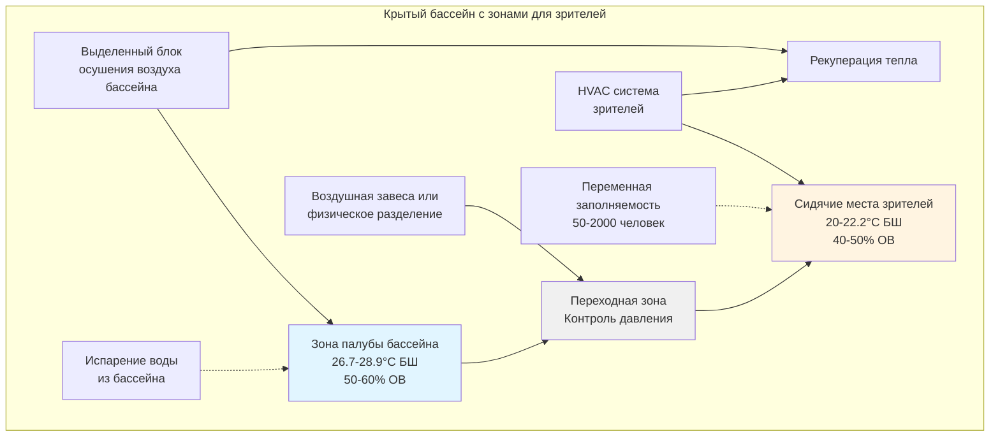

## Обзор

Крытые бассейны с зонами для зрителей представляют уникальные вызовы для HVAC, требующие одновременного контроля высокой влажности окружающей среды в зоне бассейна и кондиционирования воздуха для больших переменных нагрузок по количеству людей. Чемпионские и конкурентные объекты водного спорта должны сбалансировать требования осушения воздуха, тепловой комфорт зрителей, требования к качеству воздуха в помещении и энергоэффективность, одновременно адаптируясь к колебаниям заполняемости от тренировочных сессий до чемпионских соревнований.

## Стратегии разделения зон

Конкурентные крытые бассейны требуют тщательного рассмотрения разделения зон между окружающей средой в зоне палубы бассейна и зонами сидения зрителей из-за конфликтующих требований к окружающей среде.

## Комбинированные расчеты нагрузок

Общая нагрузка HVAC для объектов крытого бассейна с зрителями требует интеграции нагрузок испарения из бассейна с явными и скрытыми нагрузками от зрителей.

### Скорость испарения из бассейна

$$W_p = A \times F \times (p_w - p_a)$$

Где:
- $W_p$ = скорость испарения (кг/ч)
- $A$ = площадь поверхности бассейна (м²)
- $F$ = коэффициент испарения (0.1 незанятое, 0.5 интенсивное использование)
- $p_w$ = давление насыщенного пара при температуре воды (кПа)
- $p_a$ = парциальное давление пара в воздухе помещения (кПа)

### Общая скрытая нагрузка

$$Q_{latent,total} = (W_p \times 2,450) + (N \times 210)$$

Где:
- $Q_{latent,total}$ = общая скрытая нагрузка (кДж/ч)
- $N$ = количество зрителей
- $210$ = средняя скрытая теплота на одного зрителя (кДж/ч)

### Комбинированная явная нагрузка

$$Q_{sensible,total} = Q_{envelope} + Q_{lights} + (N \times 264) + Q_{solar}$$

Где:
- $Q_{envelope}$ = нагрузки передачи и инфильтрации (кДж/ч)
- $Q_{lights}$ = тепловыделение от освещения (кДж/ч)
- $264$ = средняя явная теплота на одного зрителя (кДж/ч)
- $Q_{solar}$ = солнечный теплоприток через остекление (кДж/ч)

### Требуемая емкость осушения воздуха

$$Q_{dehum} = \frac{Q_{latent,total}}{SHR_{target}}$$

Где $SHR_{target}$ = коэффициент явного тепла оборудования осушения воздуха (обычно 0.65-0.75 для выделенных блоков)

## Подходы к проектированию систем

| Подход к проектированию | Преимущества | Недостатки | Оптимальное применение |
|------------------------|------------|-----------|----------------------|
| **Интегрированная единая система** | Более низкая первоначальная стоимость, упрощенное управление, единый машинный зал | Компромиссные условия в зоне палубы, перегруженность при неполной заполняемости, более высокие расходы на эксплуатацию | Небольшие объекты (<1000 зрителей), ограниченные мероприятия |
| **Разделенные двойные системы** | Оптимизированные условия для каждой зоны, независимый контроль, энергоэффективность при частичной нагрузке | Более высокая первоначальная стоимость, больший размер оборудования, сложная координация | Чемпионские объекты, частые мероприятия, >1000 зрителей |
| **Выделенный блок осушения + DX для зрителей** | Отличное осушение в зоне палубы бассейна, обычный комфорт зрителей, возможность рекуперации тепла | Требуется координация между системами, умеренная первоначальная стоимость | Большинство конкурентных объектов, 500-2000 зрителей |
| **Гибридная с общей вентиляцией** | Сбалансированная первоначальная стоимость, централизованная обработка воздуха, гибкость переналадки в зонах | Требует тщательного проектирования, возможные проблемы с контролем влажности | Многоцелевые объекты, образовательные учреждения |

## Требования кодексов и стандартов

### Рекомендации ASHRAE

**Стандарт ASHRAE 62.1** требования к вентиляции:
- Палуба бассейна: 0.16 м³/(ч·м²) площади поверхности бассейна (8.1 CFM/ft²)
- Сидячие места зрителей: 2.4 м³/(ч·чел) (12.7 CFM/person, предполагая запрет на курение)
- Минимальный воздухообмен: 4-6 ACH для помещений крытого бассейна

**Рекомендации справочника ASHRAE Applications** глава 6:
- Температура воздуха в зоне палубы бассейна: на 1.1-2.2°C выше температуры воды
- Относительная влажность: 50-60% ОВ (не более 60%)
- Сидячие места зрителей: 20-22.2°C, 40-50% ОВ
- Поддерживать небольшое отрицательное давление (-0.005 до -0.012 кПа) относительно смежных нежилых помещений

### Требования IMC и IBC

- Помещения для собраний (A-3, A-5) требуют минимум 3.8 м³/(ч·чел) наружного воздуха (20 CFM/person)
- Зоны бассейнов классифицируются как группа A-4 (крытые плавательные бассейны)
- Системы экстренной вентиляции требуются для зон хранения хлора
- Крытые бассейны, превышающие 300 человек, требуют независимых систем вентиляции

## Стратегии контроля переменной заполняемости

Чемпионские мероприятия создают нагрузки по количеству людей в 10-40 раз выше, чем при тренировочных сессиях, требуя сложных подходов к управлению.

### Вентиляция, управляемая спросом

- Датчики CO₂ в зонах сидения зрителей (уставка 800-1000 ppm)
- Модулирующие заслонки наружного воздуха в зависимости от заполняемости
- Минимальная вентиляция в соответствии с ASHRAE 62.1

### Поэтапная работа оборудования

1. **Базовая нагрузка (тренировочные сессии):** только блок осушения бассейна, минимальное кондиционирование зрителей
2. **Умеренные мероприятия (двойные встречи):** базовая нагрузка + 50% емкости HVAC зрителей
3. **Чемпионские мероприятия:** полная работа системы, все зоны на проектных условиях
4. **Незанятое помещение:** снижение до 23.9°C в зоне палубы, осушение поддерживает максимум 60% ОВ

### Контроль соотношения давлений

Поддерживать правильный каскадный градиент давления для предотвращения миграции влаги:
- Сидячие места зрителей: +0.005 кПа (положительное относительно наружного воздуха)
- Переходная зона: нейтральное давление
- Зона палубы бассейна: -0.005 до -0.012 кПа (отрицательное относительно зрителей)

## Специальные соображения для чемпионских мероприятий

### Кондиционирование перед мероприятием

- Начать кондиционирование зоны зрителей за 2-4 часа до мероприятия
- Проверить оптимальные условия в зоне палубы (предотвращает жалобы спортсменов)
- Подтвердить достаточность емкости осушения для ожидаемой заполняемости

### Управление пиковой заполняемостью

- Постоянный мониторинг относительной влажности (сигнал при >65%)
- Увеличение вентиляции наружным воздухом при повышении уровня CO₂
- Балансировка комфорта зрителей против контроля влажности в зоне палубы

### Акустическая координация

- Шумоглушители воздуховодов требуются в зонах сидения зрителей
- Изоляция машинных залов от зон соревнований
- Выбор обрабатывающих приборов для NC-35 до NC-40 в зонах сидения

### Протоколы чрезвычайных ситуаций

- Системы вентиляции при химических разливах независимы от нормальной вентиляции
- Удаление дыма скоординировано с системами пожарной сигнализации
- Ручные элементы управления для аварийных служб

## Возможности рекуперации энергии

Выделенные блоки осушения воздуха бассейна генерируют значительное количество тепла от конденсаторов холодильных систем. Стратегии рекуперации тепла включают:

- Тепло конденсатора для нагрева воды бассейна (наиболее эффективное применение)
- Переnагрев горячим газом для нагрева подающего воздуха (улучшает осушение)
- Рекуперация тепла для нагревательных батарей зоны зрителей (снижает нагрузку на котел)
- Предварительный нагрев горячей воды для систем душевых

Годовая экономия энергии 30-50% достижима при надлежащем проектировании рекуперации тепла по сравнению с системами одноразовой вентиляции.

## Заключение

Системы HVAC для крытых бассейнов с зонами для зрителей требуют сложного проектирования, балансирующего осушение воздуха в зоне палубы бассейна, комфорт зрителей, переменную заполняемость и энергоэффективность. Разделенные системы с выделенными блоками осушения воздуха в зоне палубы и независимым кондиционированием зрителей обеспечивают оптимальную производительность конкурентных объектов. Надлежащее разделение зон, комбинированные расчеты нагрузок, учитывающие испарение из бассейна и нагрузки от зрителей, а также стратегии контроля переменной заполняемости гарантируют успешную работу от тренировочных сессий до чемпионских соревнований.
