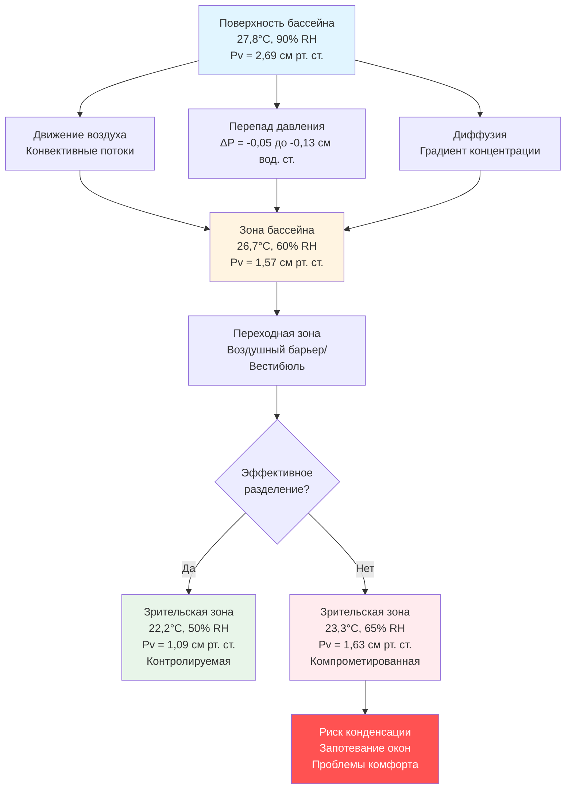

Испарение с поверхности бассейна представляет собой доминирующую влажностную нагрузку в крытых бассейнах, при этом зрительские зоны сталкиваются со значительными проблемами миграции влажности. Водяной пар, образующийся на поверхности воды, мигрирует в соседние эксплуатируемые помещения под действием перепадов давления и градиентов концентрации, что требует специализированного проектирования систем ОВКВ для поддержания комфорта и предотвращения структурных повреждений.

## Скорость испарения и генерация влаги

Скорость испарения с поверхности воды описывается уравнением Кэрриера, модифицированным для применения в крытых бассейнах:

$$W = \frac{A \cdot Y \cdot (P_w - P_a)}{Y_p}$$

Где:
- $W$ = скорость испарения (кг/ч)
- $A$ = площадь поверхности воды (м²)
- $Y$ = коэффициент активности (0,5 для неиспользуемого бассейна до 1,0 для интенсивного использования)
- $P_w$ = давление насыщения при температуре воды (см рт. ст.)
- $P_a$ = парциальное давление водяного пара в воздухе (см рт. ст.)
- $Y_p$ = безразмерный коэффициент (обычно 95)

Для соревновательного крытого бассейна с площадью поверхности воды 929 м² при температуре 27,8°C при умеренной активности ($Y = 0,65$) и условиях в зрительской зоне 22,2°C, 50% относительной влажности:

$$P_w = 2,99 \text{ см рт. ст. (при 27,8°C)}$$
$$P_a = 1,08 \text{ см рт. ст. (при 22,2°C, 50% RH)}$$
$$W = \frac{929 \cdot 0,65 \cdot (2,99 - 1,08)}{95} = 23,3 \text{ кг/ч}$$

Эта генерация влаги создает непрерывную движущую силу в сторону зон с более низким давлением пара, включая зоны зрительских мест.

## Механизмы миграции влаги

Влага мигрирует с бассейна в зрительские зоны через три основных механизма:

## Анализ градиента парциального давления

Разница давлений пара управляет миграцией влаги согласно первому закону Фика, адаптированному для строительных конструкций:

$$\dot{m} = -\frac{\delta A}{d} (P_{v1} - P_{v2})$$

Где:
- $\dot{m}$ = скорость потока влаги (г/ч)
- $\delta$ = проницаемость барьерного материала (перм)
- $A$ = площадь (м²)
- $d$ = толщина (см)
- $P_{v1}, P_{v2}$ = давления пара (см рт. ст.)

Для секции стены площадью 92,9 м², разделяющей зону бассейна (26,7°C, 60% RH, $P_v = 1,57$ см рт. ст.) и зрительскую зону (22,2°C, 50% RH, $P_v = 1,09$ см рт. ст.) со стандартным гипсокартоном ($\delta = 50$ перм, $d = 1,27$ см):

$$\dot{m} = -\frac{50 \cdot 92,9}{1,27} (1,09 - 1,57) = 8630 \text{ г/ч} = 3,9 \text{ кг/ч}$$

Эта непрерывная миграция влаги без адекватных барьеров и контроля давления ухудшает условия в зрительской зоне.

## Стратегии контроля влаги

| Стратегия | Эффективность | Стоимость внедрения | Влияние на эксплуатационные расходы | Ключевые соображения |
|------|----------|------|-----------------|-------------|
| **Положительное давление в зрительской зоне** | Высокая | Средняя | Низкая | Требуется перепад 0,05–0,13 см вод. ст.; предотвращает инфильтрацию |
| **Физический воздушный барьер с вестибюлем** | Очень высокая | Высокая | Средняя | Двойные двери; каскад давления; 150–300 л/с на дверь |
| **Специализированные системы осушения** | Высокая | Очень высокая | Высокая | Бассейн: точка росы 12,8°C; Зрительская зона: точка росы 10°C |
| **Пароизоляция в разделяющих стенах** | Средняя | Низкая | Отсутствует | 0,1 перм или менее; должна быть непрерывной; детализация проходов |
| **Воздушные завесы на проемах** | Низкая-Средняя | Низкая | Средняя | Скорость выброса 2,5–4,0 м/с; только вспомогательная; не основной контроль |
| **Отдельные системы обработки воздуха** | Очень высокая | Очень высокая | Средняя | Независимый контроль; предотвращение перекрестного загрязнения |

## Требования к соотношению давлений

Справочник приложений ASHRAE (Глава 6: Бассейны) устанавливает требования к соотношению давлений для контроля миграции влаги:

- Палуба бассейна: отрицательное давление от 0,05 до 0,10 дюйма вод. ст. относительно наружного воздуха
- Зрительские зоны: положительное давление от 0,02 до 0,05 дюйма вод. ст. относительно палубы бассейна
- Прилегающие коридоры: положительное давление 0,02 дюйма вод. ст. относительно зрительских зон

Эта каскадная система давления обеспечивает движение воздуха, насыщенного влагой, к точкам вытяжки, а не его миграцию в жилые помещения. Необходимая разность давлений поддерживается за счет:

1. **Контроля объема подаваемого воздуха**: Зрительские зоны получают на 10–15% больше подаваемого воздуха, чем возвращается/удаляется
2. **Пути сброса воздуха**: Решетки перетока или зазоры под дверями (100–150 куб. футов/мин на 1000 кв. футов поверхности бассейна (м³/ч))
3. **Специализированной вытяжки с палубы бассейна**: Минимум 4–6 воздухообменов в час
4. **Мониторинга и управления**: Датчики разности давлений с автоматической регулировкой клапанов

## Соображения по проектированию воздушного барьера

Эффективное разделение зон бассейна и зрительских зон требует:

- Непрерывного воздушного барьера с герметизацией проходов (электрика, сантехника, конструктивные элементы)
- Размещения пароизоляции с теплой стороны (со стороны палубы бассейна) изолированных конструкций
- Тамбуров с двудверными входами, поддерживающими промежуточное давление
- Высокотехнологичных входных систем с автоматическими доводчиками и уплотнениями
- Остекления между зонами: изолированных блоков с теплыми кромками, минимальное значение U-0,30

Сборка воздушного барьера должна учитывать тепловые мостики и потенциал конденсации. Температура внутренних поверхностей должна превышать точку росы минимум на 5°F (2,8°C) для предотвращения конденсации при расчетных условиях.

## Интеграция проектирования

Проектирование систем HVAC для зрительских зон в бассейнах должно включать:

- Независимую обработку воздуха для зрительских зон с уставками 72–76°F (22,2–24,4°C), 40–50% относительной влажности
- Пути вытяжки/возврата воздуха, предотвращающие рециркуляцию воздуха с палубы бассейна
- Разделение зон с поддержанием указанных разностей давлений
- Системы остекления, рассчитанные на воздействие влажности, с фактором сопротивления конденсации (CRF) выше 70
- Системы управления, контролирующие температуру, влажность и давление на границах зон

Правильная реализация контролирует миграцию влаги, поддерживает комфорт зрителей, предотвращает конденсацию на оболочке здания и защищает конструктивные элементы от повреждения влагой.
