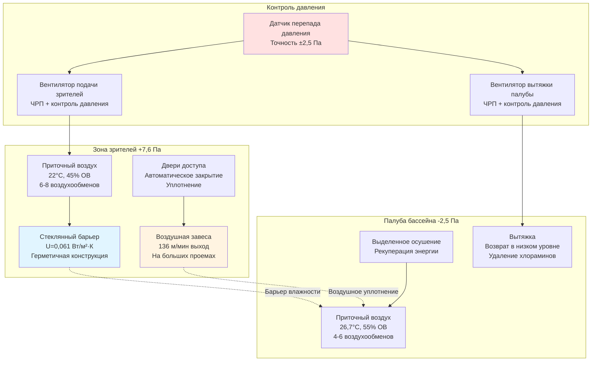

## Требования к физическому и воздушному разделению

Конкурентные аквацентры требуют строгого разделения между высокологигроскопичной средой бассейна и климатически контролируемыми зонами зрителей. Это разделение предотвращает миграцию влаги, поддерживает комфорт зрителей при более низких уровнях влажности (40-50% ОВ в сравнении с 50-60% ОВ на палубах бассейна) и снижает энергопотребление путем изоляции интенсивных нагрузок на осушение.

### Стратегия перепада давления

Установление надлежащих соотношений давлений формирует основу эффективного разделения. ASHRAE Handbook—HVAC Applications (Глава 6) рекомендует поддерживать зоны зрителей под положительным давлением относительно палуб бассейна для предотвращения миграции хлораминов и влаги в зоны занятых мест.

**Рекомендуемые перепады давления:**

| Соотношение зон | Перепад давления | Влияние на воздухообмен |
|-------------------|---------------------|-------------------|
| Зрители к палубе бассейна | +5,1 до +12,7 Па | Предотвращает инфильтрацию влаги |
| Зрители к коридору | +2,5 до +7,6 Па | Контролирует миграцию запахов |
| Палуба бассейна к улице | -5,1 до -7,6 Па | Управляет приемом наружного воздуха |

Требуемый перепад давления зависит от целостности барьера и предполагаемого уровня защиты:

$$\Delta P = \frac{\rho v^2}{2} \cdot C_d$$

Где:
- $\Delta P$ = перепад давления через барьер (Па)
- $\rho$ = плотность воздуха (кг/м³)
- $v$ = скорость через отверстия (м/мин)
- $C_d$ = коэффициент расхода (обычно 0,6-0,65)

Для зоны зрителей, требующей +10,2 Па относительно палубы бассейна со стандартной плотностью воздуха (1,2 кг/м³) и типичными путями утечек:

$$v = \sqrt{\frac{2 \Delta P}{\rho \cdot C_d}} = \sqrt{\frac{2 \times 10,2 \times 5,2}{1,2 \times 0,6}} \approx 35 \text{ м/мин}$$

Эта скорость через проникновения барьера определяет размер систем подачи и вытяжки воздуха.

### Системы физических барьеров

**Стеклянные стеновые конструкции:**

Закаленные или ламинированные стеклянные барьеры обеспечивают визуальную связь, создавая при этом физическое разделение. Ключевые аспекты проектирования включают:

- **Тепловые характеристики:** Минимальный коэффициент U 0,061 Вт/(м²·К) для предотвращения конденсации с дифференциалом точки росы со стороны зрителей
- **Несущая способность:** Ветровая нагрузка, эквивалентная 0,96 кПа для установок с большим пролетом
- **Герметичность уплотнений:** Прокладки из EPDM или силикона, рассчитанные на воздействие хлора и постоянные условия 29°C, 60% ОВ
- **Контроль доступа:** Минимизировать открытия дверей; указывать автоматические закрыватели с возможностью удержания открытым только в чрезвычайных ситуациях

**Применение воздушных завес:**

Когда физические барьеры неприемлемы для больших проемов или оперативной гибкости, надлежащим образом рассчитанные воздушные завесы обеспечивают разделение. ASHRAE Standard 90.1 признает воздушные завесы для защиты кондиционируемого пространства при соответствии критериям производительности.

Расчет скорости выхода воздушной завесы:

$$V_d = V_c \sqrt{\frac{H}{W}}$$

Где:
- $V_d$ = скорость выхода (м/мин)
- $V_c$ = скорость поперечного потока (скорость инфильтрации, обычно 15-46 м/мин)
- $H$ = высота проема (м)
- $W$ = ширина воздушной завесы (эффективная ширина струи, м)

Для проема высотой 3 м с предполагаемым поперечным потоком 30 м/мин и шириной струи 15 см:

$$V_d = 30 \sqrt{\frac{3}{0,15}} \approx 136 \text{ м/мин}$$

Необходимый расход воздуха на погонный метр:

$$\text{м³/ч на м} = \frac{V_d \times W \times 60}{1000} = \frac{136 \times 0,15 \times 60}{1000} \approx 1,22 \text{ м³/ч на м}$$

Проем шириной 6 м требует приблизительно 7,3 м³/мин (438 м³/ч) емкости воздушной завесы.

### Сравнение систем разделения

| Стратегия | Эффективность | Капитальные затраты | Операционные затраты | Обслуживание | Лучшее применение |
|----------|---------------|--------------|----------------|-------------|------------------|
| Полные стеклянные стены | 95-100% | Высокие | Низкие | Низкие | Постоянное разделение, круглогодичные объекты |
| Частичное стекло + завесы | 85-95% | Средне-высокие | Средние | Средние | Требования гибкого доступа |
| Только воздушные завесы | 70-85% | Средние | Средне-высокие | Средние | Сезонные объекты, ограниченный бюджет |
| Только контроль давления | 50-70% | Низкие | Средние | Низкие | Объекты с низкой нагрузкой, минимальное разделение |
| Вестибюли с шлюзами | 90-98% | Высокие | Низкие | Низкие | Высокопроходные точки доступа |

### Зонирование системы HVAC

Отдельные системы приточной вентиляции для каждой зоны позволяют независимо контролировать температуру, влажность и давление:

**Система палубы бассейна:**
- 100% наружный воздух или осушение с рекуперацией энергии
- Условия на выходе: 25,6-27,8°C, 50-60% ОВ
- Минимум 4-6 воздухообменов в час
- Отрицательное или нейтральное давление относительно улицы

**Система зрителей:**
- Обычная система смешанного воздуха с возможностью экономайзера
- Условия на выходе: 21,1-23,3°C, 40-50% ОВ
- 6-8 воздухообменов в час во время мероприятий
- Положительное давление относительно смежных зон (+5,1 до +12,7 Па)

Взаимно связанные последовательности управления предотвращают одновременную работу в режимах, которые могли бы обратить соотношение давлений.

### Ссылки на нормы и стандарты

- **IMC Раздел 403.3:** Требования к механической вентиляции для помещений общего пользования
- **ASHRAE 62.1:** Требования к наружному воздуху (зоны зрителей: 3,5 м³/ч на человека; аквацентры: процедура оценки качества воздуха)
- **ASHRAE Handbook—HVAC Applications, Глава 6:** Конкретные рекомендации по проектированию аквацентров
- **IBC Раздел 303:** Классификация помещений общего пользования и требования к разделению

## Диаграмма методологии разделения

**Легенда диаграммы:**
- **Голубой (физические барьеры):** Стеклянные стены и герметичные конструктивные элементы
- **Желтый (воздушные барьеры):** Воздушная завеса и разделение, управляемое давлением
- **Красный (системы управления):** Мониторинг давления и активные управляющие компоненты

## Соображения по реализации

**Фаза проектирования:**
- Моделирование соотношений давлений с использованием многозонного моделирования воздушного потока (CONTAM, EnergyPlus)
- Расчет площади утечки барьера на основе строительных чертежей и расписаний дверей
- Размер оборудования приточной вентиляции с запасом 15-20% для органа управления давлением

**Фаза строительства:**
- Проверка непрерывности герметизации стеклянной стены с помощью испытания дверцей вентилятора перед внутренней отделкой
- Ввод в эксплуатацию последовательности управления давлением со всеми дверями и проемами в различных состояниях
- Документирование базовых измерений давления во всех элементах барьера

**Операционная фаза:**
- Непрерывный мониторинг перепада давления; сигнализация при отклонении ±2,5 Па от заданного значения
- Проверка уплотнений дверей и автоматических закрывателей ежеквартально
- Очистка сопел воздушной завесы и проверка скорости выхода ежегодно

Надлежащим образом спроектированные системы разделения обеспечивают комфортные условия для зрителей, одновременно защищая зоны просмотра от агрессивной атмосферы палубы бассейна, снижая затраты на техническое обслуживание и продлевая срок службы объекта.
