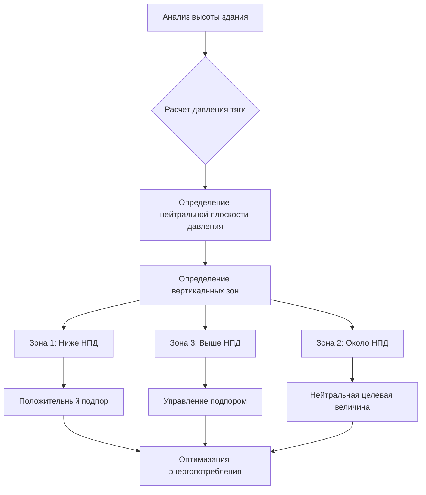
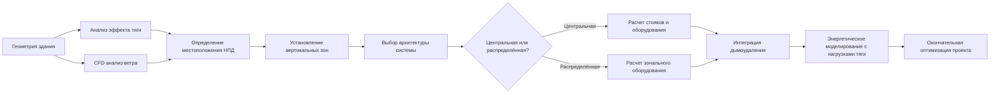

Высотные здания — обычно определяемые как конструкции выше 23 м или семи этажей — создают уникальные инженерные задачи HVAC, которые отсутствуют в низких строениях. Доминирующие физические силы, действующие на эти конструкции, коренным образом изменяют движение воздуха через ограждающую конструкцию здания и воздуховоды, требуя специализированного проектирования, учитывающего эффект тяги, ветровые нагрузки, вертикальную стратификацию и требования безопасности жизни к системам дымоудаления.

## Физические силы в высотных зданиях

### Основы эффекта тяги

Эффект тяги представляет собой наиболее значительную задачу при проектировании HVAC высотных зданий. Этот вызванный плавучестью перепад давления возникает из-за различий в плотности столбов воздуха внутри и снаружи:

$$\Delta P = C_s \cdot h \cdot \left(\frac{1}{T_o} - \frac{1}{T_i}\right)$$

Где:
- $\Delta P$ = перепад давления (Па)
- $C_s$ = коэффициент тяги (3460 Па·К·м при стандартном атмосферном давлении)
- $h$ = вертикальное расстояние от нейтральной плоскости давления (м)
- $T_o$ = абсолютная температура снаружи (К)
- $T_i$ = абсолютная температура внутри (К)

При зимнем отоплении теплый внутренний воздух создает положительное давление на верхних этажах и отрицательное давление на нижних этажах относительно наружного воздуха. Нейтральная плоскость давления (НПД) — где внутреннее и внешнее давления уравниваются — обычно находится между 40-60% высоты здания в зависимости от герметичности ограждающей конструкции и работы HVAC-системы.

**Критические воздействия:**

- **Инфильтрация/экфильтрация**: нижние этажи испытывают входящий поток воздуха; верхние этажи испытывают исходящий поток
- **Потоки в шахтах лифтов**: шахты действуют как вертикальные воздушные магистрали, транспортируя некондиционированный воздух по всему зданию
- **Работоспособность дверей**: перепады давления могут достигать 50-100 Па, создавая усилия открытия дверей, превышающие допустимые нормами 133 Н
- **Энергетический штраф**: неконтролируемый эффект тяги может составлять 20-40% потребления энергии на отопление в холодном климате

### Ветровые нагрузки

Ветер создает динамическое распределение давления по фасадам зданий в соответствии с принципом Бернулли:

$$P_{wind} = 0.613 \cdot V^2 \cdot C_p$$

Где:
- $P_{wind}$ = ветровое давление (Па)
- $V$ = скорость ветра (м/с)
- $C_p$ = коэффициент давления (варьируется по положению фасада: +0,8 с наветренной стороны, -0,5 с подветренной стороны)

На высотах выше 200 м скорости ветра увеличиваются на 15-25% по сравнению с уровнем земли, создавая перепады давления 100-200 Па во время сильного ветра. Эти давления суммируются с давлениями эффекта тяги, требуя динамических систем контроля подпора в здании.

## Стратегии вертикального зонирования

Эффективное проектирование HVAC высотных зданий требует вертикальной сегментации на зоны с контролем давления. ASHRAE Guideline 36 рекомендует максимальные высоты зон в 10-15 этажей для поддержания управляемых перепадов давления.

### Подходы к зонированию

| Стратегия зонирования | Применение | Контроль давления | Сложность |
|----------------------|-----------|-------------------|-----------|
| Однозонная | Здания <20 этажей | Ограниченные возможности | Низкая |
| Двухзонная | 20-40 этажей | Разделение верхней/нижней части | Средняя |
| Многозонная | 40+ этажей | Сегменты по 10-15 этажей | Высокая |
| По этажам | Супервысокие (75+ этажей) | Управление отдельным этажом | Очень высокая |

Каждая зона требует независимого оборудования обработки воздуха или регулирующих давление демпферов в стояках приточного/вытяжного воздуха для противодействия локальным давлениям тяги.

## Варианты архитектуры системы

### Системы центральной машинной комнаты

Конфигурации центральной машинной комнаты размещают основное оборудование нагрева/охлаждения в механических пентхаусах или подвальных помещениях, распределяя кондиционированный воздух или охлаждённую/горячую воду вертикально через здание.

**Преимущества:**
- Консолидированный доступ к техническому обслуживанию
- Эффект масштаба для крупного оборудования
- Снижение требуемой площади помещений для арендаторов

**Проблемы:**
- Энергетические штрафы на прокачку: $W_{pump} = \frac{\dot{V} \cdot \Delta P}{\eta_{pump}}$ где вертикальный напор значительно способствует $\Delta P$
- Требования к площади стояков (6-10% площади этажа)
- Расширенное время установки трубопроводов/воздуховодов

### Распределённые системы

Распределённые архитектуры размещают вентиляционные установки или фанкойлы на каждом этаже или в промежуточных механических помещениях каждые 10-15 этажей.

**Преимущества:**
- Снижение вертикальных потерь давления
- Упрощенное зонирование и управление
- Более короткие трассы воздуховодов/труб минимизируют утечки

**Проблемы:**
- Увеличенное количество оборудования и требования к доступу для обслуживания
- Снижение эффективности оборудования (установки меньшей емкости)
- Требования акустической изоляции для занятых этажей

## Интеграция систем дымоудаления

Дымоудаление для обеспечения безопасности жизни представляет собой обязательное проектное соображение согласно NFPA 92 и IBC Section 909. Высотные здания требуют систем подпора, которые разворачивают нормальные потоки воздуха во время пожара.

**Ключевые компоненты:**

- **Подпор в лестничных клетках**: поддерживайте положительное давление 25-75 Па относительно здания во время пожара, предотвращая инфильтрацию дыма в пути эвакуации
- **Управление шахтами лифтов**: подпор в лобби лифтов и шахтах 12-25 Па для предотвращения распространения дыма между этажами
- **Последовательности отключения HVAC**: автоматическое отключение подачи воздуха в пожарные зоны при сохранении работы систем подпора

$$\dot{V}_{makeup} = \frac{A_{door} \cdot V_{avg}}{\eta_{eff}}$$

Где объем подпорного воздуха ($\dot{V}_{makeup}$) должен компенсировать площадь утечки через двери ($A_{door}$) и среднюю скорость через отверстия ($V_{avg}$, обычно 1,0 м/с).

## Энергетические соображения

Высотные здания потребляют на 15-30% больше энергии HVAC на единицу площади, чем низкие здания, из-за штрафов за эффект тяги, увеличенных потерь при распределении и ветровой инфильтрации. Стратегии смягчения включают:

- **Воздушные шлюзы у входа**: снижение инфильтрации на первом этаже на 40-60%
- **Компартментализация**: закрытие дверей в лестничных клетках, установка вентиляции шахт лифтов
- **Переменная скорость распределения**: снижение паразитной энергии прокачки/вентилятора
- **Рекуперация тепла**: улавливание энергии выхлопа из систем подпора (потенциал рекуперации энергии 30-40%)

Правильно спроектированное вертикальное зонирование в сочетании с контролем подпора в здании может снизить годовое потребление энергии HVAC на 20-35% по сравнению с неконтролируемыми системами.

## Рабочий процесс проектирования

## Заключение

Проектирование HVAC-систем для высотных зданий требует строгого применения принципов механики жидкостей и термодинамики для противодействия мощным силам тяги и ветра. Вертикальное зонирование, управление подпором в здании и интеграция систем дымоудаления представляют собой неотъемлемые требования. Выбор между центральной и распределённой архитектурой системы зависит от высоты здания, архитектурных ограничений и приоритетов эксплуатации, каждый подход имеет отчетливые преимущества. Успешные проекты балансируют стоимость капитала, энергетическую производительность и требования безопасности жизни, поддерживая комфорт жителей во всех вертикальных зонах и условиях погоды.
