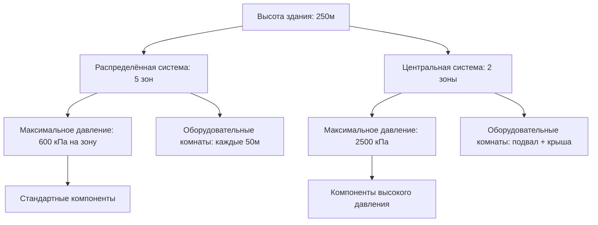

Выбор между центральными и распределёнными системами HVAC представляет одно из наиболее значимых решений при проектировании высотного здания, влияя на капитальные затраты, операционную эффективность, гибкость для арендаторов и использование пространства на протяжении всего жизненного цикла здания. Этот выбор принципиально определяет размещение механических помещений, сложность системы трубопроводов и управление зонами давления.

## Конфигурация центральной установки

Центральные установки консолидируют основное оборудование отопления и охлаждения в одном или двух местах, обычно в подвальных машинных отделениях и на крышах зданий. Такой подход концентрирует капиталоёмкое оборудование там, где нагрузки на конструкцию, шум и вибрация могут быть эффективно управляемы.

Фундаментальная физика, управляющая проектированием центральной установки, включает транспортировку тепловой энергии по вертикали через здание. Для систем охлаждённой воды статическое давление у основания вертикальной колонны равно:

$$P_{static} = \rho g h$$

где $\rho$ — плотность жидкости (обычно 1000 кг/м³ для воды), $g$ — ускорение свободного падения (9,81 м/с²), и $h$ — вертикальная высота. Для здания высотой 200 м статическое давление приближается к 2000 кПа, требуя разделения на зоны давления для предотвращения чрезмерных требований к техническим характеристикам компонентов.

### Стратегия размещения оборудовательного помещения

Конфигурации центральных установок обычно применяют:

**Размещение в подвале**
- Холодильные машины, градирни и основные насосы
- Конструктивный пол, предназначенный для сосредоточенных нагрузок (10-15 кПа типично)
- Звукоизоляция от занятых помещений
- Упрощённая замена оборудования через погрузочные доки

**Размещение на крыше**
- Воздухообрабатывающие установки, обслуживающие верхние этажи
- Размещение градирни для сокращения длины трубопроводов
- Воздействие ветра на производительность градирни, требующее анализа

Штраф по пространству для центральных установок составляет 2-4% от общей площади здания, сосредоточенный в конкретных местоположениях, а не распределённый по зданию.

## Архитектура распределённой системы

Распределённые системы размещают оборудование отопления и охлаждения на нескольких механических этажах по всему зданию, обычно через каждые 10-20 этажей. Эта стратегия снижает требования к давлению в трубопроводах и сокращает длину распределительных линий к занятым помещениям.

### Преимущества зонирования давления

Каждый распределённый механический этаж служит естественной границей зоны давления. Максимальное статическое давление, которое испытывает любой компонент, ограничивается высотой зоны, а не общей высотой здания:

$$P_{zone} = \rho g h_{zone}$$

Для зоны из 15 этажей (примерно 60 м) максимальное статическое давление снижается до 600 кПа, позволяя использовать стандартные характеристики компонентов без специальных соображений по давлению.

### Компромиссы в распределении пространства

Распределённые системы требуют механических помещений на нескольких этажах, потребляя 3-6% от общей площади здания, но распределяя это пространство по вертикали. Такое расположение влияет на сдаваемую в аренду площадь иначе, чем центральные системы:

- Сокращённые проникновения в ядро лифта
- Более короткие горизонтальные распределительные линии
- Гибкость при поэтапном строительстве
- Повышенная структурная координация

## Рассмотрения системы трубопроводов

Режим давления в высотных зданиях определяет принципиально различные подходы к трубопроводам.

### Управление давлением в центральной установке

Центральные системы требуют разделения на зоны давления на промежуточных уровнях. Теплообменник развязки разделяет зоны высокого и низкого давления:

$$Q = \dot{m} c_p \Delta T$$

Теплопередача происходит без смешивания жидкостей, отдельные насосные системы используются для каждой зоны. Теплообменник вводит штраф по температуре (0,5-1,5°C подхода), требуя от центральной установки производить воду немного холоднее для компенсации.

### Упрощение распределённой установки

Распределённые системы избегают сложности зонирования давления, ограничивая каждую стояковую систему одной или двумя зонами давления. Сравнение энергии насоса становится:

$$W_{pump} = \frac{\dot{V} \Delta P}{\eta}$$

где $\dot{V}$ — объёмный расход, $\Delta P$ — полный рост давления, и $\eta$ — эффективность насоса. Распределённые системы обычно показывают 15-25% снижение энергии насоса благодаря сниженным требованиям к давлению и более коротким трубопроводам.

## Матрица сравнения систем

| Параметр | Центральная установка | Распределённые системы |
|----------|----------------------|------------------------|
| **Капитальные затраты** | Более низкая стоимость оборудования | Более высокая стоимость оборудования |
| **Эффективность пространства** | 2-4% сосредоточено | 3-6% распределено |
| **Сложность трубопроводов** | Высокая (зоны давления) | Умеренная (зонированные стояки) |
| **Энергия насоса** | Выше (высокие стояки) | Ниже (короткие стояки) |
| **Доступ для обслуживания** | Централизованный | Несколько местоположений |
| **Гибкость для арендаторов** | Ограниченная | Высокая |
| **Срок службы оборудования** | 20-25 лет | 15-20 лет (меньшие блоки) |
| **Параметры избыточности** | N+1 возможно | Встроенная зональная избыточность |

## Анализ гибкости для арендаторов

Выбор между центральными и распределёнными системами глубоко влияет на гибкость обустройства помещений для арендаторов и распределение операционных затрат.

### Ограничения центральной установки

Центральные системы доставляют кондиционированный воздух или воду в помещения арендаторов через фиксированную распределительную инфраструктуру. Модификации требуют:

- Проникновения в ядро для новых воздуховодов/трубопроводов
- Проверку мощности центральной установки
- Балансировку системы здания в целом
- Расширенную строительную координацию

### Адаптируемость распределённой системы

Механические помещения на нескольких этажах позволяют:

- Измерение по этажам для каждого арендатора
- Независимое управление температурой
- Эксплуатацию после рабочего времени без систем здания в целом
- Сокращённые затраты на улучшение помещений для арендаторов

Для высотных зданий с несколькими арендаторами распределённые системы облегчают конфигурации HVAC, специфичные для каждого арендатора, и выставление счётов за энергию, оправдывая более высокие капитальные затраты улучшенной сдаваемостью в аренду.

## Рекомендации по проектированию ASHRAE

ASHRAE Handbook—HVAC Applications, Глава 4 (Высотные здания) рекомендует оценивать выбор системы на основе:

1. **Высота здания**: Центральные установки экономичны ниже 30 этажей; распределённые системы выгодны выше 40 этажей
2. **Тип занятости**: Здания с одним арендатором отдают предпочтение центральным установкам; здания с несколькими арендаторами выигрывают от распределённых систем
3. **График эксплуатации**: Круглосуточная эксплуатация подходит для центральных систем; различные расписания благоприятствуют распределённому подходу
4. **Структура энергетических затрат**: Высокие затраты на энергию оправдывают распределённые системы для снижения штрафов по насосам

## Гибридные подходы

Многие современные высотные здания применяют гибридные стратегии, объединяющие центральные и распределённые элементы:

- Центральная холодильная машина с распределённой обработкой воздуха
- Первичная центральная установка с вторичными распределёнными тепловыми насосами
- Центральное отопление с распределённым охлаждением

Эти конфигурации оптимизируют первоначальную стоимость, сохраняя операционную гибкость, признавая, что двоичный выбор между полностью центральными или полностью распределёнными системами представляет только экстремумы спектра проектных решений.

## Система принятия решений

Процесс выбора должен количественно оценить:

**Индикаторы центральной установки**
- Занятость одним арендатором
- Непрерывная круглосуточная эксплуатация
- Ограничения первоначальной стоимости
- Сложившийся персонал обслуживания

**Индикаторы распределённой системы**
- Занятость несколькими арендаторами
- Переменные графики эксплуатации
- Высотное строительство (>150 м)
- Премиум на гибкость для арендаторов

Правильный выбор зависит от факторов, специфичных для здания, включая высоту, схемы занятости, конструктивные ограничения и философию операционной деятельности владельца, а не от универсальных правил.
