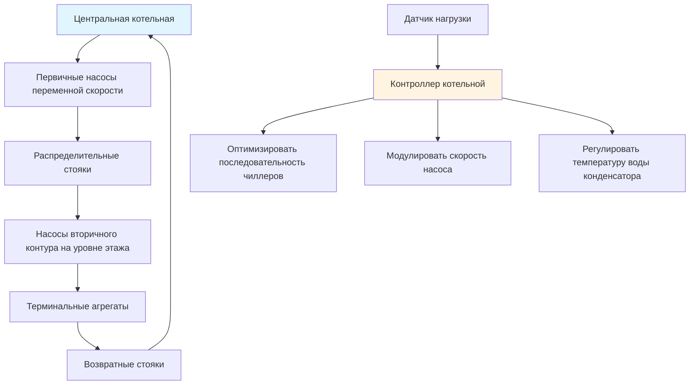
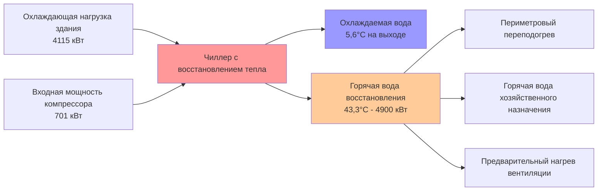

Конфигурации центральных котельных обеспечивают значительные термодинамические и эксплуатационные преимущества в высоких зданиях, где общая холодопроизводительность обычно превышает 1754 кВт. Основное преимущество вытекает из улучшений эффективности, зависящих от масштаба, и возможности внедрения сложных стратегий восстановления энергии, непрактичных в распределённых системах.

## Эффект масштаба

Эффективность оборудования улучшается нелинейно с увеличением мощности из-за фундаментальных термодинамических ограничений. Большие центробежные чиллеры достигают значений COP 6,5–7,5 (кВт/кВт 0,52–0,60), в то время как распределённые кровельные агрегаты достигают плато на уровне COP 3,5–4,2 (EER 12–14).

Зависимость между эффективностью чиллера и мощностью следует:

$$\eta_{chiller} = \eta_{base} \cdot \left(1 + k \cdot \ln\left(\frac{Q_{actual}}{Q_{reference}}\right)\right)$$

где $k$ варьируется от 0,08–0,12 для центробежных машин, а $\eta_{base}$ представляет базовую эффективность при эталонной мощности.

**Снижение капитальных затрат:**

| Размер системы | Установленная стоимость ($/кВт) | Относительная стоимость |
|-------------|------------------------|---------------|
| Распределённые агрегаты 350 кВт | $2,500–3,100 | 1,00 |
| Центральный чиллер 1758 кВт | $1,750–2,180 | 0,73 |
| Центральный чиллер 5274 кВт | $1,350–1,650 | 0,57 |

Физическая основа этого снижения стоимости заключается в улучшенном соотношении поверхности к объёму теплообменников, повышенной эффективности двигателя при больших значениях мощности и экономике производства.

## Эффективность центральной котельной

Большое оборудование работает ближе к пределам теоретической эффективности Карно благодаря снижению необратимостей на единицу мощности. Для чиллера, производящего воду охлаждения на выходе 5,6°С при температуре воды конденсатора 29,4°С:

$$COP_{Carnot} = \frac{T_{evap}}{T_{cond} - T_{evap}} = \frac{278,8 \text{ K}}{295,8 \text{ K} - 278,8 \text{ K}} = 11,7$$

Фактические чиллеры центральной котельной достигают 55–65% эффективности Карно по сравнению с 30–40% для меньших распределённых агрегатов. Эта разница вызывается:

- **Большим температурным подходом теплообменника** в малых агрегатах (4,4–6,7°С против 1,1–2,2°С)
- **Повышенными необратимостями компрессора** из-за сниженных допусков при производстве
- **Менее сложным управлением мощностью** (простое включение/отключение против регуляторов переменной скорости с направляющими аппаратами)

Центральные котельные обеспечивают переменный первичный поток с распределённым насосным оборудованием, что снижает энергию насоса на 40–60% по сравнению с системами постоянного потока:

$$P_{pump} = \frac{\dot{m} \cdot \Delta P}{\rho \cdot \eta_{pump}} \propto \dot{V}^3$$

По мере изменения потока с нагрузкой здания, мощность насоса снижается с кубом расхода при использовании регуляторов частоты вращения.

## Централизация обслуживания

Концентрация оборудования в выделенных механических помещениях снижает трудовые затраты на обслуживание на 50–70% по сравнению с распределёнными системами, требующими доступа на крышу или в помещения арендатора.

**Сравнение доступа при обслуживании:**

| Фактор | Центральная котельная | Распределённые системы |
|--------|---------------|---------------------|
| Местоположения оборудования | 2–4 механических помещения | 40–80+ местоположений |
| Ограничения доступа | Минимальные | Требуется согласование с арендатором |
| Инвентарь запчастей | Централизованный | Распределённый по зданию |
| Время в пути техника | 5–10 мин между агрегатами | 20–40 мин между агрегатами |
| Наличие специализированного инструмента | На месте | Необходимо доставить по вертикали |

Центральные котельные поддерживают прогнозирующее обслуживание с непрерывными системами мониторинга, отслеживающими вибрацию, анализ масла, состав хладагента и деградацию производительности. Логирование данных позволяет анализировать тенденции, выявляя износ подшипников или отложения до отказа.

## Доступ для квалифицированного оператора

Центральные котельные оправдывают наличие выделенных инженеров-операторов с опытом оптимизации чиллеров, особенно в зданиях, превышающих 46 500 м². Квалифицированный оператор регулирует:

1. **Последовательность чиллеров** на основе кривых эффективности в реальном времени
2. **Сброс температуры воды конденсатора** для балансирования энергии чиллера и охлаждающей башни
3. **Сброс температуры охлаждаемой воды** в условиях низкой нагрузки
4. **Стратегии заряда/разряда** аккумулирования тепловой энергии

Экономическое обоснование для полностью занятых операторов:

$$Savings_{annual} = E_{baseline} \cdot f_{reduction} \cdot C_{energy} > C_{operator}$$

где $f_{reduction}$ обычно составляет 12–18% при компетентной эксплуатации, что даёт периоды окупаемости менее 2 лет для зданий свыше 2636 кВт.

## Одновременное восстановление тепла при охлаждении

Центральные котельные обеспечивают чиллеры с восстановлением тепла, захватывающие тепло конденсатора для одновременного удовлетворения требований к отоплению. Энергетический баланс для чиллера с восстановлением тепла:

$$Q_{heating} = Q_{cooling} \cdot \left(1 + \frac{1}{COP}\right)$$

Для чиллера 3517 кВт при COP 6,0, восстанавливающего тепло при 43,3°С:

$$Q_{heating} = 12,000 \frac{\text{МВт·ч}}{3517 \text{ кВт}} \cdot 3517 \text{ кВт} \cdot \left(1 + \frac{1}{6,0}\right) = 4115 \text{ кВт}$$

Восстановленное тепло служит для:
- Периметрового переподогрева при сезоне охлаждения
- Предварительного нагрева горячей воды хозяйственного назначения
- Кондиционирования приточного воздуха
- Обогрева бассейна (многофункциональные здания)

Термодинамическое преимущество вытекает из использования иначе теряемого тепла конденсатора, эффективно достигая коэффициентов производительности отопления 4–5 по сравнению с 0,8–0,95 для обычных котлов.

## Резервирование оборудования

Центральные котельные экономичным образом реализуют резервирование N+1 или N+2 благодаря концентрации мощности. Нагрузка 10 520 кВт, обслуживаемая тремя чиллерами по 4225 кВт (N+1), обеспечивает:

- **100% мощность** при отключении любого одного чиллера
- **Гибкость обслуживания** без ограничения нагрузки
- **Оптимизацию эффективности** благодаря разнообразию последовательности

Функция надёжности для конфигурации N+1:

$$R_{system} = 1 - (1 - R_{unit})^{N+1}$$

При надёжности отдельного чиллера $R_{unit} = 0,98$, котельная из трёх чиллеров достигает $R_{system} = 0,9999992$ (готовность пять девяток).

## Преимущества разнообразия нагрузки

Центральные котельные используют преимущества разнообразия нагрузок по нескольким зонам здания, ориентациям фасадов и типам арендатора. Коэффициент разнообразия:

$$F_{diversity} = \frac{\sum Q_{peak,individual}}{\sum Q_{coincident}}$$

Типичные высокие здания характеризуются коэффициентами разнообразия 1,15–1,30, что означает, что совпадающий пиковый результат 10 520 кВт получается из совпадающей пиковой мощности 12 098–13 676 кВт отдельных зон, не совпадающих по времени. Центральные котельные рассчитываются на совпадающую нагрузку, в то время как распределённые системы должны быть рассчитаны на отдельные пики, что приводит к переизбытку мощности на 15–30%.

## Возможности аккумулирования тепловой энергии

Центральные котельные допускают системы аккумулирования охлаждаемой воды или льда, смещая электрическую нагрузку с пиковых на внепиковые периоды. Требуемая ёмкость хранилища:

$$V_{storage} = \frac{Q_{stored} \cdot t_{discharge}}{\rho \cdot c_p \cdot \Delta T \cdot \eta_{storage}}$$

Для системы аккумулирования 11 720 кВт·ч с температурным дифференциалом 8,9°К:

$$V_{storage} = \frac{11720 \text{ кВт·ч} \cdot 3600 \text{ с}}{1000 \frac{\text{кг}}{\text{м}^3} \cdot 4,18 \frac{\text{кДж}}{\text{кг·K}} \cdot 8,9°K \cdot 0,90} = 128 \text{ м}^3$$

Этот объём (приблизительно 128 000 л) вмещается в типичное помещение центральной котельной, но было бы непрактично его распределять по нескольким местоположениям.

**Сбережения стоимости энергии:**

| Метрика | Полное аккумулирование | Частичное аккумулирование | Без аккумулирования |
|--------|--------------|-----------------|------------|
| Пиковая нагрузка (кВт) | 880 | 1320 | 2200 |
| Зарядка в свободные часы (кВт·ч/сут) | 35 200 | 17 600 | 0 |
| Ежемесячный платёж за нагрузку | $12 800 | $19 200 | $32 000 |
| Годовое сбережение vs без аккумулирования | $230 000 | $153 000 | Базовый уровень |

## Снижение воздействия на помещения арендатора

Центральные котельные исключают оборудование из ценных площадей арендаторов, преобразуя потенциальную потерю аренды в доход. Для офисного здания площадью 46 500 м²:

- **Площадь механического помещения распределённой системы:** 743–1115 м² (1,6–2,4% от общей)
- **Площадь механического помещения центральной котельной:** 1393–1858 м² в подвале/на крыше (нельзя сдать в аренду)
- **Прирост сдаваемой площади:** 743–1115 м²
- **Влияние на доход при 700 $/м²/год:** $520 000–$780 000 ежегодно

Текущая стоимость этого дохода от аренды за 30 лет при ставке дисконта 6% превышает 7–11 млн долл., часто оправдывая капитальные премии за центральные котельные в 2–4 млн долл.

---

**Ссылки:**
- ASHRAE Handbook—HVAC Applications, Chapter 2: Tall Buildings
- ASHRAE Standard 90.1: Energy Standard for Buildings
- ASHRAE Journal: "Central vs. Distributed Chilled Water Plants"
