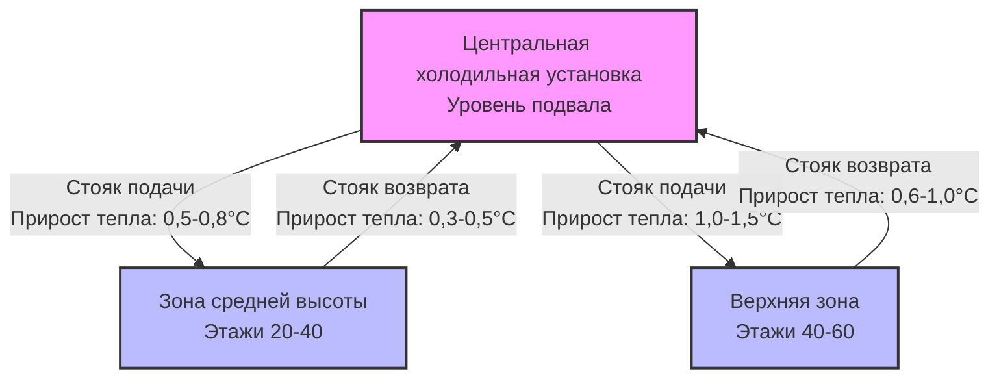
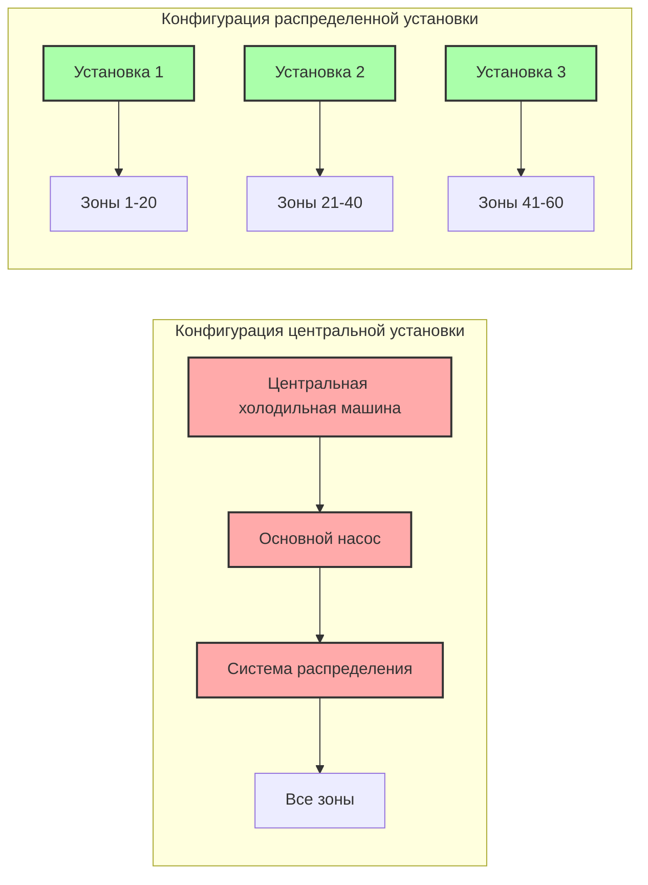

Центральные системы теплоснабжения в высотных зданиях сталкиваются со значительными физическими и эксплуатационными ограничениями, которые снижают их эффективность по мере увеличения высоты здания. Хотя централизованное оборудование обеспечивает преимущества в доступности обслуживания и эффективности при полной нагрузке, вертикальное распределение, требуемое в высотных приложениях, вводит потери, проблемы давления и проблемы надежности, которые должны быть количественно определены на этапе проектирования.

## Ограничения статического давления

Статическое давление в системах вертикального распределения воды является основным ограничением для применения центральной установки в высотных зданиях. Гидростатическое давление у основания колонны стояка определяется как:

$$P_{static} = \rho g h$$

Где:
- $P_{static}$ = статическое давление (Па)
- $\rho$ = плотность жидкости (кг/м³, приблизительно 1000 кг/м³ для воды)
- $g$ = ускорение свободного падения (9,81 м/с²)
- $h$ = высота по вертикали (м)

Для 300-метрового здания статическое давление у основания превышает 2940 кПа, что выше номинальных значений давления стандартных коммерческих компонентов трубопроводов (обычно рассчитаны на 1034–2068 кПа). Это требует станций снижения давления, специализированных трубопроводов высокого давления или распределенных конфигураций установок.

### Требования зон давления

Здания, превышающие 100–150 м, обычно требуют нескольких зон давления для сохранения целостности компонентов. Переход между зонами вводит:

- Неэффективность теплообменника (обычно перепад температуры подхода 1–3°C)
- Дополнительную энергию насоса для каждой зоны
- Повышенную сложность управления
- Несколько точек потенциального отказа

**Сравнение: управление давлением с одной зоной и несколькими зонами**

| Параметр | Одна центральная установка | Многозонная центральная установка |
|-----------|---------------------|--------------------------|
| Максимальная высота здания | ~100 м | 300+ м |
| Станции снижения давления | 0 | 2–4 на стояк |
| Потеря эффективности системы | Исходный уровень | 5–12% |
| Сложность компонентов | Низкая | Высокая |
| Премия на первоначальную стоимость | Исходный уровень | +15–30% |

## Потери энергии при распределении

Тепловые потери при вертикальном распределении растут пропорционально длине стояка и обратно пропорционально эффективности изоляции. Передача тепла через изолированный трубопровод следует:

$$Q_{loss} = \frac{2\pi k L (T_{fluid} - T_{ambient})}{\ln(r_o/r_i)}$$

Где:
- $Q_{loss}$ = скорость тепловых потерь (Вт)
- $k$ = коэффициент теплопроводности изоляции (Вт/м·К)
- $L$ = длина трубопровода (м)
- $T_{fluid}$ = температура жидкости (°C)
- $T_{ambient}$ = температура окружающей среды (°C)
- $r_o$ = наружный радиус изоляции (м)
- $r_i$ = внутренний радиус трубопровода (м)

Для 200-метрового вертикального стояка, несущего охлажденную воду с температурой 7°C через трубопровод диаметром 150 мм с изоляцией из стекловолокна толщиной 50 мм (k ≈ 0,04 Вт/м·К) в шахте с температурой 24°C, прирост тепла приближается к 450–600 Вт на стояк. За 8760 годовых часов эксплуатации это представляет 3940–5260 кВт·ч дополнительной нагрузки охлаждения на пару стояков (подача и возврат).

## Требования к энергии насосов

Мощность насоса в центральных системах возрастает с кубом скорости потока и линейно с перепадом давления. Теоретическая мощность насоса составляет:

$$P_{pump} = \frac{Q \Delta P}{\eta_{pump}}$$

Где:
- $P_{pump}$ = мощность насоса (Вт)
- $Q$ = объемный расход (м³/с)
- $\Delta P$ = полный перепад давления (Па)
- $\eta_{pump}$ = эффективность насоса (обычно 0,65–0,85)

Для высотных зданий перепад давления включает статический подъем, потери на трение (пропорциональные $L \cdot v^2$) и потери на фитингах. Центральная установка, обслуживающая 250-метровое здание при расходе 0,05 м³/с, требует примерно 35–50 кВт постоянной мощности насоса по сравнению с 8–15 кВт для распределенных установок, обслуживающих эквивалентные зоны.

Стандарт ASHRAE 90.1 ограничивает мощность системы до 22 Вт/л/с для сложных систем, что становится сложным достичь в центральных установках с вертикальным распределением, превышающим 200 м.

## Требования к площади вертикальных стояков

Стояковые шахты для центральных установок потребляют ценную сдаваемую в аренду площадь на протяжении всей высоты здания. Типичные требования:

**Требования к размеру стояка**

| Высота здания | Пары стояков охлажденной воды | Общая площадь шахты на этажа | Годовые потери арендной платы (при 500 000 руб./м²) |
|-----------------|---------------------------|----------------------------|-------------------------------|
| 100 м (25 этажей) | 2–3 | 1,2–1,8 м² | 600 000–900 000 |
| 200 м (50 этажей) | 3–5 | 2,0–3,5 м² | 1 000 000–1 750 000 |
| 300 м (75 этажей) | 4–7 | 3,5–5,5 м² | 1 750 000–2 750 000 |

Каждая пара стояков требует:
- Диаметр основного трубопровода (обычно 150–300 мм в зависимости от пропускной способности)
- Толщина изоляции (50–75 мм)
- Зазор для установки и обслуживания (минимум 150 мм)
- Конструктивную поддержку и сейсмическое закрепление

Совокупная потеря площади на высоте здания представляет значительное экономическое воздействие по сравнению с распределенными системами с более короткими горизонтальными трубопроводами распределения.

## Риск единственной точки отказа

Конфигурации центральной установки создают уязвимость к полному отказу системы при неисправности одного компонента. Надежность последовательной системы следует:

$$R_{system} = \prod_{i=1}^{n} R_i$$

Где $R_i$ представляет надежность каждого компонента в критическом пути. Для центральной установки с холодильной машиной (R = 0,95), основным насосом (R = 0,92) и управлением (R = 0,98) надежность системы составляет приблизительно 0,857, что означает вероятность отказа 14,3% в течение периода оценки.

Распределенные системы с резервными установками достигают более высокой надежности благодаря параллельным конфигурациям:

$$R_{parallel} = 1 - \prod_{i=1}^{n} (1 - R_i)$$

Три распределенные установки, каждая с R = 0,90, обеспечивают надежность системы 0,999, представляя 99,9% времени безотказной работы.

## Сложные требования к зонированию

Центральные системы в высотных зданиях требуют сложного зонирования для размещения:

- **Тепловая стратификация**: Различия температур 3–8°C между нижними и верхними этажами из-за эффекта стека и солнечного воздействия
- **Разнообразие в занятости**: Различные графики работы по арендаторам и функциям
- **Переходы зон давления**: Несколько разрывов, требующих теплообменников или клапанов снижения давления
- **Периметр против основных нагрузок**: Различные температуры подаваемой воды для зон, управляемых оболочкой, против внутренних зон

Каждая зона требует выделенных регулирующих клапанов, датчиков и контроллеров. 60-этажное здание может потребовать 180–240 зон управления при центральном распределении, в сравнении с 80–120 зонами с распределенными установками, обслуживающими меньшие группы этажей. Сложность управления увеличивает время пуска на 40–70% и требует постоянной эксплуатационной корректировки.

Руководство ASHRAE 36 (последовательности операций высокой производительности) рекомендует распределенные системы для зданий, превышающих 40 этажей, специально для снижения сложности управления и улучшения времени отклика.

## Экономический анализ

Сравнение стоимости жизненного цикла между центральными и распределенными системами смещается по мере увеличения высоты здания. Центральные установки показывают экономическое преимущество ниже приблизительно 30–35 этажей, в то время как распределенные конфигурации становятся благоприятными выше этого порога благодаря:

- Сниженной энергии насосов (экономия 30–45%)
- Устранению потерь тепла стояков (сокращение нагрузки охлаждения на 15–25%)
- Улучшенной надежности, снижающей затраты на простой
- Упрощенному зонированию, снижающему затраты на пуск и эксплуатацию

Точка пересечения варьируется в зависимости от местных затрат на энергию, ставок аренды и специфических параметров проектирования здания, требуя анализа для конкретного проекта с использованием методологии текущей стоимости жизненного цикла согласно Приложению G стандарта ASHRAE 90.1.
