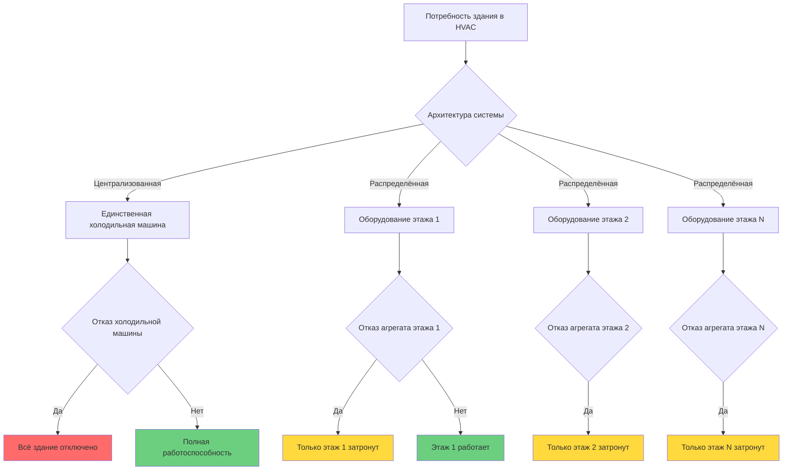
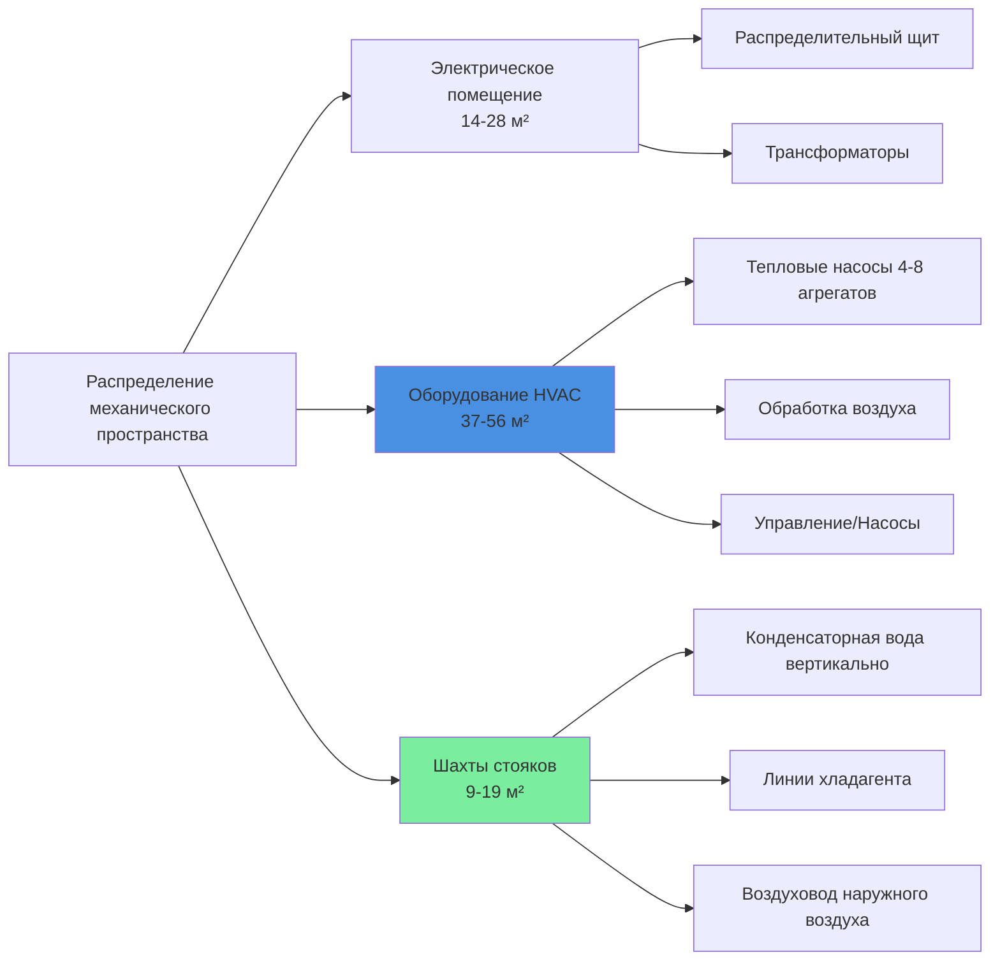

## Обзор

Распределённые системы HVAC размещают основное оборудование отопления и охлаждения на каждом этаже вместо централизованных механических пентхаусов. Эта архитектура принципиально изменяет механизмы энергетического транспорта, переходя от распределения жидкости (воздух или вода на большие вертикальные расстояния) к локализованным циклам хладагента или компактным гидравлическим контурам. Такой подход предоставляет явные преимущества в гибкости строительства, операционной резервируемости и кастомизации для арендаторов.

## Конфигурации систем

### Массивы тепловых насосов источника воды

Тепловые насосы источника воды (WSPV) представляют наиболее распространённый распределённый подход для высотных зданий. Каждый этаж содержит несколько комплектных агрегатов, подключённых к двухтрубному контуру конденсаторной воды, поддерживаемому в диапазоне 15-32°C.

**Принцип энергетического баланса:**

Контур конденсатора действует одновременно как тепловой сток и источник. При смешанных нагрузках отопления и охлаждения:

$$Q_{reject} = Q_{cooling} + W_{compressor,cooling}$$

$$Q_{extract} = Q_{heating} - W_{compressor,heating}$$

Температура сетевого контура поддерживается следующим образом:

$$\dot{m}c_p\Delta T = (Q_{reject} - Q_{extract}) \pm Q_{tower/boiler}$$

Где башня охлаждения или котёл активируются только при дисбалансе здания, превышающем ёмкость контура.

**ASHRAE Standard 90.1** требует возможностей рекуперации тепла при одновременном отоплении и охлаждении, что делает WSPV изначально соответствующими благодаря их архитектуре общего контура.

### Системы переменного хладагента (VRF)

Системы VRF располагают наружные конденсирующие агрегаты на каждом этаже (крыша, механический уступ или фасад) с хладагентом, распределённым на внутренние фанкойлы. Продвинутые системы поддерживают рекуперацию тепла между зонами:

$$COP_{system} = \frac{Q_{cooling} + Q_{heating}}{W_{compressor} + W_{fans}}$$

VRF с рекуперацией тепла может достигать значений COP системы, превышающих 4,0, путём передачи отклоненного тепла из охлаждаемых зон непосредственно в отапливаемые зоны через линии хладагента, исключая промежуточное отклонение тепла.

**Перепад давления в линиях хладагента** становится критическим:

$$\Delta P = f \frac{L}{D} \frac{\rho v^2}{2}$$

Для R-410A при типичных скоростях (жидкость: 0,91 м/с, пар: 9,14 м/с) вертикальные стояки под 61 м сохраняют приемлемые перепады давления ниже 34 кПа, сохраняя органы управления расширением.

### Комплектные агрегаты по этажам

Системы выделенного наружного воздуха (DOAS), объединённые с гидравлическим или электрическим отоплением, позволяют комплектным крышным агрегатам или сплит-системам работать на каждом этаже. Наружный воздух, распределённый вертикально, требует тщательного управления статическим давлением:

$$\Delta P_{static} = \rho g h$$

Вертикальный воздуховод 91 м создаёт дифференциал статического давления 49 Па, который должен быть скомпенсирован через управление демпфером или модуляцию скорости вентилятора, чтобы предотвратить избыточное давление на нижних этажах.

## Сравнительный анализ

| Характеристика | Распределённые системы | Централизованные системы |
|----------------|-------------------------|--------------------------|
| Пространство вертикального стояка | Минимальное (5-10 см трубы/хладагента) | Обширное (61-122 см воздуховоды/трубы) |
| Влияние отказа одной точки | Ограничено одним этажом | Влияет на всё здание |
| Кастомизация для арендаторов | Независимое управление по этажам | Ограничено централизованным расписанием |
| Резервирование оборудования | N+0 по этажам, здание-широкое N+50 | N+1 централизованное |
| Доступ для обслуживания | Требует входа на этаж | Централизованное механическое помещение |
| Потери при распределении | 2-5% (короткие пробеги) | 15-25% (долгий вертикальный транспорт) |
| Первоначальная стоимость | Выше (несколько агрегатов) | Ниже (экономия масштаба) |

## Эффективность энергетического транспорта

**Потери тепла в распределении:**

Централизованные системы, транспортирующие охлаждённую воду вертикально, испытывают потери:

$$Q_{loss} = UA\Delta T_{lm}$$

Для 152 м неизолированного стояка (труба 30 см, U=4,55 Вт/(м²·К), ΔT=17°C):

$$Q_{loss} = 4,55 \times (\pi \times 0,3 \times 152) \times 17 = 11,1 \text{ кВт}$$

С изоляцией 5 см (U=0,85 Вт/(м²·К)) потери сокращаются до 2,06 кВт, но всё равно представляют паразитную нагрузку.

Распределённые системы исключают это благодаря локализованной генерации. Трубы хладагента или конденсаторной воды имеют меньшую тепловую массу и пониженные температурные перепады к окружающей среде.

## Резервирование и надёжность

Распределённые системы обеспечивают присущую резервируемость N+50 на уровне здания. Отказ одного оборудования затрагивает только 2-4% площади здания (один этаж), тогда как отказы централизованной системы каскадируют на все этажи до ремонта.

## Гибкость и учёт для арендаторов

Системы по этажам обеспечивают:

- **Независимое расписание:** Арендаторы управляют временем работы без влияния на другие этажи
- **Прямой учёт:** Потребление электроэнергии измеряется в распределительном щите этажа
- **Пользовательские уставки:** Предпочтения температуры варьируются по арендаторам без компромиссов

Эта гибкость увеличивает привлекательность в многоарендаторных зданиях. ASHRAE Standard 189.1 поощряет отдельный учёт для арендаторов в целях энергетической ответственности.

**Время тепловой реакции** улучшается с распределёнными системами:

$$\tau = \frac{mc_p}{UA}$$

Меньший объём воздуха на этаж (тепловая масса) в сочетании с локализованным размещением оборудования снижает постоянные времени с 2-4 часов (централизованная VAV) до 15-30 минут (распределённая), обеспечивая более быструю реакцию на изменения занятости.

## Требования к пространству

Каждый этаж требует 60-102 м² механической и электрической инфраструктуры (8-12% типичной площади этажа 929 м²). Это жертвует сдаваемой в аренду площадью, но исключает требование большого централизованного пентхауса и снижает структурную нагрузку сердцевины.

Помещения оборудования распределяют вес по перекрытиям этажей, а не концентрируют нагрузки. Централизованная холодильная машина мощностью 88 кВт весит 13 600 кг; десять WSPV мощностью 8,8 кВт каждый весят 2 722 кг в сумме, распределённые по десяти этажам.

## Соображения по техническому обслуживанию

**Проблемы доступа:**

Техники должны получить доступ к помещениям арендаторов для планового обслуживания, требуя координации и возможной работы в нерабочее время. Централизованные системы обеспечивают доступ в механическое помещение 24/7 без нарушения работы арендаторов.

**Инвентарь запасных частей:**

Несколько идентичных агрегатов позволяют хранить запасные части на месте. Здание со 120 WSPV может хранить 2-3 компрессора, обеспечивая быструю возможность ремонта по сравнению с ожиданием замены компрессора холодильной машины.

**Частота замены фильтров:**

ASHRAE Standard 62.1 требует фильтрации MERV 8 минимум. Распределённые агрегаты с меньшей площадью фильтра (61 см × 61 см против 244 см × 122 см центрального AHU) требуют ежемесячной замены фильтров в нескольких местах, а не ежеквартальной центральной замены.

## Акустический контроль и управление вибрацией

Близость оборудования к занятым помещениям требует строгой изоляции вибраций. Пружинные изоляторы с эффективностью изоляции 90% (собственная частота = 0,2 × частота возбуждения) являются минимумом:

$$f_n = \frac{1}{2\pi}\sqrt{\frac{k}{m}}$$

Для теплового насоса массой 363 кг на пружинах: достичь $f_n$ < 5 Гц для изоляции от работы компрессора при 3 600 об/мин (60 Гц).

Акустические требования согласно справочнику ASHRAE Applications рекомендуют NC-35 для частных офисов, требуя уровней звука оборудования ниже 55 дBA на 1,5 м с надлежащей обработкой корпуса.

## Управление наружным воздухом

Каждый этаж требует выделенного воздухозаборника наружного воздуха, создавая несколько проникновений фасада. Управление давлением становится критическим:

**Давление в здании:**

$$Q_{OA,total} - Q_{exhaust,total} = Q_{exfiltration}$$

Координация наружного воздуха на 30+ этажах требует интеграции системы управления зданием (BMS) для поддержания лёгкого положительного давления (10-25 Па), предотвращающего инфильтрацию при избежании избыточного давления, вызывающего затруднения при открытии дверей.

---

**Ссылки:**
- ASHRAE Standard 90.1-2019: Энергетический стандарт для зданий
- ASHRAE Standard 62.1-2019: Вентиляция для приемлемого качества воздуха в помещении
- ASHRAE Handbook—HVAC Applications, Chapter 40: Tall Buildings
