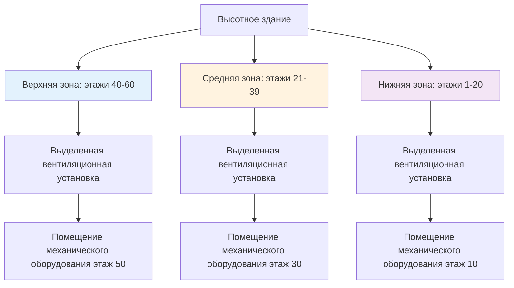
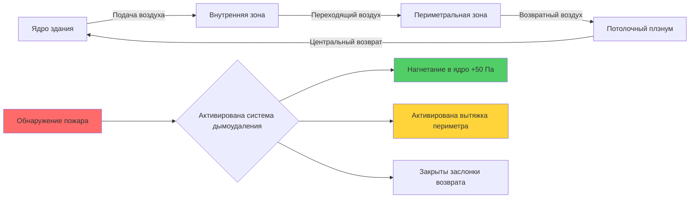
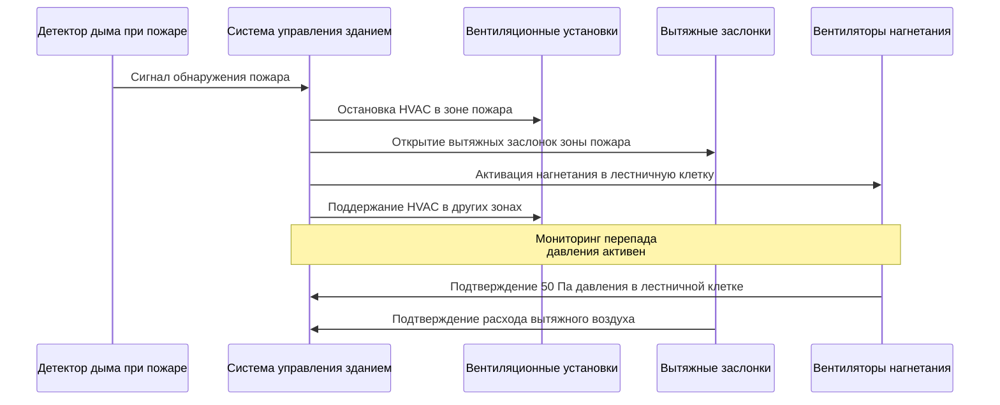

## Физические принципы компартментализации

Компартментализация в высотных зданиях делит конструкцию на отдельные пожарные и давленческие зоны для ограничения миграции дыма, контроля схем потока воздуха и облегчения эвакуации занимающих помещение лиц во время чрезвычайных ситуаций. Фундаментальная физика, управляющая компартментализацией, сосредоточена на поддержании перепада давления через барьеры и конвективном течении нагретых газов.

Перепад давления, необходимый для предотвращения просачивания дыма через барьер, определяется следующим образом:

$$\Delta P = \rho g h \frac{T_h - T_c}{T_c}$$

Где $\Delta P$ — перепад давления (Па), $\rho$ — плотность воздуха (кг/м³), $g$ — ускорение свободного падения (9,81 м/с²), $h$ — высота отверстия (м), $T_h$ — температура горячего газа (К), $T_c$ — температура окружающей среды (К). Для эффективного дымоудаления NFPA 92 требует поддержания минимальных перепадов давления 25 Па через дымовые барьеры, увеличиваясь до 50 Па для нагнетания в лестничные клетки.

## Требования нормативов и стандарты

### Положения NFPA и IBC

Международный строительный кодекс (IBC) раздел 403 требует специфических требований компартментализации для высотных зданий (конструкции выше 75 футов или 23 метров в высоту). IBC раздел 403.4.6 требует систем дымоудаления, спроектированных в соответствии с разделом 909, который напрямую ссылается на NFPA 92 для методологии проектирования.

NFPA 92 устанавливает критерии на основе производительности для компартментализации:

- Перепады давления 25-35 Па для горизонтальных дымовых барьеров
- Минимум 50 Па через двери лестничной клетки при нагнетании
- Максимум 133 Па для обеспечения работоспособности двери
- Расчеты площади утечки на основе качества конструкции

IBC раздел 716 указывает рейтинги огнестойкости для вертикальных и горизонтальных узлов, обычно требуя 2-часовых огнестойких барьеров между основными отсеками в высотных конструкциях.

## Стратегии вертикальной компартментализации

Вертикальное зонирование делит здание на стопочные отсеки, обычно охватывающие 15-25 этажей на зону. Эта стратегия решает проблему градиента давления эффекта тяги, который масштабируется с высотой здания:

$$\Delta P_{stack} = \rho_o g h \left(1 - \frac{T_o}{T_i}\right)$$

Где $\rho_o$ — плотность наружного воздуха, $h$ — вертикальное расстояние между точками, $T_o$ — температура наружного воздуха, $T_i$ — температура внутреннего воздуха.

### Барьеры между этажами

Каждая конструкция этажа представляет собой горизонтальный пожарный и дымовой барьер. Площадь утечки через проходы на этажах критически влияет на эффективность компартментализации:

$$Q = C A \sqrt{2\Delta P/\rho}$$

Где $Q$ — объемный расход воздуха (м³/с), $C$ — коэффициент расхода (обычно 0,65), $A$ — общая площадь утечки (м²). Для типичного этажа с эквивалентной площадью утечки 0,01 м² и перепадом давления 25 Па примерно 0,13 м³/с передается между этажами.

### Компартментализация механических шахт

Вертикальные шахты, содержащие стояки HVAC, шахты лифтов и служебные проходы, представляют значительные пути утечки. Стратегии включают:

**Противопожарные заслонки в проходах этажей**: Самозакрывающиеся заслонки с рейтингом огнестойкости 1,5 или 3 часа согласно UL 555
**Нагнетание в шахту**: Поддержание положительного давления в механических шахтах относительно смежных пространств
**Компартментация на механических этажах**: Создание зон сброса давления на уровнях оборудования

## Горизонтальная компартментализация

Горизонтальная компартментализация делит отдельные этажи на отдельные дымовые зоны, особенно критична для больших этажей площадью более 1 860 м².

| Стратегия компартментализации | Типовое применение | Перепад давления | Ссылка на нормативы |
|-------------------------------|---------------------|----------------------|----------------|
| Барьеры разделения помещений нанимателей | Многоквартирные этажи | 12-25 Па | IBC 403.4.6 |
| Ограждения лестничной клетки | Защита путей эвакуации | 50-75 Па | NFPA 92, раздел 4.6 |
| Барьеры лифтового вестибюля | Разделение групп лифтов | 25-35 Па | IBC 3007.7 |
| Барьеры убежища | Доступная эвакуация | 50-60 Па | IBC 1009.6 |

### Зонирование от ядра к периметру

Современные высотные здания обычно применяют компартментализацию от ядра к периметру, создавая давленческие зоны, которые учитывают различающиеся тепловые нагрузки и схемы занятости:

Физика нагнетания в ядро основана на уравнении потока через отверстие. Для дверного проема площадью $A_d$ = 2 м² с перепадом давления 50 Па:

$$Q_{door} = 0.65 \times 2 \times \sqrt{\frac{2 \times 50}{1.2}} = 11.9 \text{ м}^3/\text{с} (25,200 \text{ CFM)}$$

Это представляет подачу воздуха, требуемую для поддержания нагнетания с одной открытой дверью во время эвакуации.

## Контроль утечек между этажами

Неконтролируемые утечки между этажами компрометируют эффективность компартментализации. Основные пути утечки включают:

**Системы навесных стен**: Камеры выравнивания давления требуют герметизации на каждом этаже
**Вертикальные кабельные и трубные проходы**: Противопожарная герметизация согласно ASTM E814/UL 1479
**Воздуховоды HVAC**: Противопожарные/дымовые заслонки в рейтируемых барьерах согласно NFPA 90A
**Двери шахт лифтов**: Уплотнения для достижения скорости утечки ниже 0,3 м³/с на дверь при 75 Па

### Количественное определение утечек

Общая утечка между этажами рассчитывается суммированием площадей утечки компонентов:

$$A_{total} = A_{construction} + A_{penetrations} + A_{doors} + A_{dampers}$$

Для плотной конструкции $A_{total}$ варьируется от 0,005-0,015 м² на 100 м² площади этажа. Для стандартной конструкции это увеличивается до 0,02-0,04 м² на 100 м².

## Интеграция с проектированием системы HVAC

Стратегия компартментализации напрямую влияет на топологию системы HVAC:

**Выделенные системы наружного воздуха (DOAS)**: Обслуживают отдельные отсеки с изолированным распределением
**Системы возврата воздуха**: Сконфигурированы для предотвращения рециркуляции дыма между зонами
**Дымоудаление**: Обеспечение 6-10 кратного воздухообмена в час из зоны пожара
**Подпиточный воздух**: Подача в смежные зоны для поддержания перепадов давления

### Последовательность работы в режиме пожара

## Рекомендации по проектированию и лучшие практики

**Мониторинг давления**: Непрерывное измерение перепада давления через критические барьеры
**Координация подпиточного воздуха**: Определение размера систем подпиточного воздуха для замены объемов вытяжного дыма
**Анализ усилия открывания двери**: Проверка того, что усилия открывания двери остаются ниже 133 Н при активных системах нагнетания согласно IBC 1010.1.3
**Испытание на утечку**: Ввод в эксплуатацию систем с использованием испытания дверным вентилятором согласно ASTM E779
**Избыточность**: Обеспечение резервных вентиляторов нагнетания на аварийном питании

Эффективная площадь утечки для хорошо герметизированного границы отсека не должна превышать:

$$A_{effective} = \frac{Q_{design}}{\sqrt{2 \Delta P_{design}/\rho}}$$

Для расхода проектирования 10 м³/с при перепаде давления 50 Па максимально допустимая площадь утечки составляет примерно 0,77 м².

## Проверка производительности

NFPA 92 раздел 4.6.4 требует испытания и проверки установленных систем компартментализации. Протоколы испытания включают:

- Измерение перепада давления через все барьеры в условиях проектирования
- Испытание усилия открывания двери при активных системах нагнетания
- Испытание дыма с трассером для проверки схем потока
- Проверку времени отклика системы от тревоги до полного нагнетания

Критерии приемки требуют достижения проектных перепадов давления в течение 30 секунд после активирования системы и поддержания перепадов в течение минимум 2 часов на аварийном питании.

Компартментализация представляет основу безопасного для пожара проектирования высотных зданий, интегрируя архитектурные барьеры с механическими системами нагнетания для контроля миграции дыма и защиты путей эвакуации. Скрупулезное внимание к качеству конструкции, минимизации утечек и координации системы обеспечивает надежную производительность во время пожарных чрезвычайных ситуаций.
