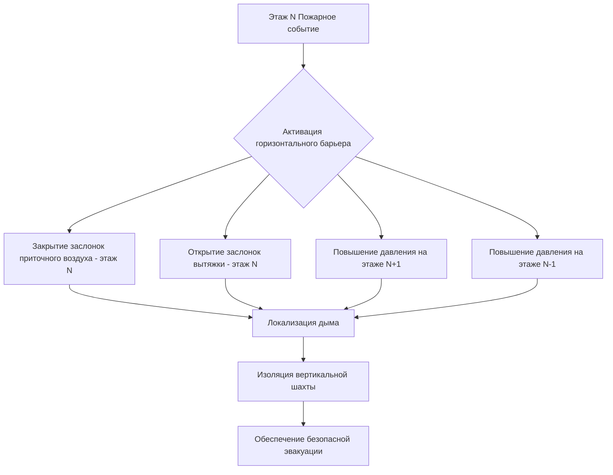
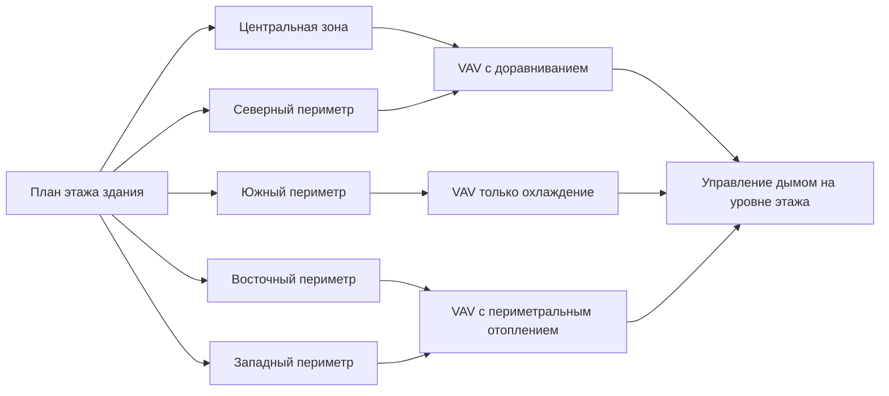

## Физическая основа горизонтального разделения помещений

Горизонтальное разделение помещений в высоких зданиях создает дискретные зоны давления на каждом уровне этажа для контроля движения дыма при пожаре. Фундаментальный принцип основан на поддержании перепадов давления через горизонтальные барьеры для предотвращения миграции дыма, вызванной плавучестью, через вертикальные шахты.

Разность давления эффекта тяги между этажами определяется следующим образом:

$$\Delta P = \rho_o g h \left(\frac{1}{T_o} - \frac{1}{T_i}\right)$$

Где $\Delta P$ — разность давления (Па), $\rho_o$ — плотность наружного воздуха (кг/м³), $g$ — ускорение свободного падения (9,81 м/с²), $h$ — высота выше нейтральной плоскости (м), $T_o$ — температура наружного воздуха (К), и $T_i$ — температура внутреннего воздуха (К).

Эффективное горизонтальное зонирование должно преодолевать этот естественно возникающий градиент давления для поддержания целостности отсека как при нормальной работе, так и при чрезвычайных ситуациях.

## Требования к поэтажной изоляции

### Стандарты разделения согласно IBC

Раздел 403.2 IBC требует, чтобы огнестойкие перекрытия в высоких зданиях имели огнестойкость не менее 2 часов. Каждый этаж функционирует как горизонтальный противопожарный отсек со специфическими требованиями интеграции HVAC системы:

- **Узлы перекрытия-потолка**: Минимальный рейтинг огнестойкости 2 часа
- **Проходки**: Герметизированы противопожарной лентой согласно разделу 714 IBC
- **Воздуховоды HVAC**: Противопожарные/дымовые заслонки на огнестойких границах
- **Максимальная площадь отсека**: Как правило, 2090 м² согласно таблице 707.3.10 IBC

### Поддержание герметичности границы давления

Для поддержания целостности отсека разность давления через плиту перекрытия должна превышать давление эффекта тяги с коэффициентом безопасности:

$$\Delta P_{required} = 1.5 \times \Delta P_{stack} + 12.5 \text{ Па}$$

Это обеспечивает минимальную разность давления 12,5 Па при условиях проектирования с коэффициентом безопасности 50% против естественно возникающих сил плавучести.

## Проектирование горизонтального дымового барьера

### Критерии производительности барьера

Горизонтальные дымовые барьеры должны сопротивляться прохождению дыма при обеспечении конструктивной деформации и теплового расширения. Скорость утечки через барьеры рассчитывается следующим образом:

$$Q = C_d A \sqrt{2 \Delta P / \rho}$$

Где $Q$ — объемный расход (м³/с), $C_d$ — коэффициент расхода (0,6–0,7 для щелей), $A$ — площадь утечки (м²), и $\rho$ — плотность воздуха (кг/м³).

| Компонент барьера | Макс. скорость утечки | Рейтинг огнестойкости | Тип заслонки |
|-------------------|------|------|------|
| Проходки в плите перекрытия | 0,05 м³/с при 75 Па | 2 часа | Комбинированная противопожарная/дымовая |
| Интерфейсы завесной стены | 0,10 м³/с при 75 Па | 1 час | Только дымовая |
| Отверстия вертикальной шахты HVAC | 0,02 м³/с при 75 Па | 2 часа | Моторизованная противопожарная/дымовая |
| Узлы дверей | 0,03 м³/с при 75 Па | 1,5 часа | Самозакрывающаяся дымовая |

### Координация заслонок

Противопожарные/дымовые заслонки на горизонтальных границах требуют определенных последовательностей приведения в действие. Время закрытия заслонки не должно превышать 4 минуты согласно NFPA 105, с отказобезопасным позиционированием при потере питания. Переходный процесс давления во время закрытия заслонки следует:

$$\frac{dP}{dt} = \frac{\dot{m} R T}{V}$$

Где $\dot{m}$ — изменение массового расхода, $R$ — удельная газовая постоянная, $T$ — абсолютная температура, и $V$ — объем отсека. Быстрое закрытие заслонки может создать скачки давления, превышающие 100 Па, требующие предусмотрения сброса давления.

## Зонирование HVAC по этажам

### Зонирование одного этажа в сравнении с многоэтажным

Поэтажное зонирование HVAC обеспечивает максимальный контроль разделения дыма, но увеличивает сложность системы и количество оборудования. Матрица решений учитывает:

| Критерий | Зоны одного этажа | Многоэтажные зоны (3–5 этажей) |
|----------|------|------|
| Эффективность управления дымом | Отличная (100% изоляция) | Хорошая (требуются последовательные заслонки) |
| Количество оборудования | Высокое (1 АПВР на этаж) | Среднее (1 АПВР на 3–5 этажей) |
| Сложность воздуховодов | Низкая (без вертикальных стояков) | Высокая (вертикальные шахты требуются) |
| Эффективность рекуперации энергии | Низшая (меньшее оборудование) | Высшая (большее оборудование) |
| Первоначальная стоимость | На 15–25% выше | Базовая линия |
| Доступ к пожаротушению | Лучше (каждый этаж независим) | Средний (последовательное отключение) |

### Зонирование периметра в сравнении с ядром

Горизонтальное зонирование разделяет каждый этаж на тепловые зоны на основе солнечной нагрузки и характеров использования:

**Расчет глубины периметральной зоны**:

$$D_{perimeter} = \frac{Q_{solar} \times A_{glazing}}{q_{cooling} \times W_{floor}}$$

Где $D_{perimeter}$ — глубина периметральной зоны (м), $Q_{solar}$ — пиковый прирост солнечного тепла (Вт/м²), $A_{glazing}$ — площадь окна на линейный метр (м²/м), $q_{cooling}$ — охлаждающая способность на площадь этажа (Вт/м²), и $W_{floor}$ — ширина этажа (м).

Типичные глубины периметральных зон варьируются от 4 до 6 м в зависимости от характеристик остекления и ориентации здания.

## Определение размера противопожарного отсека

### Ограничения площади

Таблица 707.3.10 IBC устанавливает максимальные площади противопожарных отсеков на основе типа конструкции и защиты спринклерной системой. Для высоких зданий (конструкция типа I с спринклерами):

- **Максимальный одиночный отсек**: 2090 м²
- **Совокупная площадь этажа**: Неограниченна с горизонтальными узлами на 2 часа
- **Атриумные пространства**: Специальное управление дымом согласно разделу 404.5 IBC

Скорость выделения тепла в отсеке определяет требуемую вентиляцию:

$$\dot{m}_{exhaust} = \frac{\dot{Q}}{c_p (T_{smoke} - T_{ambient})}$$

Где $\dot{m}_{exhaust}$ — массовый расход вытяжки (кг/с), $\dot{Q}$ — скорость выделения тепла (кВт), $c_p$ — удельная теплоемкость (1,005 кДж/кг·К), и $T_{smoke}$ — температура дымового слоя (типично 400–600°С при проектировании).

### Требования по разделению арендаторов

Многоарендаторские этажи требуют горизонтальных противопожарных барьеров между помещениями арендаторов, превышающих 232 м² на арендатора. Последствия для HVAC системы включают:

- Независимый контроль зоны для каждого арендатора (мин. 1 коробка VAV)
- Противопожарные/дымовые заслонки на всех проходках барьера
- Изоляция пути возвратного воздуха (без совместимых возвратных плен через барьеры)
- Выделенная вытяжка для использования арендаторами с высоким риском

## Проектирование этажа убежища

### Назначение и частота

Этажи убежища обеспечивают безопасные районы для занимающихся зданием при эвакуации и зоны развертывания пожаротушения. Раздел 403.6.2 IBC требует зон убежища в зданиях, превышающих 128 м в высоту, расположенные с максимальными интервалами в 30 этажей.

### Требования HVAC системы для этажей убежища

Этажи убежища требуют улучшенного контроля окружающей среды со следующими положениями:

| Параметр | Нормальная работа | Аварийная работа |
|----------|------|------|
| Наддув давлением | 2,5–5 Па позитивное | 12,5–25 Па позитивное |
| Изменение воздуха в час | 6–8 ACH | 15–20 ACH (приточный воздух) |
| Контроль температуры | 20–24°С | 15–29°С приемлемо |
| Вмятина на дым | Н/А | 0,05 м³/с·м² площади этажа |
| Резервное питание | 100% систем | 100% систем + 24-часовое топливо |
| Разделение с рейтингом огнестойкости | 2 часа минимум | 2 часа минимум |

Расход наддува давлением для этажей убежища рассчитывается как:

$$Q_{press} = \frac{A_{leakage} \times 2540 \times \sqrt{\Delta P}}{C_d}$$

Где $Q_{press}$ — расход наддува давлением (CFM), $A_{leakage}$ — общая площадь утечки (м²), $\Delta P$ — проектная разность давления (Па), и $C_d$ — коэффициент расхода (0,65).

### Соображения по открытому плану этажа

Открытые планы этажей без перегородок полной высоты представляют проблемы для горизонтального разделения помещений:

- **Покрытие детекторов дыма**: Расстояние сокращено до 0,7× стандартного согласно NFPA 72 для гладких потолков выше 3,6 м
- **Временные барьеры**: Развертываемые дымовые завесы в предопределенных местах
- **Распределение воздуха**: Системы подпольного или надпольного расположения не должны создавать пути горизонтального транспорта дыма
- **Однородность наддува давлением**: Требуется CFD моделирование для проверки распределения давления на открытых площадях

Постоянная времени смешивания дыма на открытых этажах:

$$\tau = \frac{V_{compartment}}{Q_{exhaust} + Q_{makeup}}$$

Где $\tau$ — постоянная времени (секунды) для спуска дымового слоя. Цель проектирования: поддерживать дымовой слой выше 1,8 м минимум 20 минут для обеспечения безопасной эвакуации.

## Интеграция со строительными системами

Горизонтальное разделение помещений требует координации между архитектурными, конструктивными и HVAC системами. Ключевые точки интеграции включают:

- **Система управления зданием (BMS)**: Контролирует перепады давления на уровне этажа и позиции заслонок
- **Система пожарной сигнализации**: Инициирует последовательности управления дымом на основе активации зоны детектора
- **Отзыв лифта**: Координирует с наддувом давлением HVAC для предотвращения попадания дыма в шахты лифтов
- **Наддув лестничной клетки**: Работает в сочетании с управлением дымом на уровне этажа для поддержания чистых путей эвакуации

Успешное горизонтальное зонирование достигает разделенного управления дымом при сохранении энергоэффективности и комфорта занимающихся во время нормальной эксплуатации здания.
