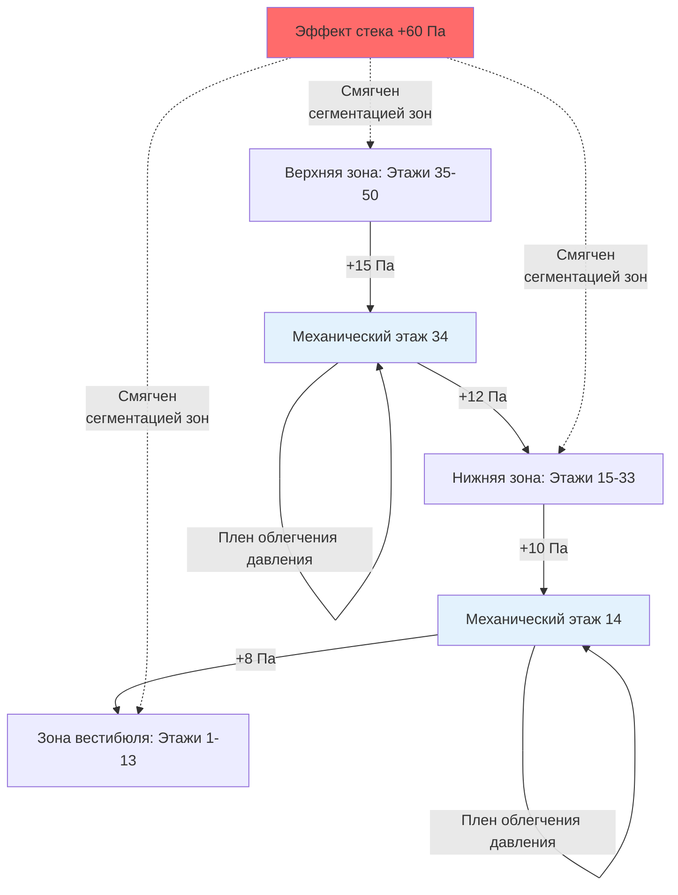
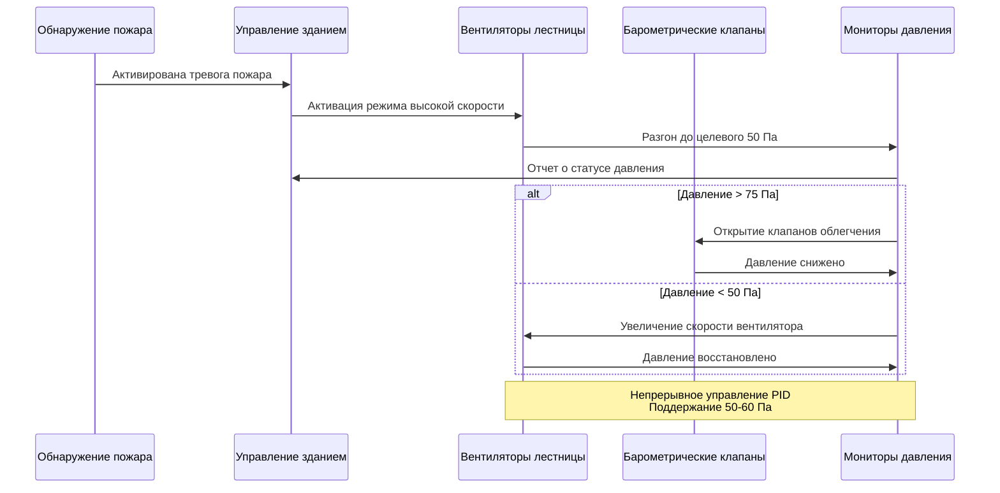
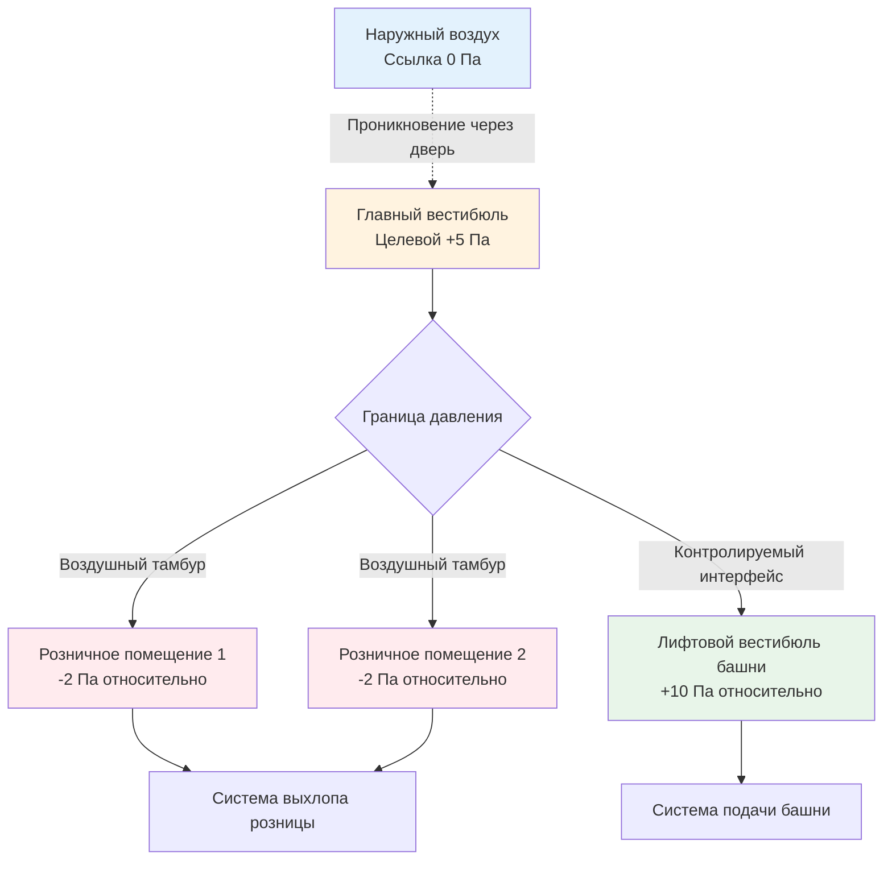
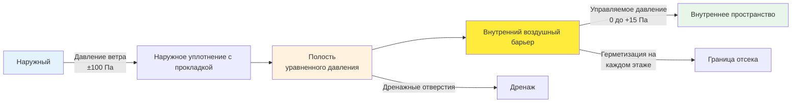

## Основные принципы проектирования границ давления

Границы давления в высотных зданиях устанавливают контролируемые зоны давления, которые противостоят силам эффекта стека, предотвращают неконтролируемую миграцию воздуха и поддерживают цели безопасности при пожаре. Граница давления состоит из физических барьеров в сочетании с механическими системами нагнетания для поддержания установленных перепадов давления на границах отсеков.

Перепад давления на границе поддерживается балансом чистого потока воздуха:

$$\Delta P = \left(\frac{\rho}{2C^2 A^2}\right) Q^2$$

Где $\Delta P$ — перепад давления (Па), $\rho$ — плотность воздуха (1,2 кг/м³), $C$ — коэффициент расхода (0,6-0,7), $A$ — общая площадь утечки (м²), и $Q$ — чистый расход воздуха (м³/с). Это соотношение демонстрирует, что поддержание границ давления требует как минимизации площади утечки, так и обеспечения достаточного потока воздуха для преодоления присущей утечки.

## Определение зон давления

### Вертикальная сегментация зон

Высотные здания подразделяются на вертикальные зоны давления для управления величиной эффекта стека. Давление эффекта стека на любой высоте составляет:

$$\Delta P_{stack} = 3460 \cdot h \cdot \frac{(T_i - T_o)}{T_o}$$

Где $h$ — разность высот (м), $T_i$ — внутренняя температура (K), и $T_o$ — наружная температура (K). Для здания высотой 300 метров с $T_i$ = 293K и $T_o$ = 268K (-5°C), общее давление стека превышает 350 Па.

Разделение на три зоны по 100 метров каждая снижает максимальное давление стека на зону до примерно 117 Па, позволяя эффективное управление давлением стандартными механическими системами.

| Высота здания | Рекомендуемое количество зон | Высота зоны | Максимальное давление стека (зимой) |
|-----------------|------------------------|-------------|----------------------------------|
| 50-100 м | 1-2 | 50-100 м | 50-120 Па |
| 100-200 м | 2-3 | 50-75 м | 60-90 Па на зону |
| 200-300 м | 3-4 | 60-80 м | 70-95 Па на зону |
| >300 м | 4+ | 60-85 м | 75-100 Па на зону |

### Проектирование переходов между зонами

Переходы между зонами давления обычно происходят на уровнях механического оборудования или в промежуточных пространствах. Этаж переходной зоны служит буферным плену облегчения давления, который буферизирует между зонами:

Механический этаж должен поддерживать давление между соседними зонами:

$$P_{mechanical} = \frac{P_{upper} + P_{lower}}{2} \pm 5 \text{ Па}$$

Такое расположение предотвращает крупные градиенты давления на проникновениях механического этажа при одновременном обеспечении независимого управления каждой зоной.

## Нагнетание заборных шахт

### Границы шахт лифтов

Шахты лифтов пронизывают все зоны давления, создавая значительные пути утечки. Объемный расход через двери шахты лифта составляет:

$$Q_{shaft} = C \cdot A_{door} \cdot \sqrt{\frac{2\Delta P}{\rho}}$$

Для типичного лифта с четырьмя дверями на этаж по 2,5 м² на дверь, с перепадом давления 30 Па и коэффициентом утечки 0,7:

$$Q_{floor} = 0.7 \times (4 \times 2.5) \times \sqrt{\frac{2 \times 30}{1.2}} = 49.5 \text{ м}^3/\text{с} = 105,000 \text{ CFM (178 тыс. м³/ч)}$$

Эта массивная утечка требует систем нагнетания шахты, которые нейтрализуют перепад давления между шахтой и соседними этажами.

**Стратегии нагнетания шахты:**

- **Нейтральное нагнетание**: Поддерживание шахты на среднем давлении здания (±2 Па относительно этажей)
- **Легкое положительное давление**: +5 до +10 Па для предотвращения проникновения дыма во время сценариев пожара
- **Клапаны облегчения**: Автоматическое облегчение давления при 15-20 Па для предотвращения чрезмерного накопления
- **Подача нагнетаемого воздуха**: Непрерывная низкообъемная подача (0,5-1,0 воздухообмена в час) на середине высоты шахты

### Границы давления лестничных клеток

Лестничные клетки требуют независимого нагнетания для защиты путей эвакуации. IBC Раздел 909.20 и NFPA 92 предписывают минимум 50 Па перепада давления в режиме пожара, с максимумом 75 Па для обеспечения работоспособности двери.

В нормальных условиях лестничные клетки работают при легком положительном давлении (+5 до +12 Па) для предотвращения проникновения запахов и загрязняющих веществ. Во время режима пожара:

Требования к расходу воздуха для нагнетания лестницы зависят от сценариев открытия двери:

$$Q_{total} = n \times A_{door} \times v_{door} + Q_{leakage}$$

Где $n$ — количество одновременно открытых дверей (типично 1 или 2), $A_{door}$ — площадь двери (2 м²), $v_{door}$ — скорость через открытую дверь (2,5-3,0 м/с для предотвращения обратного потока дыма), и $Q_{leakage}$ — фоновая утечка через закрытые двери.

## Изоляция и нагнетание вестибюля

### Проблемы многоэтажного вестибюля

Многоэтажные вестибюли представляют уникальные проблемы границы давления из-за их объема, множественных точек входа и вертикальной открытости. Вестибюль действует как массивная зона облегчения давления, которая может компрометировать отсечение, если не управляется надлежащим образом.

**Рассмотрения при проектировании:**

- **Эффекты объема**: Крупные вестибюли требуют значительного расхода воздуха для управления давлением из-за высокой утечки в дверях на уровне земли
- **Нагнетание вращающихся дверей**: Вращающиеся двери снижают инфильтрацию на 60-80% по сравнению с маятниковыми дверями, но вводят утечку вращающихся уплотнений
- **Проектирование тамбура**: Двойные входные тамбуры создают зоны блокировки давления, которые минимизируют проникновение наружного воздуха

Расход нагнетания воздуха для вестибюля со значительным наружным воздействием составляет:

$$Q_{lobby} = \frac{A_{doors} \times v_{avg} \times 3600}{E}$$

Где $A_{doors}$ — общая площадь открытия двери во время пикового трафика (м²), $v_{avg}$ — средняя скорость двери (1,5 м/с), и $E$ — эффективность уплотнения двери (0,3 для вращающихся, 0,8 для стандартных маятниковых дверей).

### Интерфейс давления вестибюля и башни

Граница между многоэтажным вестибюлем и этажами башни требует тщательного управления давлением:

| Местоположение интерфейса | Стратегия давления | Типичный перепад | Метод управления |
|--------------------|-------------------|----------------------|----------------|
| Разделение лифтового вестибюля | Положительное давление башни | +8 до +12 Па | Смещение подачи воздуха в башню |
| Потолок главного вестибюля | Нейтральное давление | 0 до +5 Па | Плен возвращаемого воздуха |
| Механический антресольный этаж | Положительное давление | +10 до +15 Па | Специальное нагнетание |
| Погрузочно-разгрузочная платформа уровня вестибюля | Отрицательное давление | -5 до -10 Па | Специальный выхлоп |

### Интеграция розничных и общественных пространств

Розничные помещения на первом этаже пронизывают границу давления вестибюля. Они требуют независимых систем HVAC с выделенным управлением давлением:

Поддержание розничных помещений при легком отрицательном давлении (-2 до -5 Па) относительно вестибюля предотвращает миграцию запахов кухни, утечек хладагента и других загрязняющих веществ в основной оборот воздуха здания.

## Нагнетание механического помещения

### Управление давлением в помещении оборудования

Помещения механического оборудования требуют положительного нагнетания (+10 до +25 Па) для предотвращения проникновения дыма и поддержания чистой окружающей среды работы оборудования. Перепад давления достигается через баланс подачи-выхлопа воздуха:

$$Q_{supply} = Q_{exhaust} + Q_{pressurization}$$

Где $Q_{pressurization}$ рассчитывается на основе характеристик утечки помещения:

$$Q_{pressurization} = C \cdot A_{leakage} \cdot \sqrt{\frac{2\Delta P_{target}}{\rho}}$$

Для помещения механического оборудования с поверхностью 500 м² и типичной утечкой конструкции 0,04 м² на 100 м² (всего 0,20 м²), целевое значение +15 Па:

$$Q_{pressurization} = 0.65 \times 0.20 \times \sqrt{\frac{2 \times 15}{1.2}} = 0.65 \text{ м}^3/\text{с} = 1,375 \text{ CFM (2,3 тыс. м³/ч)}$$

### Проектирование промежуточных пространств

Промежуточные пространства между занятыми этажами размещают механические системы распределения и обеспечивают доступ для обслуживания. Эти пространства устанавливают критические границы давления:

**Функции нагнетания:**

1. **Сдерживание утечки воздуховода**: Положительное давление предотвращает проникновение некондиционированного воздуха в системы распределения
2. **Предотвращение конденсации**: Нагнетание снижает проникновение наружного воздуха и поддерживает контроль точки росы
3. **Поддержка пожарного барьера**: Механические пространства служат пожаростойким разделением между вертикальными зонами
4. **Доступ для обслуживания**: Достаточная высота (минимум 2,4-3,0 м) для доступа к обслуживанию

Давление промежуточного пространства должно превышать соседние занятые пространства на:

$$\Delta P_{interstitial} = 10 + 0.5(P_{upper} + P_{lower})$$

Это гарантирует, что промежуточное пространство остается доминирующим источником давления, предотвращая движение воздуха, управляемое давлением, между вертикальными зонами через механические проникновения.

### Интеграция выделенного наружного воздуха

Промежуточные пространства часто размещают оборудование системы выделенного наружного воздуха (DOAS). Местоположение впуска DOAS критически влияет на производительность границы давления:

**Оптимальные местоположения впуска, ранжированные по эффективности границы давления:**

1. **Шахта с независимыми жалюзи впуска**: Изолирует наружный воздух от поля давления здания
2. **Помещение оборудования с выделенным впуском**: Обеспечивает предварительную фильтрацию и кондиционирование перед распределением
3. **Промежуточное пространство с компартментированным впуском**: Обеспечивает промежуточную зону для управления давлением
4. **Прямые впуски по этажам**: Максимальная изоляция, но высокие затраты на установку и техническое обслуживание

## Конструкция системы воздушного барьера

### Принципы непрерывного воздушного барьера

Система воздушного барьера формирует физическую основу границ давления. ASHRAE 90.1 Раздел 5.4.3 требует непрерывных воздушных барьеров с максимальной утечкой 0,02 м³/с на м² площади оболочки при испытании на давление 75 Па.

**Критические местоположения непрерывности воздушного барьера:**

- **Интерфейс этажа к наружной стене**: Герметизация аэрозольной пеной или предварительно сжатыми прокладками
- **Механические проникновения**: Огнезащитные продукты с воздушногерметичными свойствами (ASTM E814 и ASTM E283)
- **Подключения окна к стене**: Гидроизоляция обратного поддона, непрерывный герметик и прокладки сжатия
- **Соединения структурного движения**: Гибкие мембраны воздушного барьера, рассчитанные на ±25% движение соединения

### Системы навесных стен как границы давления

Системы навесных стен в высотных зданиях должны функционировать как барьеры от погодных условий и границы давления. Принцип уравнивания давления разделяет полость стены:

Полость уравненного давления снижает перепад давления через внутреннее уплотнение воздушного барьера от полного давления ветра к близкому к нулю, что резко снижает нагрузки инфильтрации.

Отсечение на каждом этаже предотвращает эффект стека в полости:

$$\Delta P_{cavity} = \frac{h_{floor}}{h_{total}} \times \Delta P_{stack,total}$$

Герметизацией полости на каждом этаже (типично 3-4 метра), эффект стека в полости снижается в 75-100 раз по сравнению с негерметизированной полостью, простирающейся на всю высоту здания.

## Испытания и проверка

### Ввод в эксплуатацию границы давления

ASHRAE Guideline 1.1 и NFPA 3 требуют комплексного испытания границы давления:

**Протоколы испытаний:**

1. **Тест нагнетания всего здания**: По ASTM E779, количественная оценка полной утечки здания
2. **Испытания нагнетания отсека**: Проверка межзонного управления давлением при условиях проекта
3. **Испытания с газом-трассировщиком**: Определение неожиданных путей воздуха с использованием трассировщиков SF₆ или CO₂
4. **Картирование перепада давления**: Измерение поля давления на всех основных границах во время сезонных экстремумов

**Критерии приемки:**

- Достижение целевых перепадов давления ±15% при установившихся условиях
- Демонстрация управления давлением во время переходных процессов открытия/закрытия двери (восстановление в течение 30 секунд)
- Проверка того, что усилия открытия двери остаются ниже 133 Н (30 фунт-сил) согласно IBC 1010.1.3
- Подтверждение точности системы мониторинга давления ±2,5 Па

### Непрерывный мониторинг производительности

Постоянные системы мониторинга давления отслеживают производительность границы:

$$\text{Индекс производительности границы давления} = \frac{\Delta P_{measured}}{\Delta P_{design}} \times 100\%$$

Целевой индекс производительности 85-115% во время нормальной работы. Значения ниже 75% указывают на чрезмерную утечку или деградацию емкости системы, требующие расследования.

Точки мониторинга включают:

- Каждый переход вертикальной зоны (механические этажи)
- Нагнетание лестницы (минимум одно на лестницу)
- Давление в шахте лифта на справочной высоте (середина-высота)
- Интерфейс давления вестибюля и башни
- Границы механического помещения
- Справочные точки промежуточного пространства

Тренды данных определяют сезонные вариации производительности, деградацию системы и возможности для оптимизации управления. Системы границы давления в высотных зданиях представляют интегрированные решения, объединяющие физические барьеры с активным управлением нагнетанием для управления эффектом стека, поддержки безопасности при пожаре и поддержания экологического разделения между пространствами и зонами.
