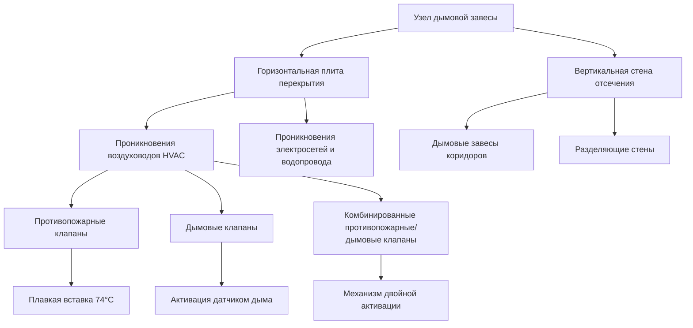
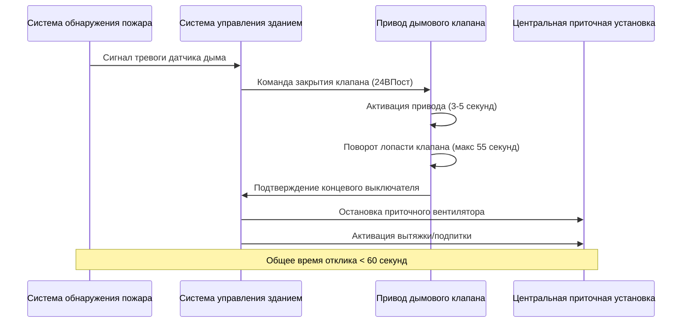

## Основы дымовых завес

Дымовые завесы представляют собой критически важные элементы пассивной противопожарной защиты, которые отсекают высотные здания, чтобы предотвратить миграцию дыма во время пожара. В отличие от противопожарных завес, которые сопротивляются проникновению пламени, дымовые завесы решают основную причину пожарных смертей в высотных зданиях: отравление дымом и потерю видимости.

Физика движения дыма в высотных зданиях включает конвективный поток, перепады давления, вызванные эффектом дымохода, и транспорт, вызванный HVAC. Температура дыма обычно составляет 200-600°C у источника пожара, создавая значительные конвективные силы, описываемые следующим образом:

$$\Delta P = \rho_0 g h \left(\frac{T_0}{T_s} - 1\right)$$

Где:
- $\Delta P$ = перепад давления на завесе (Па)
- $\rho_0$ = плотность окружающего воздуха (кг/м³)
- $g$ = ускорение свободного падения (9,81 м/с²)
- $h$ = перепад высоты (м)
- $T_0$ = температура окружающей среды (К)
- $T_s$ = температура дыма (К)

В здании высотой 100 м с пожаром, генерирующим дым температурой 400°C, перепад давления эффекта дымохода достигает примерно 50 Па, что достаточно для того, чтобы вытеснить дым через негерметичные проникновения на скоростях, превышающих 5 м/с.

## Горизонтальные и вертикальные дымовые завесы

### Горизонтальные завесы

Конструкции перекрытий служат основными горизонтальными дымовыми завесами, как правило, рассчитанными на 1-часовой или 2-часовой класс огнестойкости согласно разделу IBC 403.2.1. Основная проблема заключается в сохранении непрерывности в местах проникновения систем HVAC через такие конструкции.

Площадь утечки горизонтальной завесы не должна превышать 0,00065 м² на м² площади завесы (требование NFPA 92). Для типичного перекрытия площадью 1000 м² максимально допустимая утечка составляет 0,65 м², однако единственное негерметичное воздуховодное проникновение диаметром 300 мм само по себе обеспечивает площадь утечки 0,071 м².

### Вертикальные завесы

Вертикальные дымовые завесы разделяют этажи на отдельные дымовые отсеки, ограничивая горизонтальное распространение дыма. Раздел IBC 709 требует вертикальные завесы в крытых торговых комплексах, учреждениях группы I-2 и подземных зданиях.

Вертикальные завесы должны проходить от плиты перекрытия до нижней части перекрытия или кровельной конструкции выше, создавая полное отсечение помещений. Распределение HVAC часто следует по путям коридоров, требуя многочисленных проникновений через вертикальные завесы.

## Требования к герметизации проникновений HVAC

Каждое проникновение HVAC через дымовую завесу создает потенциальный путь утечки дыма. Системы герметизации должны сохранять как класс огнестойкости, так и пределы утечки дыма.

### Характеристики материала уплотнения

| Тип уплотнения | Класс огнестойкости | Степень утечки (м³/с/м²) | Температурный предел | Применение |
|---|---|---|---|---|
| Вспучивающийся противопожарный материал | 2-часовой | < 0,005 | 1093°C | Проникновения воздуховодов |
| Минеральная вата с герметиком | 2-часовой | < 0,008 | 1093°C | Пучки кабелей/труб |
| Противопожарный силикон | 1-часовой | < 0,003 | 982°C | Небольшие зазоры, швы |
| Керамическое волокно | 3-часовой | < 0,010 | 1260°C | Крупные отверстия |
| Раствор/затирка | 3-часовой | < 0,002 | 1316°C | Проникновения в каменных стенах |

Вспучивающиеся материалы расширяются при нагревании с коэффициентами расширения от 10:1 до 50:1. Расширение следует температурно-зависимому изменению объема:

$$V(T) = V_0 \left[1 + \alpha(T - T_0)\right]^n$$

Где $\alpha$ представляет коэффициент расширения, а $n$ обычно находится в диапазоне 2-4 в зависимости от состава. Это нелинейное расширение обеспечивает эффективное уплотнение при повышении температуры дыма.

## Противопожарные клапаны и дымовые клапаны

### Технические характеристики противопожарных клапанов

Противопожарные клапаны защищают проникновения воздуховодов через противопожарные завесы и противопожарные стены. Согласно разделу IBC 717.3.2, противопожарные клапаны должны быть установлены там, где воздуховоды пересекают конструкции с классом огнестойкости, с конкретными исключениями для систем HVAC, соответствующих критериям производительности.

**Механизмы активации клапана:**
- **Статические системы:** Закрытие по плавкой вставке при 74°C
- **Динамические системы:** Класс 74°C или 141°C в зависимости от максимальной температуры воздуха
- **Время закрытия:** < 4 минут для вертикальной установки, < 2 минут для горизонтальной

Плавкая вставка плавится, когда тепловой поток повышает температуру вставки выше номинальной. Теплопередача на вставку следует:

$$\frac{dT_{link}}{dt} = \frac{h A_{link}}{m_{link} c_p}(T_{gas} - T_{link})$$

Где $h$ — коэффициент конвективной теплопередачи (обычно 25-50 Вт/м²·К для низкоскоростного потока воздуха), а время отклика зависит от теплоемкости и площади поверхности вставки.

### Требования к дымовым клапанам

Дымовые клапаны реагируют на сигналы датчиков дыма, закрываясь для предотвращения миграции дыма через воздуховоды HVAC. Стандарты NFPA 105 и UL 555S устанавливают требования к производительности.

**Ключевые параметры производительности:**
- Класс утечки: I (4,0 м³/ч/м²), II (20 м³/ч/м²) или III (40 м³/ч/м²) при 249 Па
- Время закрытия: < 60 секунд при получении сигнала обнаружения
- Класс повышенной температуры: Класс I (121°C) или II (163°C) на 2 часа

**Комбинированные противопожарные/дымовые клапаны** интегрируют обе функции, работая либо при плавлении плавкой вставки, либо при сигнале датчика дыма, в зависимости от того, что произойдет раньше. Эти устройства упрощают проникновение, но требуют координации между системами противопожарной сигнализации и управлением HVAC.

## Непрерывность и целостность дымовой завесы

### Герметизация перегородки до конструкции

Вертикальные дымовые завесы должны проходить непрерывно от плиты перекрытия до нижней части конструкции выше, даже при установке подвесного потолка. Раздел IBC 709.4 требует, чтобы дымовые завесы образовывали эффективную мембрану, непрерывную от внешней стены к внешней стене.

**Типичные отказы целостности:**
- Негерметичный зазор между верхней частью перегородки и конструкцией (типичный зазор: 25-50 мм)
- Воздушные камеры HVAC, соединяющие соседние дымовые отсеки
- Пути возврата воздуха над потолком, создающие обходные маршруты
- Проникновения для труб спринклеров, электрокабелей без надлежащей огнепреграды

Степень утечки воздуха через зазор следует уравнению отверстия:

$$Q = C_d A \sqrt{\frac{2\Delta P}{\rho}}$$

Для зазора шириной 1 мм, распространяющегося на 10 м вдоль перегородки при перепаде давления 25 Па, поток утечки превышает 0,05 м³/с, достаточный для транспортировки дыма в опасных концентрациях.

### Испытание и проверка

**Методы полевого испытания:**

| Метод испытания | Перепад давления | Критерии приемки | Применение |
|---|---|---|---|
| ASTM E283 (отсек) | 75 Па | < 0,00065 м²/м² утечки | Проверка новой конструкции |
| Нагнетание воздуха дверным вентилятором | 25-75 Па | Поддержание перепада давления | Дымовые завесы коридоров |
| Визуализация дымовым карандашом | Естественная конвекция | Нет видимой миграции дыма | Проверка герметизации проникновений |
| Газ-индикатор (SF₆) | Рабочие условия | < 5% передачи концентрации | Проверка производительности системы |

**Требования к испытанию клапанов (NFPA 105):**
- Первоначальная приемка: 100% операционное испытание
- Периодическая проверка: Ежегодно для больниц, 4 года для других типов зданий
- Операционное испытание: Проверка закрытия, проверка выравнивания лопасти, измерение времени закрытия
- Испытание утечки: После 2000 циклов или при подозрении на деградацию

### Сохранение целостности завесы в течение жизни здания

Целостность дымовой завесы деградирует вследствие модификаций здания, деятельности по техническому обслуживанию и старения материалов. Систематическое управление целостностью требует:

1. **Документирование:** Рабочие чертежи, показывающие все местоположения завес и проникновения
2. **Контроль модификаций:** Система разрешений, требующая проверки огнепреграды для любых проникновений
3. **Периодическая проверка:** Визуальное обследование доступных герметизаций и проверка функционирования клапанов
4. **Испытание производительности:** Испытание нагнетания воздуха в отсек каждые 5 лет
5. **Обслуживание клапанов:** Смазка, регулировка связей, проверка привода

Вероятность отказа завесы возрастает с числом негерметичных проникновений следующим образом:

$$P_{failure} = 1 - (1 - p_{penetration})^n$$

Где $p_{penetration}$ представляет вероятность отказа отдельного проникновения (обычно 0,02-0,05 для правильно установленных систем), а $n$ равняется количеству проникновений. Для этажа с 50 проникновениями при показателе отказа 3% для каждого, общая целостность отсека имеет примерно 78% надежность, подчеркивая важность систематического обслуживания.

## Сводка соответствия нормам

**Требования IBC:**
- Раздел 403.2.1: Конструкции перекрытий с классом огнестойкости
- Раздел 709: Конструкция и непрерывность дымовых завес
- Раздел 717: Защита проникновений воздуховодов и воздушных проемов

**Стандарты NFPA:**
- NFPA 90A: Установка систем кондиционирования воздуха и вентиляции
- NFPA 92: Системы контроля дыма
- NFPA 101: Требования кодекса безопасности жизнедеятельности для дымовых завес
- NFPA 105: Узлы дымовых дверей и другие защитные конструкции для проемов

Надлежащее проектирование и обслуживание дымовых завес представляют собой критически важную систему безопасности жизнедеятельности в высотных зданиях, требующую координации между архитектурной, конструктивной, механической и противопожарной защитой на протяжении всего жизненного цикла здания.
