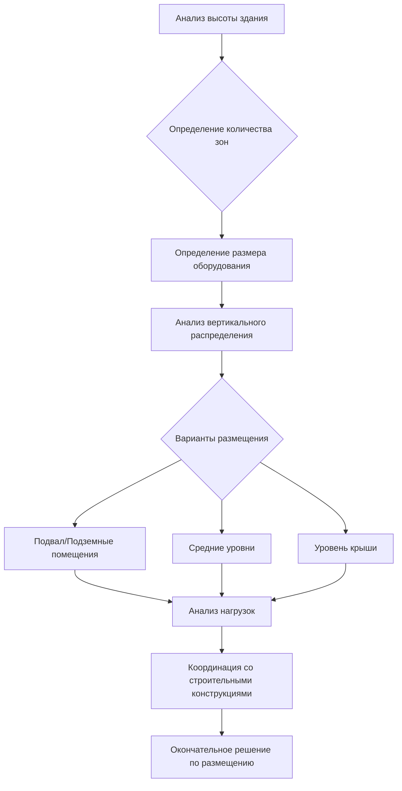

Вертикальное зонирование представляет собой фундаментальную организационную стратегию систем HVAC в высотных зданиях, разделяя высоту здания на независимые механические зоны для управления эффектом стека, ограничениями производительности оборудования и требованиями противопожарной безопасности и безопасности жизнедеятельности. Такой подход напрямую решает физические проблемы, вызванные высотой здания, когда традиционные однозонные системы становятся непрактичными выше 15-20 этажей.

## Физическая основа вертикального зонирования

Основным фактором для вертикального зонирования является эффект стека, который создает перепады давления, пропорциональные высоте здания. Разница давления между внутренним и наружным воздухом на любой высоте выражается как:

$$\Delta P = \rho g h \left(\frac{1}{T_o} - \frac{1}{T_i}\right)$$

где $\rho$ – плотность воздуха (кг/м³), $g$ – ускорение свободного падения (9,81 м/с²), $h$ – высота выше нейтральной плоскости давления (м), $T_o$ – абсолютная температура наружного воздуха (К), и $T_i$ – абсолютная температура внутреннего воздуха (К).

Для здания высотой 300 м с перепадом температуры 17°C общий перепад давления достигает примерно 360 Па (90,2 мм водного столба), создавая значительные проблемы с инфильтрацией, экфильтрацией и работой дверей, если система не компартаментирована.

## Конфигурация вертикальной зоны

Стандартная высота вертикальной зоны варьируется от 15 до 25 этажей, с типичными конфигурациями:

| Высота здания | Стратегия зонирования | Механические этажи | Высота зоны |
|-----------------|------------------------|-----------------------|------------|
| 20-40 этажей | 2 зоны | Средний уровень, крыша | 15-20 этажей |
| 40-60 этажей | 3 зоны | Нижний, средний, крыша | 15-20 этажей |
| 60-80 этажей | 4 зоны | Каждые 15-20 этажей | 15-20 этажей |
| 80+ этажей | 5+ зон | Каждые 12-18 этажей | 12-18 этажей |

Ограничения высоты зоны вытекают из множества факторов:

**Пределы статического давления в воздуховодах**: Давление на выходе вентилятора обычно ограничено 6-10 мм водного столба (1500-2500 Па) для коммерческих приложений. Чрезмерные воздуховодные пути требуют непрактичных статических давлений:

$$\Delta P_{total} = \Delta P_{equipment} + \Delta P_{duct} + \Delta P_{fittings}$$

**Пределы давления в трубопроводах**: Стандартное гидравлическое оборудование рассчитано на рабочее давление 1,0-1,2 МПа. Давление вертикального водяного столба увеличивается на 9,8 кПа/м, ограничивая высоту однозонной системы примерно 100-110 м без станций снижения давления.

**Компартаментирование по пожарному кодексу**: IBC и NFPA 101 ограничивают высоту зон дымоудаления, обычно требуя разделения каждые 23 м или на каждом этаже, в зависимости от того, что меньше.

## Стратегия размещения механических этажей

Размещение механического этажа следует систематическому анализу эффективности системы и архитектурного воздействия:

**Механические этажи в подвале**: Обслуживают нижние 15-20 этажей. Преимущества включают более простую доставку оборудования, конструктивную поддержку, звукоизоляцию. Недостатки включают риск затопления, требования вентиляции, трудности при вертикальном распределении.

**Механические этажи на средних уровнях**: Оптимизируют вертикальное распределение, уменьшают длину стояков. Типичное размещение на 1/3 и 2/3 высоты здания для трёхзонных систем. Требуемая площадь этажа: 8-12% от площади обслуживаемого этажа для полного механического этажа, или 4-6% для частичных механических помещений на нескольких уровнях.

**Механические этажи на крыше**: Стандартное решение для обслуживания верхней зоны. Минимизируют вертикальное распределение на верхние этажи, но усложняют такелаж оборудования и замену. Требования к конструкциям возрастают из-за веса оборудования на краю здания.

## Реализация этажа разрыва давления

Этажи разрыва давления создают гидравлическое разделение между вертикальными зонами, предотвращая чрезмерное статическое давление на нижних уровнях. Требуются, когда общая высота системы превышает пределы давления оборудования:

$$P_{static} = \rho g h$$

Для воды при 20°C плотность $\rho = 998$ кг/м³, создавая 97,8 кПа давления на каждые 10 м перепада высоты.

### Конфигурация теплообменника

Этажи разрыва давления используют пластинчатые теплообменники для гидравлического разделения зон при сохранении тепловой непрерывности:

**Первичная сторона (нижняя зона)**:
- Расчётное давление: рабочее давление 1,0-1,2 МПа
- Расход: $\dot{m} = \frac{Q}{c_p \Delta T}$, где $Q$ – нагрузка зоны (кВт)
- Температурный подход: 1-2°C типовой

**Вторичная сторона (верхняя зона)**:
- Меньшие требования к рабочему давлению
- Независимый расширительный бак и разделитель воздуха
- Отдельное насосное оборудование с регулятором переменной скорости

Эффективность теплообменника:

$$\epsilon = \frac{T_{h,in} - T_{h,out}}{T_{h,in} - T_{c,in}}$$

Целевая эффективность: 0,85-0,95 для минимальных температурных потерь.

### Рассмотрение энергии на перекачивание

Этажи разрыва давления увеличивают энергию на перекачивание через добавленное падение давления (обычно 10-20 кПа на теплообменник), но уменьшают общие требования к давлению в системе. Требуется анализ энергетического баланса:

$$W_{pump} = \frac{\dot{V} \Delta P}{\eta_{pump}}$$

где $\dot{V}$ – объёмный расход (м³/с), $\Delta P$ – общий напор давления (Па), и $\eta_{pump}$ – КПД насоса.

## Зоны давления водных систем

Системы водоснабжения и HVAC требуют отдельных зон давления для защиты оборудования и предотвращения отказа компонентов:

| Система | Предел давления | Высота зоны | Управление давлением |
|--------|-----------------|-------------|----------------------|
| Охлаждающая вода | 1,0 МПа | 100-110 м | Теплообменники, РДВ |
| Горячая вода | 1,0 МПа | 100-110 м | Теплообменники, РДВ |
| Вода конденсатора | 1,0 МПа | 100-110 м | Теплообменники |
| Холодная вода ХВС | 0,55 МПа | 45-55 м | Станции РДВ |
| Горячая вода ГВС | 0,55 МПа | 45-55 м | Станции РДВ |

Станции редукционного регулятора давления (РДВ) предусматривают альтернативу теплообменникам для приложений без теплопередачи. Определение размера РДВ следует:

$$C_v = Q \sqrt{\frac{SG}{\Delta P}}$$

где $C_v$ – коэффициент потока клапана, $Q$ – расход (л/мин), $SG$ – удельный вес, и $\Delta P$ – падение давления (кПа).

## Координация дымоудаления

Вертикальное зонирование должно интегрироваться со стратегиями дымоудаления в соответствии с NFPA 92 и разделом 909 IBC. Каждая вертикальная зона требует независимой возможности дымоудаления:

**Требования к нагнетанию давления**: Минимум перепад давления 12,5 Па на дымовой преграде. Пропускная способность вентилятора должна преодолеть:

$$\Delta P_{required} = \Delta P_{design} + \Delta P_{leakage} + \Delta P_{weather}$$

**Координация выброса**: Механические зоны выровнены с зонами дымоудаления, что предотвращает перекрёстное загрязнение. Вытяжные вентиляторы рассчитаны на 4-6 воздухообменов в час в зоне дымоудаления, с подпиточным воздухом, подаваемым в соседние зоны.

**Нагнетание давления в вертикальных шахтах**: Лестничные клетки и шахты лифтов требуют минимум 25 Па в высотных зданиях согласно NFPA 92. Регуляторы давления каждые 5-10 этажей поддерживают однородное нагнетание:

$$\dot{m}_{required} = \frac{A_{leakage} \sqrt{2 \rho \Delta P}}{C_d}$$

где $A_{leakage}$ – общая площадь утечки (м²), $C_d$ – коэффициент расхода (обычно 0,65).

## Требования независимости зон

Каждая вертикальная зона должна работать независимо для обеспечения надёжности и гибкости обслуживания:

- **Отдельные системы обработки воздуха**: Отсутствие вертикального распределения воздуха между зонами, кроме специализированных шахт
- **Независимые системы управления**: Система автоматизации зданий, способная отключить зону без воздействия на другие зоны
- **Резервное оборудование**: Критические системы требуют N+1 резервирования в каждой зоне
- **Автономное электроснабжение**: Системы безопасности жизнедеятельности работают независимо в каждой зоне

Изоляция зон во время пожара требует автоматических заслонок на границах зон с огнестойкостью 1,5 часа или 3 часа в соответствии с конструкцией шахты согласно NFPA 90A и разделу 717 IBC.

## Соображения интеграции проектирования

Успешное вертикальное зонирование требует координации между дисциплинами:

**Строительные конструкции**: Нагрузка механического этажа 730-1220 Па типовая, требующая армированной конструкции пола и перемычек для безколонных зон оборудования.

**Архитектура**: Высота механического этажа 4,3-5,5 м свободной высоты, с дополнительным зазором для надъёмного трубопровода и распределения воздуховодов.

**Электроснабжение**: Специализированные электрические помещения в каждом механическом этаже с отдельными питающими линиями от главной распределительной панели или зоновых понижающих трансформаторов.

**Водоснабжение**: Зоны давления холодного и горячего водоснабжения, санитарной и ливневой канализации выровнены с зонами HVAC, где практично, чтобы минимизировать вертикальные проходки.

Определение размера вертикального стояка вмещает все инженерные системы: 4-6% типовой площади этажа для объединённых механических, электрических, водопроводных и противопожарных стояков в современном высотном строительстве.
