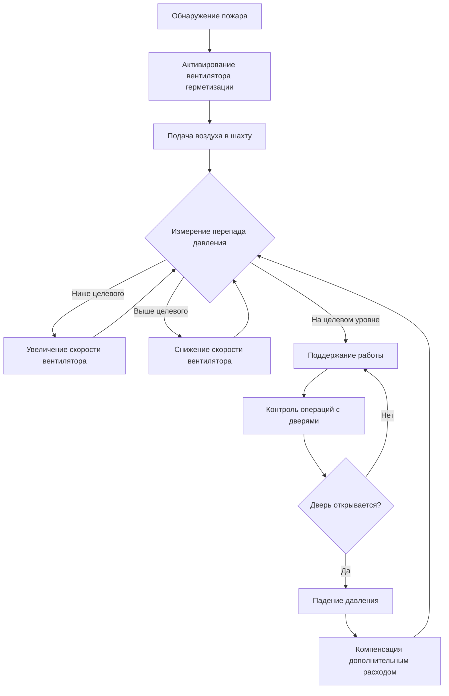
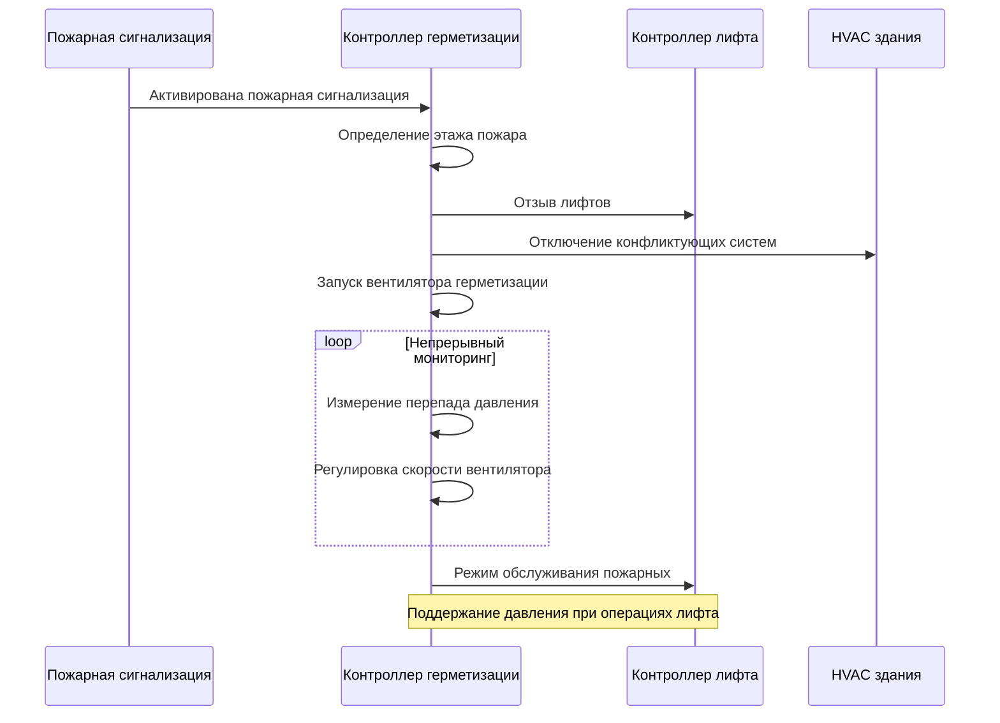

Герметизация шахты лифта представляет собой критическую стратегию управления дымом в высотных зданиях, предотвращая миграцию дыма через вертикальные шахты во время пожаров. Система поддерживает положительное давление в лифтовой шахте относительно прилегающих помещений здания, создавая физический барьер, который предотвращает проникновение дыма и защищает маршруты доступа пожарных.

## Физические принципы герметизации шахты

Эффективность герметизации шахты лифта зависит от поддержания перепада давления, который противодействует движению дыма, вызванному плавучестью. Во время пожара горячий дым создает значительные силы плавучести, которые вызывают вертикальную миграцию через любой доступный путь. Требуемый перепад давления для предотвращения проникновения дыма зависит от разницы температур между слоем дыма и воздухом в шахте.

Минимальный перепад давления для предотвращения проникновения дыма:

$$\Delta P_{min} = \rho g h \left(\frac{T_s - T_{shaft}}{T_{shaft}}\right)$$

где $\rho$ — плотность воздуха (1,2 кг/м³ при стандартных условиях), $g$ — ускорение свободного падения (9,81 м/с²), $h$ — высота столба дыма (м), $T_s$ — температура дыма (К) и $T_{shaft}$ — температура воздуха в шахте (К).

NFPA 92 устанавливает минимальные перепады давления в диапазоне от 25 Па до 75 Па в зависимости от применения, причем 50 Па (0,2 дюйма в.ст.) является типичным для защиты шахты лифта.

## Требования к подаче воздуха

Система подачи воздуха должна подавать достаточный объемный расход для поддержания целевого перепада давления и компенсации утечек через двери лифтовой шахты, конструкционные швы и другие проемы. Общий требуемый расход воздуха состоит из расхода утечки плюс резерв безопасности для изменений в системе.

### Расчет расхода утечки

Утечка через двери подчиняется уравнению потока через отверстие, где расход пропорционален квадратному корню из перепада давления:

$$Q_{leak} = C_d A \sqrt{\frac{2\Delta P}{\rho}}$$

где $Q_{leak}$ — объемный расход утечки (м³/с), $C_d$ — коэффициент расхода (типично 0,65–0,7 для щелей дверей), $A$ — общая площадь утечки (м²), $\Delta P$ — перепад давления (Па) и $\rho$ — плотность воздуха (кг/м³).

Для дверей лифтовой шахты NFPA 92 предоставляет данные об утечке на основе типа двери и качества установки:

| Тип двери | Площадь утечки на одну дверь |
|-----------|------------------------------|
| Стандартные двери лифта | 0,056 м² |
| Двери лифта с уплотнением | 0,037 м² |
| Плотно прилегающие двери с уплотнением | 0,019 м² |

Общий требуемый расход подачи воздуха:

$$Q_{supply} = 1,25 \times \sum_{i=1}^{n} Q_{leak,i}$$

где коэффициент 1,25 обеспечивает 25%-ный резерв безопасности для неопределенностей системы, вариаций конструкции и операций с дверями.

## Поддержание перепада давления

Поддержание постоянного перепада давления по высоте шахты представляет сложность из-за эффекта дымовой трубы, ветровых давлений и операций с дверями. Чистое давление на любой высоте:

$$\Delta P(z) = \Delta P_{fan} + \Delta P_{stack}(z) + \Delta P_{wind}(z) - \Delta P_{friction}(z)$$

где $\Delta P_{fan}$ — давление, создаваемое вентилятором, $\Delta P_{stack}$ — компонент эффекта дымовой трубы, $\Delta P_{wind}$ — ветровое давление и $\Delta P_{friction}$ — потери давления на трение в шахте.

### Взаимодействие эффекта дымовой трубы

В холодную погоду внешний эффект дымовой трубы создает градиенты давления в направлении вверх, которые могут либо способствовать, либо противодействовать герметизации шахты в зависимости от расположения шахты и конфигурации здания. Перепад давления эффекта дымовой трубы между двумя высотами:

$$\Delta P_{stack} = 3460 h \left(\frac{1}{T_o} - \frac{1}{T_i}\right)$$

где $h$ — разница высот (м), $T_o$ — абсолютная температура на улице (К) и $T_i$ — абсолютная температура внутри (К).

Для здания высотой 100 м с наружной температурой −10 °C (263 К) и внутренней температурой 20 °C (293 К) эффект дымовой трубы создает примерно 133 Па перепада давления, что может существенно повлиять на производительность герметизации шахты.

## Рассмотрение утечек через двери лифтовой шахты

Характеристики утечки через двери принципиально влияют на проектирование и производительность системы. Взаимосвязь между давлением и утечкой нелинейна, требуя итеративных расчетов для точного определения размеров системы.

### Сценарии с несколькими дверями

Когда в одной лифтовой шахте существует несколько дверей на одном этаже (обычно в высотных зданиях с несколькими группами лифтов), общая площадь утечки значительно увеличивается. Для этажа с тремя лифтовыми шахтами, каждая со стандартными дверями:

$$A_{total} = 3 \times 0,056 = 0,168 \text{ м}^2$$

При перепаде давления 50 Па расход утечки на одном этаже:

$$Q_{leak} = 0,65 \times 0,168 \times \sqrt{\frac{2 \times 50}{1,2}} = 0,995 \text{ м}^3/\text{с} \approx 1689 \text{ м}^3/\text{ч}$$

Для 30-этажного здания общая утечка может приблизиться к 50 670 м³/ч, требуя значительной производительности вентилятора.

## Стратегии проектирования перепада давления

NFPA 92 рекомендует подходы к стратифицированному управлению давлением, основанные на высоте здания и требованиях к эксплуатации:

| Высота здания | Рекомендуемый перепад давления | Стратегия управления |
|---|---|---|
| < 23 м | 25–50 Па | Одна зона с постоянным давлением |
| 23–75 м | 40–60 Па | Две зоны с переменным давлением |
| > 75 м | 50–75 Па | Многозонное адаптивное управление |

Более высокие давления обеспечивают большие резервы безопасности, но увеличивают энергопотребление, структурные нагрузки на двери и затрудняют открывание дверей во время чрезвычайных ситуаций.

## Методы распределения подаваемого воздуха

Методы подачи воздуха существенно влияют на равномерность давления и производительность системы. Существуют три основных подхода:

**Подача сверху**: Воздух подается в верхней части шахты, опираясь на нисходящее распределение. Эффективно для зданий менее 15 этажей, но создает градиенты давления в более высоких зданиях.

**Подача снизу**: Воздух подается в основание шахты, создавая восходящий поток. Согласуется с естественной плавучестью, но может создавать чрезмерные давления на верхних уровнях в очень высоких зданиях.

**Многоточечная подача**: Воздух подается на нескольких высотах (типично каждые 10–15 этажей), обеспечивая превосходную равномерность давления по высоте здания. Рекомендуется для зданий, превышающих 75 м высоты, согласно рекомендациям NFPA 92.

Распределение давления для многоточечной подачи с точками подачи на высотах $z_1, z_2, ..., z_n$ можно приблизительно выразить как:

$$\Delta P(z) = \Delta P_{target} - C_{friction} |z - z_{nearest}|$$

где $z_{nearest}$ — высота ближайшей точки подачи и $C_{friction}$ — коэффициент потерь на трение (типично 0,1–0,3 Па/м для лифтовых шахт).

## Интеграция системы управления

Современные системы герметизации лифтовых шахт интегрируются с системами пожарной сигнализации и управления HVAC здания для координации операций в чрезвычайных ситуациях:

Мониторинг давления на нескольких высотах позволяет осуществлять регулировку управления в реальном времени, компенсируя операции с дверями, изменения погоды и вариации системы. Современные системы используют частотные преобразователи (VFD) для модулирования скорости вентилятора на основе измеренных перепадов давления, поддерживая целевые давления в пределах допуска ±10 Па.

## Тестирование и наладка

NFPA 92 требует комплексного тестирования для проверки производительности системы в различных сценариях, включая наихудший случай утечки через двери, экстремальные погодные условия и одновременные операции с дверями. Критерии приемки включают:

- Поддержание перепада давления на всех точках мониторинга
- Максимальные силы при открывании двери ниже 133 Н
- Время восстановления менее 30 секунд после операции с дверью
- Равномерное распределение давления в пределах ±15% от целевого значения

Полевые испытания обычно выявляют требования к расходу воздуха на 15–25% выше расчетных из-за конструкционных дефектов, дополнительных путей утечки и вариаций при монтаже, что оправдывает резервы безопасности при проектировании.
