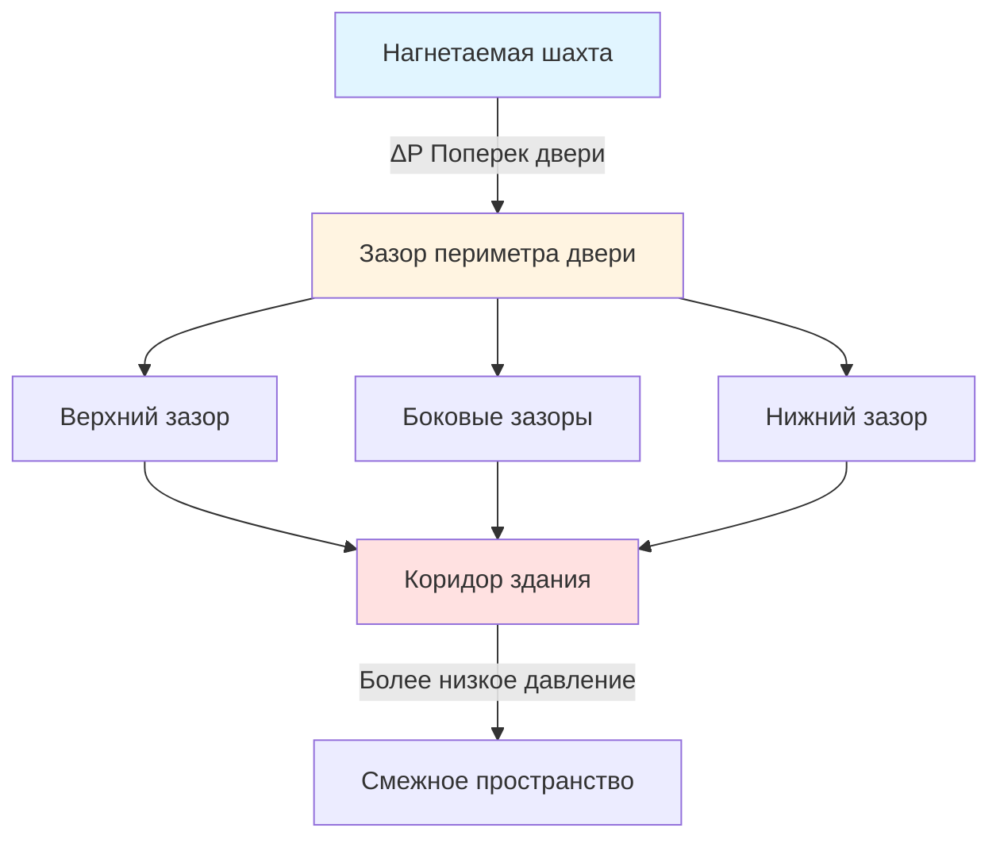
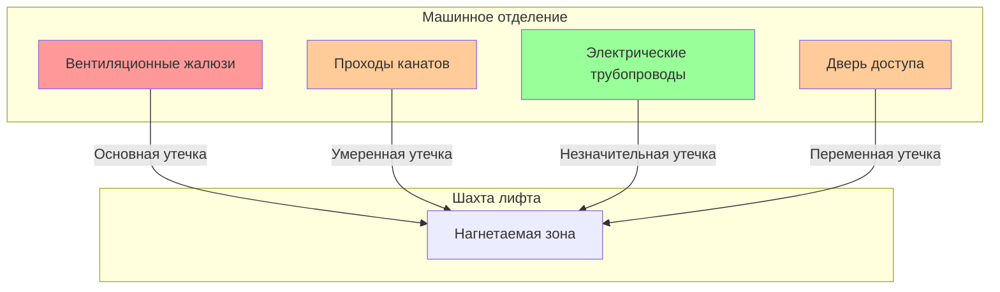

Пути утечки воздуха в шахтах лифтов представляют собой критические элементы в проектировании и функционировании систем нагнетания давления. Понимание физики движения воздуха через эти пути позволяет точно рассчитать размер системы и обеспечить эффективный дымовой контроль во время пожарных чрезвычайных ситуаций. Основные механизмы утечки включают поток воздуха через отверстия, управляемый перепадами давления и уравнениями расхода через отверстия.

## Физика утечки воздуха через двери шахты

Двери шахты лифта представляют собой доминирующий путь утечки в большинстве систем нагнетания давления. Поток воздуха через зазоры в дверях следует принципам расхода через отверстия, где связь между перепадом давления и объемным расходом является нелинейной.

Расход воздуха через зазор периметра двери рассчитывается следующим образом:

$$Q = C_d A \sqrt{\frac{2\Delta P}{\rho}}$$

Где $Q$ — объемный расход воздуха (CFM), $C_d$ — коэффициент расхода (обычно 0,60–0,65 для зазоров в дверях), $A$ — эффективная площадь утечки (м²), $\Delta P$ — перепад давления на отверстии (кПа), и $\rho$ — плотность воздуха (кг/м³).

Для стандартных условий ($\rho = 1,2$ кг/м³), это упрощается до:

$$Q = 4450 \times C_d \times A \times \sqrt{\Delta P}$$

С $\Delta P$ в кПа и $Q$ в CFM (м³/ч).

### Спецификации зазоров дверей

NFPA 92 устанавливает максимально допустимые зазоры для дверей шахты лифта в системах нагнетания давления. Стандартный подход использует эквивалентную площадь утечки вместо прямых измерений зазоров.

| Компонент двери | Типичный зазор | Максимально допустимый (NFPA 92) |
|----------------|-------------------|------------------------------|
| Верхний зазор | 3,2–6,4 мм | Ограничен общей ELA |
| Боковые зазоры (каждый) | 3,2–4,8 мм | Ограничен общей ELA |
| Нижний зазор | 9,5–19 мм | Ограничен общей ELA |
| Стык в центре | 1,6–3,2 мм | Ограничен общей ELA |

Общая длина периметра для стандартной двери лифта составляет:

$$L_{периметр} = 2h + 2w + w_{стык}$$

Где $h$ — высота двери, $w$ — ширина двери, и $w_{стык}$ учитывает центральный стык на двустворчатых дверях.

## Расчеты эквивалентной площади утечки

Эквивалентная площадь утечки (ELA) предоставляет стандартизированный показатель для сравнения и расчета полной утечки в шахте. Она представляет площадь острого отверстия, которое создает такой же расход воздуха при эталонном перепаде давления.

Для полной шахты с $n$ этажами:

$$A_{общая} = \sum_{i=1}^{n} A_{дверь,i} + A_{стены} + A_{проходы} + A_{машинное}$$

Площадь утечки каждой двери зависит от конструкции двери:

$$A_{дверь} = g_{средний} \times L_{периметр} \times f_{зазор}$$

Где $g_{средний}$ — средняя ширина зазора, $L_{периметр}$ — общая длина периметра, и $f_{зазор}$ — коэффициент эффективности зазора (0,8–1,0), учитывающий неравномерные зазоры.

### Пределы площади утечки NFPA 92

NFPA 92 устанавливает максимальные эквивалентные площади утечки на основе способности системы нагнетания давления поддерживать требуемые перепады давления:

- Максимальная утечка через дверь: 0,0093 м² на дверь при 24,9 Па
- Максимальная утечка через стену: 0,003 м²/м² площади стены шахты
- Отверстия машинного отделения: Должны быть включены в расчеты или герметизированы

Общий требуемый расход воздуха в системе составляет:

$$Q_{общий} = 4450 \sum_{i=1}^{n} A_i \sqrt{\Delta P_i} + Q_{кабина} + Q_{безопасность}$$

Где $Q_{кабина}$ учитывает утечку кабины в неподвижном состоянии и $Q_{безопасность}$ предусматривает запас прочности (обычно 10–20%).

## Отверстия машинного отделения

Проходы в машинном отделении представляют собой значительные пути утечки, которые различаются в зависимости от конфигурации оборудования. Тяговые лифты с верхним машинным отделением создают другие схемы утечки, чем гидравлические или безмашинные конструкции.

### Верхнее машинное отделение

Для традиционных тяговых лифтов:

$$A_{машинное} = A_{канаты} + A_{вентиляция} + A_{дверь} + A_{кабель}$$

Типичные значения:
- Проходы канатов/кабелей: 0,014–0,028 м² на лифт
- Вентиляционные жалюзи (если не герметизированы): 0,093–0,232 м²
- Дверь доступа в машинное отделение: 0,005–0,014 м²
- Электрические проходы: 0,002–0,005 м²

Вентиляция машинного отделения требует тщательной координации. ASME A17.1 требует охлаждения машинного отделения, что конфликтует с целями нагнетания давления в шахте. Решения включают:

1. Отдельные герметизированные системы охлаждения для машинных отделений
2. Моторизованные заслонки, которые закрываются при активации дымового контроля
3. Клапан сброса давления между шахтой и машинным отделением

## Утечка через стены шахты и проходы

Конструкция стен шахты значительно влияет на полную утечку. Сборки из гипсокартона проявляют другие характеристики утечки, чем бетонная или кирпичная конструкция.

Площадь утечки в стенах масштабируется с площадью поверхности:

$$A_{стена} = \alpha \times A_{поверхность}$$

Где $\alpha$ — коэффициент утечки (м²/м²):
- Герметизированный бетон: $\alpha = 0,0001$ до $0,0002$
- Гипсокартон (герметизированные швы): $\alpha = 0,0002$ до $0,0004$
- Негерметизированный гипсокартон: $\alpha = 0,0005$ до $0,0010$

Проходы через стены шахты должны быть герметизированы для поддержания целостности нагнетания давления:

| Тип прохода | Типичная утечка при отсутствии герметизации | Метод герметизации |
|------------------|----------------------------|----------------|
| Воздуховоды HVAC | 0,014–0,037 м²/проход | Противопожарные заслонки с уплотнениями |
| Водопроводные трубы | 0,005–0,014 м²/проход | Интумесцентные манжеты |
| Электрические трубопроводы | 0,002–0,007 м²/проход | Противопожарные замазки |
| Кабели связи | 0,009–0,023 м²/проход | Системы кабельных проходов |

## Методы испытания на утечку

Точное определение площадей утечки в шахте требует систематических процедур испытания. Приложение D к NFPA 92 предоставляет протоколы испытания для систем нагнетания давления в шахтах лифтов.

### Испытание на нагнетание давления с использованием вентилятора

Метод дверного вентилятора, адаптированный для шахт лифтов:

1. Герметизируйте одно отверстие шахты (обычно машинное отделение)
2. Установите откалиброванный вентилятор на другом отверстии
3. Нагнетайте давление в шахте на несколько уровней давления
4. Измерьте расход воздуха на каждом уровне давления
5. Рассчитайте ELA из соотношения расход-давление

Эквивалентная площадь утечки при эталонном давлении $P_{эталон}$ (обычно 24,9 Па):

$$A_{ELA} = \frac{Q_{эталон}}{4450 \times C_d \times \sqrt{P_{эталон}}}$$

Данные из нескольких уровней давления позволяют проверку:

$$Q = K \times (\Delta P)^n$$

Где показатель степени $n$ должен приближаться к 0,5 для потока, ограниченного отверстием. Отклонения указывают на необычные схемы утечки или ошибки измерения.

### Измерение утечки через двери

Испытание утечки через отдельные двери включает:

1. Нагнетайте давление в шахте до целевого перепада (24,9–37,4 Па)
2. Измеряйте скорость воздуха по периметру двери с помощью анемометра с горячей нитью
3. Рассчитайте расход: $Q_{дверь} = V_{средняя} \times A_{зазор}$
4. Сравните с допустимыми пределами

Профиль скорости по зазорам дверей демонстрирует эффекты пограничного слоя:

$$V(y) = V_{макс}\left(1 - e^{-y/\delta}\right)$$

Где $y$ — расстояние от поверхности зазора и $\delta$ — толщина пограничного слоя (обычно 0,1–0,2 от ширины зазора).

### Многоточечное картирование давления

Для высоких шахт давление варьируется по высоте из-за эффекта дымовой трубы:

$$\Delta P(z) = \Delta P_0 - \rho g z \left(\frac{1}{T_{шахта}} - \frac{1}{T_{наружный}}\right)$$

Где $z$ — высота выше контрольной точки, $g$ — ускорение свободного падения, и $T$ — абсолютная температура. При определении распределения утечки испытание должно учитывать вертикальные градиенты давления.

## Соображения проектирования

Эффективное проектирование нагнетания давления в шахте требует баланса между несколькими путями утечки:

1. **Утечка через двери доминирует** — обычно 60–80% от полной утечки в шахте
2. **Контроль машинного отделения** — критически важен для достижения расчетного давления
3. **Герметичность стен** — более важна в старых зданиях с зазорами в конструкции
4. **Герметизация проходов** — необходима для поддержания границ давления

Требуемый расход приточного воздуха в системе должен преодолеть все пути утечки и поддерживать минимальный перепад давления (обычно 24,9 Па согласно NFPA 92) у наиболее критической двери, обычно на первом этаже при максимальном эффекте дымовой трубы.

Точная характеристика утечки позволяет правильно рассчитать размер вентилятора, снижает потребление энергии и обеспечивает надежное функционирование дымового контроля на протяжении всего срока эксплуатации здания.
