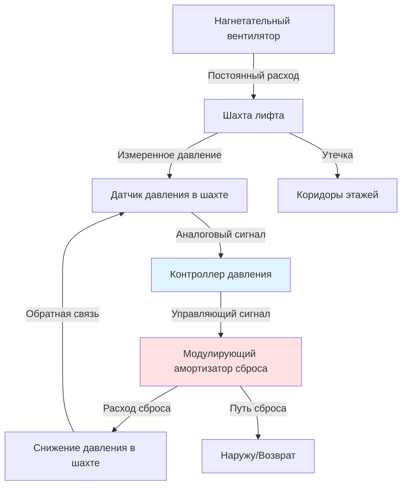

## Основы систем сброса давления в шахтах

Системы нагнетания воздуха в шахты лифтов подают свежий воздух для предотвращения проникновения дыма во время пожара, однако неконтролируемое нагнетание создает опасные усилия открытия дверей. Механизмы сброса давления регулируют давление в шахте путем выпуска избыточного воздуха, когда перепад давления превышает пороги проектирования.

Перепад давления на дверях лифта определяется следующим уравнением:

$$\Delta P = P_{shaft} - P_{floor}$$

Усилие, необходимое для открытия двери, составляет:

$$F_{door} = \Delta P \cdot A_{door} + F_{latch}$$

IBC раздел 1009.3 ограничивает максимальное усилие открытия дверей выхода до 30 lbf (133 Н). Для стандартной двери лифта размером 3 ft × 7 ft (2,1 м²) это ограничение ограничивает перепад давления до приблизительно 0,10 inches w.c. (25 Па) выше требований к усилию защелки.

## Барометрические амортизаторы сброса

### Принцип работы

Барометрические амортизаторы работают пассивно благодаря аэродинамическим силам. Лопасть амортизатора вращается на смещенной оси, создавая вращающие моменты от перепада давления и гравитации:

$$\tau_{net} = \tau_{pressure} - \tau_{gravity}$$

При повышении давления в шахте момент, вызванный давлением, преодолевает гравитационное усилие закрытия, открывая амортизатор. Амортизатор модулирует открытие пропорционально перепаду давления, обеспечивая саморегулирующийся сброс без электрических систем управления.

### Методология расчета размеров

Пропускная способность сброса должна соответствовать максимальному расходу подаваемого воздуха за вычетом утечек через двери и проходы в шахте:

$$Q_{relief} = Q_{supply} - Q_{leakage}$$

Расход утечки через двери следует принципам потока через отверстие:

$$Q_{leakage} = C_d \cdot A_{gaps} \cdot \sqrt{\frac{2\Delta P}{\rho}}$$

Для современных дверей лифтов с уплотнениями $C_d \approx 0,65$, общая площадь щелей составляет 0,5–1,5 ft² на дверь.

**Таблица размеров барометрических амортизаторов:**

| Расход подаваемого воздуха (CFM) | Количество дверей | Утечка (CFM @ 0,10" w.c.) | Требуемый сброс (CFM) | Размер амортизатора (см²) |
|----------------------|-----------------|----------------------------|-----------------------|-------------------|
| 3,000 (1,416 м³/ч) | 8 | 450 | 2,550 | 5,484 |
| 5,000 (2,361 м³/ч) | 12 | 650 | 4,350 | 9,355 |
| 8,000 (3,777 м³/ч) | 20 | 950 | 7,050 | 15,177 |
| 12,000 (5,665 м³/ч) | 30 | 1,300 | 10,700 | 23,035 |

Свободная площадь амортизатора предусматривает скорость потока 100 FPM (0,508 м/с) на конец при расчетном перепаде давления.

## Автоматические системы управления давлением

### Последовательность управления

Автоматические системы используют датчики давления и модулирующие амортизаторы для поддержания давления в шахте в узких пределах, независимо от условий окружающей среды или эффекта стека здания.



### Логика управления

Контроллер реализует алгоритм ПИД:

$$u(t) = K_p \cdot e(t) + K_i \int_0^t e(\tau)d\tau + K_d \frac{de(t)}{dt}$$

Где:
- $u(t)$ = команда положения амортизатора (0-100%)
- $e(t)$ = давление установки минус измеренное давление
- $K_p, K_i, K_d$ = коэффициенты пропорциональности, интегралирования и дифференцирования

Типовое значение установки: 0,08 inches w.c. (20 Па) с мертвой зоной ±0,02 inches w.c.

### Реакция системы

Автоматические системы реагируют на динамические изменения давления от:
- Колебаний давления в здании, вызванных ветром
- Вариаций эффекта стека с изменением наружной температуры
- Событий открытия дверей, создающих внезапные падения давления
- Активации соседних систем нагнетания в шахты

Требования ко времени отклика в соответствии с NFPA 92 раздел 5.2.3.3:
- Стабилизация давления в шахте в течение 30 секунд после активации системы
- Поддержание давления во время цикла открытия дверей (15-20 секунд)

## Расчеты размеров вентиляционных отверстий сброса

### Пошаговая процедура

**1. Определение максимального расхода подаваемого воздуха**

На основании объема шахты и требований к смене воздуха:

$$Q_{supply} = \frac{V_{shaft} \cdot ACH}{60}$$

NFPA 92 рекомендует минимум 1 смену воздуха в минуту для шахт, обслуживающих подземные уровни.

**2. Расчет утечки при расчетном давлении**

Суммирование утечек через все двери и проходы:

$$Q_{leak,total} = \sum_{i=1}^{n} C_{d,i} \cdot A_{i} \cdot \sqrt{\frac{2\Delta P_{design}}{\rho}}$$

**3. Размер отверстия сброса**

$$A_{relief} = \frac{Q_{relief}}{V_{relief}}$$

Где $V_{relief}$ = 500-800 FPM (2,54-4,06 м/с) для гравитационного сброса, 1000-1500 FPM (5,08-7,62 м/с) для сброса с приводом.

**4. Применение коэффициента безопасности**

Умножение расчетной площади на 1,25 для учета:
- Помех от лопасти амортизатора (снижает свободную площадь на 10-20%)
- Сопротивления экрана/жалюзи
- Несовершенств установки

## Оптимизация расположения вентиляционного отверстия сброса

### Вертикальное положение

**Верхняя часть шахты (предпочтительно):**
- Естественная плавучесть способствует потоку сброса
- Минимизирует градиент давления по высоте шахты
- Эффект стека способствует восходящему потоку воздуха

Изменение давления с высотой:

$$\frac{dP}{dz} = -\rho g$$

Для шахты высотой 400 ft (121,9 м) с 0,10 inches w.c. внизу естественный градиент давления стека способствует восходящему градиенту давления 0,50-0,80 inches w.c.

**Сброс внизу (особые случаи):**
- Требуется при невозможности сброса сверху (конфигурация здания)
- Должен преодолеть восходящее давление стека
- Требует большей пропускной способности сброса или принудительного выхлопа

### Горизонтальное положение

Расположение точек сброса для минимизации короткого замыкания между подачей и сбросом:

**Оптимальная конфигурация:**
| Местоположение подачи | Местоположение сброса | Расстояние разделения | Риск короткого замыкания |
|-----------------|-----------------|---------------------|---------------------|
| Низ по центру | Верхние углы (2 отверстия) | Полная высота шахты | Низкий |
| На среднюю высоту | Верх и низ | 50% высоты шахты каждый | Средний |
| Низ | Низ противоположная стена | 1,5-3,0 м | Высокий |

## Мониторинг давления и проверка

### Размещение датчика

Установка датчиков перепада давления:
- Портал ссылки: репрезентативный коридор этажа
- Портал измерения: шахта на средней высоте
- Избегать мест вблизи диффузоров подачи (минимум ±4,6 м)
- Защита от прямого потока воздуха

### Приемочные испытания

NFPA 92 раздел 5.2.3.4 требует проверки:

1. Измерение перепада давления на каждом этаже со всеми закрытыми дверями
2. Проверка максимального усилия открытия двери ≤ 30 lbf (133 Н)
3. Тестирование восстановления давления после цикла открытия двери
4. Подтверждение активации системы сброса перед пределом давления

**Критерии приемки:**

```mermaid
graph LR
    A[Система активирована] --> B{Давление стабильно за 30 с?}
    B -->|Да| C{Все этажи < 0,10" w.c.?}
    B -->|Нет| D[Отрегулировать подачу/сброс]
    C -->|Да| E{Усилие двери < 30 lbf?}
    C -->|Нет| D
    E -->|Да| F[Тест восстановления открытия двери]
    E -->|Нет| D
    F --> G{Давление восстанавливается < 15 с?}
    G -->|Да| H[Система принята]
    G -->|Нет| D
    D --> A

    style H fill:#90EE90
    style D fill:#FFB6C6
```

## Резюме требований кодекса

**IBC 2021:**
- Раздел 1009.3: Максимальное усилие открытия двери 30 lbf (133 Н)
- Раздел 909.20.5: Системы нагнетания в лестничные клетки и шахты лифтов

**NFPA 92 (2021):**
- Раздел 5.2.3: Проектирование нагнетания в шахты лифтов
- Раздел 5.2.3.3: Требования к сбросу давления
- Раздел 5.2.3.4: Процедуры приемочных испытаний

**Пределы расчетного давления:**
- Минимум: 0,05 inches w.c. (12,5 Па) для эффективности дымоудаления
- Максимум: 0,10 inches w.c. (25 Па) для поддержания усилий дверей в пределах
- Целевое значение: 0,08 inches w.c. (20 Па) с автоматическим управлением

Системы сброса давления обеспечивают критический баланс между эффективностью дымоудаления и требованиями безопасности при эвакуации, требуя точного инженерного проектирования для одновременного достижения обеих целей.
