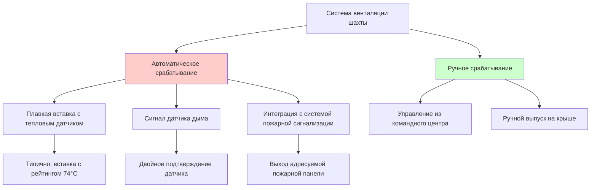
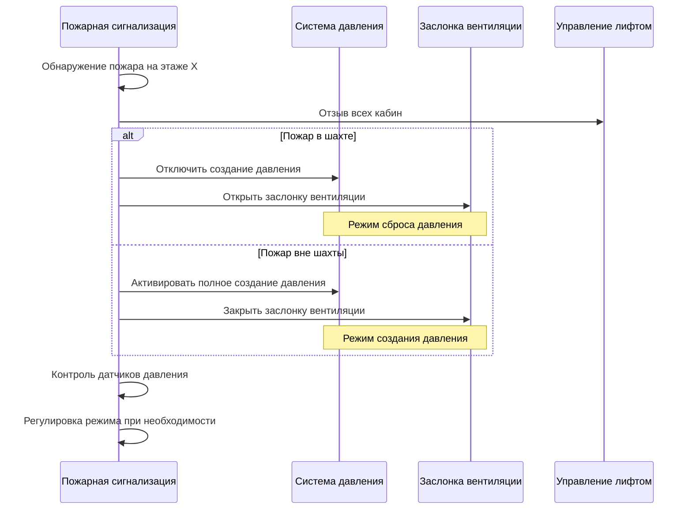

Вентиляция шахты лифта служит двойной цели в системах HVAC высотных зданий: контролируемое удаление дыма при пожарных чрезвычайных ситуациях и снижение перепадов давления, вызванных эффектом тяги. Физика конвекционного потока и геометрические ограничения вертикальных шахт создают уникальные проблемы проектирования, требующие тщательной координации с системами создания давления.

## Фундаментальная физика вентиляции шахт

Движущая сила для естественной вентиляции в шахтах лифтов происходит от тепловой конвекции. Когда дым поступает в шахту, температурный перепад создает восходящий градиент давления, определяемый формулой:

$$\Delta P = \rho_0 g h \left(1 - \frac{T_0}{T_s}\right)$$

Где $\Delta P$ — перепад давления (Па), $\rho_0$ — плотность окружающего воздуха (кг/м³), $g$ — ускорение свободного падения (9,81 м/с²), $h$ — высота шахты (м), $T_0$ — температура окружающей среды (К), $T_s$ — температура дыма (К).

Это конвекционное давление должно преодолеть сопротивление потоку через вентиляционное отверстие. Полученный объемный расход через кровельную вентиляцию следует формуле:

$$Q = C_d A \sqrt{\frac{2\Delta P}{\rho}}$$

Где $Q$ — расход (м³/с), $C_d$ — коэффициент расхода (обычно 0,6-0,7 для острых кромок), $A$ — площадь вентиляции (м²), $\rho$ — средняя плотность в канале вентиляции.

## Требования норм по вентиляции

### Требования IBC

Раздел 3004.3 Международного строительного кодекса устанавливает базовые требования к вентиляции шахт лифтов:

- Вентиляция требуется для шахт лифтов, обслуживающих четыре или более этажей
- Минимальная площадь вентиляции: 3,5% площади поперечного сечения шахты
- Расположение вентиляции: в пределах 90 см от верхней точки шахты
- Механизм открытия: автоматическое срабатывание от тепла или дыма либо ручное управление

### Стандарты управления дымом NFPA 92

NFPA 92 предоставляет рекомендации, основанные на эффективности, для систем вентиляции шахт лифтов:

| Параметр | Требование | Обоснование |
|----------|------------|-------------|
| Минимальная площадь вентиляции | Больший из минимума по коду или рассчитанного требования дымоудаления | Обеспечить надлежащую пропускную способность удаления дыма |
| Температура срабатывания | 140°F (60°C) для плавких вставок | Баланс между ранним срабатыванием и предотвращением ложных тревог |
| Ручное управление | Требуется от командного центра пожаротушения | Позволить пожарным управлять системой во время операций |
| Чистое проходное сечение вентиляции | 100% номинальной площади при полном открытии | Минимизировать потери на ограничение потока |

## Расчеты размера вентиляции

### Методика проектирования

Расчет размера вентиляции шахты требует анализа трех отдельных сценариев:

1. **Дымоудаление при пожаре** — максимальное ожидаемое производство дыма
2. **Сброс давления эффекта тяги** — смягчение сезонного перепада давления
3. **Нормальная работа** — минимальная утечка воздуха для поддержания чистоты шахты

#### Расчет при пожаре

Требуемая площадь вентиляции зависит от ожидаемого расхода дыма и допустимой скорости снижения уровня дыма:

$$A_{vent} = \frac{Q_{smoke}}{v_{exit}}$$

Где $Q_{smoke}$ — расход дыма (м³/с) и $v_{exit}$ — скорость выхода через вентиляцию (м/с).

Для типичных сценариев пожара в холле лифта производство дыма составляет от 2 до 5 м³/с на этаж. Скорость выхода через вентиляцию зависит от конвекционного давления и может быть оценена с использованием уравнения отверстия.

**Практический пример:**

Рассмотрим 30-этажное здание с размерами шахты 4 м × 4 м (площадь поперечного сечения 16 м²), общая высота 100 м, пожар на 15 этаже:

Примите температуру дыма: 500°C (773 K), окружающая среда: 20°C (293 K)

$$\Delta P = 1,2 \times 9,81 \times 100 \times \left(1 - \frac{293}{773}\right) = 729 \text{ Па}$$

$$v_{exit} = 0,65 \sqrt{\frac{2 \times 729}{1,2}} = 22,6 \text{ м/с}$$

Для расхода дыма 3 м³/с:

$$A_{vent} = \frac{3}{22,6} = 0,133 \text{ м}^2$$

Минимальное требование IBC: $0,035 \times 16 = 0,56$ м²

Минимум по коду 0,56 м² превышает расчетное требование, обеспечивая запас для неопределенности в оценках производства дыма.

#### Сброс давления эффекта тяги

Зимой теплый воздух в здании в шахте создает восходящее давление. Вентиляция должна сбросить избыточное давление, чтобы предотвратить проблемы с управлением дверями:

$$Q_{relief} = C_d A_{vent} \sqrt{\frac{2\Delta P_{stack}}{\rho}}$$

Где $\Delta P_{stack}$ — давление эффекта тяги в верхней части шахты.

## Системы срабатывания

### Автоматическое срабатывание от тепла

Системы с плавкими вставками обеспечивают отказоустойчивую работу без электропитания или сигнальной проводки:

**Преимущества:**
- Не требуется электрическое питание
- Простой, надежный механизм
- Самопроверка (вставка видна для проверки)
- Внутренне отказоустойчива (вставка плавится в огне)

**Недостатки:**
- Не может быть дистанционно закрыта после срабатывания
- Одноразовое устройство, требующее замены
- Фиксированная температура срабатывания
- Медленнее электронного обнаружения

Плавкие вставки с рейтингом 165°F (74°C) являются стандартом, обеспечивающим срабатывание до работы спринклерной системы (обычно 212°F), избегая ложных срабатываний от нагрева солнцем.

### Автоматическое обнаружение дыма

Фотоэлектрические или ионизационные датчики дыма, подключенные к приводам моторизованных заслонок, обеспечивают более быстрое срабатывание и дистанционное управление:

**Требования к проектированию:**
- Двойное подтверждение датчика для предотвращения ложного срабатывания
- Датчики расположены в шахте на двух верхних этажах
- Контролируемые цепи, отслеживаемые пожарной панелью
- Возможность ручного управления из командного центра
- Резервное питание для приводов (минимум 4 часа)

### Координация с системами создания давления

Одновременная работа системы создания давления в шахте и вентиляции создает противоречивые потоки. Проектирование должно учитывать это взаимодействие:

| Сценарий | Система создания давления | Заслонка вентиляции | Результат |
|----------|--------------------------|-------------------|-----------|
| Нормальная работа | Выключена | Закрыта | Минимальный воздушный поток |
| Управление эффектом тяги | Модулируемая подача воздуха | Частично открыта | Уравновешенное управление давлением |
| Пожар — режим сброса давления | Выключена | Открыта | Максимальное дымоудаление |
| Пожар — режим создания давления | Полная мощность | Закрыта | Максимальное исключение дыма |

**Логика управления:**

Система пожарной сигнализации должна координировать эти режимы на основе местоположения пожара. Современные последовательности управления:

## Детали конструкции вентиляции

### Типы вентиляции

**Шарнирный люк на крыше:**
- Наиболее распространенная конфигурация
- Одностворчатое или двухстворчатое исполнение
- Подпружиненное или противовесное открытие
- Прокладки для герметизации от погодных условий
- Типовой размер: 4 фута × 4 фута (1,2 м × 1,2 м)

**Жалюзийное отверстие пентхауса:**
- Обеспечивает защиту от погодных условий
- Управление моторизованной заслонкой
- Более высокое сопротивление потоку, чем открытый люк
- Лучшая эстетическая интеграция с архитектурой пентхауса

**Система механического выхлопа:**
- Механический выхлоп преодолевает воздействие ветра
- Типовая пропускная способность: 2-4 смены воздуха в минуту объема шахты
- Требует питание с огнеупорной изоляцией
- Позволяет закрытую вентиляцию во время периодов эффекта тяги

### Требования к установке

Критические детали для эффективной работы вентиляции:

- **Зазор:** минимум 90 см вокруг рабочей вентиляции для доступа к техническому обслуживанию
- **Конструкционная поддержка:** основание вентиляции должно выдерживать нагрузку снега плюс ветровые подъемные силы
- **Защита от погодных условий:** непрерывная прокладка при закрытом состоянии, минимум 10 см высоты основания
- **Усилие привода:** максимум 110 Н для ручного срабатывания согласно IBC 3004.3

### Минимизация сопротивления потоку

Эффективная площадь вентиляции отличается от геометрической площади из-за потерь на вход и трения:

$$A_{effective} = C_d \times A_{geometric}$$

Практики проектирования для максимизации $C_d$:

- Плавные переходы от шахты к вентиляционному отверстию
- Щедрый радиус на острых углах (минимум 5 см радиуса)
- Положение полностью открытой заслонки 90° или больше
- Минимизация сеток или жалюзи в канале потока

## Испытания и пусконаладка

Процедуры проверки подтверждают производительность вентиляции:

**Функциональные испытания:**
1. Тест ручного управления — проверить максимальное усилие 110 Н
2. Тест автоматического срабатывания — имитировать сигнал датчика или источник тепла
3. Проверка полного открытия — подтвердить достижение 100% геометрического открытия
4. Тест закрытия (моторизованный) — проверить возвращение в герметичное положение

**Испытания производительности:**
- Визуализация дыма — театральный дым для наблюдения за потоком
- Измерение давления — проверить сброс давления при имитированном эффекте тяги
- Время срабатывания — измерить задержку от сигнала к полному открытию

## Требования техническое обслуживание

Постоянное техническое обслуживание обеспечивает надежную аварийную работу:

| Компонент | Частота | Процедура |
|-----------|---------|-----------|
| Плавкие вставки | Ежегодно | Визуальная проверка, проверка коррозии |
| Работа заслонки | Два раза в год | Тест ручного срабатывания, смазка шарниров |
| Датчики дыма | Ежегодно | Тест чувствительности согласно NFPA 72 |
| Уплотнения от погодных условий | Ежегодно | Проверка повреждений, замена при необходимости |
| Трос ручного выпуска | Ежегодно | Управление выпуском, проверка люфта |

Правильное проектирование вентиляции шахты балансирует соответствие коду, производительность при пожаре и эксплуатационные соображения для контроля эффекта тяги. Интеграция вентиляции с системами создания давления требует тщательного анализа физики тепловой конвекции и скоординированных последовательностей управления для обеспечения эффективного управления дымом во всех сценариях работы.
