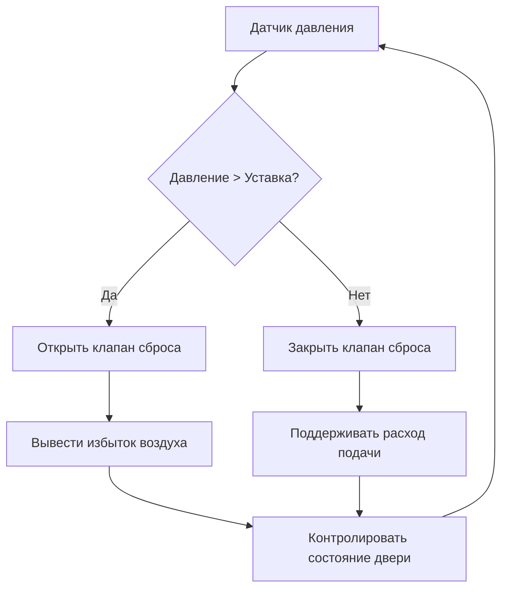

## Основы дымонепроницаемых ограждений

Вестибюли лифтовых холлов служат критическими барьерами пожарной безопасности в высотных зданиях, защищая лестничные выходы от попадания дыма при обеспечении безопасных путей эвакуации. Международный строительный кодекс (IBC раздел 3008) и NFPA 92 устанавливают нормативные требования для дымонепроницаемых ограждений, соединяющих лифтовые холлы с лестничными выходами.

Фундаментальный физический принцип заключается в создании каскада давления, который предотвращает инфильтрацию дыма. Воздух течёт от областей высокого давления к областям низкого давления согласно:

$$Q = C_d A \sqrt{\frac{2\Delta P}{\rho}}$$

где $Q$ представляет объёмный расход воздуха (м³/ч), $C_d$ — коэффициент расхода (обычно 0,65 для дверных проёмов), $A$ — площадь потока (м²), $\Delta P$ — разность давлений (Па), и $\rho$ — плотность воздуха (кг/м³).

## Требования к нагнетанию давления и физика процесса

IBC раздел 3008.7 требует минимальных перепадов давления 50 Па относительно соседних помещений при закрытых дверях и 25 Па при открытой одной двери. Эти значения уравновешивают два конкурирующих физических требования: достаточное давление для предотвращения инфильтрации дыма при сохранении сил открывания дверей в приемлемых пределах.

Эффект тяги в высотных зданиях существенно влияет на нагнетание давления в вестибюле. Разность давлений вследствие эффекта тяги:

$$\Delta P_{stack} = 3.26 \times h \times \left(\frac{1}{T_o} - \frac{1}{T_i}\right)$$

где $h$ — вертикальное расстояние (м), $T_o$ — абсолютная температура наружного воздуха (К), и $T_i$ — абсолютная температура внутреннего воздуха (К). При зимних условиях в здании высотой 122 м с температурой внутри 21°C и снаружи −18°C, это создаёт приблизительно 190 Па, противодействующие системе нагнетания на верхних этажах.

### Стратегия каскада давления

## Анализ сил открывания дверей

NFPA 101 раздел 7.2.1.4.5 ограничивает силы открывания дверей 133 Н, а стандарты ADA требуют максимум 22 Н для внутренних дверей. Сила, требуемая для открывания двери против перепада давления:

$$F = \Delta P \times A \times k$$

где $F$ — сила открывания (Н), $\Delta P$ — разность давлений (Па), $A$ — площадь двери (м²), и $k$ — коэффициент, учитывающий геометрию двери и расположение петель (обычно 0,5 для дверей с центральным поворотом).

Для стандартной двери 0,9 м × 2,1 м (1,89 м²) с перепадом 50 Па:

$$F = 50 \times 1,89 \times 0,5 = 47,3 \text{ Н}$$

Это превышает нормативные пределы, что требует автоматических механизмов сброса давления.

## Конфигурации вентиляции вестибюля

NFPA 92 раздел 5.2.3 признаёт три приемлемые конфигурации дымонепроницаемых ограждений:

| Конфигурация | Метод вентиляции | Ключевое требование | Типичное применение |
|--------------|-------------------|-----------------|---------------------|
| Естественная вентиляция | Открытый наружный балкон | Минимум 1,5 м² площади на этаж | Мягкие климатические зоны |
| Механическая вентиляция | Нагнетание подаваемого воздуха | Минимум 71 м³/ч + утечка через двери | Высотные здания |
| Нагнетание в лестничную клетку | Прямое нагнетание в лестницу | Поддержание 50 Па | Наиболее распространённый подход |

### Расчёт расхода воздуха при механической вентиляции

Требуемый расход подаваемого воздуха объединяет утечки через закрытые двери и компенсацию воздуха при качании двери:

$$Q_{total} = Q_{leakage} + Q_{door}$$

Утечка через двери для стандартной двери 0,9 м × 2,1 м с зазором 0,3 см и перепадом 50 Па:

$$Q_{leakage} = 0.827 \times A_{gap} \times \sqrt{\Delta P} = 0.827 \times 0.0063 \times \sqrt{50} \approx 33 \text{ м³/ч}$$

Компенсация при качании двери требует продувки объёма, вытесняемого при открывании:

$$Q_{door} = \frac{V_{displaced} \times N_{opens}}{60} = \frac{1.89 \times 0.15 \times 10}{60} = 47 \text{ м³/ч}$$

Общий расход проектирования: $Q_{total} = 33 + 47 = 80$ м³/ч на уровень этажа.

## Лифты пожарной службы в холлах

IBC раздел 3007 устанавливает повышенные требования для холлов лифтов пожарной службы. Эти помещения требуют:

- **Минимальная площадь 9,3 м²** холла (IBC 3007.7.3)
- **Огнестойкое разделение** от остальных помещений здания (рейтинг 2 часа)
- **Независимая система HVAC**, которая сохраняет нагнетание давления во время пожара
- **Обнаружение дыма**, интегрированное с системой пожарной сигнализации здания

Физика сохранения нагнетания давления с большими объёмами холлов требует увеличенной пропускной способности воздуховода:

$$Q = \frac{V \times ACH}{60}$$

Для холла 9,3 м² × 3 м высота (27,9 м³) с 10 воздухообменами в час:

$$Q = \frac{27.9 \times 10}{60} = 4.65 \text{ м³/ч базовый расход}$$

Добавьте компенсацию утечки и допуск качания дверей для окончательного определения размеров.

## Системы сброса и регулирования давления

Сохранение целевых перепадов давления при управлении силами открывания дверей требует активного сброса давления. Три основные стратегии:

**Барометрические клапаны сброса** открываются автоматически, когда давление превышает механическую установку пружины (обычно 75 Па). Они обеспечивают пассивную защиту, но лишены точного управления.

**Моторизованные клапаны сброса** с датчиками перепада давления позволяют активное управление. Алгоритмы ПИД-регулирования модулируют положение клапана для сохранения уставки ±5 Па.

**Передача между лестничной клеткой и вестибюлем** выравнивает давление при открывании дверей, снижая силу открывания до приемлемых уровней при сохранении защиты от дыма.

## Альтернативы кодекса и проектирование на основе производительности

IBC раздел 3008.13 разрешает альтернативы нормативным требованиям при одобрении органом юрисдикции. Проектирование управления дымом на основе производительности с использованием вычислительной гидродинамики (CFD) может демонстрировать эквивалентную безопасность с модифицированными конфигурациями.

Ключевые критерии производительности для одобрения:

- Высота дымового слоя сохраняется выше 1,8 м от уровня пола
- Максимальная температура дыма 93°C в зоне дыхания
- Приемлемые условия сохраняются в течение требуемого времени эвакуации
- Перепады давления достаточны для предотвращения обратного потока дыма

Анализ CFD должен учитывать потоки, управляемые плавучестью, используя число Фруда:

$$Fr = \frac{v}{\sqrt{g \times L \times \frac{\Delta T}{T}}}$$

где $v$ — скорость, $g$ — ускорение свободного падения, $L$ — характерная длина, и $\Delta T/T$ представляет относительную разность температур.

## Проверочное испытание при проектировании

NFPA 92 раздел 4.6 требует от введённых в эксплуатацию систем управления дымом прохождения испытаний для проверки производительности. Критические точки испытания:

1. **Измерения давления в установившемся режиме** при закрытых всех дверях
2. **Проверка силы открывания двери** с использованием откалиброванного динамометра
3. **Измерения расхода воздуха** в точках подачи и сброса
4. **Испытания имитации качания двери** — проверка динамического отклика давления
5. **Сезонные испытания** для проверки производительности при эффекте тяги во всех климатических условиях

Документация должна демонстрировать соответствие проектным критериям при всех ожидаемых условиях эксплуатации, включая частичную работу системы и неблагоприятные погодные условия.
