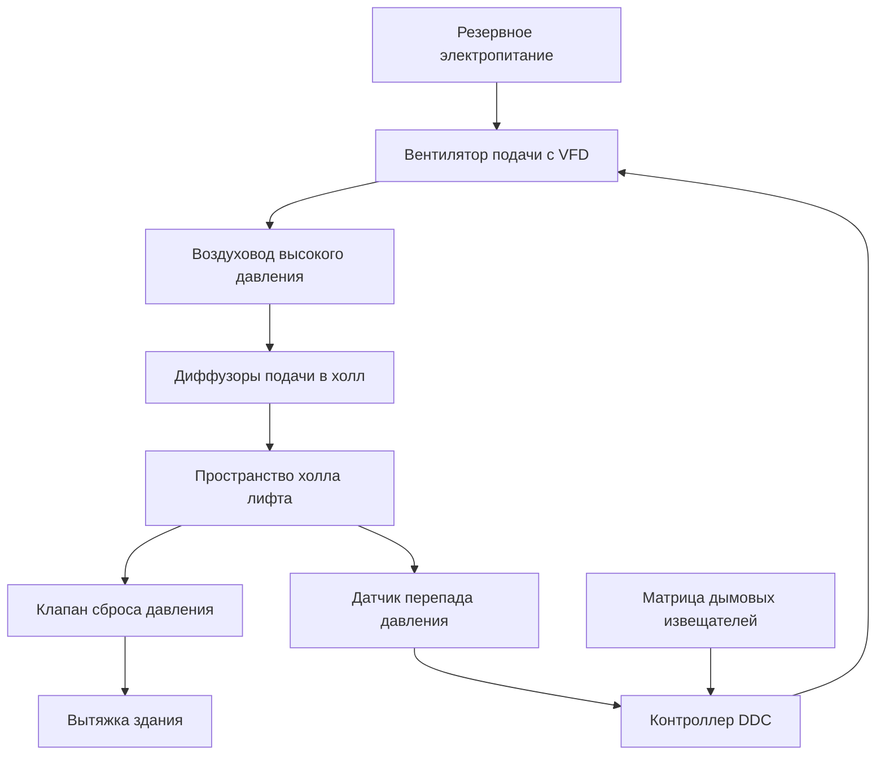
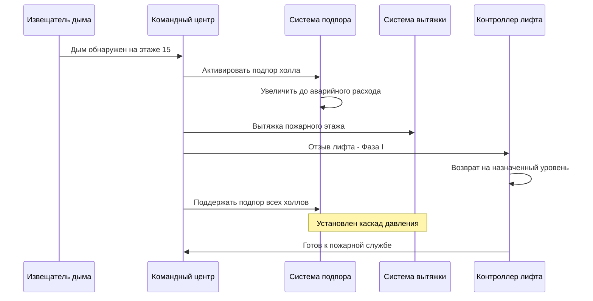

Лифты пожарной безопасности представляют критическую инфраструктуру обеспечения жизнедеятельности в высотных зданиях, требующую специализированных систем HVAC, которые поддерживают операционную целостность во время чрезвычайных ситуаций, связанных с пожаром. Эти системы должны обеспечивать среду, свободную от дыма, для доступа пожарных, одновременно гарантируя, что оборудование продолжает функционировать в экстремальных тепловых условиях.

## Нормативная база

IBC раздел 3007 и ASME A17.1 правило 211.3 устанавливают комплексные требования для лифтов пожарной безопасности. Здания, превышающие высоту 36,5 м (120 футов), требуют как минимум одного лифта, обслуживающего все этажи, с выделенными положениями HVAC, которые защищают как холл лифта, так и машинное отделение от проникновения дыма и теплового повреждения.

Интеграция систем HVAC и пожаротушения создает скоординированный механизм защиты, где подпор, вентиляция и охлаждение работают одновременно для поддержания приемлемых условий во время аварийных операций.

## Подпор в холле лифта

Холлы лифтов пожарной безопасности требуют положительного подпора относительно соседних помещений для предотвращения миграции дыма. Система подпора поддерживает минимальный перепад давления 12,5 Па между закрытыми дверьми, увеличиваясь до 25 Па при максимальном расходе воздуха.

### Физика перепада давления

Требуемый перепад давления соответствует уравнению потока через отверстие:

$$Q = 1.23 \cdot A \cdot \sqrt{\frac{\Delta P}{\rho}}$$

Где:
- $Q$ = расход воздуха (м³/ч)
- $A$ = площадь утечки (м²)
- $\Delta P$ = перепад давления (Па)
- $\rho$ = плотность воздуха (кг/м³)

Для типичного холла с площадью утечки конструкции 0,009 м² на 1 м² площади стены, поддержание 12,5 Па требует приблизительно 400–570 м³/ч расхода подачи воздуха, учитывая подрезы дверей, проёмы и качество конструкции.

Вентилятор подачи должен преодолеть силы открывания двери при одновременном поддержании приемлемых перепадов давления:

$$F_{door} = \frac{\Delta P \cdot A_{door} \cdot W}{2(W - d)}$$

Где $F_{door}$ представляет дополнительную силу, необходимую для открывания двери против перепада давления, $A_{door}$ — площадь двери, $W$ — ширина двери, $d$ — расстояние от ручки двери до петель. Максимально допустимая сила открывания двери 133 Н ограничивает перепад давления примерно до 88 Па для стандартных дверей размером 0,9×2,1 м.

### Стратегия распределения воздуха

Воздух подачи поступает через диффузоры в потолке, расположенные так, чтобы создавать нисходящие потоки, которые выметают дым от дверей лифта. Профиль скорости должен избегать высокоскоростных струй, которые могли бы нарушить слои дыма или создать неудобные условия для присутствующих. Расчётные скорости на высоте 1,8 м над полом не должны превышать 0,76 м/с в нормальном режиме подпора.

Сброс давления происходит через барометрические клапаны или электронно управляемые клапаны, которые модулируют на основе датчиков перепада давления. Путь сброса должен выводить в безопасные зоны, как правило, в систему вытяжки дыма здания или непосредственно в атмосферу через выделенные шахты.

## Контроль окружающей среды машинного отделения

Машинные отделения лифтов, в которых размещены тяговое оборудование, контроллеры и системы резервного электропитания, требуют круглогодичного охлаждения для поддержания оборудования в пределах технических характеристик производителя, как правило, максимум 32°C окружающей температуры.

### Расчёты тепловой нагрузки

Генерация тепла в машинном отделении включает:

$$Q_{total} = Q_{motors} + Q_{controller} + Q_{lighting} + Q_{envelope}$$

Теплоотвод тягового двигателя при непрерывной работе:

$$Q_{motors} = \frac{P \cdot 1000 \cdot (1 - \eta)}{\eta}$$

Для типичного 30 кВт безредукторного механизма, работающего при КПД 92%, теплоотвод двигателя составляет приблизительно 2,1 кВт. Контроллеры преобразователей частоты добавляют 3–5% мощности двигателя как тепло, внося дополнительные 1,5 кВт. Нагрузки через ограду варьируются в зависимости от расположения помещения, но как правило добавляют 2,4–3,5 кВт для внутренних помещений и 4,4–7,3 кВт для крыш, подвергаемых солнечному излучению.

Полная тепловая нагрузка охлаждения для одного машинного отделения лифта варьируется от 5,9 до 11,7 кВт в зависимости от размера оборудования и расположения.

### Проектирование системы охлаждения

Системы охлаждения машинного отделения должны работать на резервном электропитании с той же надёжностью, что и сам лифт. Существуют три основных подхода:

| Метод охлаждения | Преимущества | Недостатки | Типичное применение |
|---|---|---|---|
| Сплит-система AC | Высокая эффективность, компактность | Требует доступа к наружному блоку | Здания средней высоты |
| Вентилятор охлаждённой воды | Интеграция с системами здания | Требуется аварийный охладитель | Высотные здания с центральными установками |
| Теплообменник гликолевого контура | Без хладагента в помещении | Требует отвода тепла | Критически важные объекты |
| Выделенный блок DX | Независимая работа | Нижняя эффективность | Модернизация существующих зданий |

Размеры резервного электропитания должны учитывать одновременную работу всех систем обеспечения жизнедеятельности. Охлаждение машинного отделения обычно составляет 15–20% от общей аварийной нагрузки лифта пожарной безопасности.

## Стратегии защиты от дыма

Лифты пожарной безопасности должны оставаться свободными от дыма благодаря физическому разделению и активному контролю дыма. ASME A17.1 требует закрытых холлов лифтов на каждом этаже с огнестойкой конструкцией минимум класс 1 час и самозакрывающимися огнестойкими дверями.

Система HVAC предотвращает проникновение дыма через три механизма:

**Подпор**: Поддерживает положительный перепад давления, предотвращающий проникновение дыма через закрытые двери и конструкционные щели.

**Вентиляция**: При обнаружении дыма переключается в режим 100% наружного воздуха, предотвращая рециркуляцию загрязненного воздуха через системы HVAC здания.

**Координация вытяжки**: Взаимодействует с системой вытяжки дыма здания, создавая каскады давления, направляющие дым в сторону от защищённых холлов.

## Интеграция резервного электропитания

Все компоненты HVAC лифта пожарной безопасности подключены к резервному электропитанию в течение 60 секунд после отказа нормального питания согласно IBC раздел 3007.9. Последовательность резервного электропитания приоритизирует работу лифта при сохранении защиты окружающей среды:

**Приоритет 1** (0–10 секунд): Контроллер лифта, отпуск тормоза, освещение

**Приоритет 2** (10–30 секунд): Охлаждение машинного отделения, вентиляторы подпора холла

**Приоритет 3** (30–60 секунд): Обнаружение дыма, системы управления, вспомогательная вентиляция

Расчёты мощности генератора должны учитывать пусковые токи при пуске двигателя. Вентиляторы подпора с прямым пуском потребляют 600% номинального тока в течение 2–4 секунд, требуя размеров генератора для размещения этих переходных нагрузок без падения напряжения, превышающего 15%.

Преобразователи частоты снижают пусковой ток до 150% номинального, но добавляют гармоническое искажение, требующее гармонических фильтров или увеличенных генераторов с коэффициентом мощности 0,8 вместо стандартного соотношения 0,8 кВА/кВт.

## Испытания и наладка

Функциональное испытание производительности подтверждает отклик системы HVAC при моделировании условий пожара. Протоколы испытаний включают:

- Измерения перепада давления на всех дверях холла при открытых/закрытых соседних дверях
- Испытания дымовой свечи, проверяющие, что потоки воздуха предотвращают проникновение дыма
- Измерения сил открывания двери, обеспечивающие соответствие максимуму 133 Н
- Мониторинг температуры машинного отделения во время расширенной работы лифта
- Испытание переключения резервного электропитания с полной нагрузкой HVAC
- Проверка последовательности управления через интерфейс пожарной сигнализации

Требования к документации согласно IBC раздел 3007.10 включают рабочие чертежи, показывающие все компоненты HVAC, последовательности управления, процедуры обслуживания и результаты испытаний, которые хранятся в командном центре пожарной безопасности.

## Критерии проверки производительности

Завершённая система HVAC лифта пожарной безопасности должна демонстрировать:

- Перепад давления в холле 12,5–25 Па относительно здания
- Температура машинного отделения поддерживаемая ниже 32°C во время непрерывной работы
- Силы открывания двери не превышающие 133 Н при максимальном подпоре
- Переключение резервного электропитания завершаемое в течение 60 секунд с сохранением всех функций
- Активация извещателя дыма инициирующая подпор в течение 30 секунд
- Работа системы устойчивая в течение минимум 2 часов на резервном электропитании

Эти стандарты производительности обеспечивают, что лифты пожарной безопасности остаются жизнеспособными маршрутами транспортировки для пожарных операций в течение всей продолжительности чрезвычайных ситуаций в зданиях.
