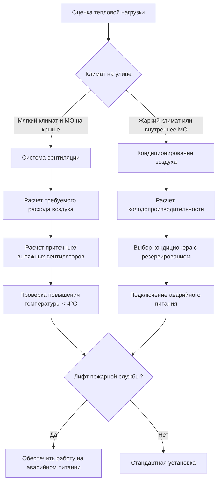
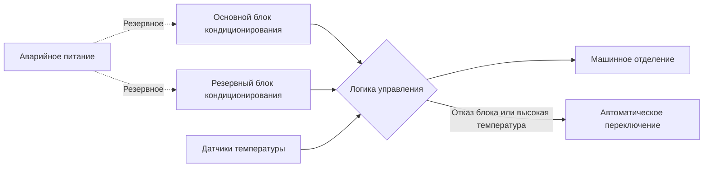

Машинные отделения лифтов концентрируют значительные тепловые нагрузки в ограниченных пространствах, требуя точного терморегулирования для поддержания оборудования в пределах допустимых температур работы. Конструкция системы охлаждения непосредственно влияет на надежность лифта, особенно для лифтов пожарной службы, которые должны работать в аварийных условиях.

## Источники тепловой нагрузки и расчеты

### Основные источники тепла

Машинные отделения лифтов генерируют тепло из трех основных источников:

1. **Тяговые двигатели** - Преобразуют электрическую энергию в механическую работу, потери эффективности проявляются как тепло
2. **Приводы и контроллеры двигателя** - Силовая электроника рассеивает тепло при коммутации и проводимости
3. **Резисторы динамического торможения** - Преобразуют энергию рекуперативного торможения в тепло при замедлении кабины

Общая величина чувствительной тепловой нагрузки:

$$Q_{total} = Q_{motor} + Q_{controller} + Q_{brake} + Q_{lighting} + Q_{envelope}$$

### Генерирование тепла тяговым двигателем

Выделение тепла двигателем зависит от режима работы и эффективности. Для редуктора тягового двигателя:

$$Q_{motor} = \frac{P_{rated} \times LF \times (1 - \eta)}{3.517} \text{ [кВт]}$$

Где:
- $P_{rated}$ = номинальная мощность двигателя [кВт]
- $LF$ = коэффициент нагрузки (типично 0,25-0,40 для лифтов)
- $\eta$ = эффективность двигателя (0,85-0,92 для современных двигателей)

Бесредукторные тяговые двигатели работают с более высокой эффективностью (0,90-0,95), но с более высокой номинальной мощностью, что приводит к сравнимому отводу тепла.

### Рассеивание тепла контроллером

Преобразователи частоты (VFD) рассеивают тепло пропорционально потоку тока:

$$Q_{VFD} = 3 \times I_{rated}^2 \times R_{eq} \times DF$$

Где $R_{eq}$ представляет эквивалентное сопротивление модулей IGBT, а $DF$ — коэффициент режима работы. Современные производители VFD указывают рассеивание тепла на уровне 1,5-3% от номинала привода.

### Резисторы динамического торможения

При рекуперативном торможении кинетическая энергия преобразуется в электрическую энергию, затем в тепло в тормозных резисторах:

$$Q_{brake} = \frac{m \times g \times h \times \eta_{regen}}{t_{cycle} \times 3.517}$$

Это представляет значительную прерывистую нагрузку, особенно в высоких зданиях, где изменения потенциальной энергии значительны.

## Температурные пределы оборудования

### Требования производителя

Температурные пределы оборудования лифта соответствуют ограничениям электронных компонентов:

| Тип оборудования | Максимальная окружающая | Оптимальный диапазон | Последствия превышения |
|-----------------|----------------------|-------------------|----------------------|
| Тяговые двигатели | 40°C | 25-35°C | Деградация изоляции, тепловые отключения |
| Контроллеры VFD | 40°C | 20-30°C | Снижение номинала, отказ полупроводников |
| Тормозные резисторы | 60°C | 35-50°C | Риск теплового разгона |
| Панели управления | 35°C | 20-30°C | Логические ошибки, отказ реле |

ASME A17.1 Раздел 2.8.2 требует, чтобы машинные отделения поддерживали температуры, подходящие для работы оборудования, при этом большинство производителей указывают максимум 40°C.

### Физика теплопередачи

Поверхности оборудования рассеивают тепло через конвекцию:

$$q = h \times A \times (T_{surface} - T_{ambient})$$

Более высокие температуры окружающей среды снижают разность температур, уменьшая эффективность теплопередачи и вызывая повышение температуры компонентов. Недостаточное охлаждение создает обратную связь, при которой повышенные температуры компонентов дополнительно снижают охлаждающую способность.

## Вентиляция против кондиционирования воздуха

### Системы только вентиляции

Вентиляция полагается на поток воздуха для отвода тепла:

$$\dot{m}_{air} = \frac{Q_{total}}{c_p \times (T_{discharge} - T_{supply})}$$

Для стандартного воздуха ($c_p$ = 1005 Дж/кг·°C), достигая повышения температуры на 8°C:

$$\text{CFM} = \frac{Q_{\text{кДж/ч}}}{1.2 \times 8} \approx \frac{Q_{\text{кДж/ч}}}{9.6}$$

или в м³/ч: $V = Q_{\text{кДж/ч}} / 9.6 \times 1.699$

**Ограничения:**
- Эффективна только при температуре наружного воздуха < 29°C
- Отсутствует контроль влажности
- Неэффективна в условиях пика летнего сезона
- Непригодна для внутренних машинных отделений

### Системы кондиционирования воздуха

Механическое охлаждение поддерживает постоянные условия независимо от температуры наружного воздуха. Холодопроизводительность включает:

$$Q_{AC} = Q_{sensible} + Q_{latent} + SF$$

Где $SF$ = коэффициент безопасности (типично 1,15-1,25 для машинных отделений).

## Рассмотрение лифтов без машинного отделения (MRL)

Лифты MRL интегрируют двигатели и контроллеры в шахту, исключая выделенные машинные отделения, но создавая уникальные проблемы охлаждения:

### Рассеивание тепла в шахтах

Без выделенной вентиляции температуры в шахте повышаются из-за тепла оборудования и солнечного излучения через внешние стены. Происходит стратификация тепла с градиентами температуры 5-11°C от низа к верху.

Шахта действует как вертикальный дымоход с естественной конвекцией:

$$\dot{Q}_{natural} = \rho \times A \times v \times c_p \times \Delta T$$

Где скорость $v$ зависит от эффекта тяги:

$$v = C \times \sqrt{h \times \Delta T}$$

Естественной конвекции в большинстве приложений недостаточно для контроля температуры.

### Требования принудительной вентиляции

Установки MRL требуют принудительной вентиляции шахты:

- Приток воздуха в нижнюю часть шахты
- Вытяжка в верхней части шахты
- Минимум 4 воздухообмена в час
- Зона оборудования требует прямого потока воздуха над двигателем и контроллером

## Требования аварийной эксплуатации

### Лифты для доступа пожарной службы

ASME A17.1 Раздел 2.27 и IBC Раздел 403.6.1 требуют, чтобы лифты доступа пожарной службы работали во время аварийных условий. Система охлаждения должна:

1. Подключаться к аварийному питанию (в течение 60 секунд после сбоя питания)
2. Поддерживать температуры оборудования во время продолжительной эксплуатации пожарной службой
3. Работать независимо от систем HVAC здания
4. Включать резервную охлаждающую способность

### Резервирование и надежность

Критические установки используют резервирование N+1 с автоматическим переключением:

- Работа основного-резервного режима на основе уравнивания наработки
- Автоматическое переключение при отказе блока или высокой температуре
- Независимые холодильные контуры
- Подключение аварийного питания для обоих блоков

### Расчет холодопроизводительности аварийного питания

Во время пожарной эксплуатации цикл работы лифта значительно увеличивается. Аварийная тепловая нагрузка учитывает:

$$Q_{emergency} = Q_{motor,max} + Q_{controller,max} + Q_{brake,avg} + Q_{envelope,fire}$$

Нагрузки оболочки увеличиваются в условиях пожара из-за повышенных температур коридоров. Проектируйте непрерывную работу при максимальном коэффициенте нагрузки (LF = 0,60-0,80), а не при типичных значениях.

## Рекомендации по проектированию

### Методология расчета

1. Расчет тепловыделения оборудования по данным производителя
2. Добавление нагрузок оболочки (стены, потолок, освещение)
3. Применение коэффициента безопасности 20% для машинных отделений
4. Выбор охлаждающего оборудования для общей нагрузки
5. Обеспечение резервирования N+1 для лифтов пожарной службы

### Требования к установке

- Размещение конденсаторных блоков на аварийном питании
- Обеспечение виброизоляции независимо от оборудования лифта
- Установка резервного контроля температуры с интерфейсом системы автоматизации здания
- Обеспечение размещения впусков и выпусков наружного воздуха, предотвращающего рециркуляцию
- Наладка системы охлаждения при полной нагрузке лифта

Охлаждение машинного отделения представляет критическую подсистему, где терморегулирование непосредственно влияет на доступность и безопасность лифта. Надлежащий расчет, резервирование и интеграция аварийного питания обеспечивают надежную работу при всех условиях.

## Компоненты

- Тепловая нагрузка машинного отделения
- Тепловыделение электродвигателя лифта
- Температурные пределы машинного отделения
- Проектирование системы охлаждения машинного отделения
- Резервные охлаждающие блоки
- Охлаждение на аварийном питании
