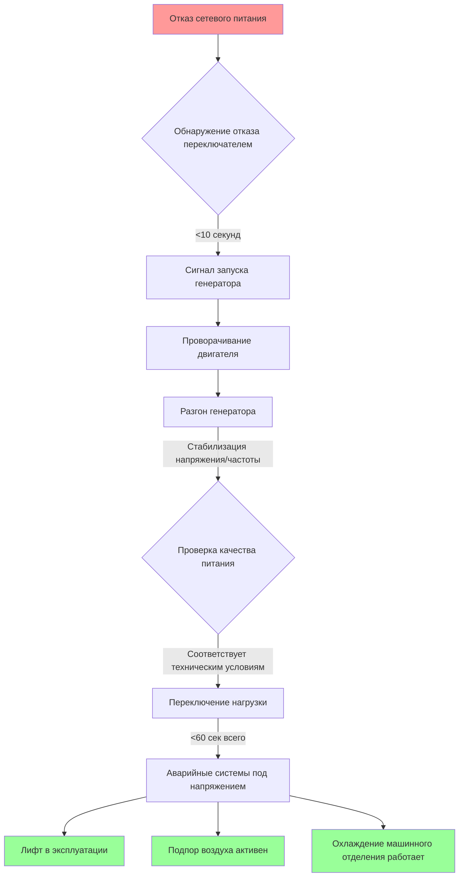
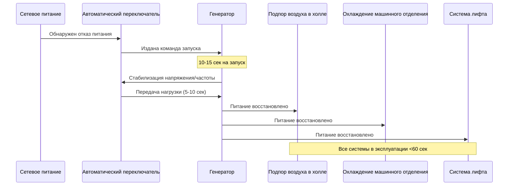

## Требования к системам аварийного электроснабжения

Пожарные лифты должны функционировать непрерывно при аварийных условиях, что требует надежных систем резервного питания. Инфраструктура аварийного питания должна поддерживать не только механические системы лифта и системы управления, но и критические компоненты HVAC, включая подпор воздуха в холле, охлаждение машинного отделения и интерфейсы систем дымоудаления.

### Требуемое время переключения согласно нормам

IBC раздел 3003 и NFPA 72 требуют, чтобы переключение аварийного питания пожарных лифтов происходило в течение 60 секунд после отказа основного источника питания. Это требование распространяется на все системы безопасности жизни, включая:

- Вентиляторы подпора воздуха в шахте лифта
- Системы подпора воздуха в холле лифта
- Вентиляцию и охлаждение оборудования машинного отделения
- Системы аварийного освещения и связи

Окно длительностью 60 секунд представляет максимально допустимый период прерывания перед восстановлением отката лифта и восстановлением его эксплуатационной способности. Системы HVAC, поддерживающие эти лифты, должны функционировать на протяжении всего процесса переключения.

### Расчет мощности генератора для комбинированных нагрузок

Мощность аварийного генератора должна обеспечивать одновременную работу нескольких систем. Расчет общей подключаемой нагрузки выполняется по формуле:

$$P_{total} = P_{elevator} + P_{HVAC} + P_{lighting} + P_{controls} \times SF$$

Где:
- $P_{total}$ = Общая мощность генератора (кВ)
- $P_{elevator}$ = Нагрузка электродвигателя и системы управления лифта (кВ)
- $P_{HVAC}$ = Суммарная нагрузка оборудования HVAC (кВ)
- $P_{lighting}$ = Аварийное и эвакуационное освещение (кВ)
- $P_{controls}$ = Системы пожарной сигнализации и связи (кВ)
- $SF$ = Коэффициент безопасности (обычно 1.25 согласно NFPA 110)

**Компоненты нагрузки HVAC:**

Часть HVAC включает:

$$P_{HVAC} = \sum_{i=1}^{n} \left(\frac{HP_i \times 0.746}{\eta_i \times PF_i}\right) + Q_{cooling}$$

Где:
- $HP_i$ = Мощность электродвигателя вентилятора/насоса $i$
- $\eta_i$ = КПД электродвигателя (обычно 0.85-0.92)
- $PF_i$ = Коэффициент мощности (обычно 0.85 для электродвигателей)
- $Q_{cooling}$ = Нагрузка оборудования охлаждения машинного отделения (кВ)

## Характеристики автоматического переключателя

Автоматический переключатель (ATS) служит критическим интерфейсом между сетевым и аварийным питанием. Для приложений с пожарными лифтами ATS должен соответствовать определенным критериям производительности:

| Параметр | Требование | Ссылка на стандарт |
|-----------|-------------|-------------------|
| Время переключения | ≤10 секунд (типичное) | NFPA 110 Type 10 |
| Диапазон датчика напряжения | ±10% номинального | UL 1008 |
| Допуск по частоте | ±5% (57-63 Hz) | IEEE 446 |
| Ток удержания | 10× номинальный на 0.5 сек | UL 1008 |
| Механические операции | минимум 6,000 | UL 1008 |
| Коммутация нагрузки HVAC | с пусковым током | применительно к приложению |

### Учет пускового тока

Оборудование HVAC, особенно вентиляторы подпора воздуха и компрессоры охлаждения, показывают значительный пусковой ток при запуске. Ток при заблокированном роторе может быть в 6-8 раз больше полной номинальной нагрузки:

$$I_{inrush} = I_{FLA} \times LRC$$

Где:
- $I_{inrush}$ = Пиковый пусковой ток (A)
- $I_{FLA}$ = Полная номинальная нагрузка (A)
- $LRC$ = Коэффициент кода заблокированного ротора (обычно 6.0-8.0)

Переключатель ATS и генератор должны выдерживать эти переходные нагрузки без падения напряжения более 20% или отклонения частоты более 5%.

## Системы HVAC на аварийном питании

### Подпор воздуха в холле лифта

Системы подпора воздуха в холле предотвращают инфильтрацию дыма в шахты лифтов, поддерживая минимальный перепад давления 0.05 дюйма водяного столба (12.5 Па) относительно смежных помещений. Система аварийного питания должна поддерживать этот подпор воздуха на протяжении всего аварийного события.

**Непрерывность воздушного потока:**

Поддержание требуемого перепада давления требует непрерывной работы вентилятора:

$$Q = \frac{A \times \sqrt{2 \times \Delta P / \rho}}{C_d}$$

Где:
- $Q$ = Требуемый воздушный поток (CFM, м³/ч)
- $A$ = Общая площадь утечек (м²)
- $\Delta P$ = Целевой перепад давления (Па)
- $\rho$ = Плотность воздуха (кг/м³)
- $C_d$ = Коэффициент выхода (обычно 0.65)

Прерывания питания продолжительностью более 5-10 секунд позволяют давлению упасть, потенциально компрометируя защиту от дыма. Питаемые от батареи преобразователи частоты (VFD) могут преодолеть разрыв переключения, поддерживая работу вентилятора во время переходного периода.

### Непрерывность охлаждения машинного отделения

Машинные отделения лифтов требуют непрерывного охлаждения для предотвращения перегрева оборудования, особенно при высокопроизводительных аварийных операциях. Рекомендации ASHRAE предусматривают поддержание температуры машинного отделения ниже 32°C с относительной влажностью не более 85%.

**Тепловая нагрузка при аварийной работе:**

Теплопоступления в машинное отделение при непрерывной работе лифта:

$$Q_{total} = Q_{elevator} + Q_{lights} + Q_{transmission} + Q_{VFD}$$

Где:
- $Q_{elevator}$ = Тепло от электродвигателя и тормозного резистора (кДж/ч)
- $Q_{lights}$ = Нагрузка аварийного освещения (кДж/ч)
- $Q_{transmission}$ = Теплопоступления через ограждающую конструкцию (кДж/ч)
- $Q_{VFD}$ = Потери в преобразователе частоты (3-5% от нагрузки электродвигателя)

Для типичного грузового лифта при непрерывной работе неэффективность электродвигателя и резисторы регенеративного торможения могут давать 21,000-42,000 кДж/ч. Без непрерывного охлаждения температура машинного отделения может возрастать на 1-2°C в час в хорошо изолированных помещениях.

## Сброс нагрузки и иерархия приоритетов

Когда мощность генератора ограничена, протоколы сброса нагрузки приоритизируют критические функции пожарного лифта. Типовая последовательность приоритетов:

**Приоритет 1 (без сброса):**
- Электродвигатель и системы управления лифтом
- Подпор воздуха в холле лифта
- Системы пожарной сигнализации и связи

**Приоритет 2 (поддерживать при наличии мощности):**
- Охлаждение машинного отделения
- Подпор воздуха в шахте (если отдельный от системы холла)
- Аварийное освещение

**Приоритет 3 (сбросить при необходимости):**
- Некритичная система HVAC здания
- Удобные электросетевые розетки
- Неаварийное освещение

Логика сброса нагрузки контролирует выходную мощность генератора и частоту. Если частота падает ниже 58.5 Hz или напряжение падает более чем на 15%, нагрузки нижних приоритетов отключаются автоматически для предотвращения перегрузки генератора и потенциального отказа.

## Интеграция резервного питания от батареи

Источники бесперебойного питания (UPS) обеспечивают плавную преемственность для систем управления и критических компонентов HVAC во время переходного интервала. Для приложений с пожарными лифтами:

- **Системы управления лифтом:** минимум 30-60 минут емкости UPS
- **Преобразователи частоты вентиляторов подпора воздуха:** 2-5 минут емкости буфера
- **Контроль машинного отделения:** 4-часовой аккумуляторный резерв согласно NFPA 72

Система UPS обеспечивает, что управляющие последовательности остаются непрерывными даже во время событий переключения, предотвращая непредвиденные остановы или изменения режимов, которые могут скомпрометировать безопасность.

## Требования к испытаниям и техническому обслуживанию

NFPA 110 требует ежемесячных испытаний генератора под нагрузкой, с ежегодными испытаниями при 100% номинальной мощности. Для приложений с пожарными лифтами протоколы испытаний должны проверить:

- Соответствие времени переключения (<60 секунд всего)
- Перезапуск системы HVAC и устойчивую работу
- Обработку одновременных нагрузок (лифт + HVAC + освещение)
- Циклы разрядки и перезарядки резервного питания от батареи
- Функциональность последовательности сброса нагрузки

Регулярное испытание выявляет деградировавшие компоненты до аварийных событий, обеспечивая надежную производительность, когда она наиболее необходима.
