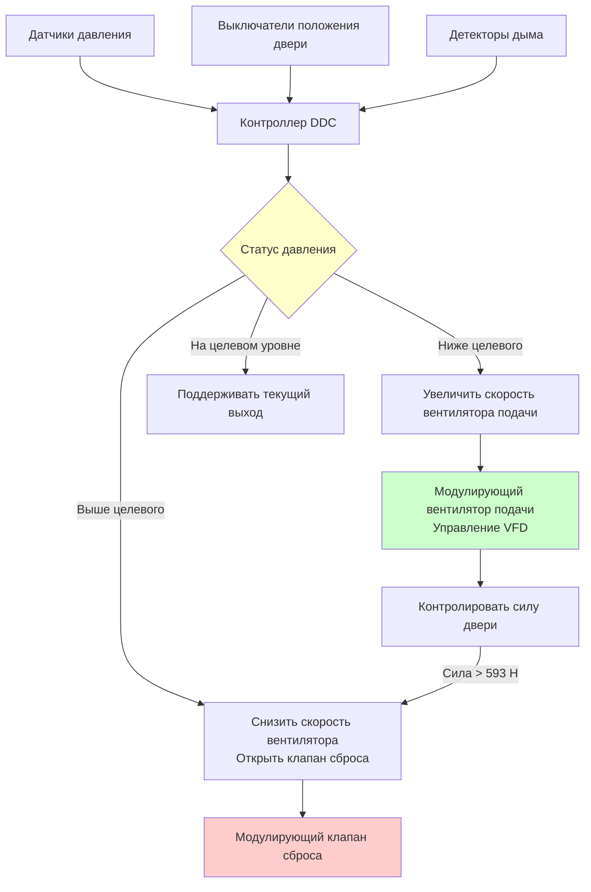

## Физические принципы герметизации вестибюля

Герметизация вестибюля пожарного лифта (FSAE) создает положительный перепад давления между вестибюлем лифта и смежными помещениями для предотвращения проникновения дыма при пожаре. Герметизация основана на фундаментальных принципах механики жидкости, где поток воздуха через отверстия зависит от перепада давления, геометрии отверстия и плотности воздуха.

Объемный расход воздуха через отверстие следует уравнению орифиция:

$$Q = C_d A \sqrt{\frac{2\Delta P}{\rho}}$$

где $Q$ — объемный расход (CFM), $A$ — эффективная площадь утечки (м²), $C_d$ — коэффициент расхода (обычно 0,6–0,7), а $\Delta P$ — перепад давления (Па).

## Требования к герметизации

### Обязательные нормативами перепады давления

**Раздел IBC 403.6.1** и **NFPA 5000** требуют поддержания минимальных перепадов давления в вестибюлях пожарных лифтов относительно смежных зон здания во время пожара:

| Состояние | Минимальное давление | Максимальное давление | Сила открытия двери |
|-----------|-------------------|------------------|-------------------|
| Двери закрыты | 12,5 Па | 37 Па | Н/Д |
| Двери открыты (одна дверь) | 25 Па | 37 Па | ≤ 593 Н |
| Несколько дверей открыты | 12,5 Па минимум | — | — |

Система герметизации поддерживает защитный перепад давления между вестибюлем пожарного лифта и смежными помещениями, предотвращая проникновение дыма и обеспечивая доступ пожарных.

### Ограничения силы открытия двери

Раздел IBC 1010.1.3 ограничивает силу открытия двери до 593 Н, что ограничивает максимально допустимый перепад давления. Сила, необходимая для открытия двери против перепада давления:

$$F_{door} = \Delta P \cdot A_{door} \cdot \frac{W}{2}$$

где $F_{door}$ — сила открытия (Н), $A_{door}$ — площадь двери (м²), и $W$ — ширина двери (м).

Для стандартной двери размером 0,91 м × 2,13 м:

$$F_{593} = \frac{593}{1,94 \cdot 0,457} = 668 \text{ Па/м}^2 = 27 \text{ Па}$$

Это устанавливает максимальный устойчивый перепад давления примерно на уровне 25 Па перед превышением ограничений по силе.

## Расчет подачи воздуха

Система подачи воздуха должна компенсировать утечку через закрытые двери и поддерживать поток воздуха при открытии дверей. Общий расход воздуха состоит из трех компонентов:

$$Q_{total} = Q_{leakage} + Q_{door} + Q_{safety}$$

### Поток утечки

Утечка через двери следует предположениям NFPA 92 для дверей вестибюля лифта:

$$Q_{leak} = 0.05 \cdot P \cdot A_{gap}$$

где $P$ — периметр (м) и $A_{gap}$ — площадь щели на метр (см²/м).

Типичная утечка: 28–47 CFM (47–79 м³/ч) на дверь при 12,5 Па при стандартном строительстве.

### Поток при открытии двери

При открытии дверей система должна подавать достаточно воздуха для поддержания скорости наружу, предотвращающей проникновение дыма. NFPA 92 рекомендует минимальную среднюю скорость 1,02 м/с через дверное отверстие в направлении, противоположном движению дыма.

$$Q_{door} = V_{avg} \cdot A_{door} \cdot N_{open}$$

Для одной двери размером 0,91 м × 2,13 м:

$$Q_{door} = 1.02 \text{ м/с} \cdot 1,94 \text{ м}^2 = 1,976 \text{ CFM (3,354 м³/ч)}$$

### Общая вместимость системы

Для вестибюля пожарного лифта, обслуживающего один лифт:

$$Q_{design} = (38 \text{ CFM} \cdot 4 \text{ закрытые двери}) + (1,976 \text{ CFM} \cdot 1 \text{ открытая дверь}) + 236 \text{ CFM запас}$$

$$Q_{design} = 152 + 1,976 + 236 = 2,364 \text{ CFM (4,013 м³/ч)}$$

## Конфигурация проектирования вестибюля

Вестибюли пожарных лифтов функционируют как герметизирующие вестибюли, разделяющие шахту лифта от этажей здания. Вестибюль создает трехзонный каскад давления:

### Требования к геометрии

IBC 3007.7.1 устанавливает минимальные размеры вестибюля:
- Минимальная площадь: 13,9 м²
- Минимальный размер: 2,4 м во всех направлениях
- Свободно от препятствий для размещения пожарных

Более крупные вестибюли требуют пропорционально большего расхода подачи воздуха из-за увеличенных путей утечки и объема.

## Система управления давлением

Система герметизации использует модулирующее управление для поддержания целевого давления при различных положениях дверей:

### Последовательность управления

**Нормальная работа (двери закрыты):**
1. Вентилятор подачи работает на минимальной скорости, поддерживая 12,5–25 Па
2. Клапан сброса закрыт или в минимальном положении
3. Датчик давления обеспечивает непрерывную обратную связь

**События открытия двери:**
1. Выключатель положения двери сигнализирует контроллеру
2. Скорость вентилятора увеличивается до установленной высокопроизводительной точки
3. Давление поддерживается на нижнем пороге (5 Па)
4. Клапан сброса открывается, если давление превышает максимум

**Сценарий с несколькими дверями:**
1. Вторая дверь открывается перед закрытием первой
2. Вентилятор работает на максимальной производительности
3. Клапаны сброса полностью открыты для предотвращения избыточного давления
4. Система поддерживает положительное давление без нарушения ограничений по силе

## Проектирование пути сброса

Клапаны сброса предотвращают избыточное давление при закрытии дверей после высокопроизводительной работы. Расчет размера клапана:

$$A_{relief} = \frac{Q_{max}}{V_{relief} \cdot 60}$$

где $V_{relief}$ — максимальная скорость на лицевой стороне 10,16 м/с.

Для системы на 2,364 CFM:

$$A_{relief} = \frac{2,364}{CFM} / (10.16 \text{ м/с} \cdot 196.9) = 0,00119 \text{ м}^2 = 11,9 \text{ см}^2$$

Типичная установка: два барометрических клапана сброса размером 30 см × 30 см с регулируемыми противовесами, установленными на открытие при 20 Па.

## Мониторинг и тестирование

NFPA 72 требует непрерывного мониторинга систем герметизации вестибюля с передачей сигналов тревоги в центр управления пожаром. Ежемесячное тестирование проверяет:

1. Поддержание перепада давления (двери закрыты)
2. Соответствие силе открытия двери
3. Реакция вентилятора подачи на операции с дверями
4. Работу клапана сброса
5. Функциональность системы управления

Ежегодное наладочное тестирование включает испытание дымовым индикатором для проверки наружного потока воздуха у дверных проемов и отсутствия обратного потока.

## Защита доступа пожарных

Система герметизации защищает пожарных во время транзита по лифту и операций размещения в вестибюле. Ключевые механизмы защиты:

**Исключение дыма:** Положительное давление предотвращает проникновение дыма с соседних этажей, поддерживая пригодные для дыхания условия на пути следования между лифтом и лестницей на этаже пожара.

**Тепловой барьер:** Непрерывный наружный поток воздуха создает пневматический барьер, дополняющий физическую конструкцию с огнеустойчивостью.

**Обеспечение эвакуации:** Поддерживаемый перепад давления гарантирует, что если условия ухудшатся, пожарные смогут отступить через двери, которые легко открываются в направлении эвакуации.

**Размещение оборудования:** Чистая воздушная среда сохраняет функциональность оборудования SCBA, радиостанций и другого снаряжения, размещенного в вестибюле во время операций.

Интеграция герметизации вестибюля с механическими системами лифта, герметизацией шахты лифта и герметизацией лестничной клетки создает комплексную стратегию дымоудаления для высотного доступа пожарных.
