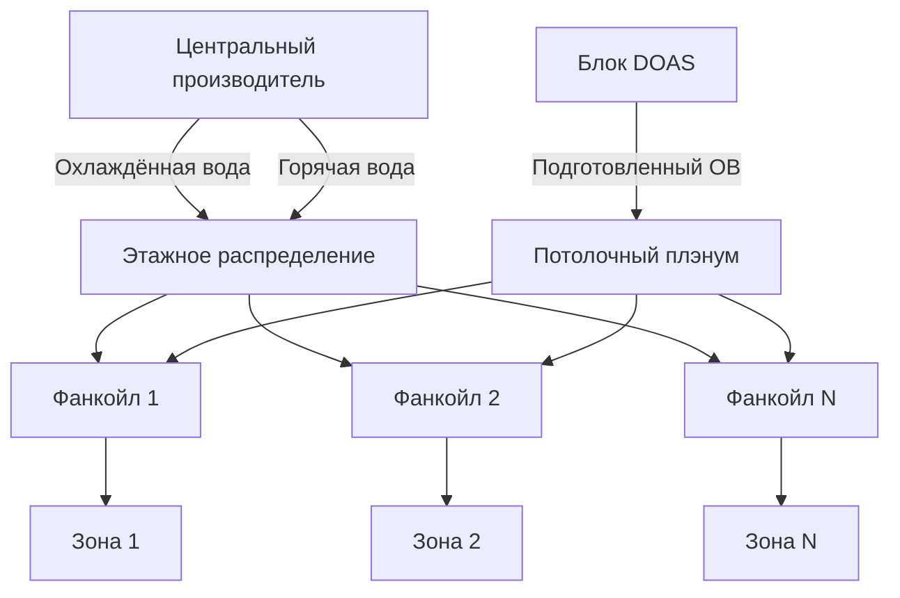
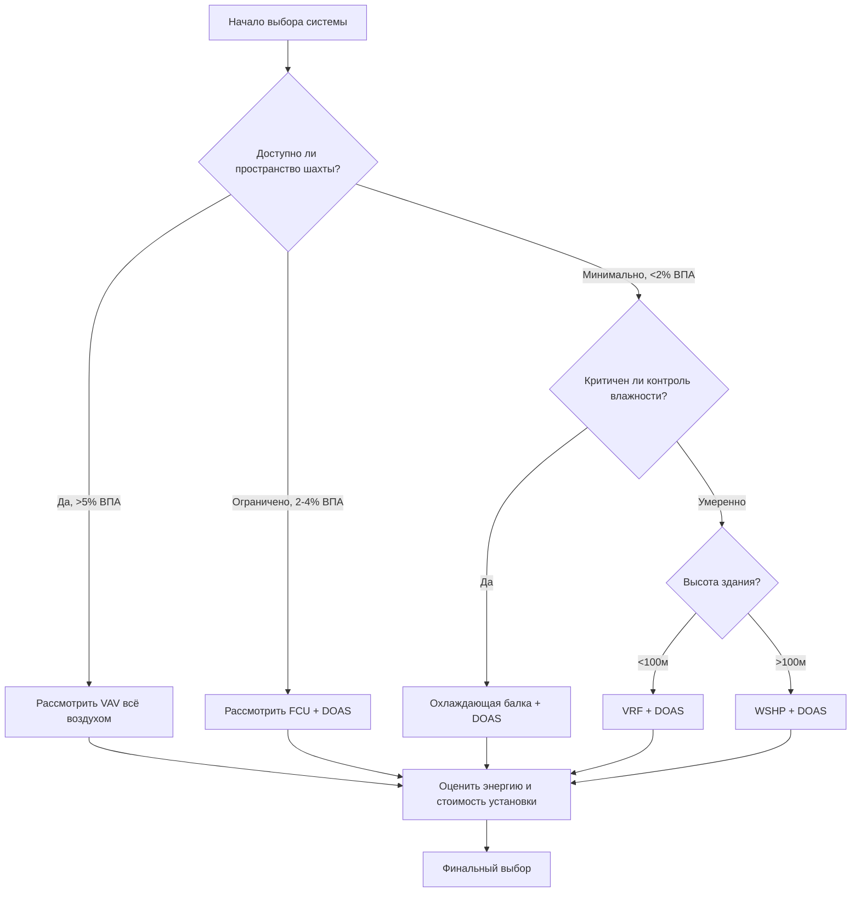

# Типы систем HVAC в высотных зданиях и их выбор

Высотные здания создают уникальные проблемы для HVAC, обусловленные вертикальной стратификацией, давлением воздушного столба и необходимостью эффективного распределения энергии по большим высотам. Выбор системы зависит от баланса между эффективностью транспортировки энергии, пространственными ограничениями и требованиями к зональному управлению.

## Основы транспортировки энергии

Энергия, необходимая для кондиционирования, определяется уравнением:

$$Q_{total} = Q_{sensible} + Q_{latent} = \dot{m}c_p\Delta T + \dot{m}h_{fg}\Delta W$$

где $\dot{m}$ — массовый расход, $c_p$ — удельная теплоёмкость, $\Delta T$ — разность температур, $h_{fg}$ — удельная теплота парообразования, $\Delta W$ — изменение абсолютной влажности.

Критическое решение в HVAC высотных зданий заключается в выборе способа транспортировки тепловой энергии:
- **Воздушные системы**: транспортировка энергии в виде явного тепла воздухом ($\rho_{air} \approx 1,2$ кг/м³)
- **Гидронные системы**: транспортировка энергии водой ($\rho_{water} \approx 1000$ кг/м³)

Соотношение объёмных теплоёмкостей составляет приблизительно 3500:1, что делает распределение воды намного более эффективным с точки зрения использования пространства для явных нагрузок.

## Сравнение типов систем

| Тип системы | Транспортировка энергии | Зональное управление | Требования к пространству | Стратегия наружного воздуха |
|-------------|------------------------|---------------------|--------------------------|---------------------------|
| Все воздухом VAV | Только воздух | Хорошо | Высокие (шахты 4-8% ВПА) | Интегрированная |
| Фанкойл + DOAS | Вода + воздух | Отличное | Средние (2-3% ВПА) | Отдельная система |
| Тепловой насос с водяным источником | Водяной контур | Отличное | Низкие (1-2% ВПА) | Отдельная вентиляция |
| VRF + DOAS | Хладагент + воздух | Отличное | Низкие (1-2% ВПА) | Отдельная система |
| Охлаждающая балка + DOAS | Вода + воздух | Хорошо | Низкие (минимальные шахты) | Отдельная система |

## Системы «все воздухом»

Системы «все воздухом» транспортируют как явные, так и скрытые нагрузки по воздуховодам. Для типичного этажа высотного здания, требующего охлаждения мощностью 300 кВт при $\Delta T = 11°C$:

$$\dot{V} = \frac{Q}{\rho c_p \Delta T} = \frac{300,000}{1,2 \times 1005 \times 11} \approx 22,700 \text{ м}^3/\text{ч}$$

Такой значительный расход воздуха требует больших вертикальных шахт, которые обычно занимают 4-8% валовой площади этажа согласно рекомендациям ASHRAE. Давление воздушного столба усложняет распределение:

$$\Delta P_{stack} = 3460 \times h \times \left(\frac{1}{T_o} - \frac{1}{T_i}\right)$$

где $h$ — высота в метрах, $T_o$ — абсолютная температура наружного воздуха, $T_i$ — абсолютная температура воздуха в помещении. Здание высотой 200 м при разности температур 30°C испытывает приблизительно 260 Па давления воздушного столба.

**Преимущества:**
- Полный контроль влажности и наружного воздуха
- Превосходное качество воздуха в помещении
- Простая изоляция между зонами
- Хорошо изученная эксплуатация и техническое обслуживание

**Ограничения:**
- Чрезмерные требования к пространству шахт
- Высокое энергопотребление вентиляторов при вертикальном распределении
- Ограниченная способность повторного нагрева без энергетического ущерба
- Сложное управление периметральными зонами

## Фанкойлы с системой DOAS

Этот разделённый подход отделяет вентиляцию (через систему выделенного наружного воздуха) от кондиционирования пространства (через гидронные фанкойлы). DOAS обрабатывает скрытые нагрузки и вентиляцию, а фанкойлы решают задачи явных нагрузок:

$$Q_{sensible} = \dot{m}_{water} c_{p,water} (T_{supply} - T_{return})$$

Для той же нагрузки 300 кВт при разности температур воды 5°C:

$$\dot{m}_{water} = \frac{300,000}{4186 \times 5} \approx 14,3 \text{ л/с}$$

Это требует только трубопровода диаметром 50 мм в сравнении с воздуховодом диаметром 900 мм для эквивалентных воздушных систем.

**Преимущества:**
- Минимальные требования к шахтам (2-3% ВПА)
- Индивидуальное управление и учёт для каждой зоны
- Возможность одновременного нагрева и охлаждения
- Более низкая энергия распределения

**Ограничения:**
- Требуется отвод конденсата в каждом устройстве
- Шум вентилятора в занятых помещениях
- Техническое обслуживание фильтра в распределённых местоположениях
- Возможность недостаточного наружного воздуха

## Тепловые насосы с водяным источником

Системы WSHP используют общий водяной контур (обычно 15-32°C) одновременно в качестве источника и приёмника тепла. Каждое устройство функционирует как обратимый тепловой насос:

$$COP_{cooling} = \frac{Q_{evap}}{W_{comp}} = \frac{T_{evap}}{T_{cond} - T_{evap}}$$

Контур здания действует как тепловое хранилище, позволяя одновременно нагревать и охлаждать с высокой эффективностью, когда внутренние зоны отклоняют тепло, которое требуется периметральным зонам.

**Преимущества:**
- Рекуперация тепла между зонами
- Отсутствие ограничений на трубопроводы хладагента
- Простое распределение по контуру
- Отличная эффективность при частичной нагрузке

**Ограничения:**
- Шум устройства в занятых помещениях
- Сложное управление отводом и подводом тепла
- Техническое обслуживание распределено по всем зонам
- Требуется отдельная система вентиляции

## Системы с переменным расходом хладагента (VRF)

Системы VRF распределяют хладагент к нескольким внутренним блокам от централизованных наружных блоков. Контур хладагента работает по циклу паровой компрессии:

$$Q_{cooling} = \dot{m}_{ref}(h_1 - h_4)$$

где $\dot{m}_{ref}$ — массовый расход хладагента, а $(h_1 - h_4)$ — разность энтальпий на испарителе.

**Преимущества:**
- Минимальные требования к пространству
- Возможность рекуперации тепла
- Индивидуальное управление для каждой зоны
- Нет водяных систем или конденсата

**Ограничения:**
- Ограничения на высоту трубопровода хладагента (90-150 м в зависимости от системы)
- Ограничения норм на количество хладагента
- Сложная диагностика неисправностей
- Ограниченная интеграция наружного воздуха

## Системы охлаждающих балок

Охлаждающие балки используют конвекцию и излучение для явного охлаждения, а DOAS обрабатывает скрытые нагрузки. Производительность балки описывается уравнением:

$$q_{beam} = UA(T_{room} - T_{water})$$

Критически важно для работы поддерживать температуру поверхности балки выше точки росы, чтобы избежать конденсации. Для помещения при 21°C при относительной влажности 50% (точка росы 10,5°C) минимальная температура воды в балке обычно составляет 14-15°C.

**Преимущества:**
- Бесшумная работа
- Минимальное механическое пространство
- Низкая энергия эксплуатации
- Отличный комфорт (радиационный компонент)

**Ограничения:**
- Требует тщательного контроля влажности
- Отсутствие скрытой производительности
- Сложная наладка
- Ограниченное применение в влажном климате

## Платформа критериев выбора

**Основные факторы выбора:**

1. **Доступное пространство шахты**: определяет воздушный или гидронный транспорт
2. **Высота здания**: влияет на потери давления, воздушный столб и ограничения хладагента
3. **Требования к влажности**: определяет необходимость централизованного осушения
4. **Плотность зонирования**: высокое количество зон благоприятствует гидронным системам
5. **Операционная сложность**: способность владельца и философия обслуживания

**Стандарт ASHRAE 90.1** устанавливает минимальные требования к эффективности, но не предписывает типы систем. Выбор зависит от специфических для здания ограничений и анализа стоимости жизненного цикла, включая стоимость установки, энергопотребление и затраты на техническое обслуживание в течение ожидаемого срока службы системы (обычно 20-25 лет согласно данным ASHRAE о сроке службы оборудования).

Оптимальная система сбалансирует термодинамическую эффективность, пространственную эффективность и операционную простоту в пределах ограничений, обусловленных геометрией здания, климатом и требованиями к занятости.
