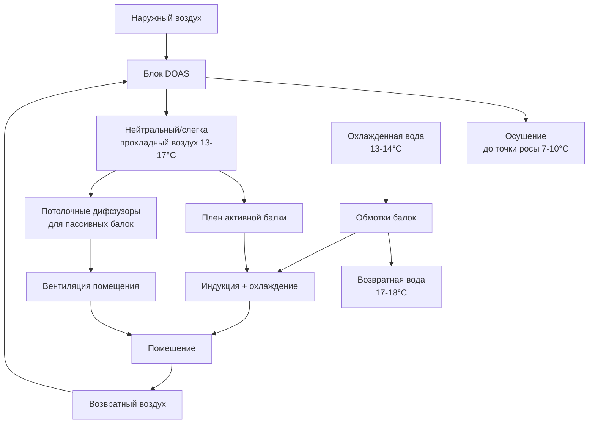

Системы охлаждающих балок обеспечивают чувствительное охлаждение через потолочные теплообменники, предлагая значительные преимущества для высоких зданий, где ограничения высоты между этажами влияют на стоимость строительства, а контроль конденсации требует тщательного проектирования. Разделение чувствительного охлаждения и вентиляционного воздуха снижает размер воздуховодов, уменьшает энергию вентилятора и позволяет меньшие площади технических шахт.

## Фундаментальные принципы теплопередачи

Охлаждающие балки работают на основе конвективной и лучистой теплопередачи от воздуха в помещении к холодной воде, циркулирующей через спирально-трубчатые обмотки. Скорость теплопередачи следует формуле:

$$Q = U \cdot A \cdot \Delta T_{lm}$$

где $U$ — коэффициент теплопередачи (обычно 40-80 Вт/м²·K для пассивных балок, 80-150 Вт/м²·K для активных балок), $A$ — площадь поверхности теплообменника, $\Delta T_{lm}$ — логарифмическая разность температур между воздухом в помещении и охлажденной водой.

Мощность охлаждения балки увеличивается нелинейно с температурной разностью:

$$q \propto (\Delta T)^{1.3}$$

Это соотношение делает системы балок чувствительными к температуре подачи охлажденной воды и выбору уставки в помещении.

## Активные и пассивные охлаждающие балки

**Пассивные охлаждающие балки** основаны на естественной конвекции. Теплый воздух в помещении поднимается к потолку, контактирует с холодной поверхностью балки, охлаждается (увеличивая плотность) и спускается обратно в пространство. Мощность охлаждения составляет 30-100 Вт/м² площади пола в зависимости от высоты потолка, покрытия балками и температурной разности.

**Активные охлаждающие балки** включают первичный воздушный плен, который индуцирует воздух в помещении через теплообменник балки с помощью сопел. Индуцированный воздух смешивается с первичным воздухом в соотношениях обычно 2:1 до 4:1 (индуцированный:первичный). Это смешивание создает более высокие коэффициенты теплопередачи и мощность охлаждения 100-300 Вт/м².

Коэффициент индукции зависит от скорости первичного воздуха и конструкции сопла:

$$IR = \frac{\dot{m}_{induced}}{\dot{m}_{primary}} = f(v_{nozzle}, geometry)$$

| Характеристика | Пассивные балки | Активные балки |
|---|---|---|
| Мощность охлаждения | 30-100 Вт/м² | 100-300 Вт/м² |
| Требование воздуха | Нет | 10-30 л/с на балку |
| Уровень шума | NC 15-20 | NC 25-35 |
| Зональное управление | Ограничено | Отличное |
| Первоначальная стоимость | Ниже | Выше |
| Операционная стоимость | Ниже | Средняя |
| Применение | Периметровые зоны | Внутренние и периметровые |

## Стратегия интеграции DOAS

Охлаждающие балки обрабатывают только чувствительное охлаждение. Система выделенного наружного воздуха (DOAS) обеспечивает вентиляцию, контролируя влажность в помещении для предотвращения конденсации на поверхностях балок. Это разделение функций оптимизирует каждую систему:

DOAS должна поддерживать точку росы в помещении ниже температуры поверхности балки с адекватным запасом безопасности:

$$T_{dew,space} \leq T_{beam,surface} - \Delta T_{safety}$$

где $\Delta T_{safety}$ обычно составляет 1.1-1.7°C для учета локальных колебаний и переходных условий.

## Предотвращение конденсации

Контроль конденсации представляет критическую проблему проектирования для систем охлаждающих балок в высоких зданиях, где внешняя влажность может значительно варьироваться по высоте. Стратегии предотвращения включают:

**Контроль температуры охлажденной воды**: поддерживайте температуру подачи воды выше точки росы в помещении. Типичный диапазон составляет 13-14°C, требующий тщательной координации с конструкцией центрального растения.

**Мониторинг точки росы**: установите датчики точки росы в пространстве, которые повышают температуру охлажденной воды или закрывают клапаны, когда точка росы приближается к температуре балки. Последовательность управления:

$$\text{если } (T_{dew,measured} > T_{CW,supply} - 1.7°C) \text{ то } T_{CW,supply} = T_{dew,measured} + 2.2°C$$

**Осушение DOAS**: размер охлаждающих спиралей DOAS для достижения точки росы подаваемого воздуха 7-10°C в условиях проектирования. Требуемое соотношение чувствительного тепла:

$$SHR_{DOAS} = \frac{Q_{sensible}}{Q_{sensible} + Q_{latent}} \approx 0.65-0.75$$

**Блокировки влажности**: перекрывайте поток охлажденной воды к балкам, когда относительная влажность в помещении превышает 60% или точка росы приближается к температуре подачи воды.

**Дренажные устройства**: хотя система разработана для предотвращения конденсации, установите дренажные поддоны или наклонные потолочные плиты ниже балок в качестве защиты резервного копирования для занятых этажей ниже.

## Преимущества снижения высоты этажа

Системы охлаждающих балок позволяют значительно снизить высоту между этажами по сравнению с обычными системами полностью воздушного охлаждения:

**Исключение воздуховодов**: балки обрабатывают 60-80% нагрузки охлаждения водой (удельная теплоемкость 4.18 кДж/кг·K) вместо воздуха (1.00 кДж/кг·K). Сравнение объемных потоков для 35 кВт охлаждения:

- Воздух при разности температур 11°C: $\dot{V}_{air} = \frac{35 \times 3600}{1.2 \times 11} = 9,545$ м³/ч
- Вода при разности температур 5.6°C: $\dot{V}_{water} = \frac{35 \times 3600}{4186 \times 5.6} = 1.36$ л/с

Воздушная система требует примерно 155 см² на 1000 м³/ч включая зазор изоляции, а водяная система нуждается в трубах диаметром 25-50 мм.

**Глубина плена**: системы VAV для всего воздуха требуют плены глубиной 61-91 см для воздуховодов, лопаток поворота и доступа к VAV боксам. Системы охлаждающих балок снижают это до 30-46 см, так как только небольшие вентиляционные воздуховоды проникают в пространство.

**Влияние экономии высоты**: для 50-этажного здания снижение высоты между этажами с 3.96 м до 3.66 м экономит 15 м высоты здания. При стоимости строительства 4300-6500 за м² в городских рынках высоких зданий, это снижение экономит примерно:

$$\text{Экономия затрат} = 15 \text{ м} \times \text{площадь пола} \times \text{премия за периметр}$$

Для площади пола 1858 м², это составляет 2.3-3.5 млн доллара в сбережениях по конструкции, облицовке и ядру.

## Соображения проектирования системы

**Интеграция в потолок**: балки интегрируются в подвесные потолочные системы как:
- Открытые линейные агрегаты в открытых потолках
- Встроенные агрегаты в стандартные потолочные сетки
- Специальная архитектурная интеграция со светильниками и диффузорами

**Стратегия зонирования**: активные балки обеспечивают индивидуальное управление зонами путем модуляции первичного воздуха. Пассивные балки требуют управления со стороны воды с помощью двухходовых клапанов, обеспечивая более медленный отклик, но адекватную производительность для периметровых зон.

**Координация со строительной конструкцией**: балки, заполненные водой, добавляют 73-122 кг/м² к нагрузкам на потолок. Координируйте точки подвеса с инженером конструкции, особенно для требований сейсмического крепления согласно ASCE 7.

**Акустическая производительность**: пассивные балки создают минимальный шум (NC 15-20). Активные балки генерируют шум от сопел первичного воздуха, требуя звукопоглощающей облицовки и правильного выбора сопла для поддержания NC 25-35 для офисных помещений согласно ASHRAE Fundamentals.

**Доступ для обслуживания**: обеспечьте доступные потолочные плиты в местах балок для проверки спиралей, хотя требования к обслуживанию минимальны по сравнению с оборудованием со стороны воздуха. Ежегодная проверка спиралей, фильтров и управляющих клапанов обычно достаточна.

## Энергетическая производительность

Системы охлаждающих балок снижают потребление энергии несколькими механизмами:

- Более низкая энергия вентилятора: 0.067-0.134 Вт/л/с для DOAS в сравнении с 0.201-0.402 Вт/л/с для VAV
- Более высокие температуры охлажденной воды: 13-14°C позволяют более эффективное управление холодильной машиной
- Снижение перенагрева: охлаждение только чувствительного тепла исключает циклы перепрограммирования-перенагрева
- Активизация тепловой массы: открытая балка к конструкции обеспечивает тепловое хранилище

Исследования ASHRAE указывают на 20-40% снижение энергии HVAC по сравнению с обычными системами VAV в применимых климатах.

## Ссылки

ASHRAE Handbook—HVAC Systems and Equipment, Chapter 6: Radiant Heating and Cooling
ASHRAE Standard 62.1: Ventilation for Acceptable Indoor Air Quality
ASHRAE Guideline 36: High-Performance Sequences of Operation for HVAC Systems
