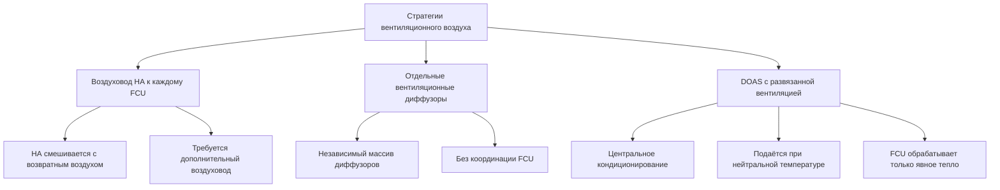

## Обзор системы

Вентиляторные доводчики (FCU) — это децентрализованные терминальные устройства HVAC, широко используемые в высотных жилых, гостиничных и офисных помещениях. Каждый доводчик содержит вентилятор, нагревательный/охлаждающий serpentiн, фильтр и систему управления в компактном корпусе, расположенном в кондиционируемом помещении. Водяной теплообмен обеспечивает энергоэффективное вертикальное распределение по сравнению с полностью воздушными системами, в то время как распределённые вентиляторы минимизируют требования к воздуховодам — критическое преимущество в зданиях, где вертикальное пространство шахт ограничено.

Фундаментальная работа включает циркуляцию воздуха помещения через оребрённо-трубчатый serpentiн, подаваемый охлаждённой или горячей водой. Скорость теплопередачи следует формуле:

$$Q = \dot{m}_w c_{p,w} (T_{w,in} - T_{w,out}) = UA \cdot LMTD$$

где $\dot{m}_w$ — массовый расход воды (кг/с), $c_{p,w}$ — удельная теплоёмкость воды (4,186 кДж/кг·К), $U$ — общий коэффициент теплопередачи (Вт/м²·К), $A$ — поверхность serpentина (м²), и $LMTD$ — логарифмическая средняя разность температур (К).

## Двухтрубные и четырёхтрубные конфигурации

Конфигурация трубопровода фундаментально определяет гибкость и производительность системы:

| Параметр | Двухтрубная система | Четырёхтрубная система |
|-----------|-------------------|----------------------|
| Подающие линии | 1 подача, 1 возврат | 2 подачи (горячая + охлаждённая), 2 возврата |
| Одновременный обогрев/охлаждение | Нет | Да |
| Сезонное переключение | Требуется | Не требуется |
| Начальная стоимость | Ниже (на 40-50% менее трубопровода) | Выше |
| Эксплуатационная стоимость | Выше (потери при переключении) | Ниже (оптимизированная работа) |
| Гибкость арендаторов | Ограниченная | Максимальная |
| Типовое применение | Жилые, бюджетные гостиницы | Офисы класса A, роскошные жилые |

### Работа двухтрубной системы

Двухтрубные системы подают либо охлаждённую воду, либо горячую воду через один контур трубопровода. Переключение на уровне здания обычно происходит при температурах наружного воздуха около 13-16°C на основе доминирующих условий нагрузки. В переходные сезоны периметральные зоны, требующие обогрева, в то время как внутренние зоны нуждаются в охлаждении, не могут быть удовлетворены одновременно.

Критерий решения о переключении:

$$T_{changeover} = \frac{\sum_{i=1}^{n} (Q_{cooling,i} - Q_{heating,i})}{UA_{total}}$$

где положительная чистая нагрузка указывает на работу в режиме охлаждения. Это ограничение создаёт жалобы на тепловой комфорт в переходные периоды, особенно в зданиях с различными солнечными экспозициями.

### Работа четырёхтрубной системы

Четырёхтрубные системы поддерживают независимые контуры горячей и охлаждённой воды в течение всего года, обеспечивая одновременный обогрев и охлаждение в разных зонах. Каждый FCU содержит отдельные serpentины нагрева и охлаждения, обычно с отдельными регулирующими вентилями. Эта конфигурация охватывает:

- Обогрев периметральной зоны с охлаждением внутренней зоны
- Различные предпочтения температуры арендаторов
- Разнообразные модели внутренней нагрузки
- Вариации солнечной нагрузки по ориентации

Энергетический штраф — увеличенная мощность насоса для четырёх контуров трубопровода вместо двух, что компенсируется устранением отходов тепла при переключении и улучшенным комфортом, снижающим манипуляцию уставкой термостата.

## Координация вентиляционного воздуха

Стандарт ASHRAE 62.1 требует минимальной вентиляции наружным воздухом независимо от тепловой нагрузки. Системы с вентиляторными доводчиками обрабатывают только рециркулируемый воздух помещения, требуя отдельной подачи вентиляционного воздуха. Существуют три основные стратегии:

### Системы отдельной подачи наружного воздуха (DOAS)

Современные высотные конструкции всё чаще используют DOAS для развязки вентиляции от тепловых нагрузок. DOAS кондиционирует наружный воздух до нейтральной температуры помещения (обычно 21-24°C, 50% ОВ), устраняя скрытую нагрузку из serpentinов FCU и предотвращая проблемы конденсации.

Температура подачи DOAS рассчитывается как:

$$T_{DOAS} = T_{space} + \frac{Q_{sensible,FCU}}{\dot{m}_{OA} c_p}$$

Этот подход позволяет:
- Централизованное восстановление энергии (ERV/HRV)
- Превосходное управление влажностью
- Сниженный дренаж конденсата FCU
- Меньшие serpentины FCU (только явное тепло)

## Вызовы распределения воды

Вертикальное распределение воды в высотных зданиях создаёт значительные проблемы со статическим давлением. На высоте здания $h$ (м) статическое давление составляет:

$$P_{static} = \rho g h = 9.81h \text{ кПа}$$

Для 200 м высокого здания это генерирует 1 962 кПа в основании — превышая пределы давления стандартных компонентов FCU (обычно рассчитаны на 1 035 кПа).

### Стратегии управления давлением

**Вертикальное зонирование**: Разделить здание на 15-20 этажных зон с отдельными системами насосов и теплообменниками:

| Зона | Этажи | Статическое давление | Номинальное давление оборудования |
|------|-------|-------------------|--------------------------------|
| Верхняя | 40-50 | 300 кПа | Стандартное |
| Верхняя-средняя | 30-39 | 600 кПа | Стандартное |
| Нижняя-средняя | 20-29 | 900 кПа | Высокое давление |
| Нижняя | 1-19 | 1 200 кПа | Высокое давление |

**Редукционные вентили (PRV)**: Установите редукционные вентили на боковые соединения для ограничения давления входа FCU. Определение размера редукционного вентиля требует балансировки перепада давления против ёмкости потока:

$$\Delta P_{PRV} = K \frac{\rho v^2}{2}$$

где $K$ — коэффициент потерь вентиля и $v$ — скорость потока (м/с).

**Реверсивный возвратный трубопровод**: Обеспечивает равные длины труб ко всем FCU, способствуя сбалансированному потоку без обширной регулировки балансировочного вентиля. Критично в зданиях, где доступ для пуско-наладки ограничен.

## Гибкость управления арендаторами

FCU обеспечивают превосходное управление отдельной зоной по сравнению с центральными воздушными системами — первичный фактор выбора для многотенантных зданий. Каждый блок работает независимо с локальным управлением термостатом:

- Скорость вентилятора (обычно 3-скоростная или переменная)
- Положение клапана нагрева/охлаждения
- Режим работы (тепло/охлаждение/авто/только вентилятор)

Контрольный контур для модуляции пропорционального вентиля:

$$\dot{m}_w = \dot{m}_{max} \cdot f(T_{space} - T_{setpoint})$$

где $f$ представляет функцию управления пропорционально-интегральной (PI). Современные FCU используют электронные дроссельные вентили с управлением 0-10В для точной модуляции.

### Преимущества для гибкости арендаторов

- **Работа вне часов**: Арендаторы активируют отдельные FCU без запуска центральных систем
- **Модификации внутренней отделки**: Местоположения FCU легко переместить во время улучшений для арендаторов
- **Отдельный учёт**: Счётчики расхода воды позволяют выставлять счета за энергию на уровне арендаторов
- **Разнообразные графики**: Каждая зона работает независимо — критично для зданий смешанного использования

### Рассмотрения доступа для обслуживания

Обслуживание высотного FCU требует планирования логистики вертикального доступа. Типовое обслуживание включает:

- Замена фильтра (ежеквартально)
- Очистка serpentina (ежегодно)
- Обработка поддона конденсата (ежеквартально)
- Смазка подшипников вентилятора (ежегодно)

Укажите доступные потолочные установки с достаточным зазором (минимум 61 см над блоком) и панели доступа для обслуживания ниже потолка. Координируйте с архитектурными системами потолков на ранней стадии проектирования, чтобы избежать недоступных установок, обнаруженных при пуско-наладке.

## Оптимизация производительности

Максимизируйте производительность системы вентиляторных доводчиков через:

1. **Вентиляторы переменной скорости**: Двигатели ECM снижают энергию на 40-60% в сравнении с двигателями PSC
2. **Экономайзер водяной стороны**: Свободное охлаждение, когда позволяют условия наружного воздуха
3. **Переброс температуры подачи воды**: Повысьте температуру охлаждённой воды на основе нагрузок в помещении
4. **Дренаж конденсата**: Проверьте положительный уклон (минимум 0,6 см на 30 см) к точкам дренажа

Оптимальная связь переброса температуры подачи охлаждённой воды:

$$T_{CHW,supply} = T_{CHW,design} + K(T_{OA,design} - T_{OA,actual})$$

где типовой коэффициент переброса $K = 0,4-0,6$ обеспечивает сокращение энергии чиллера на 20-30% при частичной нагрузке согласно ASHRAE Research Project RP-1515.

## Ссылки

- ASHRAE Handbook—HVAC Systems and Equipment, Chapter 5: "In-Room Terminal Systems"
- ASHRAE Standard 62.1: Ventilation for Acceptable Indoor Air Quality
- ASHRAE Research Project RP-1515: Control Optimization for Chilled Water Plants
