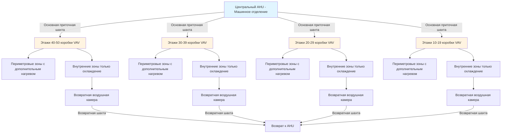
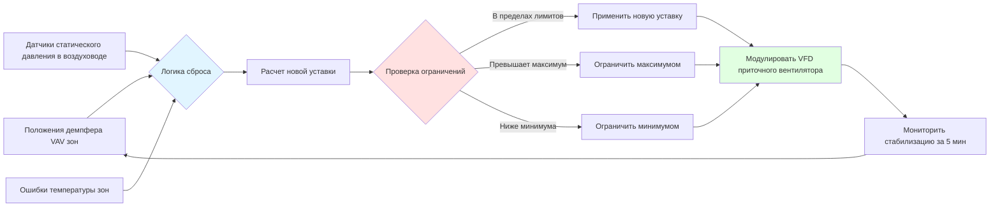

## Системы переменного воздухораспределения в высотных зданиях

Системы переменного воздухораспределения (VAV) представляют доминирующий подход для кондиционирования высотных зданий, обеспечивая одновременное отопление и охлаждение на нескольких этажах при сохранении энергоэффективности посредством модуляции расхода воздуха. Фундаментальная физика работы VAV основана на поддержании постоянной температуры приточного воздуха при изменении объема для соответствия тепловым нагрузкам, описываемая энергетическим балансом:

$$Q = \dot{m} \cdot c_p \cdot \Delta T = \rho \cdot \dot{V} \cdot c_p \cdot (T_{supply} - T_{zone})$$

где $Q$ — холодопроизводительность (Вт), $\dot{m}$ — массовый расход (кг/с), $\dot{V}$ — объемный расход (м³/с), $c_p$ — удельная теплоемкость (1006 Дж/кг·K для воздуха), и $\Delta T$ — разность температур (K).

## Конфигурации VAV систем для высотных зданий

Высотные здания используют специализированные конфигурации VAV для решения проблем вертикального распределения, давлений от тепловой конвекции и разнообразных требований зон на нескольких этажах.

### Центральное и распределенное воздухораспределение

| Конфигурация | Применение | Преимущества | Ограничения |
|--------------|-----------|-----------|-------------|
| **Единственный центральный AHU** | Здания <30 этажей | Максимальная эффективность площади этажа, централизованное обслуживание | Высокое статическое давление (>2,0 кПа), большие требования к шахтам |
| **Зоны средней высоты и высотные** | Здания 30-60 этажей | Пониженное статическое давление на зону, управляемые размеры шахт | Требуются несколько машинных отделений, сложность |
| **AHU по этажам** | Сверхвысокие здания >60 этажей | Минимальное статическое давление, меньшие шахты, изоляция зон | Сокращение площади этажа, распределенное обслуживание |
| **Гибридная конфигурация** | Многофункциональные башни | Оптимизировано для разнообразных нагрузок, гибкая работа | Выше начальная стоимость, сложное управление |

## Расчет размеров воздуховодных шахт для вертикального распределения

Расчет размеров воздуховодных шахт в высотных зданиях балансирует скорость потока, потери давления, уровень шума и экономику строительства. Потеря давления через вертикальные каналы следует уравнению Дарси-Вейсбаха:

$$\Delta P_{shaft} = f \cdot \frac{L}{D_h} \cdot \frac{\rho \cdot V^2}{2}$$

где $f$ — коэффициент трения (безразмерный), $L$ — высота шахты (м), $D_h$ — гидравлический диаметр (м), $\rho$ — плотность воздуха (кг/м³), и $V$ — скорость потока (м/с).

### Критерии проектирования приточной шахты

**Максимальные скорости** согласно ASHRAE Fundamentals:
- Основные приточные каналы: 10-12,7 м/с
- Боковые ответвления: 7,6-9,1 м/с
- Подключения к терминалам: 6,1-7,6 м/с

**Методология расчета размеров шахты:**

Для 40-этажного здания с общим приточным расходом 28,3 м³/с при расчетных условиях:

$$A_{shaft} = \frac{\dot{V}}{V_{max}} = \frac{28,3 \text{ м³/с}}{12,7 \text{ м/с}} = 2,23 \text{ м}^2$$

Для прямоугольной шахты: 1,52 м × 1,68 м обеспечивает площадь 2,55 м² с соотношением сторон <1,5:1.

**Компенсация давления от тепловой конвекции:**

Тепловая конвекция создает дополнительный перепад давления:

$$\Delta P_{stack} = g \cdot h \cdot (\rho_{outside} - \rho_{inside}) = g \cdot h \cdot \rho_0 \cdot \left(\frac{1}{T_{outside}} - \frac{1}{T_{inside}}\right)$$

Для здания высотой 152 м с $T_{outside} = -18°C$ и $T_{inside} = 21°C$:

$$\Delta P_{stack} = 9,81 \cdot 152 \cdot 1,2 \cdot \left(\frac{1}{255} - \frac{1}{294}\right) = 0,075 \text{ кПа}$$

Это давление должно быть учтено посредством управления демпфером и возможности давления вентилятора AHU.

## Стратегии сброса статического давления

Сброс статического давления снижает потребление энергии вентилятором посредством модуляции уставки статического давления в воздуховоде на основе фактического спроса зон. Зависимость мощности вентилятора демонстрирует кубическую экономию энергии:

$$P_{fan} = \frac{\dot{V} \cdot \Delta P}{\eta_{fan}} \propto \Delta P^{3/2}$$

### Методы управления сбросом

**Сброс на основе положения демпфера (наиболее распространенный):**

Мониторить положения всех демпферов VAV; если критическая зона открыта <90%, снизить статическое давление:

$$SP_{new} = SP_{current} - k \cdot (90\% - D_{max})$$

где $k$ — константа настройки (обычно 0,012-0,024 кПа на процент), $D_{max}$ — максимальное положение демпфера.

**Минимальные ограничения статического давления для высотных зданий:**
- Нижние 10 этажей: минимум 0,37-0,50 кПа
- Средние этажи: минимум 0,50-0,62 кПа
- Верхние 10 этажей: минимум 0,25-0,37 кПа (помощь от тепловой конвекции)

### Расчет экономии энергии

Снижение статического давления с 0,99 до 0,75 кПа при 50% расходе воздуха:

$$\frac{P_{reset}}{P_{original}} = \frac{0,75}{0,99} \cdot \left(\frac{0,5}{1,0}\right)^3 = 0,758 \cdot 0,125 = 0,095$$

Это представляет экономию энергии на 90,5% в сравнении с постоянным объемом при полном давлении.

## Подходы к воздухораспределению по этажам

Системы с воздухораспределением по этажам используют выделенные воздухообработчики на каждом этаже или на каждые несколько этажей, исключая длинные вертикальные воздуховоды и снижая требования к статическому давлению.

### Преимущества системы

1. **Пониженное статическое давление**: Типично 0,62-0,87 кПа в сравнении с 1,49-1,99 кПа для центральных систем
2. **Меньшие вертикальные шахты**: Только холодная вода, конденсаторная вода и электричество
3. **Изоляция зон**: Отказ оборудования влияет на ограниченное число этажей
4. **Гибкая реновация**: Модификации отдельного этажа без влияния на систему в целом

### Соображения при проектировании

| Параметр | По этажам | Центральная система |
|-----------|-----------|----------------|
| **Статическое давление вентилятора** | 0,62-0,87 кПа | 1,49-2,49 кПа |
| **Площадь шахты** | 1,4-2,3 м² (только трубопроводы) | 3,7-5,6 м² (воздуховоды + трубопроводы) |
| **Механическое пространство на этаж** | 37-74 м² | 0 м² (кроме машинных этажей) |
| **Доступ к обслуживанию** | Каждый этаж | Централизованный |
| **Звукоизоляция** | Больший требуется | Преимущество центрального расположения |
| **Начальная стоимость** | Выше (несколько AHU) | Ниже (эффект масштаба) |
| **Рабочая стоимость** | Ниже (пониженное давление) | Выше (энергия вентилятора) |

## Стратегии зонального управления

Высотные VAV системы обычно используют двухзонную стратегию: периметровые зоны с дополнительным нагревом для нагрузок ограждающей конструкции и внутренние зоны с режимом только охлаждения.

### Управление периметровыми зонами

Периметровые зоны испытывают высокую вариабельность солнечных и кондуктивных нагрузок, требуя возможности дополнительного нагрева:

$$Q_{total} = Q_{cooling} + Q_{reheat} = \dot{V}_{min} \cdot \rho \cdot c_p \cdot (T_{supply} - T_{zone}) + Q_{RH}$$

Минимальный расход воздуха обычно устанавливается на 30-50% от расчетного для поддержания вентиляции при разрешении дополнительного нагрева.

**Последовательность операций:**
1. Спрос на охлаждение: демпфер VAV модулирует от минимума к максимуму (приточный воздух 12,8°C)
2. Спрос на отопление: демпфер VAV в минимальном положении, катушка дополнительного нагрева модулирует
3. Мертвая зона: 1,1-1,7°C между охлаждением и отоплением для предотвращения одновременной работы

### Управление внутренними зонами

Внутренние зоны поддерживают относительно постоянные нагрузки от людей, освещения и оборудования:

- Коробки VAV только с охлаждением без дополнительного нагрева
- Минимальный расход воздуха 20-30% для вентиляции
- Температура приточного воздуха 12,8-14,4°C
- Стратегия прямого возврата в воздушную камеру

**Соответствие требованиям вентиляции** согласно ASHRAE 62.1:

$$V_{oz} = R_p \cdot P_z + R_a \cdot A_z$$

где $V_{oz}$ — наружный воздух зоны (м³/ч), $R_p$ — требование на человека (обычно 8,5 м³/ч на человека), $P_z$ — население зоны, $R_a$ — требование на площадь (0,096 м³/ч на м²), $A_z$ — площадь зоны.

### Интеграция передового управления

Современные высотные VAV системы интегрируют несколько стратегий управления:

- **Управление вентиляцией по спросу**: Датчики CO₂ модулируют минимальный расход воздуха
- **Планирование на основе занятости**: Пониженный расход воздуха в период отсутствия людей
- **Оптимальный старт/стоп**: Минимизировать время работы при достижении уставок температуры
- **Сброс температуры приточного воздуха**: Повышение SAT при низких нагрузках охлаждения для снижения дополнительного нагрева

## Оптимизация производительности

Оптимизация высотной VAV системы сосредоточена на минимизации одновременного отопления и охлаждения при сохранении комфорта и вентиляции на всех этажах.

**Ключевые показатели производительности:**
- Энергия дополнительного нагрева терминала <10% от общей энергии охлаждения
- Среднее положение демпфера VAV 40-60% при расчетных условиях
- Сброс статического давления достигает >30% экономии энергии вентилятора
- Температура зоны поддерживается в пределах ±0,56°C от уставки >95% рабочих часов

Согласно ASHRAE 90.1 сброс температуры приточного воздуха должен быть реализован когда системы обслуживают >465 м² или несколько этажей, повышая SAT на до 2,8°C когда позволяют нагрузки охлаждения, дополнительно снижая штрафы дополнительного нагрева в периметровых зонах.

---

**Файл:** `/Users/evgenygantman/Documents/github/gantmane/hvac/content/specialty-applications-testing/specialty-hvac-applications/tall-buildings-high-rise-hvac/high-rise-system-types/vav-systems/_index.md`
