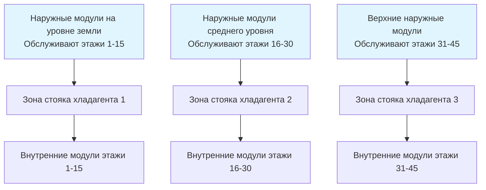
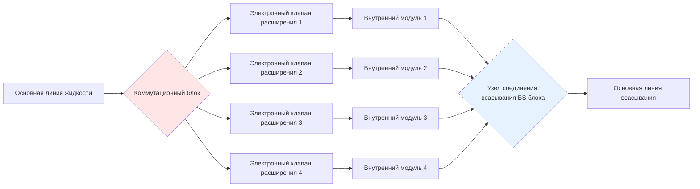
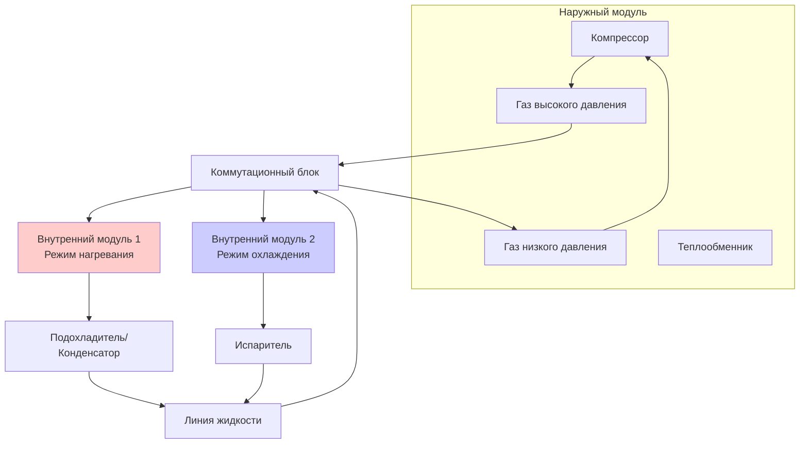

## Системы переменного расхода хладагента в многоэтажных зданиях

Системы переменного расхода хладагента (VRF) обеспечивают гибкость зонирования и энергетическую эффективность в многоэтажных зданиях благодаря прямому расширению распределения хладагента. Основной вызов в приложениях VRF для высоких зданий заключается в управлении циркуляцией хладагента и возвратом масла на значительные вертикальные расстояния, где силы тяжести, перепады давления и динамика жидкостей создают эксплуатационные ограничения, не встречающиеся в установках низкого роста.

## Ограничения высоты трубопровода хладагента

Ограничения по высоте в системах VRF вытекают из взаимодействия между перепадом давления хладагента, требованиями к переносу масла и возможностями давления нагнетания компрессора.

### Физические принципы ограничений высоты

Максимальная вертикальная высота между наружными и внутренними модулями определяется следующим образом:

$$\Delta P_{total} = \Delta P_{friction} + \Delta P_{elevation} + \Delta P_{acceleration}$$

Для вертикальных стояков хладагента:

$$\Delta P_{elevation} = \rho_{refrigerant} \cdot g \cdot h$$

где $\rho_{refrigerant}$ — плотность хладагента (кг/м³), $g$ — ускорение свободного падения (9,81 м/с²), и $h$ — вертикальная высота (м).

Разность давления создает статический напор, который должен быть преодолен компрессором. Для R-410A при типичных условиях эксплуатации ($\rho \approx 1100$ кг/м³ в жидком состоянии) каждый метр вертикального подъема создает примерно 10,8 кПа статического давления.

| Ограничения производителя | Максимальная высота (м) | Максимальная общая длина трубопровода (м) | Примечания |
|---------------------------|-------------------------|------------------------------------------|-----------|
| Стандартные системы VRF | 50-90 | 150-200 | Стандартные конфигурации |
| Модели для многоэтажных зданий | 90-165 | 200-300 | Требует сепараторов масла |
| Распределенные системы | Без единого ограничения | 1000+ | Несколько наружных модулей |
| Каскадный хладагент | 30-50 на этап | Варьируется | Расположение каскадом |

### Многоэтапное распределение хладагента

Для зданий, превышающих ограничения высоты одной системы, каскадные или поэтапные конфигурации VRF делят здание вертикально:

## Рассмотрения возврата масла

Управление циркуляцией масла представляет критическую проблему проектирования в системах VRF высоких зданий, так как смазка компрессора зависит от непрерывного возврата масла из удаленных испарителей.

### Механика переноса масла

Скорость хладагента должна поддерживать увлечение масла, чтобы предотвратить накопление в горизонтальных участках и вертикальных стояках. Минимальная скорость для надежного возврата масла зависит от ориентации трубопровода:

**Горизонтальные линии всасывания:** $v_{min} = 3,5$ до 5 м/с

**Вертикальные стояки всасывания:** $v_{min} = 5$ до 7,5 м/с

Сила сопротивления на капельках масла должна превышать гравитационное осаждение:

$$F_{drag} = \frac{1}{2} \cdot C_D \cdot \rho_{vapor} \cdot A_{droplet} \cdot v^2$$

где $C_D$ — коэффициент сопротивления, $A_{droplet}$ — площадь поперечного сечения капли, и $v$ — скорость хладагента.

### Интеграция сепаратора масла

Системы VRF высоких зданий используют сепараторы масла на наружных модулях для минимизации циркуляции масла:

| Стратегия управления маслом | Применение | Эффективность | Требование установки |
|----------------------------|-----------|---------------|----------------------|
| Встроенный сепаратор масла | Высота >50 м | 90-95% разделение | Заводская установка |
| Внешний коалесцирующий сепаратор | Высота >90 м | 95-98% разделение | Требуется полевая установка |
| Датчики уровня масла | Все высокие здания | Только мониторинг | Картер компрессора |
| Линии уравнивания давления масла | Несколько компрессоров | Н/А | Балансировка давления |

### Проектирование стояка всасывания для возврата масла

Вертикальные стояки всасывания требуют специальных конструктивных решений:

$$D_{riser} = \sqrt{\frac{4 \cdot \dot{m}}{\pi \cdot \rho_{vapor} \cdot v_{min}}}$$

где $\dot{m}$ — массовый расход хладагента (кг/с), и $v_{min}$ — минимальная скорость для увлечения масла.

Для систем модуляции мощности конфигурации с двойным стояком предотвращают захват масла при низких нагрузках:

- **Большой стояк:** Обеспечивает работу с 100% мощностью
- **Малый стояк:** Поддерживает скорость при 25-50% мощности

Перевернутые конфигурации ловушки с отверстиями возврата масла обеспечивают дренаж масла во время периодов остановки.

## Коммутационные блоки (BS блоки)

Коммутационные блоки распределяют хладагент на несколько внутренних модулей, управляя регулированием потока и разделением фаз хладагента.

### Функции BS блока

Коммутационные блоки обеспечивают:

1. **Распределение потока** — направляет жидкий хладагент на активные внутренние модули
2. **Уравнивание давления** — поддерживает согласованное давление подачи
3. **Разделение пара и жидкости** — предотвращает гидравлические удары в линиях всасывания
4. **Управление электромагнитным клапаном** — изолирует неактивные модули

### Стратегическое размещение в многоэтажных зданиях

Оптимальные местоположения BS блока минимизируют общую длину трубопровода при сохранении ограничений высоты:

**Размещение в вертикальной шахте:** Каждые 8-12 этажей для распределенной доставки хладагента

**Горизонтальное распределение:** Сокращает длины ветвей до <25 м на зону

**Доступ для обслуживания:** Механические шкафы или панели потолочного доступа

Перепад давления через BS блок добавляется к общему сопротивлению системы:

$$\Delta P_{BS} = K_{BS} \cdot \frac{\rho \cdot v^2}{2}$$

Типичные значения $K_{BS}$ варьируются от 1,5 до 3,0 в зависимости от конфигурации и скоростей потока.

## Одновременное нагревание и охлаждение

Системы теплоутилизирующей VRF обеспечивают энергоэффективное одновременное нагревание и охлаждение путем передачи тепловой энергии между зонами.

### Режимы работы теплоутилизации

| Режим работы | Описание | Передача энергии | Диапазон COP |
|-------------|---------|-----------------|-------------|
| Только охлаждение | Все модули охлаждают | Тепло отвергается на улицу | 3,0-4,5 |
| Только нагревание | Все модули нагревают | Тепло поглощается с улицы | 3,5-5,0 |
| Теплоутилизация | Смешанное нагревание/охлаждение | Внутренняя передача тепла | 4,5-7,0 |
| Доминирующее охлаждение | Большинство охлаждают | Избыточное тепло отвергается | 4,0-5,5 |
| Доминирующее нагревание | Большинство нагревают | Поглощение дополнительного тепла | 4,0-5,5 |

### Архитектура трехтрубной теплоутилизирующей VRF

Теплоутилизирующая VRF использует три трубопровода хладагента:

- **Линия высокого давления газа:** От компрессора к модулям нагревания
- **Линия низкого давления газа:** От модулей охлаждения к компрессору
- **Линия жидкости:** Двусторонний дистрибьютор жидкого хладагента

### Энергетический баланс при теплоутилизации

Эффективность теплоутилизации зависит от соотношения требуемых тепловых нагрузок нагревания и охлаждения:

$$Q_{recovery} = \min(Q_{heating,demand}, Q_{cooling,available})$$

Когда требуемая нагрузка нагревания превышает доступную энергию охлаждения:

$$Q_{supplemental} = Q_{heating,total} - Q_{recovery}$$

Коэффициент производительности при работе теплоутилизации:

$$COP_{system} = \frac{Q_{heating} + Q_{cooling}}{W_{compressor} + W_{fans}}$$

Системы теплоутилизации достигают значений COP 5,0-7,0 при уравновешенных нагрузках нагревания и охлаждения, в сравнении с 3,5-4,5 для работы только теплового насоса.

### Преимущества теплоутилизации VRF в многоэтажных зданиях

Многоэтажные здания представляют идеальные условия для теплоутилизирующей VRF:

- **Нагрузки сердечник/периметр:** Внутренние зоны требуют охлаждение круглый год, а периметровые зоны нуждаются в нагревании
- **Изменение солнечного воздействия:** Ориентированные на юг зоны нагреваются, в то время как ориентированные на север охлаждаются
- **Разнообразие занятости:** Центры обработки данных и кухни отвергают тепло для периметрового нагревания
- **Вертикальная температурная стратификация:** Верхние этажи требуют больше охлаждения, нижние этажи требуют больше нагревания

Разность температуры между зонами нагревания и охлаждения способствует термодинамической эффективности. С температурами сердечника 24°С, требующими охлаждения, и периметра 18°С, требующими нагревания:

$$\Delta T_{internal} = T_{cooling,zone} - T_{heating,zone} = 6\text{ K}$$

Этот внутренний температурный подъем значительно меньше наружных разностей температур, снижая работу сжатия:

$$W_{recovery} = \dot{m} \cdot c_p \cdot \Delta T_{internal} / \eta_{compressor}$$

## Проектирование стояков и управление зарядкой хладагента

Вертикальное распределение хладагента в многоэтажных зданиях требует специальных конфигураций трубопровода и стратегий управления зарядкой.

### Линии уравнивания давления

Установите линии уравнивания давления (PE) параллельно жидкостным стякам, чтобы предотвратить вес столба жидкости от создания избыточного переохлаждения:

$$\Delta T_{subcool} = \frac{\Delta P_{static}}{(\partial P / \partial T)_{sat}}$$

Линии PE позволяют сообщение давления пара, поддерживая надлежащую работу клапана расширения.

### Расчет зарядки хладагента

Общая зарядка хладагента значительно увеличивается с высотой здания:

$$M_{total} = M_{outdoor} + M_{indoor} + M_{liquid,line} + M_{vapor,line}$$

Зарядка жидкостной линии доминирует в многоэтажных зданиях:

$$M_{liquid,line} = \rho_{liquid} \cdot V_{pipe} = \rho_{liquid} \cdot \frac{\pi \cdot D^2}{4} \cdot L$$

Для 100-метрового стояка с жидкостной линией наружного диаметра 28 мм и R-410A ($\rho_{liquid} \approx 1100$ кг/м³):

$$M_{liquid,line} = 1100 \cdot \frac{\pi \cdot 0,025^2}{4} \cdot 100 \approx 54 \text{ кг}$$

### Предотвращение миграции хладагента

Во время остановки температурные градиенты вызывают миграцию хладагента к самому холодному компоненту системы. В многоэтажных зданиях верхние этажи могут быть значительно холоднее, создавая дисбаланс зарядки.

**Стратегии смягчения:**

- **Нагреватели картера:** Поддерживают температуру масла компрессора выше окружающей
- **Циклы откачки:** Перемещают хладагент на наружный модуль перед остановкой
- **Ресиверы хладагента:** Накапливают избыточную зарядку во время событий миграции
- **Изоляция электромагнитного клапана:** Предотвращают поток хладагента к неактивным зонам

## Выбор системы VRF для многоэтажных зданий

| Критерий выбора | Тепловой насос VRF | Теплоутилизирующая VRF | Распределенная VRF |
|-----------------|-------------------|----------------------|-------------------|
| Высота здания | <50 м | <90 м | Неограниченная |
| Одновременное нагревание/охлаждение | Нет | Да | Да (с моделями HR) |
| Начальная стоимость | Наименьшая | +20-30% | +15-25% на зону |
| Стоимость эксплуатации | Базовая | -15-25% | -10-20% |
| Зарядка хладагента | Умеренная | Высокая (+30%) | Наименьшая на систему |
| Сложность проектирования | Низкая | Умеренная | Высокая |

**Справочные материалы ASHRAE:** Обратитесь к Справочнику ASHRAE—Системы и оборудование HVAC, Глава 18 (Системы кондиционирования воздуха и отопления) для рекомендаций по проектированию VRF и Глава 2 (Хладагенты) для свойств хладагента и проектирования трубопровода.

## Заключение

Системы VRF обеспечивают гибкое и эффективное управление климатом в многоэтажных зданиях при надлежащем проектировании для преодоления вызовов вертикального распределения хладагента. Ограничения высоты вытекают из требований перепада давления и возврата масла, адресуемые через многоэтапные конфигурации, сепараторы масла и надлежащее размерирование стояков. Варианты теплоутилизации предлагают существенную экономию энергии в зданиях с одновременными требованиями нагревания и охлаждения. Коммутационные блоки обеспечивают распределенную доставку хладагента при сохранении системного управления. Успех требует тщательного внимания к управлению зарядкой хладагента, уравниванию давления и скоростям увлечения масла во всей сети вертикального распределения.
