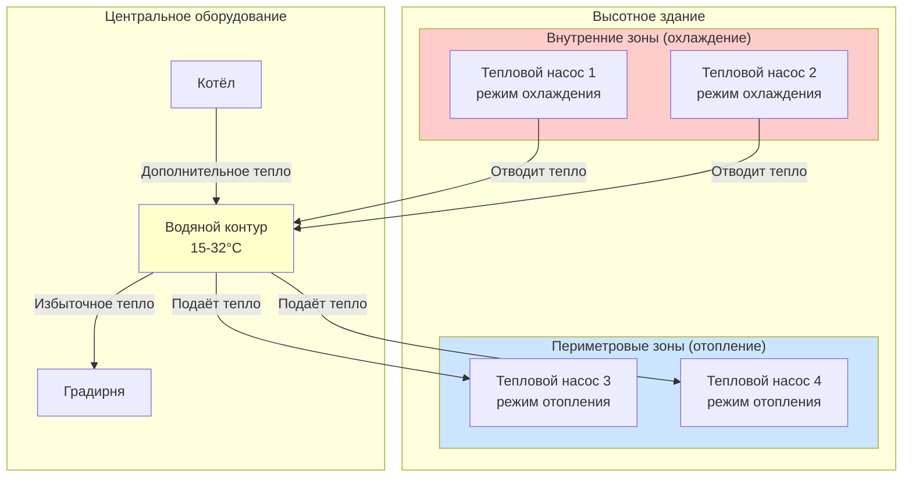
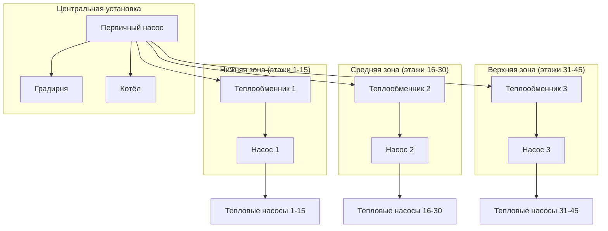

Системы тепловых насосов с источником воды (WSHP) представляют один из наиболее энергоэффективных подходов к проектированию HVAC высотных зданий, особенно в зданиях со значительными одновременными нагрузками отопления и охлаждения. Эти распределённые системы обеспечивают прямую передачу энергии между зонами, требующими охлаждения, и зонами, требующими отопления, через общий водяной контур, исключая потери энергии, присущие традиционным центральным системам, которые отводят тепло, одновременно генерируя его.

## Архитектура системы и принципы передачи энергии

Система WSHP состоит из нескольких водо-воздушных тепловых насосов, распределённых по всему зданию и подключённых к замкнутой сети трубопроводов, содержащей воду, обычно поддерживаемую при температуре от 15 до 32°C. Каждый тепловой насос работает независимо в режиме отопления или охлаждения в зависимости от требований зоны, используя контур либо как источник тепла, либо как теплосток.

Фундаментальный энергетический баланс контура демонстрирует принцип восстановления энергии:

$$Q_{loop} = \sum Q_{cooling} + \sum P_{comp,cooling} - \sum Q_{heating}$$

где:
- $Q_{loop}$ = чистое добавление тепла в контур (положительное требует градирни, отрицательное требует котла)
- $Q_{cooling}$ = тепло, извлечённое из охлаждаемых зон
- $P_{comp,cooling}$ = мощность компрессора для охлаждающих установок
- $Q_{heating}$ = тепло, подаваемое в отапливаемые зоны

Когда внутренние зоны требуют охлаждения, а периметровые зоны требуют отопления (частая ситуация в переходные сезоны и умеренном климате), система достигает почти нулевой чистой нагрузки на контур, требуя минимального вспомогательного отопления или охлаждения.

## Стратегия управления температурой контура

Управление температурой контура прямо влияет на эффективность системы через влияние на коэффициент производительности (COP) теплового насоса. Соотношение между температурой входящей воды (EWT) и COP следует выражению:

Для режима отопления:
$$COP_{heating} = \frac{Q_{heating}}{P_{comp}} = f(T_{cond} - T_{evap})$$

Для режима охлаждения:
$$COP_{cooling} = \frac{Q_{cooling}}{P_{comp}} = f(T_{evap} - T_{cond})$$

Более низкие температуры контура улучшают COP охлаждения, но снижают COP отопления, в то время как более высокие температуры имеют противоположный эффект. Стандарт ASHRAE 90.1 указывает на 15°C минимум и 32°C максимум температуры контура как практические границы.

**Оптимальные последовательности управления:**

1. **Плавающая температура контура**: позволить температуре контура плавать между уставками в зависимости от баланса нагрузки, минимизируя работу вспомогательного оборудования
2. **Управление по дифференциальной температуре**: поддерживать разность температур контура ($\Delta T = T_{supply} - T_{return}$) 6-11°C для минимизации энергии насоса
3. **Ступенчатое включение вспомогательного оборудования**: включать градирню или котёл только при приближении температуры контура к границам, несмотря на внутреннее восстановление тепла

| Температура контура | Влияние на COP отопления | Влияние на COP охлаждения | Применение |
|-----------------|-------------------|-------------------|-------------|
| 15-21°C | Снижено (3,0-3,5) | Оптимально (4,5-5,5) | Здания с доминирующим охлаждением |
| 21-27°C | Сбалансировано (3,5-4,0) | Сбалансировано (4,0-5,0) | Смешанное использование, переходные сезоны |
| 27-32°C | Оптимально (4,0-5,0) | Снижено (3,5-4,5) | Условия с доминирующим отоплением |

## Выбор мощности теплового насоса для высотных приложений

Выбор мощности теплового насоса должен учитывать как тепловую нагрузку, так и доступный диапазон температур на стороне воды. Производители номинируют оборудование при конкретных условиях EWT (обычно 21°C для охлаждения, 27°C для отопления), но фактическая мощность значительно варьируется с температурой контура.

Соотношение регулировки мощности:

$$Q_{actual} = Q_{rated} \times CAF$$

где $CAF$ = коэффициент регулировки мощности из данных производителя, варьирующийся ±15-25% во всём диапазоне температур контура.

**Методология выбора:**

1. Рассчитать пиковые нагрузки зон в расчётных условиях
2. Определить температуру контура в зависимости от углубления нагрузки здания
3. Применить коэффициенты регулировки мощности для фактического EWT
4. Добавить коэффициент безопасности 10-15% на эффекты давления в высотных зданиях и потерю давления в трубопроводах
5. Проверить производительность при нескольких условиях работы (пиковое отопление, пиковое охлаждение, переходный сезон)

Для периметровой зоны, требующей 6,8 кВ отопления при расчётных условиях с ожидаемой температурой контура 21°C:

$$\text{Требуемая номинальная мощность} = \frac{6,8 \text{ кВ}}{0,85 \text{ CAF}} \times 1,10 = 8,8 \text{ кВ}$$

Выбрать следующий стандартный размер (10 кВ номинальная).

## Проектирование трубопроводов контура

Трубопроводы WSHP в высотных зданиях представляют уникальные проблемы из-за статического давления, потерь на трение при вертикальном распределении и необходимости зонирования по давлению.

**Критические параметры проектирования:**

- **Статическое давление**: $P_{static} = \rho g h = 9,81 \text{ кПа/м}$ для воды
- **Потеря на трение**: использовать уравнение Дарси-Вайсбаха с методом эквивалентной длины для фитингов
- **Рейтинг давления системы**: задать трубопроводы и компоненты для максимального статического давления плюс рабочее давление системы

**Стратегия зонирования по давлению:**

Здания, превышающие 120 м, обычно требуют разделения зоны давления для ограничения номиналов давления оборудования и предотвращения чрезмерного давления на соединениях теплового насоса. Обычный подход использует промежуточные теплообменники каждые 5-6 этажей с выделенными циркуляционными насосами на зону.

**Критерии выбора трубопроводов:**

- Основные стояки: 0,6-1,2 м/с скорость при расчётном расходе
- Ветвевые трубопроводы: максимум 1,2-1,8 м/с скорость
- Бюджет полного перепада давления: 5-8 м вод. ст. на зону
- Размер расширительного бака для полного объёма системы плюс тепловое расширение

Расчёт потери давления для вертикальных стояков:

$$\Delta P_{total} = \Delta P_{friction} + \Delta P_{static,net}$$

Для замкнутой системы циркуляции чистое статическое давление равно нулю по полному пути циркуляции, остаются только потери на трение и локальные требования давления.

## Проектирование котельной и установки с градирней

Мощность вспомогательного оборудования зависит от углубления нагрузки здания и климата. Центральная установка должна справляться с дисбалансом контура, когда одновременное отопление и охлаждение не могут достичь баланса.

**Мощность котла**: выбирать на основе пиковой нагрузки отопления минус совпадающее восстановление внутренней теплоты, обычно 50-70% от пиковой нагрузки отопления здания:

$$Q_{boiler} = Q_{peak,heating} - (Q_{internal,cooling} + P_{comp}) \times DF$$

где $DF$ = коэффициент углубления (0,6-0,8 для высотных приложений).

**Мощность градирни**: выбирать на основе пиковой нагрузки охлаждения плюс тепло компрессора минус совпадающее восстановление периметрового отопления:

$$Q_{tower} = (Q_{peak,cooling} + P_{comp}) \times 1,25 - Q_{perimeter,heating} \times DF$$

Множитель 1,25 учитывает тепло сжатия. Выбор градирни должен приоритизировать низкий подход к температуре (3-4°C) для поддержания более низких температур контура и улучшения COP в режиме охлаждения.

## Производительность восстановления энергии

Эффективность восстановления энергии количественно выражает способность системы повторно использовать отводимое тепло:

$$\eta_{recovery} = \frac{Q_{recovered}}{Q_{total,heating}} = \frac{Q_{cooling} + P_{comp} - Q_{tower}}{Q_{heating}}$$

Хорошо спроектированные системы WSHP в смешанных высотных зданиях достигают эффективности восстановления 40-70% в год, с пиковыми значениями, превышающими 90% в переходные сезоны, когда периметровые и внутренние нагрузки уравновешиваются.

Эта прямая передача энергии исключает потери при двойном преобразовании, присущие традиционным системам (генерация тепла при одновременном отводе тепла в другом месте), обеспечивая значительную экономию энергии, особенно в зданиях с высокими внутренними нагрузками и переменными режимами использования по зонам.
