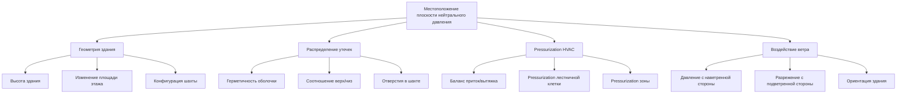

Вертикальные шахты в высоких зданиях создают уникальные проблемы перепада давления, вызванные силами тепловой плавучести. Понимание физики эффекта стека, динамики плоскости нейтрального давления и сезонных изменений необходимо для проектирования систем HVAC в высотных зданиях, которые поддерживают комфорт жильцов, контролируют инфильтрацию воздуха и обеспечивают надлежащее давление в здании.

## Основы эффекта стека

Эффект стека возникает из различий плотности воздуха между внутренней и внешней частями здания, создавая подъемные силы, которые приводят в движение вертикальный воздушный поток через непрерывные шахты.

### Физика перепада давления

Разница давления на любой высоте из-за эффекта стека описывается уравнением гидростатики, модифицированным для зависящей от температуры плотности:

$$\Delta P = \rho_o g h \left(\frac{1}{T_o} - \frac{1}{T_i}\right) \times T_o$$

Где:
- $\Delta P$ = перепад давления (Па)
- $\rho_o$ = плотность наружного воздуха при эталонной температуре (кг/м³)
- $g$ = ускорение свободного падения, 9,81 м/с²
- $h$ = высота над плоскостью нейтрального давления (м)
- $T_o$ = абсолютная температура наружного воздуха (К)
- $T_i$ = абсолютная температура внутреннего воздуха (К)

**Упрощенная форма для инженерных расчетов:**

$$\Delta P = C \times h \times \left(\frac{1}{T_o} - \frac{1}{T_i}\right)$$

Где $C = 3460$ Па·м·К (при нормальном атмосферном давлении).

### Величина эффекта стека

Для типичных зимних условий с внутренней температурой 21°C (294 К) и наружной температурой -18°C (255 К):

$$\Delta P = 3460 \times h \times \left(\frac{1}{255} - \frac{1}{294}\right)$$

$$\Delta P = 3460 \times h \times (0,00392 - 0,00340) = 1,80h \text{ Па}$$

Это дает приблизительно **1,8 Па на метр высоты** при этих условиях.

| Высота здания | Перепад давления зимой (Па) | Перепад давления летом (Па) | Годовое изменение |
|----------------|----------------|----------------|------------------|
| 50 м (13 этажей) | 90 | -30 | 120 Па |
| 100 м (26 этажей) | 180 | -60 | 240 Па |
| 200 м (52 этажа) | 360 | -120 | 480 Па |
| 300 м (78 этажей) | 540 | -180 | 720 Па |

*Примечание: значения летом предполагают обратный эффект стека с наружной температурой 35°C, внутренней 24°C*

## Плоскость нейтрального давления

Плоскость нейтрального давления (ПНД) представляет высоту, на которой давление внутри и снаружи здания равны. Воздух поступает в здание ниже ПНД и выходит выше нее при нормальных условиях эффекта стека.

### Расчет местоположения ПНД

Для здания с однородными характеристиками утечки:

$$h_{ПНД} = \frac{H}{2} \times \frac{1 + (A_{нижн}/A_{верх})}{1 + \sqrt{A_{нижн}/A_{верх}}}$$

Где:
- $h_{ПНД}$ = высота плоскости нейтрального давления (м)
- $H$ = общая высота здания (м)
- $A_{нижн}$ = эффективная площадь утечки у основания (м²)
- $A_{верх}$ = эффективная площадь утечки в верхней части (м²)

**Для равной утечки сверху и снизу** ($A_{нижн} = A_{верх}$):

$$h_{ПНД} = \frac{H}{2}$$

ПНД расположена на середине высоты.

### Факторы, влияющие на местоположение ПНД

### Стратегии управления ПНД

Системы pressurization здания могут смещать местоположение ПНД:

**Положительное давление в здании** (приток > вытяжка):
- Поднимает ПНД выше середины высоты
- Увеличивает исходящий поток на верхних уровнях
- Снижает инфильтрацию на нижних уровнях

**Отрицательное давление в здании** (вытяжка > приток):
- Опускает ПНД ниже середины высоты
- Увеличивает инфильтрацию на нижних уровнях
- Увеличивает экфильтрацию на верхних уровнях

## Сезонные изменения

Направление эффекта стека изменяется сезонно в зависимости от соотношения температуры внутри и снаружи.

### Зимний эффект стека

**Условия:** $T_i > T_o$

- Внутренний воздух менее плотный, чем наружный воздух
- Восходящая подъемная сила в шахтах
- Инфильтрация на нижних этажах
- Экфильтрация на верхних этажах
- Максимальные перепады давления
- Критично для проектирования тамбура

**Скорость вертикального воздушного потока в шахтах:**

$$v = \sqrt{\frac{2\Delta P}{\rho}}$$

Для $\Delta P = 180$ Па и $\rho = 1,2$ кг/м³:

$$v = \sqrt{\frac{2 \times 180}{1,2}} = 17,3 \text{ м/с}$$

Эта существенная скорость создает проблемы с работой дверей и распределением воздуха.

### Летний эффект стека

**Условия:** $T_i < T_o$ (в кондиционируемых зданиях)

- Внутренний воздух более плотный, чем наружный воздух
- Нисходящая сила в шахтах (обратный стек)
- Инфильтрация на верхних этажах
- Экфильтрация на нижних этажах
- Меньшая величина, чем зимой (меньший ΔT)
- Опасения по поводу инфильтрации влаги

### Переходные периоды

Весна и осень представляют уникальные проблемы:

- Частое смещение ПНД
- Переменные перепады давления
- Непредсказуемые закономерности воздушного потока
- Поиск в системе управления
- Возможности смешанной вентиляции

## Управление давлением в вертикальных шахтах

### Шахты лифтов

Шахты лифтов действуют как вертикальные проходы, соединяющие все этажи:

**Подходы к pressurization:**

1. **Вентилируемые шахты:** Снижение наростания давления через контролируемую вентиляцию в верхней части
2. **Герметичные шахты:** Минимизация воздухообмена, управление давлением через HVAC
3. **Pressurized шахты:** Активная pressurization для дымоудаления

**Эффект поршня лифта:**

$$\Delta P_{поршень} = \frac{\rho v^2}{2} \times \frac{A_{кабина}}{A_{шахта} - A_{кабина}}$$

Где:
- $v$ = скорость лифта (м/с)
- $A_{кабина}$ = площадь поперечного сечения кабины (м²)
- $A_{шахта}$ = площадь поперечного сечения шахты (м²)

### Pressurization лестничной клетки

Требования NFPA 92A и IBC для pressurization лестничной клетки при пожаре:

| Условие | Минимальное давление | Максимальное давление |
|-----------|------------------|------------------|
| Двери закрыты | 12,5 Па | 75 Па |
| Одна дверь открыта | 12,5 Па | 75 Па |
| Критическая дверь открыта | По указанию АХЖ | 175 Па (макс. сила открытия) |

**Проектный воздушный поток для pressurization:**

$$Q = A_L \times \sqrt{\frac{2\Delta P}{\rho}}$$

Где:
- $Q$ = требуемый воздушный поток (м³/с)
- $A_L$ = общая площадь утечки (м²)
- $\Delta P$ = целевой перепад давления (Па)

## Стратегии снижения

### Компартментализация

Разделение высоких зданий на вертикальные зоны:

- Небные лобби как точки разделения давления
- Переходные этажи с разделением
- Механические этажи как границы
- Уменьшенная эффективная высота на зону

**Снижение эффективной высоты:**

Для 4 зон в здании высотой 300 м: $h_{эфф} = 75$ м

Снижение давления: $\Delta P = 1,8 \times 75 = 135$ Па (вместо 540 Па)

### Вращающиеся двери и тамбуры

Требуются при входах в здание для управления перепадами давления:

**Эффективность тамбура:**

$$\eta = 1 - \frac{Q_{с\,тамбуром}}{Q_{без\,тамбура}}$$

Правильно спроектированные тамбуры достигают снижения инфильтрации на 60-80%.

### Вентиляция шахт

Стратегическая вентиляция вертикальных шахт:

- Вентиляция в верхней части здания для шахт лифтов
- Вентиляция на середине высоты для стабилизации ПНД
- Автоматические заслонки для сезонного переключения
- Предохранительные заслонки для ограничения максимального давления

## Ссылки ASHRAE

ASHRAE Handbook—Fundamentals (2021):
- Chapter 16: Ventilation and Infiltration
- Расчеты эффекта стека и распределение давления

ASHRAE Handbook—HVAC Applications (2019):
- Chapter 5: Tall Buildings
- Интеграция вертикального транспорта с HVAC

ASHRAE Standard 62.1-2022: Ventilation for Acceptable Indoor Air Quality
- Требования pressurization
- Подача наружного воздуха в высотных зданиях

## Измерение и проверка

**Местоположения мониторинга давления:**

1. Основание здания (ниже ПНД)
2. Высота плоскости нейтрального давления
3. Верхний механический этаж
4. Критические лобби лифтов
5. Лестничная клетка на нескольких уровнях

**Критерии приемки:**

- Максимальная сила открытия двери: 133 Н (30 lbf)
- Давление в лобби: ±5 Па относительно внешнего давления
- Давление в лестничной клетке: согласно требованиям NFPA
- Давление в лобби лифта: -2,5 до +2,5 Па относительно соседних помещений

Понимание перепадов давления в вертикальных шахтах позволяет инженерам проектировать эффективные системы pressurization, выбирать надлежащие конфигурации тамбуров и внедрять стратегии разделения зон, которые поддерживают комфорт и безопасность в высотных зданиях на протяжении всех сезонов.
