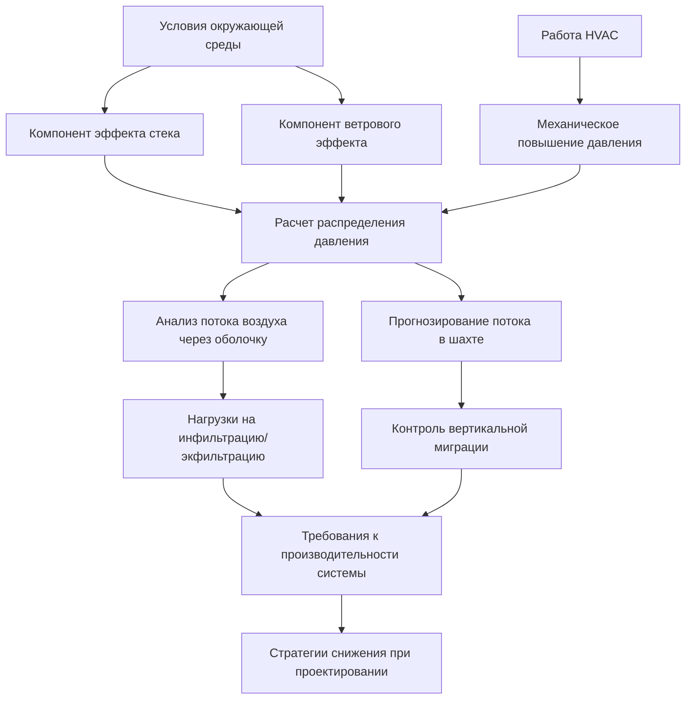

Точные расчеты дифференциала давления составляют основу проектирования HVAC-систем высотных зданий. Эти методы количественно определяют силы эффекта стека, давления, вызванного ветром, и их совместное воздействие на инфильтрацию оболочки здания, поток воздуха в шахтах и вертикальное распределение давления. Понимание физики и вычислительных подходов позволяет инженерам предсказывать явления, вызванные давлением, и разрабатывать эффективные стратегии снижения.

## Расчет давления эффекта стека

Фундаментальный дифференциал давления эффекта стека возникает из-за различий плотности между внутренней и внешней воздушными колоннами. На любой высоте $h$ выше нейтральной плоскости давления (НПД) дифференциал давления составляет:

$$\Delta P_s = \rho_o g h \left(1 - \frac{T_o}{T_i}\right)$$

Где:
- $\Delta P_s$ = дифференциал давления эффекта стека (Па)
- $\rho_o$ = плотность наружного воздуха (кг/м³)
- $g$ = ускорение свободного падения (9,81 м/с²)
- $h$ = вертикальное расстояние от нейтральной плоскости давления (м)
- $T_o$ = абсолютная температура наружного воздуха (К)
- $T_i$ = абсолютная температура внутреннего воздуха (К)

**Упрощенная форма** с использованием стандартной плотности воздуха на уровне моря (1,2 кг/м³):

$$\Delta P_s = 0,0342 \, h \, \frac{\Delta T}{T_i}$$

Где $\Delta T = T_i - T_o$ в Кельвинах. Это уравнение показывает, что дифференциал давления масштабируется линейно с высотой и разностью температур, создавая максимальный дифференциал на крайних точках здания в зимних условиях.

### Расположение нейтральной плоскости давления

НПД представляет собой отметку, где внутреннее и наружное давления выравниваются. Её расположение зависит от распределения утечек здания и работы HVAC-системы. Для здания с равномерной утечкой:

$$h_{NPP} = \frac{\sum A_i h_i}{\sum A_i}$$

Где $A_i$ представляет площадь утечки на высоте $h_i$. На практике НПД обычно располагается между 0,3H и 0,7H (H = высота здания), смещаясь в зависимости от:

| Условие | Смещение НПД | Физическая причина |
|---------|--------------|------------------|
| Утечка в верхней части здания | Вверх | Больше сопротивления потоку ниже |
| Утечка в нижней части здания | Вниз | Больше сопротивления потоку выше |
| Работа вытяжного вентилятора | Вверх | Разрежение в здании |
| Дисбаланс подачи воздуха | Вниз | Повышенное давление в здании |
| Повышение наружной температуры | К середине здания | Снижение дифференциала плотности |

Стратегическое управление НПД за счет повышения давления снижает пиковые дифференциалы в критических местах (например, входы на первом этаже, шахты лифтов).

## Расчеты воздействия ветра

Ветер создает распределения поверхностного давления, подчиняющиеся уравнению Бернулли и геометрии здания. Давление, вызванное ветром, на любой поверхности здания:

$$P_w = C_p \cdot \frac{1}{2} \rho_{air} V^2$$

Где:
- $P_w$ = давление ветра (Па)
- $C_p$ = коэффициент давления (безразмерный)
- $V$ = скорость ветра на высоте здания (м/с)
- $\rho_{air}$ = плотность воздуха (кг/м³)

Коэффициенты давления варьируются в зависимости от формы здания, ориентации и окружающей местности. Справочник ASHRAE—Fundamentals, глава 24, предоставляет значения $C_p$:

| Поверхность здания | Диапазон $C_p$ | Типовое значение |
|--------------------|----------------|------------------|
| Наветренный фасад | +0,5 ÷ +0,8 | +0,6 |
| Подветренный фасад | -0,3 ÷ -0,5 | -0,4 |
| Боковые фасады | -0,6 ÷ -0,8 | -0,7 |
| Крыша (плоская) | -0,6 ÷ -0,9 | -0,7 |
| Углы/кромки | -1,0 ÷ -1,5 | -1,2 |

**Скорость ветра увеличивается с высотой** в соответствии с степенным профилем:

$$V_h = V_{ref} \left(\frac{h}{h_{ref}}\right)^\alpha$$

Где $\alpha$ варьируется от 0,14 (открытая местность) до 0,33 (городские центры). Этот вертикальный градиент создает дифференциалы давления по высоте здания даже на одном фасаде.

## Комбинированный тепловой и ветровой анализ

Эффекты стека и ветра накладываются друг на друга, создавая сложные картины давления. Полный дифференциал давления на оболочке здания:

$$\Delta P_{total} = \Delta P_s + \Delta P_w + \Delta P_{HVAC}$$

Где $\Delta P_{HVAC}$ представляет эффекты механического повышения или понижения давления в системе. Взаимодействие создает:

**Критические условия проектирования** возникают, когда тепловой и ветровой эффекты совпадают:

1. **Зимний наветренный верхний этаж**: $\Delta P_s$ (положительный) + $P_w$ (положительный) = максимальная инфильтрация
2. **Зимний подветренный верхний этаж**: $\Delta P_s$ (положительный) + $P_w$ (отрицательный) = потенциальное изменение направления
3. **Лето первый этаж**: $\Delta P_s$ (отрицательный) + $P_w$ (переменный) = сложность повышения давления у входа

## Вычислительные методы

### Моделирование сетей воздушного потока

Сетевые модели дискретизируют здания на узлы (зоны, шахты), связанные путями потока (утечки, двери, клапаны). Соотношение давление-поток для каждого пути:

$$Q = C (\Delta P)^n$$

Где:
- $Q$ = объемный расход (м³/с)
- $C$ = коэффициент потока (м³/с·Па^n)
- $n$ = показатель потока (0,5 для турбулентного, 1,0 для ламинарного)

Одновременное решение уравнений баланса масс на всех узлах дает распределение давления:

$$\sum Q_{in} = \sum Q_{out}$$

Программные инструменты (CONTAM, EnergyPlus Airflow Network) решают эти нелинейные наборы уравнений итеративно. Требования к входным данным включают:

- Геометрию здания и распределение утечек
- Размеры шахт и эффективные площади утечек
- Характеристики дверей (размер, усилие закрывания, класс инфильтрации)
- Параметры HVAC-системы (потоки подачи/возврата, повышение давления)
- Граничные условия окружающей среды (T, P, ветер)

### Вычислительная гидродинамика

CFD обеспечивает пространственное разрешение полей скорости и давления внутри шахт и вокруг наружных поверхностей здания. Уравнения Навье-Стокса управляют движением жидкости:

$$\rho \left(\frac{\partial \mathbf{v}}{\partial t} + \mathbf{v} \cdot \nabla \mathbf{v}\right) = -\nabla p + \mu \nabla^2 \mathbf{v} + \rho \mathbf{g}$$

Приложения CFD в HVAC высотных зданий включают:

| Тип анализа | Приложение CFD | Проектный вывод |
|-------------|----------------|-----------------|
| Внешний поток ветра | Коэффициенты поверхностного давления | Специфичные для здания значения $C_p$ |
| Поток в шахте | Профили скорости, зоны рециркуляции | Оптимальные размер/расположение вентиляции |
| Поток в холле | Стратификация температуры | Эффективность тамбура |
| Вентиляция механического отделения | Идентификация горячих точек | Оптимизация расположения оборудования |

**Моделирование турбулентности** (k-ε, k-ω SST) захватывает реалистичное поведение потока, но требует значительных вычислительных ресурсов. Упрощенные подходы (потенциальный поток, панельные методы) предлагают более быстрые решения для предварительного проектирования.

## Инструменты и процедуры проектирования

**Рабочий процесс ручного расчета**:

**Анализ на основе программного обеспечения**:

1. **Ввод геометрии здания**: Планы этажей, расположение шахт, размеры
2. **Характеристика утечек**: Производительность воздушного барьера оболочки, рейтинги инфильтрации дверей
3. **Сценарии окружающей среды**: Дни проектного отопления/охлаждения, скорость/направление ветра
4. **Определение HVAC-системы**: Стратегия повышения давления, потоки системы
5. **Итеративное решение**: Сходимость к распределению давления/потока
6. **Постобработка**: Пиковые дифференциалы, потоки в шахтах, эффективность снижения

Справочник ASHRAE—HVAC Applications, глава 53, предоставляет подробные процедуры расчета эффекта стека и проектирования снижения. Точность критически зависит от оценки площади утечки—полевые испытания (дверь с нагнетателем, газ-индикатор) повышают надежность прогноза.

**Подходы валидации** включают:

- Мониторинг дифференциала давления при вводе в эксплуатацию
- Измерения скорости потока воздуха в шахте
- Тестирование силы открывания двери
- Сравнение с аналогичными зданиями в том же климате

Эти методы расчета обеспечивают количественное прогнозирование явлений, вызванных давлением, переходя проектирование от эмпирических правил к прогнозированию производительности на основе физики. Комбинация аналитических уравнений для концептуального понимания и вычислительных инструментов для детального анализа обеспечивает комплексные возможности проектирования.

## Компоненты

- Расчет давления эффекта стека
- Оценка потока воздуха в шахте
- Определение площади утечки
- Расчеты потери давления
- Коэффициент потока дверей шахты
- Эмпирические методы давления
- Вычислительная гидродинамика шахт
