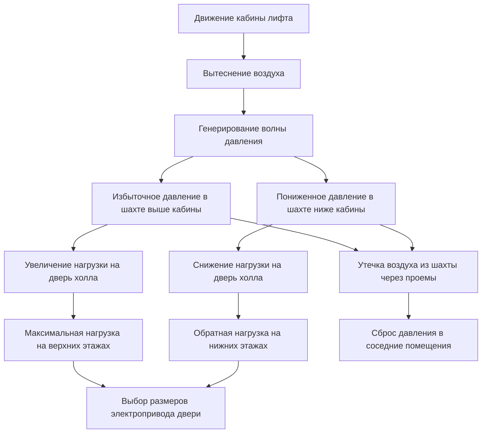
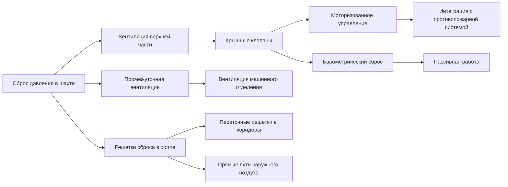

Шахты лифтов в высотных зданиях создают сложную динамику давления, вызванную движением кабины, эффектом тяги и взаимодействием систем HVAC. Эффект поршня от движущейся кабины лифта создает переходные колебания давления, которые влияют на работу двери, комфорт занимающих помещение лиц и системы пожарной безопасности. Надлежащий анализ этих перепадов давления необходим для соответствия нормам и надежности эксплуатации.

## Физика эффекта поршня

Кабина лифта действует как движущийся поршень в шахте, вытесняя воздух при движении. Это вытеснение создает волны давления, распространяющиеся через шахту и прилегающие пространства. Величина изменения давления зависит от скорости кабины, площади поперечного сечения шахты и характеристик утечки.

Мгновенный перепад давления, создаваемый движением кабины, аппроксимируется следующим образом:

$$\Delta P = \frac{\rho v^2}{2} \left(\frac{A_c}{A_s - A_c}\right)^2 \cdot C_d$$

Где:
- $\Delta P$ = перепад давления (Па)
- $\rho$ = плотность воздуха (кг/м³)
- $v$ = скорость кабины (м/с)
- $A_c$ = площадь поперечного сечения кабины (м²)
- $A_s$ = площадь поперечного сечения шахты (м²)
- $C_d$ = коэффициент динамического давления (обычно 0,6–0,8)

Для высокоскоростного лифта, движущегося со скоростью 8 м/с в шахте с соотношением площадей кабины к шахте 60%, пиковые перепады давления достигают 150–250 Па. Эти переходные давления накладываются на статическое давление эффекта тяги, создавая сложные условия нагрузки на дверь лифтового холла.

## Распределение давления в шахтах лифтов

Давление в шахте лифта изменяется по высоте вследствие эффекта тяги и по горизонтали вследствие положения кабины. Общее давление в любой точке представляет собой комбинацию статического давления эффекта тяги и динамического давления поршня:

$$P_{total}(z,t) = P_{stack}(z) + P_{piston}(z,t)$$

Давление эффекта тяги следует уравнению:

$$P_{stack}(z) = \rho g h \left(\frac{1}{T_{out}} - \frac{1}{T_{shaft}}\right)$$

Где:
- $g$ = ускорение свободного падения (9,81 м/с²)
- $h$ = высота над нейтральной плоскостью (м)
- $T_{out}$ = абсолютная температура снаружи (К)
- $T_{shaft}$ = абсолютная температура воздуха в шахте (К)

## Анализ нагрузок на дверь лифтового холла

Двери лифтового холла испытывают объединенные нагрузки от эффекта тяги и эффекта поршня. Раздел IBC 3002.7 требует, чтобы двери холла работали при максимальных расчетных перепадах давления. Сила, необходимая для открытия двери против перепада давления, составляет:

$$F_{door} = \Delta P \cdot A_{door} \cdot \mu$$

Где:
- $F_{door}$ = сила открытия двери (Н)
- $\Delta P$ = перепад давления через дверь (Па)
- $A_{door}$ = площадь дверного полотна (м²)
- $\mu$ = эффективность передачи усилия (0,5–0,7 для раздвижных дверей)

| Перепад давления | Стандартная дверь (2,1 м × 0,9 м) | Широкая дверь (2,1 м × 1,2 м) | Предел усилия |
|----------------------|-------------------------------|---------------------------|-------------|
| 25 Па | 24 Н | 32 Н | Приемлемо |
| 50 Па | 47 Н | 63 Н | Граничное состояние |
| 75 Па | 71 Н | 95 Н | Требуется электропривод |
| 100 Па | 95 Н | 126 Н | Превышены пределы ADA |

Стандарты ADA и IBC ограничивают максимальное усилие открытия двери 133 Н (30 lbf). Когда объединенное давление эффекта тяги и поршня превышает 75 Па, становятся необходимы электроприводы дверей или стратегии сброса давления.

## Требования для лифта противопожарной службы

NFPA 72 и раздел IBC 3007 требуют конкретных требований герметизации для лифтов противопожарной службы. Шахта должна поддерживать избыточное давление относительно этажа пожара, чтобы предотвратить проникновение дыма при аварийной работе.

Раздел NFPA 72 21.3.3 требует:
- Минимум 25 Па избыточного давления в холле лифта относительно этажа пожара
- Максимум 35 Па, чтобы предотвратить чрезмерное открытие двери
- Поддержание давления при открытии одной двери
- Автоматический сброс давления для условий без пожара

Расход воздуха, необходимый для поддержания целевого давления, рассчитывается по формуле:

$$Q = A_{leak} \sqrt{\frac{2\Delta P}{\rho}} \cdot C_{leak}$$

Где:
- $Q$ = расход воздуха (м³/с)
- $A_{leak}$ = общая площадь утечки (м²)
- $C_{leak}$ = коэффициент утечки (0,6–0,65)

Для типичного холла лифта противопожарной службы с эквивалентной площадью утечки 0,08 м², поддержание давления 30 Па требует примерно 850 м³/ч подаваемого воздуха.

## Стратегии вентиляции шахты

Стратегии вентиляции снижают пиковые перепады давления при сохранении пожарной безопасности:

### Вентиляция верхней части
Моторизованные клапаны в верхней части шахты открываются при высокоскоростной работе кабины для сброса давления. Площадь вентиляционного отверстия рассчитывается для ограничения пикового давления:

$$A_{vent} = \frac{v \cdot A_c}{\sqrt{\frac{2\Delta P_{max}}{\rho}}}$$

Для предыдущего примера (скорость кабины 8 м/с, ограничение до 50 Па) требуемая площадь вентиляционного отверстия составляет приблизительно 1,2 м².

### Промежуточная вентиляция
Машинные отделения обеспечивают естественные пути сброса при наличии дверей или жалюзи, соединяющих шахту с пространствами здания. Этот подход снижает пиковые давления, но может передавать шум и колебания давления в занятые помещения.

### Сброс в холле
Переточные решетки между холлами лифтов и коридорами снижают нагрузки открытия двери, но снижают акустическую развязку. Выбор размера решетки следует тому же уравнению расхода воздуха с эффективной площадью 40–60% от геометрической площади вследствие сопротивления жалюзи.

## Измерение и проверка давления

Полевая проверка герметизации шахты лифта требует приборов и протоколов испытаний, учитывающих переходные условия:

| Параметр | Приборное оборудование | Метод измерения | Критерии приемки |
|-----------|-----------------|-------------------|---------------------|
| Статическое давление эффекта тяги | Дифференциальный манометр | Шахта относительно внешней среды на нескольких этажах | Соответствие расчету ±15% |
| Пиковое давление поршня | Быстродействующий датчик | Дискретизация 10+ Гц при движении | Ниже расчетного предела |
| Нагрузка на дверь холла | Динамометр | Усилие натяжения на краю защелки | ≤133 Н (30 lbf) |
| Давление противопожарной службы | Откалиброванный манометр | При работающем вентиляторе подачи | Диапазон 25–35 Па |

Испытания должны проводиться при условиях расчетного ветра и температуры. Зимние условия обычно создают максимальный эффект тяги, тогда как летние условия могут создавать противоположные градиенты давления в кондиционируемых шахтах.

## Интеграция в проект

Успешное управление давлением в шахте лифта требует координации между архитектурными, строительными и HVAC подразделениями:

1. **Герметизация шахты**: Задайте конструкционные стыки, уплотнения проемов и дверные коробки для достижения целевых скоростей утечки (обычно 1,5–2,5 м² на 100 м² площади стены шахты эквивалентной площади утечки)

2. **Выбор размеров электропривода двери**: Выбирайте дверные машины, способные работать при расчетных перепадах давления плюс 25% запас

3. **Система герметизации**: Интегрируйте вентиляторы герметизации противопожарной службы с системой управления зданием BMS для мониторинга давления и управления клапанами

4. **Пути сброса**: Спроектируйте преднамеренные пути сброса, рассчитанные для ограничения пиковых давлений при сохранении противопожарной отсеченности

5. **Смягчение эффекта тяги**: Рассмотрите возможность промежуточных вестибюлей, разбиения шахты или систем-вестибюлей для снижения общих перепадов давления

Взаимодействие между герметизацией шахты лифта и эффектом тяги здания создает одну из наиболее сложных проблем управления давлением при проектировании высотных зданий. Анализ на основе физики движения кабины, геометрии шахты и характеристик утечки обеспечивает основу для надежной работы системы при всех условиях эксплуатации.
