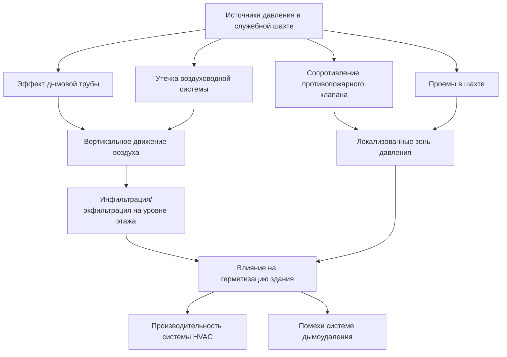
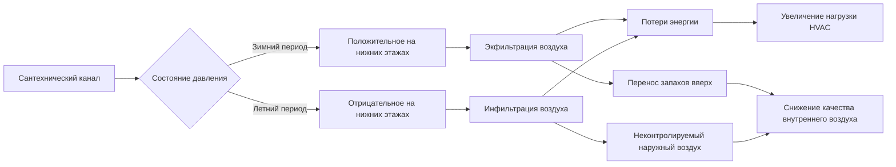

## Физика давления в служебных шахтах

Служебные шахты в многоэтажных зданиях испытывают значительные дифференциалы давления, вызванные эффектом дымовой трубы, работой механических систем и требованиями противопожарной защиты. В отличие от лестничных клеток, предназначенных для специальной герметизации, служебные шахты создают непредусмотренные пути вертикального движения воздуха, влияющие на герметизацию здания, потребление энергии и производительность систем дымоудаления при пожаре.

Фундаментальный дифференциал давления в служебной шахте следует гидростатическому уравнению, модифицированному для различий температур:

$$\Delta P = \rho g h \left(\frac{T_{shaft} - T_{outdoor}}{T_{outdoor}}\right)$$

Где $\rho$ = плотность воздуха (кг/м³), $g$ = ускорение свободного падения (9,81 м/с²), $h$ = высота шахты (м), температуры в Кельвинах. Шахта высотой 200 м с разностью температур 20°C генерирует примерно 48 Па дифференциала давления между верхом и низом.

## Характеристики герметизации механических шахт

Механические шахты, содержащие воздуховоды приточные и вытяжные, трубопроводы и кабельные каналы, создают сложные условия давления, зависящие от множества факторов:

**Основные источники давления:**
- Эффект дымовой трубы от температурной стратификации в шахте
- Давление вентилятора, передаваемое через утечки воздуховодов
- Эффект поршня лифта в соседних шахтах
- Работа оборудования HVAC, создающая локальную герметизацию
- Ветровые нагрузки на выходы шахты, вызывающие колебания давления

Общее давление на любой высоте шахты объединяет эти эффекты:

$$P_{total}(z) = P_{stack}(z) + P_{duct\_leak}(z) + P_{wind}(z)$$

Механические шахты обычно работают при давлении 5–15 Па выше занятых помещений в зимний период и могут разворачиваться в отрицательное значение во время охлаждения здания в зависимости от контроля температуры шахты.

## Анализ утечки воздуха в воздуховодных шахтах

Вертикальные воздуховодные шахты имеют утечки в нескольких точках, создавая распределённые потери давления по высоте шахты. Кумулятивная утечка следует соотношению степенного закона:

$$Q_{leak} = C \cdot A \cdot \Delta P^n$$

Где $C$ = коэффициент утечки (0,4–0,65 для типичного строительства), $A$ = общая площадь утечек (м²), $n$ = показатель потока (0,6–0,7). Для шахты с площадью стен 200 м² и рейтингом класса утечки 1,8 л/(с·м²) при 75 Па общая утечка превышает 25 000 л/с при пиковых условиях дифференциала давления.

Эта распределённая утечка создаёт вертикальный градиент давления, отклоняющийся от теоретической кривой эффекта дымовой трубы:

$$\frac{dP}{dz} = -\rho g + \frac{Q_{leak}(z)}{A_{shaft} \cdot v(z)}$$

Второе слагаемое представляет восстановление давления за счёт уменьшения скорости воздуха при утечке по высоте шахты.

| Метод герметизации шахты | Скорость утечки (л/(с·м²) при 75 Па) | Относительная стоимость | Долговечность |
|----------------------|-------------------------------|---------------|------------|
| Небольшный бетонный блок | 3,5–5,0 | 1,0× | Постоянная |
| Окрашенный бетонный блок | 1,8–2,5 | 1,2× | 5–10 лет |
| Гипсокартон (негерметичные стыки) | 2,0–3,0 | 1,3× | Постоянная |
| Герметичный гипсокартон (проконопачен) | 0,8–1,2 | 1,5× | 15+ лет |
| Распылённый барьер | 0,4–0,6 | 2,0× | 20+ лет |

## Динамика давления в сантехнических каналах

Сантехнические каналы создают уникальные проблемы давления из-за динамики потока воды, соединений вентиляционных стояков и термической стратификации от трубопроводов горячего водоснабжения. Эффективная площадь утечки в сантехнических каналах обычно превышает механические шахты на 40–60% из-за более крупных проемов для трубопроводов.

**Критические соображения давления:**
- Работа вентиляционного стояка создаёт двусторонний поток воздуха
- Клапаны впуска воздуха линии слива позволяют односторонний поток воздуха
- Стояки горячего водоснабжения повышают температуру шахты на 8–15°C выше окружающей температуры
- Выходы конденсатопровода создают прямые соединения с наружным воздухом
- Соединения напольного слива с санитарной системой допускают инфильтрацию газов из канализации при отрицательном давлении

Комбинированный эффект создаёт давления в канале, которые изменяются с работой сантехнической системы:

$$P_{chase}(t) = P_{stack,thermal} + P_{vent,flow} + P_{drain,surge}$$

Где член потока вентиляции изменяется с событиями сброса сантехприборов, а член скачка слива представляет переходные импульсы давления от потока сточных вод.

## Влияние противопожарного клапана на давление в шахте

Противопожарные клапаны, установленные на проемах перекрытий, создают значительное сужение потока, влияющее на герметизацию шахты. Перепад давления на противопожарном клапане следует принципам турбулентного потока:

$$\Delta P_{damper} = \frac{1}{2} \rho v^2 K$$

Где $K$ = коэффициент потерь клапана (2,5–4,5 для клапанов с плавким звеном, 1,5–2,5 для завесного типа). Шахта, испытывающая поток 500 л/с через проём 0,5 м² клапана, генерирует дополнительное падение давления 15–30 Па.

**Эффекты давления противопожарного клапана:**
- Создаёт локализованные зоны высокого давления непосредственно выше по потоку
- Снижает поток эффекта дымовой трубы на 30–50% по сравнению с открытыми шахтами
- Позволяет разделение давления между этажами
- Генерирует турбулентное смешивание, которое модерирует температурную стратификацию в шахте

International Building Code (IBC) раздел 717 и International Mechanical Code (IMC) раздел 607 требуют противопожарных клапанов на проемах шахт через узлы с огнестойкостью. Эти клапаны должны поддерживать рейтинги при работе с дифференциалами давления до 50 Па без преждевременного закрытия.

## Герметизация шахты и стратегии контроля утечек

Эффективная герметизация шахты требует решения проблем проемов, конструкционных стыков и проницаемости материалов:

**Требования герметизации проемов (IBC раздел 714):**
- Системы огнестойких преград должны поддерживать F-рейтинг, равный рейтингу стены шахты
- Требуется рейтинг утечки (L-рейтинг) для проемов в дымовых барьерах
- Кольцевые пространства вокруг трубопроводов герметизированы утверждёнными материалами
- Проемы кабельного лотка требуют функциональные системы огнестойких преград

**Обработка конструкционных стыков:**
- Горизонтальные стыки на бетонных плитах герметизированы интумесцентными прокладками
- Вертикальные деформационные швы обработаны эластомерными герметиками
- Периметры дверных коробок и люков доступа непрерывно герметизированы
- Якори механического оборудования изолированы компрессионными уплотнениями

Общий коэффициент утечки шахты улучшается экспоненциально при комплексной герметизации:

$$C_{effective} = C_{base} \cdot e^{-k \cdot N_{seals}}$$

Где $N_{seals}$ представляет количество герметизированных путей утечки, а $k$ = коэффициент эффективности герметизации (0,15–0,25 для профессиональной установки).

## Интеграция контроля давления в служебном ядре

Многошахтные служебные ядра требуют скоординированного управления давлением для предотвращения перекрёстного загрязнения и поддержания целостности систем противопожарного дымоудаления. Соотношение давления между соседними шахтами следует:

$$\Delta P_{shaft1-shaft2} = \left(\rho g h \frac{\Delta T_1}{T_{ref}}\right) - \left(\rho g h \frac{\Delta T_2}{T_{ref}}\right)$$

Когда разности температур между шахтами превышают 5°C, дифференциалы давления между шахтами достигают 12–15 Па, достаточного для движения воздуха через общие стены и проемы.

**Стратегии контроля давления:**
- Установка барометрических клапанов сброса давления на верхах шахт для ограничения максимального давления
- Обеспечение механической вентиляции для контроля температуры шахты
- Герметизация между соседними шахтами для предотвращения перекрёстного потока
- Мониторинг давления в шахтах относительно занятых помещений
- Скоординация с проектированием систем дымоудаления согласно NFPA 92

Надлежащее управление давлением в служебной шахте снижает неконтролируемые утечки воздуха на 40–60%, уменьшает потребление энергии HVAC на 8–12% и обеспечивает надёжность системы противопожарного дымоудаления при аварийной работе.

## Требования к тестированию и наладке

Проверка производительности служебной шахты требует испытания под давлением согласно ASTM E779 или E1827 в адаптации для вертикальных приложений:

- Измерение площади утечки при нескольких дифференциалах давления (25, 50, 75 Па)
- Документирование схем потока воздуха с помощью дымовых трассеров
- Проверка работы противопожарного клапана при условиях расчётного давления
- Подтверждение соотношений давления между шахтой и занятыми помещениями
- Испытание интеграции с системами дымоудаления здания

Эти измерения устанавливают базовую производительность и определяют приоритеты восстановления для шахт, превышающих критерии проектной утечки.
