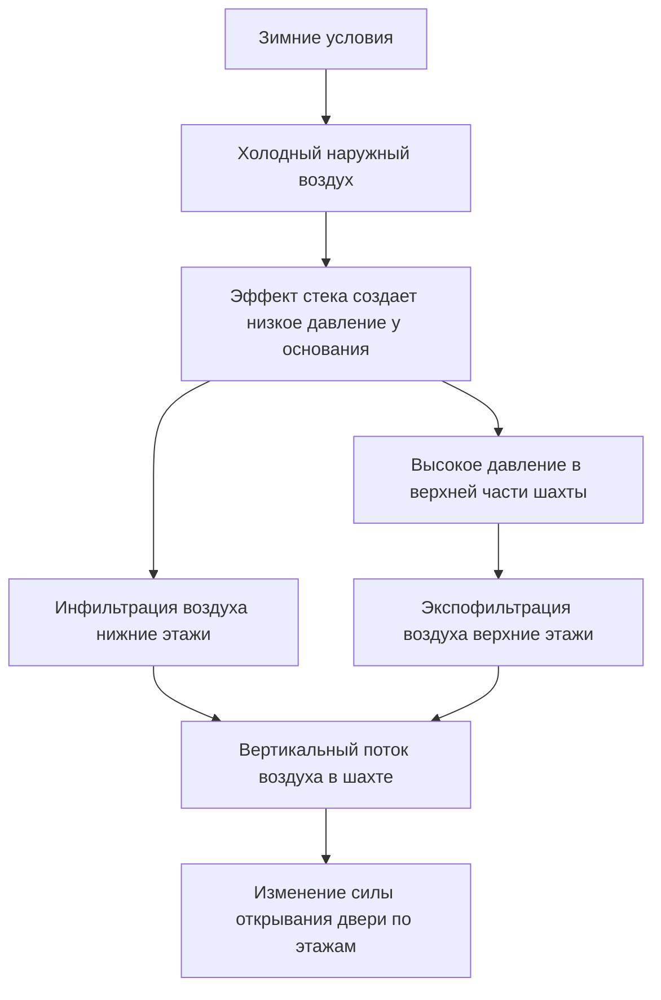
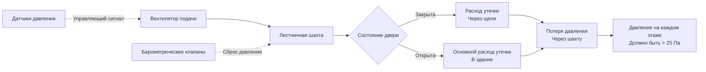

Контроль давления в лестничных клетках высотных зданий представляет собой критическое пересечение безопасности жизни, физики здания и механического проектирования. Вертикальные шахты, созданные закрытыми лестничными клетками, испытывают значительные перепады давления, вызванные эффектом стека, системами механической герметизации и условиями окружающей среды. Эти изменения давления напрямую влияют на возможность эвакуации, эффективность дымоудаления и соответствие нормативным требованиям.

## Эффект стека в лестничных шахтах

Эффект стека создает перепады давления, пропорциональные высоте вертикальной шахты и разнице температур между внутренней и внешней средой. Для лестничной шахты перепад давления на любой высоте составляет:

$$\Delta P = \rho g h \left(\frac{1}{T_o} - \frac{1}{T_i}\right)$$

Где:
- $\Delta P$ = перепад давления (Па)
- $\rho$ = плотность воздуха при стандартных условиях (1,2 кг/м³)
- $g$ = ускорение свободного падения (9,81 м/с²)
- $h$ = вертикальная высота от нейтральной плоскости (м)
- $T_o$ = абсолютная температура снаружи (К)
- $T_i$ = абсолютная температура внутри (К)

Для здания высотой 200 м с внутренней температурой 20°C (293 К) и внешней температурой -20°C (253 К) максимальный перепад давления достигает приблизительно 250 Па. Этот значительный перепад давления создает серьезные проблемы при эксплуатации дверей и контроле инфильтрации воздуха.

### Расположение нейтральной плоскости давления

Нейтральная плоскость давления (НПД) представляет собой высоту, на которой внутреннее и внешнее давление выравниваются. В естественно вентилируемых лестничных клетках НПД обычно расположена вблизи середины высоты, но смещается в зависимости от распределения утечек:

$$h_{NPP} = \frac{\sum A_L h_L}{\sum A_L}$$

Где $A_L$ представляет площадь утечки на высоте $h_L$. Двери лестничных клеток, строительные стыки и проникновения в стены шахты доминируют в распределении утечек.

## Силы открывания дверей

Раздел IBC 1010.1.3 ограничивает силу открывания двери до 30 lbf (133 Н) в нормальных условиях и 15 lbf (67 Н) для доступности. Сила, необходимая для открывания двери против перепада давления, составляет:

$$F_{door} = \Delta P \times A_{door} \times d / w$$

Где:
- $F_{door}$ = сила открывания у ручки (Н)
- $\Delta P$ = перепад давления через дверь (Па)
- $A_{door}$ = площадь двери (м²)
- $d$ = расстояние от петли до центра давления (м)
- $w$ = расстояние от петли до ручки (м)

Для стандартной двери размером 915 мм × 2130 мм с перепадом давления 50 Па сила открывания превышает 100 Н (22,5 lbf), приближаясь к нормативным ограничениям даже без механической герметизации.

### Сезонные вариации силы

| Сезон | Наружная температура | ΔP у основания (200м) | ΔP в верхней части (200м) | Сила у основания | Сила в верхней части |
|--------|----------------------|----------------------|--------------------------|------------------|----------------------|
| Зима | -20°C | +125 Па | -125 Па | 280 Н (63 lbf) | -280 Н (всас) |
| Весна | 10°C | +25 Па | -25 Па | 56 Н (12,6 lbf) | -56 Н (всас) |
| Лето | 35°C | -75 Па | +75 Па | -168 Н (всас) | 168 Н (37,8 lbf) |

В этой таблице предполагается поддерживаемая внутренняя температура 20°C и демонстрируется, как силы открывания дверей меняются сезонно в зависимости от этажа, создавая проблемы доступности в течение года.

## Герметизация лестничных клеток для дымоудаления

NFPA 92 и раздел IBC 403.5.4 требуют герметизации лестничных клеток в зданиях, превышающих определенную высоту (обычно 23 м или 75 ft). Система герметизации должна поддерживать минимальный перепад давления 25 Па (0,10 в.в.л.) при закрытых всех дверях лестничной клетки и не более 60 Па (0,25 в.в.л.) при ожидаемых открытых дверях.

### Требования к расходу воздуха при герметизации

Требуемый общий расход воздуха учитывает утечку через закрытые двери и поддерживает давление при открывании дверей:

$$Q_{total} = Q_{leakage} + Q_{open\_doors}$$

Утечка через закрытые двери следует:

$$Q_{leakage} = C \times A_{gap} \times \sqrt{\Delta P}$$

Где $C$ — коэффициент потока (0,65 для острых кромок отверстий), а $A_{gap}$ представляет общую площадь щели вокруг всех дверей лестничной клетки. Для 50-этажного здания со 100 дверями, при условии среднего разме щели 6 мм:

$$A_{gap} = 100 \times (2 \times 2,13 + 0,915) \times 0,006 = 3,14 \text{ м}^2$$

При давлении 50 Па расход утечки достигает примерно 900 м³/ч (530 CFM). Расход открывания двери при скорости 1 м/с через открытый проем добавляет 7000 м³/ч (4100 CFM) на одну открытую дверь. NFPA 92 предполагает одну открытую дверь на пять этажей во время эвакуации, требуя существенной пропускной способности подачи.

## Характеристики утечки воздуха в лестничных шахтах

Утечка в лестничных шахтах происходит через несколько путей с различными зависимостями от давления. Основные пути утечки включают:

**Щели по периметру двери**: Следуют квадратному корню зависимости от давления, обычно 0,2-0,4 м³/с на дверь при 50 Па
**Строительные стыки**: Линейная зависимость от давления при малых щелях, 0,05-0,15 м³/с на этаж при 50 Па
**Проникновения в стену шахты**: Электрические и механические проникновения составляют 10-20% от общей утечки
**Вентиляционные отверстия крыши лестницы**: При наличии могут доминировать в утечке на верхних этажах

Общая утечка в лестничной клетке следует степенной закономерности:

$$Q = C (\Delta P)^n$$

Где показатель степени $n$ варьируется от 0,5 до 0,7 в зависимости от геометрии щели. Полевые измерения в существующих зданиях обычно показывают $n = 0,6$ как разумное среднее значение.

## Требования IBC и соображения при проектировании

Раздел IBC 403.5.4 устанавливает предписывающие требования для систем герметизации лестничных клеток:

1. Минимальный перепад давления 0,10 в.в.л. (25 Па) в шахте относительно здания при закрытых всех дверях
2. Максимальный перепад давления 0,35 в.в.л. (87 Па) при закрытых всех дверях
3. Максимальная сила открывания двери 30 lbf (133 Н) при любых условиях
4. Сброс давления для предотвращения чрезмерного давления при закрывании дверей после открывания
5. Пропускная способность подачи воздуха для поддержания минимального давления при открывании любой отдельной двери

### Стратегии сброса давления

Поддержание давления в допустимом диапазоне при одновременном обеспечении событий открывания дверей требует механизмов сброса давления:

| Метод сброса | Время отклика | Пропускная способность | Преимущества | Ограничения |
|--------------|----------------|----------------------|--------------|-------------|
| Барометрические клапаны | <1 секунда | Высокая | Быстрое, без энергии | Фиксированная уставка, обслуживание |
| Моторизованные клапаны | 3-10 секунд | Средняя | Регулируемые | Медленнее, требуют управления |
| Управление ВЧР вентилятора | 5-20 секунд | Переменная | Эффективно | Самый медленный отклик |
| Вспомогательные вентиляторы сброса | 2-5 секунд | Высокая | Положительное управление | Сложность, стоимость |

Эффективные проекты объединяют несколько стратегий сброса, используя барометрические клапаны для быстрого отклика и управление ВЧР для оптимизации установившегося режима.

## Конфигурации лестниц-ножниц и противопожарных башен

Здания с несколькими лестничными клетками в непосредственной близости друг от друга сталкиваются с уникальными проблемами герметизации. Лестницы-ножницы (две лестницы в одной шахте) используют одну общую среду давления, упрощая герметизацию, но создавая проблемы координации эвакуации. Отдельные башни лестниц требуют независимых систем герметизации для предотвращения дисбаланса давления, который может скомпрометировать одну шахту при чрезмерном нагнетании давления в другую.

Конфигурации противопожарных башен с преддверием между зданием и лестничной клеткой обеспечивают превосходный контроль дыма благодаря двухступенчатой герметизации. Преддверие поддерживает 12,5 Па относительно здания, а лестничная клетка поддерживает дополнительные 12,5 Па относительно преддверия, создавая общий перепад 25 Па с улучшенным распределением сил открывания дверей.

Эффективный контроль давления в лестничных клетках требует интеграции физики эффекта стека, проектирования механической системы и нормативных требований в комплексное решение, которое поддерживает безопасность жизни при всех условиях эксплуатации.
