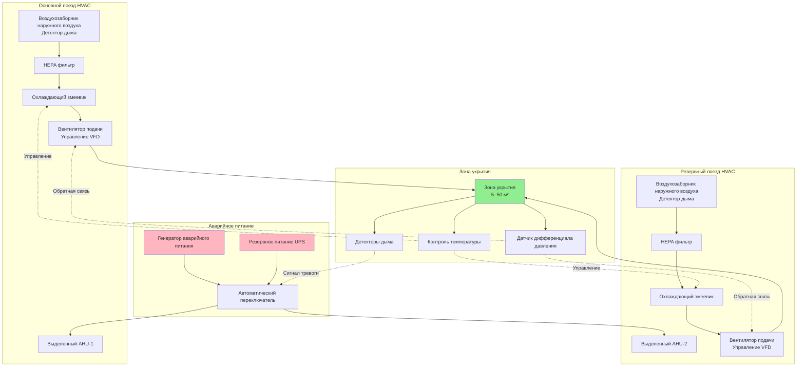

Независимые системы HVAC для зон укрытия обеспечивают выделенное экологическое управление, изолированное от основных механических систем здания. Эти специализированные установки гарантируют безопасность людей при пожарной чрезвычайной ситуации или других сценариях эвакуации путём сохранения приемлемых условий в обозначенных безопасных убежищах.

## Требования проектирования и соответствие коду

NFPA 101 Life Safety Code и IBC Section 1009.6 требуют определённых экологических условий для зон укрытия. Независимые системы HVAC должны поддерживать положительное давление относительно смежных пространств, обеспечивать адекватное поступление наружного воздуха и работать непрерывно в условиях чрезвычайной ситуации.

Минимальный дифференциал давления наддува обычно составляет 0,05–0,10 дюйма водяного столба (12,5–25 Па) относительно окружающих территорий. Это давление предотвращает проникновение дыма и позволяет открывать двери эвакуации с разумным усилием.

### Расчёт продолжительности подачи воздуха

Требуемая ёмкость подачи воздуха зависит от численности людей и требований к продолжительности аварийной работы:

$$V_{total} = N \cdot V_{person} \cdot t$$

Где:
- $V_{total}$ = общий требуемый объём воздуха (м³/ч)
- $N$ = расчётная численность людей (чел.)
- $V_{person}$ = наружный воздух на человека (минимум 8–10 м³/ч)
- $t$ = требуемая продолжительность работы (ч)

Для зоны укрытия, вмещающей 50 человек с 2-часовой продолжительностью аварийной работы:

$$V_{total} = 50 \times 10 \times 2 = 1000 \text{ м³/ч минимум}$$

### Определение размера холодильной мощности

Чувствительная охлаждающая нагрузка учитывает теплоотделение людей, освещение и передачу через ограждающие конструкции:

$$Q_{sensible} = (N \cdot 117) + (A \cdot U \cdot \Delta T) + Q_{lights}$$

Где:
- $Q_{sensible}$ = чувствительная охлаждающая нагрузка (кДж/ч)
- $N$ = численность людей
- $117$ = чувствительное теплоотделение на человека (кДж/ч)
- $A$ = площадь ограждающих конструкций (м²)
- $U$ = коэффициент теплопередачи (кДж/ч·м²·°C)
- $\Delta T$ = разность температур (°C)
- $Q_{lights}$ = теплоотделение от освещения (кДж/ч)

## Архитектура системы

## Сравнение конфигураций системы

| Конфигурация | Преимущества | Недостатки | Типовое применение |
|---------------|------------|---------------|---------------------|
| **100% резервирование (N+N)** | Полная резервная ёмкость; обслуживание без отключения | Высокая первоначальная стоимость; двойное пространство | Критические объекты; супервысокие здания >75 этажей |
| **Частичное резервирование (N+1)** | Сниженная стоимость капитала; полная ёмкость при отказе одного блока | Некоторая потеря ёмкости при обслуживании | Высотные здания 40–75 этажей |
| **Единственная система с резервированием компонентов** | Более низкая стоимость; меньший размер | Нет полного резервирования системы | Зоны укрытия среднеэтажных зданий <40 этажей с доступом пожарной службы |
| **Общая система с приоритетным управлением** | Минимальная стоимость; эффективное использование пространства | Зависит от основных систем здания | Низкоэтажные применения где разрешено органами юрисдикции |

## Критические элементы проектирования

### Выделенное оборудование

Независимые системы HVAC для зон укрытия работают как самостоятельные установки. Блоки приточно-вытяжной обработки, воздуховоды, органы управления и источники питания физически отделены от основной инфраструктуры HVAC здания. Эта изоляция гарантирует, что система зоны укрытия продолжает работать даже при отказе основных систем здания или их загрязнении.

Помещения оборудования должны располагаться на том же этаже, что и зона укрытия, или непосредственно выше/ниже с выделенными шахтами. Горизонтальные воздуховоды через незащищённые пространства должны избегаться или защищаться конструкцией, рассчитанной на 2-часовую огнестойкость.

### Интеграция аварийного питания

Подключение к аварийному питанию через автоматические переключатели (ATS) обеспечивает непрерывность при отказе сети. Типовая последовательность работает следующим образом:

1. Обнаружение отказа основного питания
2. ATS инициирует запуск генератора (задержка 10 секунд)
3. Генератор достигает стабильного напряжения/частоты
4. ATS переключает нагрузку на аварийное питание
5. Система HVAC возобновляет работу за 30 секунд в целом

Системы бесперебойного питания (UPS) мостят разрыв передачи для критических органов управления и датчиков дыма. Ёмкость батареи должна обеспечивать 15–30 минут работы панелей управления и датчиков.

### Качество воздуха и фильтрация

Фильтрация HEPA (минимум MERV 16 или H13) удаляет твёрдые частицы и дымовые частицы из воздухозаборника наружного воздуха. Предварительные фильтры (MERV 8–11) продлевают срок службы HEPA фильтра путём захвата больших частиц.

Воздухозаборники наружного воздуха должны располагаться для предотвращения загрязнения дымом. Типовые места включают:
- Уровень крыши с мониторингом детектора дыма
- Расширения башни выше наивысшего занимаемого этажа
- Наветренные фасады здания с множественными точками воздухозабора
- Защищённые ниши с автоматическим отсечным клапаном

### Контроль и мониторинг давления

Преобразователи частоты (VFD) на вентиляторах подачи модулируют расход воздуха для сохранения установленного дифференциала давления. Системы автоматизации зданий непрерывно контролируют:

- Дифференциал давления через границы зоны укрытия
- Статус детектора дыма на воздухозаборниках
- Температуру и расход подаваемого воздуха
- Рабочее состояние и неисправности оборудования

Дифференциал давления ниже установки запускает переопределение вентилятора на высокую скорость. Обнаружение дыма на любом воздухозаборнике автоматически закрывает связанные клапаны и переключает на альтернативные места воздухозабора.

### Стратегии резервирования

Полное резервирование N+N обеспечивает две полные системы HVAC, каждая рассчитана на 100% расчётной нагрузки. Обе системы работают во время чрезвычайной ситуации; любая система отдельно сохраняет условия, требуемые кодом.

Резервирование на уровне компонентов включает двойные вентиляторы параллельно, резервные охлаждающие змеевики с независимыми холодильными контурами и множественные пути воздухозабора наружного воздуха. Этот подход снижает капитальные затраты при сохранении надёжности.

## Испытания и пусконаладка

Функциональное тестирование производительности проверяет работу системы в условиях имитированной чрезвычайной ситуации:

- Тестирование дифференциала давления с открытыми/закрытыми дверями
- Упражнение автоматического переключателя под нагрузкой
- Активация детектора дыма и реакция клапана
- Тест работы генератора аварийного питания (минимум 90 минут)
- Контроль температуры во время имитации максимальной численности людей

Ежегодное тестирование в соответствии с NFPA 110 гарантирует постоянную готовность. Квартальные проверки проверяют состояние фильтра, работу клапана и калибровку системы управления.

## Рассмотрение вопросов обслуживания

Плановое обслуживание происходит в обычные рабочие часы без нарушения защиты зоны укрытия. Резервные системы позволяют отключить один поезд в режим обслуживания, пока резервная система остаётся работающей.

Критические задачи обслуживания включают:
- Ежемесячное упражнение генератора аварийного питания (30 минут под нагрузкой)
- Квартальный мониторинг дифференциала давления HEPA фильтра
- Полугодовое смазывание привода клапана и тестирование хода
- Ежегодная очистка охлаждающего змеевика и тестирование герметичности
- Двухгодичная проверка контактов ATS и тестирование нагрузочного банка

Интервалы замены фильтра зависят от качества наружного воздуха, но обычно варьируются от 6–24 месяцев для HEPA фильтров и 3–6 месяцев для предварительных фильтров. Передатчики дифференциала давления обеспечивают индикацию загрузки фильтра в реальном времени.
