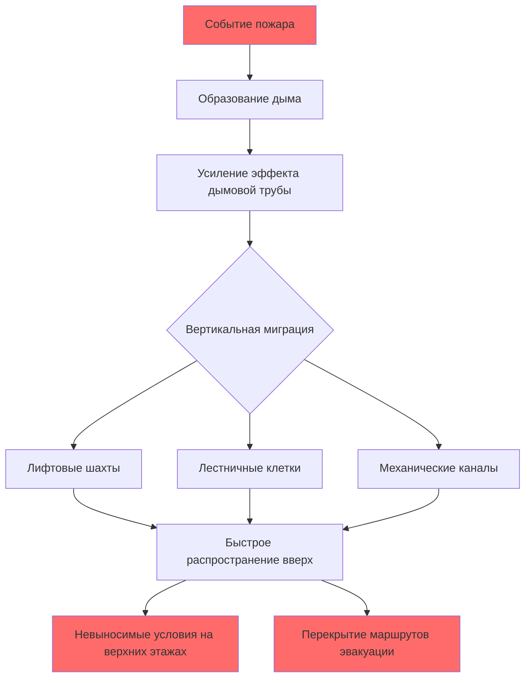
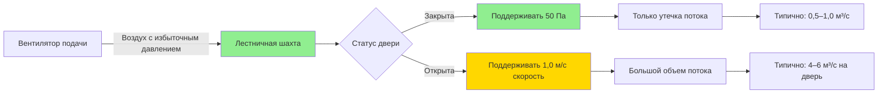

Управление дымом в высотных зданиях представляет уникальные проблемы, принципиально отличающиеся от конструкций малой высоты. Вертикальная высота усиливает естественные перепады давления, создавая мощные силы плавучести, которые могут быстро распространять дым по всему зданию. Эффективное управление дымом требует понимания физики эффекта дымовой трубы, внедрения стратегий создания избыточного давления и интеграции этих систем с HVAC инфраструктурой здания.

## Физика эффекта дымовой трубы и движение дыма

Эффект дымовой трубы в высотных зданиях создает перепады давления, которые определяют характер движения дыма. Плоскость нейтрального давления (PHP) делит здание на зоны давления с давлением ниже атмосферного на нижних этажах и выше атмосферного на верхних этажах.

Перепад давления, обусловленный эффектом дымовой трубы:

$$\Delta P_s = C_s h \rho_o \left(1 - \frac{T_o}{T_i}\right)$$

Где:
- $\Delta P_s$ = перепад давления из-за эффекта дымовой трубы (Па)
- $C_s$ = коэффициент эффекта дымовой трубы (обычно 0,000043 для системы СИ)
- $h$ = вертикальное расстояние от PHP (м)
- $\rho_o$ = плотность наружного воздуха (кг/м³)
- $T_o$ = абсолютная температура наружного воздуха (К)
- $T_i$ = абсолютная температура внутреннего воздуха (К)

Для здания высотой 200 м с перепадом температур 20°C перепад давления между верхним и нижним этажами достигает приблизительно 80–100 Па. Во время пожара температура дыма может превышать 600°C, создавая отношение температур $(T_i/T_o)$ 3:1 или выше, что резко усиливает силы плавучести.

Объемный расход дыма, образующегося при пожаре, зависит от скорости выделения тепла пожаром:

$$\dot{V}_s = 0.071 Q_c^{1/3} (T_s - T_a)$$

Где $\dot{V}_s$ — производство дыма (м³/с), $Q_c$ — скорость конвективного выделения тепла (кВт), $T_s$ и $T_a$ — температуры дыма и окружающего воздуха (К).

## Проблемы управления дымом в высотных зданиях

**Критические проблемы:**

1. **Миграция по вертикальным шахтам**: Незащищенные вертикальные шахты действуют как дымовые трубы, транспортируя продукты сгорания со скоростью 2–5 м/с в условиях эффекта дымовой трубы

2. **Инверсия давления**: Местоположение PHP смещается с изменением наружной температуры, вызывая непредсказуемые закономерности потоков воздуха в зависимости от сезона

3. **Пути утечки**: Производственные допуски создают зазоры вокруг дверей, дверей лифтов и проходок с типичными площадями утечки 0,01–0,02 м² на дверь

4. **Ветровые эффекты**: Динамическое ветровое давление накладывается на давление эффекта дымовой трубы, создавая флуктуирующие поля давления, которые варьируются в зависимости от ориентации и высоты здания

5. **Динамика этажа пожара**: Скорость выделения тепла в коммерческих помещениях может достигать 5–10 МВт, генерируя дым со скоростью 20–40 м³/с

## Стратегии создания избыточного давления

Создание избыточного давления в лестничных клетках и лифтовых шахтах создает барьеры давления, предотвращающие проникновение дыма в защищенные маршруты эвакуации.

### Проектные перепады давления

NFPA 92 указывает минимальные перепады давления через дымовые преграды:

| Место | Минимальное давление (Па) | Максимальное давление (Па) |
|-------|--------------------------|---------------------------|
| Лестничная клетка к зданию | 12,5 | 60 |
| Лифтовая шахта к зданию | 25 | 60 |
| Вестибюль к коридору | 12,5 | 60 |
| Помещение укрытия к зданию | 12,5 | 60 |

Максимальные давления ограничивают силы открывания дверей до примерно 130 Н согласно IBC раздел 1010.1.3.

### Расчеты воздушного потока для создания избыточного давления

Требуемый воздушный поток для поддержания перепада давления при закрытых дверях:

$$Q_L = 2610 A \sqrt{\frac{\Delta P}{\rho}}$$

Где:
- $Q_L$ = утечка воздушного потока (м³/с)
- $A$ = общая площадь утечки (м²)
- $\Delta P$ = перепад давления (Па)
- $\rho$ = плотность воздуха (кг/м³)

Для лестничной клетки с эффективной площадью утечки 0,4 м² и целевым перепадом 50 Па:

$$Q_L = 2610 \times 0,4 \times \sqrt{\frac{50}{1,2}} = 6720 \text{ м}^3/\text{ч}$$

При открывании дверей во время эвакуации требования к расходу воздуха резко возрастают. Поток через открытую дверь с поддержанием скорости $v$:

$$Q_d = 0.6 A_d v$$

Где $A_d$ — площадь двери (обычно 2,0 м²) и $v$ — скорость на входе (минимум 1,0 м/с согласно NFPA 92).

## Методы удаления дыма

### Выделенные системы удаления дыма

Механическое удаление дыма удаляет дым непосредственно с этажа пожара и с соседних уровней. Скорости выпуска зависят от геометрии здания и характеристик пожара.

Для зоны дыма с площадью $A$ и периметром $P$ требуемая скорость выпуска:

$$Q_e = \frac{P \times h \times v}{0.8}$$

Где $h$ — глубина слоя дыма (обычно 2,0–2,5 м) и $v$ — скорость подпиточного воздуха на отверстиях (0,5–1,0 м/с).

### Интеграция с системой HVAC

Существуют три подхода к интеграции:

| Стратегия | Описание | Преимущества | Ограничения |
|-----------|---------|-------------|-----------|
| **Выделенные системы** | Отдельные вентиляторы управления дымом и воздуховоды | Надежность, соответствие кодам, отсутствие помех | Более высокие затраты на установку, требования к пространству |
| **Двойного назначения HVAC** | Вентиляторы HVAC переключаются в режим управления дымом | Более низкие затраты, эффективное использование пространства | Требуются демпферы с рейтингом, сложное управление |
| **Пассивное удаление** | Удаление, управляемое естественной плавучестью | Не требует энергии, простота | Ненадежность, зависимость от погоды, ограниченная пропускная способность |

Большинство юрисдикций требуют выделенных систем согласно IBC раздел 909 для зданий, превышающих 55 м или содержащих атриумы.

### Управление дымом в зонах

Крупные этажи требуют разделения на зоны дыма, каждая с независимой способностью создания избыточного давления и удаления.

**Критерии проектирования:**
- Максимальная площадь зоны: 1850 м² согласно NFPA 92
- Минимальный рейтинг границы давления: огнестойкость 1 час
- Рейтинги дымовых демпферов: класс I (повышенная температура 250°C)
- Рейтинги выживания вентилятора: 400°C минимум 2 часа

## Последовательности управления и мониторинг

Современные системы управления дымом используют системы управления зданием (BMS) с интеграцией пожарной сигнализации. При активации тревоги:

1. **Немедленные действия** (0–5 секунд):
   - Активация вентиляторов создания давления в лестничных клетках
   - Закрытие дымовых демпферов на не пораженных этажах
   - Отзыв лифтов на обозначенные этажи

2. **Действия на этаже пожара** (5–15 секунд):
   - Запуск вытяжных вентиляторов для создания отрицательного давления
   - Открытие демпферов подпиточного воздуха на соседние этажи
   - Переключение HVAC в режим отключения

3. **Действия на соседних этажах** (5–15 секунд):
   - Поддержание нейтрального или слегка положительного давления
   - Непрерывный мониторинг перепадов давления

4. **Требования мониторинга**:
   - Датчики перепада давления каждые 3–5 этажей
   - Датчики скорости потока воздуха на критических путях подпиточного воздуха
   - Датчики положения дверей у входов в лестничные клетки
   - Датчики температуры в вытяжных каналах

Допуски управления давлением обычно составляют ±5 Па от заданного значения в установившихся условиях, расширяясь до ±10 Па при переходных операциях с дверями.

## Заключение

Эффективное управление дымом в высотных зданиях требует глубокого понимания динамики давления, тщательной интеграции с системами HVAC и надежных последовательностей управления. Усиление эффекта дымовой трубы в высотных конструкциях преобразует то, что было бы управляемым распространением дыма в малоэтажных зданиях, в быстрое загрязнение всего здания без надлежащих систем создания давления и удаления дыма. Проектирование должно учитывать сложное взаимодействие термической плавучести, механического создания давления, ветровых эффектов и закономерностей эвакуации людей для создания действительно эффективных систем защиты жизни.
