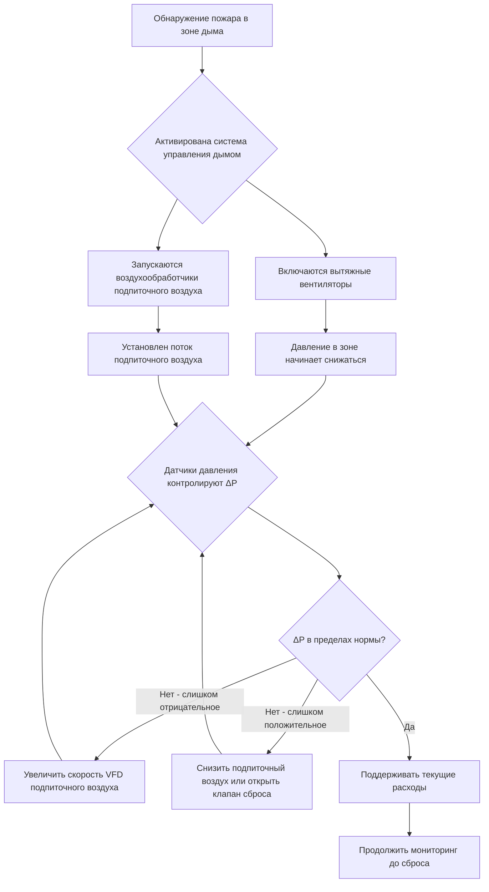
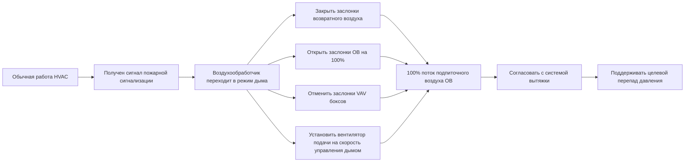

Системы подпиточного воздуха выполняют критическую функцию в операциях управления дымом путем замещения вытяжного воздуха для поддержания управляемых перепадов давления и предотвращения чрезмерного разрежения здания. Без надлежащо согласованного подпиточного воздуха системы вытяжки создают отрицательные давления, которые могут нарушить целостность лестничных клеток, затруднить открытие дверей эвакуации и втянуть дым в защищённые помещения через непреднамеренные пути.

## Объемный баланс и управление давлением

Фундаментальный принцип, определяющий требования к подпиточному воздуху, вытекает из закона сохранения массы. Когда системы дымовой вытяжки удаляют воздух из здания или зоны, замещающий воздух должен поступать через управляемые или неконтролируемые пути. Перепад давления через любую границу является результатом дисбаланса между исходящим и входящим потоками.

Для контрольного объёма, представляющего зону дыма, уравнение неразрывности даёт:

$$\dot{m}_{exhaust} = \dot{m}_{makeup} + \dot{m}_{leakage}$$

Где утечка воздуха происходит через строительные щели, шахты лифтов и другие непредусмотренные отверстия. Преобразование в объёмный расход при стандартных условиях:

$$Q_{makeup} = Q_{exhaust} - Q_{leakage}$$

Компонент утечки подчиняется уравнению отверстия, связывающему поток с перепадом давления:

$$Q_{leakage} = C \cdot A \cdot \sqrt{2 \Delta P / \rho}$$

Где $C$ представляет коэффициент расхода (0,6–0,7 для типичных строительных отверстий), $A$ — эффективную площадь утечки, а $\Delta P$ — перепад давления через ограждение здания или узел перекрытия.

## Определение объёма подпиточного воздуха

NFPA 92 предоставляет руководство по объёмам подпиточного воздуха, типично указывая, что 50–80 % расхода вытяжки должны подаваться как кондиционированный подпиточный воздух. Оставшиеся 20–50 % поступают через управляемые пути утечки, включая двери лестничных клеток и отверстия в ограждении здания.

| Соотношение подпиточного воздуха | Типичное применение | Перепад давления |
|-------|-----|-----|
| 100 % вытяжки | Герметизированные зоны, критические приложения | Минимальный (0–5 Па) |
| 80 % вытяжки | Стандартные полы высотных зданий | Низкий (5–12 Па) |
| 50–60 % вытяжки | Зоны с клапанами сброса | Умеренный (12–25 Па) |
| <50 % вытяжки | Неприемлемо — чрезмерное давление | Высокий (>25 Па) |

Выбор процента подпиточного воздуха предполагает балансирование нескольких факторов. Избыток подпиточного воздуха (приближение к 100 %) минимизирует перепады давления, но требует более крупных систем воздухообработки и энергетических затрат. Недостаточный подпиточный воздух создаёт отрицательные давления, которые могут превышать силы открытия дверей, предусмотренные строительными кодексами (обычно 30–133 Н в зависимости от назначения).

Максимальный допустимый перепад давления ограничивает силу открытия двери:

$$F_{door} = \frac{\Delta P \cdot A_{door} \cdot W}{2(W - d)}$$

Где $W$ — ширина двери, а $d$ — расстояние от рукоятки двери до края защёлки. IBC ограничивает эту силу значением 133 Н для дверей эвакуации.

## Расположение впускного отверстия подпиточного воздуха и предотвращение загрязнения

Впускные отверстия подпиточного воздуха требуют стратегического расположения для предотвращения попадания дыма. Расположение впускного отверстия должно учитывать влияние ветра, поведение дымного шлейфа и потенциальные сценарии пожара.

Подъём дымного шлейфа следует принципам поток, управляемого плавучестью. Для дымовыпуска с объёмным расходом $Q_{exhaust}$ и повышением температуры $\Delta T$:

$$h_{plume} = 1,5 \cdot Q_{exhaust}^{0,4} \cdot \Delta T^{0,6}$$

Это эмпирическое соотношение указывает на то, что впускные отверстия подпиточного воздуха, расположенные на противоположной грани здания или на уровне земли, минимизируют риск рециркуляции дыма. Вертикальное разделение между дымовым выпуском и впускным отверстием должно превышать трёхкратную высоту шлейфа, рассчитанную при условиях проектирования.

## Требования к температуре подпиточного воздуха

Введение больших объёмов наружного воздуха в зимних условиях без кондиционирования температуры создаёт дискомфорт для занятых лиц и потенциально опасные условия. Температура подпиточного воздуха влияет на силы плавучести и распределение давления в высоких зданиях.

Перепад давления эффекта тяги в вертикальной шахте:

$$\Delta P_{stack} = 3460 \cdot h \cdot \left(\frac{1}{T_{outdoor}} - \frac{1}{T_{indoor}}\right)$$

Где $h$ — высота в метрах, а температуры — в Кельвинах. Холодный подпиточный воздух при наружных зимних температурах (например, -20 °C), поданный в здание высотой 200 м, создаёт дополнительные восходящие силы давления, превышающие 100 Па, что может преодолеть перепады давления управления дымом.

IBC и NFPA 92 не требуют конкретных температур подпиточного воздуха, но практические соображения предполагают кондиционирование как минимум до 10–15 °C для ограничения помех эффекта тяги. Требуемая тепловая энергия:

$$Q_{heating} = \dot{m} \cdot c_p \cdot (T_{supply} - T_{outdoor})$$

Для системы подпиточного воздуха 50 000 CFM (847 м³/ч), обслуживающей несколько полов, кондиционирование от -20 °C до 15 °C требует примерно 1200 кВт тепловой мощности.

## Режимы управления дымом воздухообработчика

Стандартные воздухообработчики, обслуживающие полы высотных зданий, должны иметь режимы работы при управлении дымом, отличные от обычной работы HVAC. Переход включает переустановку заслонок, регулировку скорости вентилятора и координацию блокировок.

### Обычный режим HVAC
- Регулирование заслонок возвратного воздуха для управления температурой
- Заслонки наружного воздуха в минимальном положении (обычно 10–20 %)
- Вентиляторы подачи на переменной скорости на основе спроса в зоне
- Вентиляторы возврата/вытяжки, поддерживающие лёгкое избыточное давление в здании

### Режим управления дымом
- Заслонки возвратного воздуха полностью закрыты (предотвращают рециркуляцию дыма)
- Заслонки наружного воздуха полностью открыты (работа на 100 % наружного воздуха)
- Вентиляторы подачи на предопределённой скорости управления дымом (обычно 80–100 % мощности)
- Координация с выделенной системой дымовой вытяжки
- Отмена всех обычных элементов управления температурой

## Аварийная мощность и надёжность

Системы подпиточного воздуха, классифицированные как системы безопасности жизни, требуют подключения к аварийной мощности согласно требованиям NFPA 92 и IBC. Расчёт электрической нагрузки должен учитывать:

- Двигатели вентиляторов подачи подпиточного воздуха при полной нагрузке
- Нагревательные батареи (если электрические) или вентиляторы подачи воздуха горения (если газовые)
- Системы управления и приводы
- Системы мониторинга давления и блокировки

Аварийные генераторы должны достичь полного напряжения и частоты в течение 10 секунд после отказа нормального питания, при этом автоматический переключатель передачи поддерживает непрерывность. Резервное питание от аккумуляторов для систем управления мостит интервал передачи.

## Распределение подпиточного воздуха и проектирование воздуховодов

Распределение подпиточного воздуха требует воздуховодов с низкой скоростью потока для минимизации потерь давления, которые уменьшают доступную мощность вентилятора для преодоления сопротивления здания. Скорости в воздуховодах обычно варьируются от 5–10 м/с в сравнении с 10–20 м/с в обычных системах HVAC.

Потеря давления в воздуховодах подпиточного воздуха:

$$\Delta P_{duct} = f \cdot \frac{L}{D} \cdot \frac{\rho V^2}{2} + \sum K \cdot \frac{\rho V^2}{2}$$

Где $f$ — коэффициент трения, $L/D$ — отношение длины к диаметру, а $\sum K$ представляет сумму коэффициентов динамических потерь для фитингов и переходов.

Увеличенные воздуховоды уменьшают потери давления, но повышают стоимость конструкции и требования к пространству. Оптимизация балансирует первоначальную стоимость против энергопотребления вентилятора и надёжности. Увеличение диаметра воздуховода на 20 % снижает потерю давления примерно на 50 % при увеличении стоимости материалов на 20 %.

## Координация с системами вытяжки

Эффективное управление дымом требует точной координации между подачей подпиточного воздуха и дымовой вытяжкой. Последовательность управления должна предотвратить:

- Чрезмерное разрежение здания (>25 Па)
- Недостаточный перепад давления для движения дыма (<5 Па)
- Временную задержку между активацией вытяжки и подачей подпиточного воздуха
- Потоки подпиточного воздуха, которые препятствуют стратификации дыма

Датчики перепада давления, расположенные на критических границах (двери лестничных клеток, лобби лифтов, разделения зон), предоставляют обратную связь для частотных преобразователей, управляющих скоростью вентилятора подпиточного воздуха. Типичный алгоритм управления:

1. Вентиляторы вытяжки запускаются при обнаружении дыма
2. Вентиляторы подпиточного воздуха запускаются с задержкой 2–5 секунд
3. VFD подпиточного воздуха разгоняется до 80 % расхода вытяжки
4. Датчики давления измеряют фактический перепад после 30 секунд
5. VFD подстраивает ±10 % для достижения целевого перепада (8–15 Па)
6. Непрерывный мониторинг поддерживает перепад в пределах допуска

Этот подход управления с обратной связью учитывает вариации наружных условий ветра, утечки ограждения здания и положения дверей, которые влияют на фактическое распределение давления.
