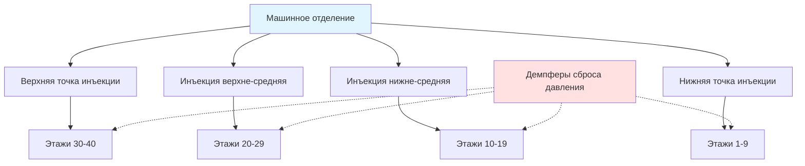
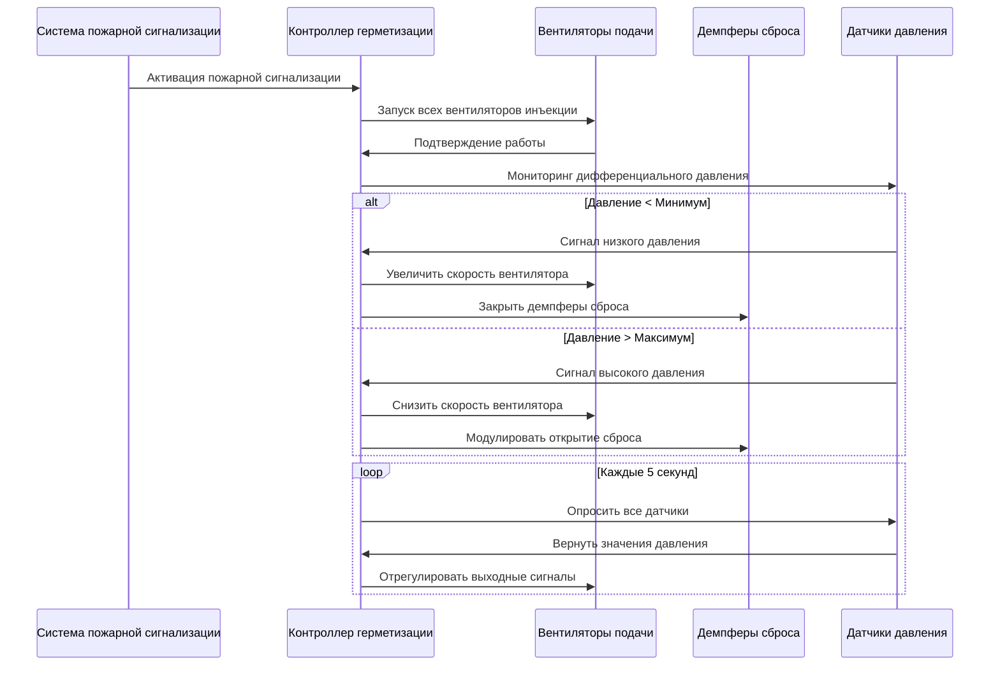

Герметизация лестничных клеток и шахт лифтов образует основную стратегию безопасности жизни в системах управления дымом высотных зданий. Эти системы создают барьеры с положительным давлением, которые предотвращают проникновение дыма в защищённые маршруты эвакуации и шахты лифтов во время пожара. Фундаментальная задача заключается в поддержании достаточного дифференциала давления для блокирования миграции дыма, при этом обеспечивая, чтобы двери оставались открываемыми в соответствии с пределами силы, установленными кодексом, на всей высоте здания, с учётом эффекта стека и температурных колебаний.

## Расчётные дифференциалы давления

Требуемый дифференциал давления на дымовых барьерах зависит от характеристик утечки сборки барьера и сил плавучести, вызывающих движение дыма. IBC раздел 909 и NFPA 92 устанавливают минимальные дифференциалы давления на основе конфигурации здания и конструкции барьера.

**Целевой дифференциал давления на закрытых дверях:**

$$\Delta P_{min} = 12,5 \text{ Па}$$

Этот минимум обеспечивает сдерживание дыма в большинстве сценариев пожара. Для повышенной надёжности проектные значения обычно находятся в диапазоне 25–75 Па. Дифференциал давления создаёт барьер скорости через зазоры дверей и пути утечки.

Скорость через пути утечки барьера следует принципу Бернулли:

$$v = C \sqrt{\frac{2\Delta P}{\rho}}$$

Где:
- $v$ = скорость воздуха через отверстие (м/с)
- $C$ = коэффициент расхода (обычно 0,6–0,7 для зазоров дверей)
- $\Delta P$ = дифференциал давления (Па)
- $\rho$ = плотность воздуха (кг/м³)

Для дифференциала давления 25 Па при воздухе при 20°C ($\rho$ = 1,20 кг/м³):

$$v = 0,65 \sqrt{\frac{2 \times 25}{1,20}} = 4,2 \text{ м/с}$$

Эта скорость превышает типичные скорости миграции дыма, эффективно блокируя проникновение дыма.

## Пределы силы открывания дверей

Сила, необходимая для открывания двери против дифференциала давления, создаёт фундаментальное ограничение проекта. IBC раздел 1010.1.3 ограничивает силу открывания двери до 133 Н, хотя требования доступности в соответствии с IBC/ANSI A117.1 обычно ограничивают это до 67 Н для внутренних дверей.

Требуемая сила открывания состоит из двух компонентов: силы давления и силы закрывающего устройства.

$$F_{open} = F_{pressure} + F_{closer} + F_{friction}$$

Компонент давления действует на площадь двери:

$$F_{pressure} = \Delta P \times A_{door} \times \frac{w}{2}$$

Где:
- $A_{door}$ = площадь двери (м²)
- $w$ = ширина двери (м)
- Коэффициент $w/2$ представляет эффективное плечо момента

Для стандартной двери 0,91 м × 2,13 м под давлением 50 Па:

$$F_{pressure} = 50 \times (0,91 \times 2,13) \times \frac{0,91}{2} = 44 \text{ Н}$$

Это оставляет минимальный запас для сил закрывающего устройства и трения, демонстрируя, почему механизмы сброса давления становятся необходимыми при более высоких дифференциалах.

## Компенсация эффекта стека

Эффект стека создаёт естественные градиенты давления в высотных зданиях, которые наложены на механическую систему герметизации. Дифференциал давления эффекта стека увеличивается с вертикальным расстоянием:

$$\Delta P_{stack} = 3460 \times h \left(\frac{1}{T_o} - \frac{1}{T_i}\right)$$

Где:
- $\Delta P_{stack}$ = давление эффекта стека (Па)
- $h$ = вертикальное расстояние от нейтральной плоскости (м)
- $T_o$ = абсолютная температура на улице (K)
- $T_i$ = абсолютная температура в помещении (K)

Для здания высотой 100 м с $T_i$ = 293 K (20°C) и $T_o$ = 263 K (-10°C):

$$\Delta P_{stack} = 3460 \times 100 \left(\frac{1}{263} - \frac{1}{293}\right) = 133 \text{ Па}$$

Этот значительный градиент давления требует распределения переменного расхода подаваемого воздуха для поддержания равномерных дифференциалов давления на всех этажах.

## Стратегия множественных точек инъекции

Для компенсации эффекта стека и поддержания равномерной герметизации, инъекция подаваемого воздуха происходит в несколько вертикальных мест по всей лестничной клетке или шахте. Расстояние и распределение расхода точек инъекции вытекают из анализа градиента давления.

Оптимальное расстояние инъекции зависит от высоты здания и расчётного дифференциала давления. Типичный подход распределяет точки инъекции каждые 10–15 этажей в зданиях выше 30 этажей.

**Распределение расхода точек инъекции:**

| Местоположение инъекции | Обслуживаемые этажи | Типичное отношение расхода | Компенсация эффекта стека |
|------------------------|-------------------|--------------------------|---------------------------|
| Верхняя инъекция | 30–40 | 1,0× базовый | Противодействие отрицательному стеку |
| Инъекция верхне-средняя | 20–29 | 1,2× базовый | Умеренная компенсация |
| Инъекция нижне-средняя | 10–19 | 1,5× базовый | Сильная компенсация |
| Нижняя инъекция | 1–9 | 1,8× базовый | Максимальное противодействие стеку |

## Методология расчёта вентилятора

Производительность вентилятора герметизации должна учитывать полную утечку системы при расчётном дифференциале давления. Расчёт площади утечки следует методологии NFPA 92.

Требование полного расхода воздуха системы:

$$Q_{total} = A_{leakage} \times v_{avg} + Q_{door}$$

Где:
- $A_{leakage}$ = общая эффективная площадь утечки (м²)
- $v_{avg}$ = средняя скорость через пути утечки (м/с)
- $Q_{door}$ = запас на события открывания двери (м³/с)

Оценка площади утечки использует значения, зависящие от конструкции:

| Тип конструкции | Площадь утечки на этаж | Основание |
|-----------------|----------------------|-----------|
| Плотная конструкция (герметичные шахты) | 0,04–0,06 м²/этаж | Двери с прокладками, герметичные проходы |
| Средняя конструкция | 0,08–0,12 м²/этаж | Стандартные двери, типичные проходы |
| Свободная конструкция | 0,15–0,25 м²/этаж | Двери без прокладок, плохая герметизация |

Для лестничной клетки на 30 этажей со средней конструкцией (0,10 м²/этаж утечка) при расчётном давлении 50 Па:

$$v_{avg} = 0,65 \sqrt{\frac{2 \times 50}{1,20}} = 5,9 \text{ м/с}$$

$$Q_{leakage} = (30 \times 0,10) \times 5,9 = 17,7 \text{ м}^3\text{/с}$$

Добавление 30% для одновременного открывания дверей:

$$Q_{total} = 17,7 \times 1,3 = 23,0 \text{ м}^3\text{/с}$$

## Координация сброса давления

Демпферы сброса давления или барометрические сбросы предотвращают избыточное давление, когда двери остаются закрытыми. Демпферы сброса открываются, когда давление превышает порог силы открывания двери, обычно устанавливаемый на 35–60 Па.

Расчёт размера демпфера сброса следует максимально ожидаемому сценарию давления:

$$A_{relief} = \frac{Q_{total}}{v_{relief} \times C}$$

Где $v_{relief}$ соответствует точке установки сброса дифференциала давления.

## Архитектура последовательности управления

Системы герметизации требуют сложных последовательностей управления для поддержания расчётных дифференциалов в различных состояниях дверей и сценариях пожара.

Система управления должна поддерживать герметизацию в трёх различных режимах работы:

1. **Все двери закрыты** – максимальное давление, демпферы сброса модулируют
2. **Одна дверь открыта** – умеренное давление, повышенный выход вентилятора
3. **Несколько дверей открыты** – минимально приемлемое давление, максимальный выход вентилятора

**Сравнение стратегий управления:**

| Стратегия управления | Время отклика | Сложность | Надёжность | Стоимость |
|---------------------|--------------|-----------|-----------|-----------|
| Вентиляторы фиксированной скорости с демпферами сброса | Медленно (5–10 с) | Низкая | Высокая | Низкая |
| Вентиляторы переменной скорости с обратной связью по давлению | Быстро (1–3 с) | Средняя | Высокая | Средняя |
| Многоступенчатые вентиляторы с зональным управлением | Умеренно (3–5 с) | Высокая | Очень высокая | Высокая |
| Гибридный VFD + демпферы барометрического сброса | Быстро (1–2 с) | Средняя | Очень высокая | Средняя-высокая |

Гибридный подход, сочетающий управление VFD с демпферами барометрического сброса, обеспечивает оптимальную производительность, поддерживая быстрое реагирование на события открывания дверей, при этом обеспечивая защиту потолка давления посредством пассивного сброса.

## Проверка проекта путём испытаний

NFPA 92 требует испытаний производительности для проверки того, что установленные системы отвечают расчётным дифференциалам давления при смоделированных условиях пожара. Испытания включают измерения давления на каждом уровне этажа с закрытыми дверями, с одной открытой дверью и с несколькими открытыми дверями. Критерии приёмки требуют поддержания минимального дифференциала 12,5 Па во всех случаях при соблюдении максимальных сил открывания дверей.

Полевые корректировки распределения расхода инъекции и настроек демпферов сброса обычно достигают соответствия, когда основной расчёт доказывает адекватность. Значительные отклонения указывают на дефициты проекта, требующие модернизации производительности вентилятора или мер по снижению утечки.
