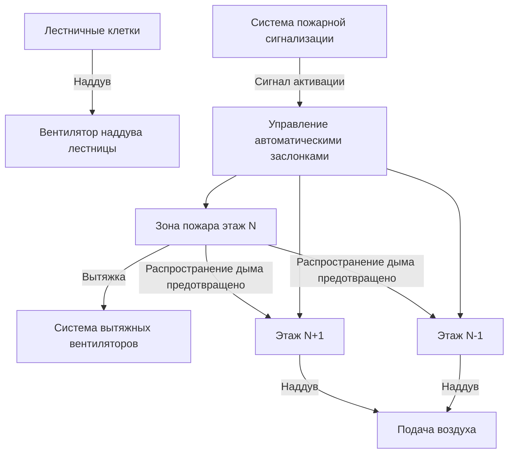
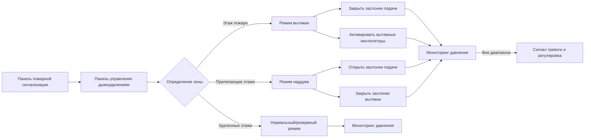
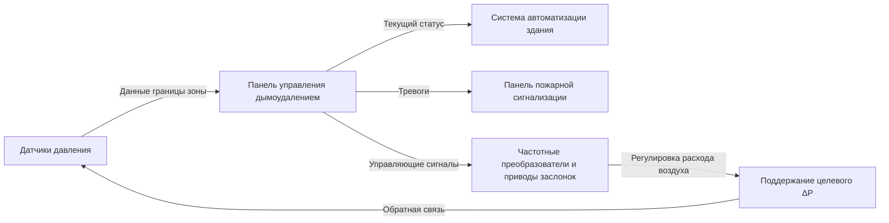

Зонированное дымоудаление разделяет высокие здания на отдельные зоны дымоудаления, как правило, по этажам, для локализации дыма в зоне пожара, одновременно поддерживая приемлемые условия в прилегающих помещениях и путях эвакуации. Этот подход использует скоординированную вытяжку, наддув и управление воздушными потоками для создания предсказуемых перепадов давления, которые предотвращают распространение дыма.

## Фундаментальная физика зонированного дымоудаления

Движение дыма в зданиях подчиняется законам градиента давления. Воздух течет из областей высокого давления в области низкого давления согласно:

$$Q = C \cdot A \cdot \sqrt{2\Delta P / \rho}$$

Где:
- $Q$ = объемный расход воздуха (м³/с)
- $C$ = коэффициент расхода (обычно 0,6–0,7)
- $A$ = площадь утечки (м²)
- $\Delta P$ = перепад давления (Па)
- $\rho$ = плотность воздуха (кг/м³)

Перепад давления, необходимый для предотвращения распространения дыма, зависит от сил плавучести горячего дыма и характеристик утечки границ зоны. Для эффективного дымоудаления система должна преодолеть эффект стека (stack effect), ветровые воздействия и тепловую плавучесть.

### Рассмотрение эффекта стека

В высоких зданиях перепад давления из-за эффекта стека на любой высоте составляет:

$$\Delta P_s = \frac{P_0 \cdot g \cdot h \cdot (T_o - T_i)}{T_o \cdot T_i}$$

Где:
- $P_0$ = атмосферное давление (Па)
- $g$ = ускорение свободного падения (9,81 м/с²)
- $h$ = высота выше нейтральной плоскости (м)
- $T_o$ = наружная температура (К)
- $T_i$ = внутренняя температура (К)

Системы зонированного дымоудаления должны обеспечивать перепады давления, превышающие силы эффекта стека, обычно 25–75 Па по границам зон согласно NFPA 92.

## Определение зоны дымоудаления и границы зон

Границы зон должны сопротивляться как утечке воздуха, так и проникновению дыма. Каждая зона дымоудаления физически определяется по:

| Граничный элемент | Требование конструкции | Типовая площадь утечки |
|------------------|--------------------------|----------------------|
| Перекрытие этажа | Огнестойкая конструкция | 0,0001–0,0003 м²/м² |
| Стены шахт | Огнестойкость 2 часа | 0,00015 м²/м² |
| Двери | Автоматического закрывания с уплотнением | 0,01–0,02 м² на дверь |
| Заслонки | Дымо- и огнестойкие | 0,005–0,01 м² в закрытом состоянии |
| Проходки | Герметизированные | Переменная, минимизировать |

Площадь утечки границ зон прямо влияет на требуемые расходы воздуха. Одно незаплотненное отверстие может скомпрометировать способность дымоудаления всей зоны.

## Стратегия вытяжки и наддува этаж за этажом

Типовая последовательность работы зонированной системы дымоудаления следующая:

**Этаж пожара (зона N):**
1. Подача воздуха HVAC отключается через автоматические заслонки
2. Заслонки рециркуляции закрываются
3. Активируются специализированные вытяжные вентиляторы (или воздухозаборник HVAC переводится на вытяжку)
4. Целевое давление: −25 до −40 Па относительно прилегающих этажей

**Прилегающие этажи (N+1, N−1):**
1. Подача воздуха HVAC увеличивается или активируются специализированные вентиляторы наддува
2. Заслонки рециркуляции/вытяжки закрываются или модулируют
3. Целевое давление: +25 до +40 Па относительно этажа пожара
4. Перепад давления поддерживается: 50–80 Па по покрытиям этажей

**Удаленные этажи:**
- Нормальная работа HVAC или этапная подача наддува
- Вестибюли лифтов могут получать дополнительный наддув
- Наддув лестничной клетки работает независимо

### Расчеты расходов воздуха

Требуемый расход вытяжки с этажа пожара:

$$Q_{exhaust} = \frac{A_{leak} \cdot \sqrt{2 \cdot \Delta P_{target} / \rho}}{C}$$

Для типичного этажа площадью 4000 м² и коэффициентом утечки 0,0002 м²/м²:

$$A_{leak} = 4000 \times 0,0002 = 0,8 \text{ м}^2$$

С целевым $\Delta P = 50$ Па:

$$Q_{exhaust} = \frac{0,8 \cdot \sqrt{2 \cdot 50 / 1,2}}{0,65} \approx 9,4 \text{ м}^3/\text{с} = 33\,840 \text{ м}^3/\text{ч}$$

Это представляет минимальную вытяжную производительность; реальный проект включает коэффициенты безопасности (1,5–2,0) и учитывает открытие дверей, которое может увеличить требуемый расход на 200–400%.

## Интеграция с системой HVAC

Эффективное зонированное дымоудаление интегрируется с системой HVAC здания через несколько путей:

### Методы интеграции

**Специализированная система дымоудаления:**
- Отдельные вентиляторы, воздуховоды и заслонки
- Наибольшая надежность, но наибольшая стоимость
- Типична для супер высотных зданий (>150 м)

**Преобразование системы HVAC:**
- Существующее оборудование HVAC переназначается во время пожара
- Вентиляторы рециркуляции преобразуются в функцию вытяжки
- Вентиляторы подачи обеспечивают наддув
- Более низкая стоимость, но требует тщательного проектирования
- Адекватна для большинства высотных приложений

**Гибридный подход:**
- Специализированная вытяжка для этажа пожара
- Система HVAC обеспечивает наддув
- Баланс стоимости и производительности

## Управление автоматическими заслонками

Производительность заслонок критична для изоляции зоны. Каждая зона требует:

| Тип заслонки | Местоположение | Метод привода | Класс утечки |
|-------------|----------|------------------|---------------|
| Дымо-/огнестойкая | Проходки границ этажей | Отказоустойчивое пружинное возвращение | Класс I (≤0,0006 м³/с·м² @ 250 Па) |
| Комбинированная дымо-/огнестойкая | Изоляция воздухообрабатывающего устройства | Электрический/пневматический с пружинным возвращением | Класс I |
| Дымовая | Управление наддувом | Модулирующий электрический/пневматический | Класс II (≤0,003 м³/с·м² @ 250 Па) |
| Вытяжная | Вытяжка этажа пожара | Обычно закрыта, с электроприводом открытия | Класс I |

Время отклика заслонки не должно превышать 60 секунд от сигнала тревоги до полного перемещения согласно IBC раздел 909.10. Последовательности управления должны учитывать время движения заслонки в расчетах отклика системы.

### Модуляция заслонки с обратной связью по давлению

Продвинутые системы используют обратную связь по давлению для модуляции заслонок:

$$A_{effective} = A_{max} \cdot f(\theta)$$

Где угол открытия заслонки $\theta$ регулируется для поддержания целевого давления. Алгоритмы управления обычно используют логику PID с коэффициентами, настроенными на характеристики отклика конкретного здания.

## Мониторинг перепада давления и поддержание

IBC раздел 909.12 и NFPA 92 требуют непрерывного мониторинга давления по границам зон. Минимальные перепады давления:

- Этаж пожара к прилегающему этажу: 12,5 Па (0,05 дюйма в.ст.) минимум
- Типовой целевой проект: 25–50 Па
- Максимум: 75–100 Па (чрезмерное давление затрудняет открытие дверей)

Требования к размещению датчиков:
- Один датчик на интерфейс границы зоны
- Размещен вдали от точек подачи/вытяжки (минимум 1 м)
- Установлен на уровне головы двери или середины этажа
- Калибруется ежегодно с точностью ±2,5 Па

## Проверка проекта с помощью компьютерного моделирования

NFPA 92 раздел 4.7 требует компьютерного моделирования для сложных систем зонированного дымоудаления. Модели должны учитывать:

1. **Анализ путей утечки** – Все двери, стены, шахты и проходки
2. **Переходные эффекты** – События открытия дверей, последовательности запуска вентиляторов
3. **Взаимодействие HVAC** – Потери давления в воздуховодах, кривые производительности вентиляторов
4. **Условия окружающей среды** – Расчетные скорости ветра, экстремальные температуры
5. **Эффект стека** – Зависящие от высоты градиенты давления

Валидация модели по измеренным данным утечки в здании повышает точность. Испытания при вводе в эксплуатацию должны продемонстрировать давления в пределах ±20% от предсказанных моделью.

## Соображения по надежности работы

Эффективность зонированного дымоудаления зависит от:

- **Целостность границ**: Регулярная проверка уплотнений, прокладок и герметизации проходок
- **Поддержание производительности вентилятора**: Загрязнение фильтра снижает доступное давление
- **Функциональность заслонок**: Требуется квартальное испытание срабатывания
- **Проверка системы управления**: Ежегодное испытание последовательности операций
- **Поведение персонала**: Обучение по поддержанию закрытыми дверей во время тревог

Режимы отказа системы включают недостаточную вытяжную производительность, неисправность заслонок и скомпрометированные границы зон. Резервирование в критических компонентах (двойные вентиляторы, резервное питание) повышает надежность в наиболее критичных приложениях спасения жизни.

---

**File:** `/Users/evgenygantman/Documents/github/gantmane/hvac/content/specialty-applications-testing/specialty-hvac-applications/tall-buildings-high-rise-hvac/smoke-control-tall-buildings/zoned-smoke-control/_index.md`
