Эффект стека, также известный как дымоходный эффект, представляет собой один из наиболее значительных явлений движения воздуха в высоких зданиях. Этот природный перепад давления возникает из-за разницы плотности воздушных масс внутри и снаружи здания при различных температурах. Понимание и контроль эффекта стека являются важными для проектирования функциональных систем HVAC в высотных конструкциях.

## Физическая основа эффекта стека

Эффект стека возникает из принципа, что теплый воздух менее плотен, чем холодный воздух. В зимних условиях нагретый воздух в здании становится более легким относительно холодного наружного воздуха. Эта выталкивающая сила создает восходящий поток воздуха в конверте здания, устанавливая распределение давления, при котором нижние этажи испытывают отрицательное давление (инфильтрация), а верхние этажи испытывают положительное давление (экфильтрация). Явление меняется на противоположное летом, когда наружные температуры превышают внутренние, хотя величина обычно меньше из-за уменьшенных перепадов температур.

Движущий перепад давления на конверте здания на любой высоте можно рассчитать с помощью уравнения эффекта стека из справочника ASHRAE Fundamentals:

$$\Delta P = C \cdot h \cdot \left(\frac{1}{T_o} - \frac{1}{T_i}\right)$$

Где:
- $\Delta P$ = разница давления, Па
- $C$ = 3460 для единиц СИ (7,64 для I-P единиц)
- $h$ = вертикальное расстояние от плоскости нейтрального давления, м
- $T_o$ = абсолютная наружная температура, К
- $T_i$ = абсолютная внутренняя температура, К

Эта зависимость показывает, что давление эффекта стека растет линейно с высотой и пропорционально перепаду температур.

## Плоскость нейтрального давления

Плоскость нейтрального давления (ПНД) представляет высоту, на которой внутреннее и внешнее давление равны. Выше ПНД внутреннее давление превышает внешнее. Ниже ПНД отношение меняется. Расположение ПНД зависит от распределения утечек в здании, работы системы HVAC и конфигурации шахт.

Для здания с равномерным распределением утечек и без механического нагнетания давления, ПНД обычно находится вблизи середины высоты. Однако концентрация утечек в лифтовых шахтах, лестничных клетках и механических проходках смещает положение ПНД. Намеренное нагнетание давления через системы HVAC может также манипулировать положением ПНД для контроля характера потока воздуха.

Высота ПНД может быть приблизительно определена по формуле:

$$h_{NPP} = \frac{H}{1 + \sqrt{A_t/A_b}}$$

Где:
- $h_{NPP}$ = высота плоскости нейтрального давления, м
- $H$ = общая высота здания, м
- $A_t$ = площадь утечки в верхней части, м²
- $A_b$ = площадь утечки в нижней части, м²

## Влияние эффекта стека в зависимости от высоты здания

| Высота здания | Типичная зимняя ΔT | Максимальный перепад давления | Основные проблемы |
|-----------------|-------------------|---------------------------|------------------|
| 10-20 этажей (30-60 м) | 40°C | 15-30 Па | Инфильтрация, незначительные проблемы с работой дверей |
| 20-40 этажей (60-120 м) | 40°C | 30-60 Па | Значительная инфильтрация, утечки дверей лифтов, затрудненное открывание дверей |
| 40-60 этажей (120-180 м) | 40°C | 60-90 Па | Значительные нагрузки инфильтрации, нагнетание давления в шахте лифта, силы открывания дверей превышают нормы доступности |
| 60+ этажей (180+ м) | 40°C | 90+ Па | Экстремальная инфильтрация, требуется разделение на отсеки, необходимы специальные системы вестибюлей |

Примечание: Значения предполагают равномерную внутреннюю температуру и отсутствие механического нагнетания давления. Фактические давления варьируются в зависимости от распределения утечек и работы HVAC.

## Последствия для проектирования HVAC

Эффект стека создает множество проблем для эксплуатации здания:

**Нагрузки инфильтрации**: Инфильтрация, вызванная эффектом стека, вводит неондиционированный наружный воздух, который должен быть нагрет или охлажден. На нижних этажах зимой эта инфильтрация может представлять 10-30% от общей нагрузки на отопление. Объемная скорость инфильтрации растет с квадратным корнем перепада давления.

**Силы открывания дверей**: Перепады давления создают силы, препятствующие открыванию дверей. Перепад давления в 50 Па на стандартной двери шириной 1 м создает примерно 100 Н дополнительной силы открывания, потенциально превышая требования доступности ADA в 67 Н максимум.

**Проблемы с системой лифта**: Шахты лифтов действуют как непрерывные вертикальные каналы, усиливающие эффект стека. Перепады давления вызывают значительные силы закрывания или открывания дверей лифтов, потенциально нарушая системы безопасности. Утечка через двери лифтов передает воздух между этажами, вызывая жалобы на комфорт.

**Нагнетание давления в лестничной клетке**: Эффект стека препятствует системам нагнетания давления в лестничных клетках для защиты от пожара. Зимний эффект стека может чрезмерно нагнетать давление на верхних уровнях лестничной клетки, в то время как недостаточно нагнетает на нижних уровнях, нарушая работоспособность дверей эвакуации.

## Характеры потока воздуха эффекта стека

```mermaid
graph TD
    subgraph "Зимний эффект стека"
    W1[Холодный наружный воздух<br/>Более высокая плотность]
    W2[Нижние этажи<br/>Отрицательное давление<br/>Инфильтрация]
    W3[Плоскость нейтрального давления<br/>Нулевой перепад давления]
    W4[Верхние этажи<br/>Положительное давление<br/>Экфильтрация]
    W5[Теплый внутренний воздух<br/>Более низкая плотность<br/>Поднимается]

    W1 -->|Входит| W2
    W2 --> W3
    W3 --> W4
    W4 -->|Выходит| W5
    end

    subgraph "Летний эффект стека"
    S1[Горячий наружный воздух<br/>Более низкая плотность]
    S2[Верхние этажи<br/>Отрицательное давление<br/>Инфильтрация]
    S3[Плоскость нейтрального давления<br/>Нулевой перепад давления]
    S4[Нижние этажи<br/>Положительное давление<br/>Экфильтрация]
    S5[Прохладный внутренний воздух<br/>Более высокая плотность<br/>Опускается]

    S1 -->|Входит| S2
    S2 --> S3
    S3 --> S4
    S4 -->|Выходит| S5
    end

    style W3 fill:#90EE90
    style S3 fill:#90EE90
```

## Стратегии снижения

Эффективное управление эффектом стека использует множество стратегий:

**Разделение на отсеки**: Разделение здания на вертикальные зоны, разделенные барьерами, прерывает непрерывную колонну эффекта стека. Каждая зона развивает независимый эффект стека с уменьшенной величиной.

**Нагнетание давления в шахтах**: Механическое нагнетание давления в шахтах лифтов и лестничных клетках противодействует естественным градиентам давления. Этот подход требует тщательной балансировки, чтобы избежать создания новых проблем, связанных с давлением.

**Нагнетание давления в здании**: Поддержание легкого положительного давления во всех занятых помещениях снижает инфильтрацию, вызванную эффектом стека. Эта стратегия увеличивает потребление энергии, но обеспечивает лучший контроль.

**Вестибюли и вращающиеся двери**: Системы с несколькими дверями на уровне земли снижают прямые воздушные пути между внешней и внутренней частями, ограничивая эффективность перепадов давления в создании потока воздуха.

**Повышенная герметичность конверта**: Снижение площади утечки конверта, особенно в проходках шахт и на крайних точках здания, снижает скорости потока воздуха при заданных перепадах давления.

Эффект стека не может быть исключен в высоких зданиях, но понимание его физической основы позволяет проектировщикам предсказать его величину и реализовать надлежащие стратегии контроля. Точный анализ эффекта стека во время проектирования предотвращает операционные проблемы и снижает потребление энергии на протяжении всего жизненного цикла здания.
