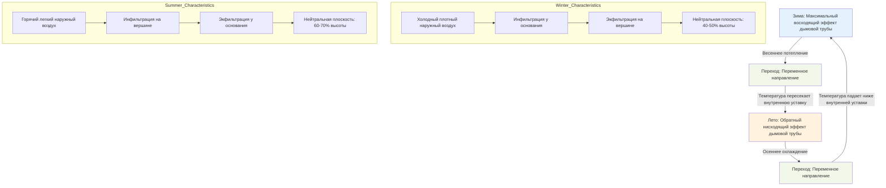

Эффект дымовой трубы в высотных зданиях следует предсказуемому годовому циклу, обусловленному сезонными различиями температур между внутренней и внешней средой. Величина и направление потока воздуха, вызванного эффектом дымовой трубы, варьируются в течение года, создавая различные операционные проблемы для каждого сезона, требующие адаптивных стратегий HVAC и методов управления давлением.

## Механика сезонного перепада давления

Движущая сила для изменения эффекта дымовой трубы непрерывно меняется по мере изменения внешней температуры в течение года. Перепад давления на любой высоте соответствует фундаментальному соотношению:

$$\Delta P = \rho_o g h \left(1 - \frac{T_o}{T_i}\right)$$

Где $\rho_o$ — плотность наружного воздуха, $g$ — ускорение свободного падения, $h$ — высота над нейтральной плоскостью, $T_o$ — абсолютная температура наружного воздуха, $T_i$ — абсолютная температура внутреннего воздуха.

Максимальный перепад давления эффекта дымовой трубы возникает во время зимних условий, когда разница температур $(T_i - T_o)$ достигает своего годового максимума. Для здания, поддерживающего внутреннюю температуру 21°C (294 K):

$$\Delta P_{max} = \frac{3460 \cdot h \cdot \Delta T}{T_{avg}}$$

Где $h$ — в метрах, $\Delta T$ — разница температур в Кельвинах, $T_{avg}$ — средняя абсолютная температура.

## Зимний максимум эффекта дымовой трубы

Зима производит наиболее суровые условия эффекта дымовой трубы из-за максимальных перепадов температур между внутренним и наружным воздухом. Холодный, плотный наружный воздух создает сильную инфильтрацию в нижних уровнях, в то время как теплый внутренний воздух с силой выходит наружу в верхних уровнях.

**Характеристики зимы:**
- Максимальные перепады давления на ограждающей конструкции здания
- Нейтральная плоскость обычно находится на 40-50% высоты здания
- Самый сильный восходящий поток воздуха в шахтах и вертикальных проходах
- Пиковые потери энергии через инфильтрацию и экфильтрацию
- Максимальные силы открытия дверей лифтов
- Наибольшее сопротивление дверей вращающегося входа в холл

ASHRAE Standard 62.1 рекомендует поддерживать давление в здании в пределах от -5 Па до +12 Па относительно наружного давления. Зимний эффект дымовой трубы регулярно превышает эти значения в высотных зданиях без активного управления давлением.

## Летнее изменение направления эффекта дымовой трубы

Летом, когда внешние температуры превышают внутренние уставки, эффект дымовой трубы меняет направление. Горячий наружный воздух в верхних уровнях создает положительное давление, вызывая инфильтрацию вниз через здание.

**Условия летнего изменения направления:**
- Обратные потоки воздуха (направленные вниз в шахтах)
- Нейтральная плоскость смещается на верхние уровни здания (60-70% высоты)
- Пониженные значения давления по сравнению с зимой
- Проблемы для систем дымоудаления, рассчитанных на восходящий поток
- Увеличенные охлаждающие нагрузки на верхних этажах из-за инфильтрации горячего воздуха
- Возможность проникновения влаги на уровне пентхауса

Изменение направления происходит, когда:

$$T_o > T_i + \frac{P_{fan}}{\rho_o g h}$$

Где $P_{fan}$ представляет любой эффект наддува от систем HVAC.

## Проблемы переходных периодов

Весенние и осенние переходные сезоны представляют уникальные операционные проблемы, так как наружные температуры колеблются вокруг внутренних уставок. Нейтральная плоскость становится нестабильной, смещаясь вертикально в течение дня.

**Проблемы переходного периода:**
- Множественные ежедневные изменения направления эффекта дымовой трубы
- Непредсказуемое распределение давления
- Нестабильность систем управления
- Жалобы на дискомфорт у занимающихся лиц из-за изменяющейся инфильтрации
- Сложность поддержания последовательного наддува здания
- Ненадежность систем дымоудаления

В эти периоды суточные колебания температуры могут вызвать смещение нейтральной плоскости на 20-30 этажей в крупных высотных зданиях, создавая переходные условия давления, которые нагружают двери, окна и системы фасада.

## Вариации в климатических зонах

Годовой цикл эффекта дымовой трубы значительно различается в зависимости от климатической зоны:

**Холодные климаты (ASHRAE Zones 6-8):**
- Доминирующий зимний эффект дымовой трубы в течение 5-7 месяцев
- Минимальное летнее изменение направления
- Краткие переходные периоды

**Умеренные климаты (ASHRAE Zones 3-5):**
- Значительные зимний и летний эффекты
- Продленные переходные периоды с частыми изменениями направления
- Наибольшие проблемы систем управления

**Жаркие климаты (ASHRAE Zones 1-2):**
- Доминирующий обратный эффект дымовой трубы
- Минимальный традиционный восходящий эффект дымовой трубы
- Другие рассмотрения утечек фасада

## Годовой цикл эффекта дымовой трубы

## Сравнение сезонных эффектов дымовой трубы

| Параметр | Зимний пик | Переходный сезон | Летний пик |
|-----------|-----------|-----------------|-------------|
| **Наружная температура (°C)** | -20 до 0 | 15 до 25 | 30 до 40 |
| **ΔT (K)** | 40 до 60 | 0 до ±10 | -10 до -20 |
| **Перепад давления (Па/100 м)** | 450 до 675 | 0 до ±110 | -110 до -220 |
| **Направление потока** | Восходящий | Переменный/Нестабильный | Нисходящий |
| **Расположение нейтральной плоскости** | 40-50% высоты | Очень переменное | 60-70% высоты |
| **Зона инфильтрации** | Нижние 40% здания | Ежедневное смещение | Верхние 30% здания |
| **Зона экфильтрации** | Верхние 60% здания | Ежедневное смещение | Нижние 70% здания |
| **Сложность управления** | Высокая (постоянная) | Очень высокая (переменная) | Умеренная (постоянная) |
| **Энергетическое воздействие** | Максимальные потери тепла | Переменное | Увеличенная охлаждающая нагрузка |
| **Работа дверей** | Затруднена в экстремумах | Непредсказуема | Умеренная сложность |
| **Проблемы лифтов** | Наддув шахты | Переменное давление | Снижено по сравнению с зимой |

**Примечания:** Значения давления рассчитаны для 100-метрового приращения высоты. Фактические значения зависят от герметичности здания, внутреннего сопротивления и работы систем HVAC.

## Адаптивные стратегии управления

Эффективные системы HVAC в высотных зданиях должны учитывать годовые вариации эффекта дымовой трубы:

**Требования для круглогодичной работы:**
- Переменная скорость наддува лестничных клеток на основе наружной температуры
- Сезонная регулировка уставок наддува здания
- Регулируемая вентиляция шахты лифта с компенсацией температуры
- Адаптивные последовательности управления входным вестибюлем холла

**Сезонные стратегии управления:**
- Зима: Максимизировать подачу воздуха в нижних уровнях, снизить наддув верхних уровней
- Лето: Увеличить подачу воздуха в верхних уровнях, pressurize области пентхауса
- Переход: Частый мониторинг давления и регулировка уставок в реальном времени

ASHRAE Handbook—Fundamentals рекомендует непрерывный мониторинг давления в здании на нескольких вертикальных уровнях для отслеживания смещения нейтральной плоскости и соответствующей регулировки стратегий наддува.

Годовой цикл эффекта дымовой трубы представляет одну из самых значительных динамических нагрузок на системы HVAC в высотных зданиях, требуя сложных стратегий управления, которые адаптируются к изменяющимся наружным условиям в течение года.
