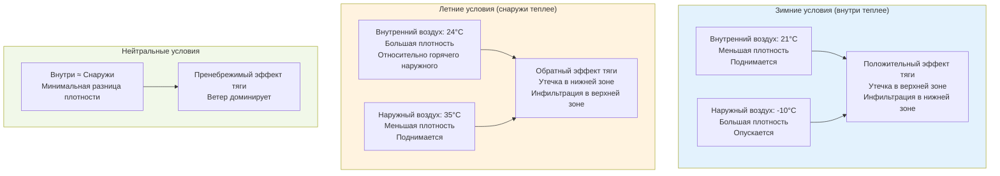

## Температура как основной движущий фактор

Разница температур между внутренним и наружным воздухом создает фундаментальную движущую силу для эффекта тяги в высоких зданиях. Этот температурный дифференциал создает колебания плотности, которые генерируют вертикальные градиенты давления, вызывая движение воздуха через ограждающую конструкцию здания. Величина давления эффекта тяги прямо пропорциональна температурной разнице и высоте здания.

## Физический механизм

Эффект тяги возникает из сил плавучести, создаваемых когда воздушные массы при разных температурах имеют разные плотности. Когда температура внутреннего воздуха отличается от температуры наружного воздуха, менее плотный воздух стремится подняться, создавая перепады давления через ограждающую конструкцию здания. Это явление следует фундаментальным термодинамическим принципам, регулирующим поведение жидкостей при тепловых градиентах.

Связь между температурой и плотностью воздуха выражается через идеальный закон газа. При заданном атмосферном давлении теплый воздух имеет меньшую плотность, чем холодный воздух. Эта разница плотностей создает выталкивающие силы, которые приводят к вертикальному движению воздуха.

## Расчет давления эффекта тяги

Перепад давления, вызванный эффектом тяги на любой высоте в здании, рассчитывается с помощью следующего соотношения:

$$\Delta P_{stack} = \rho_o \cdot g \cdot h \cdot \left(\frac{1}{T_o} - \frac{1}{T_i}\right)$$

Где:
- $\Delta P_{stack}$ = перепад давления эффекта тяги (Па)
- $\rho_o$ = плотность наружного воздуха при стандартных условиях (кг/м³)
- $g$ = ускорение свободного падения (9,81 м/с²)
- $h$ = высота выше уровня нейтрального давления (м)
- $T_o$ = абсолютная температура наружного воздуха (К)
- $T_i$ = абсолютная температура внутреннего воздуха (К)

Для практических расчетов с использованием температур в градусах Цельсия формула принимает вид:

$$\Delta P_{stack} = 3460 \cdot \frac{h}{T_i} \cdot \left(\frac{T_i - T_o}{T_o}\right)$$

Где температуры в Кельвинах (добавить 273,15 к значениям в Цельсиях).

Упрощенное инженерное приближение, обычно используемое в приложениях ASHRAE:

$$\Delta P_{stack} = C \cdot h \cdot \left(\frac{1}{T_o} - \frac{1}{T_i}\right)$$

Где $C$ = 3460 Па·м/К для стандартного атмосферного давления на уровне моря.

## Эффекты температурного дифференциала

## Интенсивность эффекта тяги по температурной разнице

Следующая таблица количественно определяет давление эффекта тяги на различных высотах для разных температурных дифференциалов:

| Разница температур (°C) | Высота 10м (Па) | Высота 50м (Па) | Высота 100м (Па) | Высота 200м (Па) | Степень тяжести |
|----------------------------|-----------------|-----------------|------------------|------------------|----------|
| 5 | 1,7 | 8,6 | 17,2 | 34,4 | Минимальная |
| 10 | 3,4 | 17,1 | 34,2 | 68,4 | Умеренная |
| 15 | 5,1 | 25,6 | 51,3 | 102,6 | Значительная |
| 20 | 6,8 | 34,1 | 68,2 | 136,4 | Сильная |
| 25 | 8,5 | 42,5 | 85,0 | 170,0 | Очень сильная |
| 30 | 10,2 | 51,0 | 102,0 | 204,0 | Экстремальная |
| 35 | 11,9 | 59,4 | 118,8 | 237,6 | Критическая |

*Рассчитано на уровне моря при внутренней температуре 21°C и наружных температурах от 16°C до -14°C*

## Сезонные вариации

### Зимний эффект тяги

В зимних условиях внутренние температуры превышают наружные температуры, создавая классический положительный эффект тяги. Нагретый внутренний воздух имеет меньшую плотность, чем холодный наружный воздух, вызывая его подъем внутри шахты здания. Это создает:

- Утечку кондиционируемого воздуха на верхних этажах
- Инфильтрацию холодного наружного воздуха на нижних этажах
- Максимальный перепад давления в верхней части здания
- Увеличенные нагрузки на отопление из-за инфильтрации холодного воздуха

Уровень нейтрального давления обычно находится между 40-60% высоты здания, в зависимости от распределения утечек ограждающей конструкции и работы механической системы.

### Реверс летнего эффекта тяги

Когда наружные температуры значительно превышают внутренние температуры, возникает обратный эффект тяги. Кондиционируемый внутренний воздух становится плотнее, чем горячий наружный воздух, изменяя типичную схему потока:

- Инфильтрация горячего влажного воздуха на верхних этажах
- Утечка кондиционируемого воздуха на нижних этажах
- Увеличенные нагрузки на охлаждение и проблемы контроля влажности
- Потенциальные проблемы конденсации влаги

Летний эффект тяги, как правило, менее интенсивен, чем зимний эффект тяги в большинстве климатических условий, поскольку температурный дифференциал обычно меньше.

## Основы сил плавучести

Выталкивающая сила, приводящая эффект тяги, вытекает из принципа Архимеда, применяемого к сжимаемым жидкостям. Выталкивающая сила на единицу объема:

$$F_b = (\rho_o - \rho_i) \cdot g$$

Где:
- $F_b$ = выталкивающая сила на единицу объема (Н/м³)
- $\rho_o$ = плотность наружного воздуха (кг/м³)
- $\rho_i$ = плотность внутреннего воздуха (кг/м³)
- $g$ = ускорение свободного падения (9,81 м/с²)

Эта сила действует на весь столб внутреннего воздуха, создавая вертикальный градиент давления, который характеризует эффект тяги.

## Последствия контроля температуры

Поддержание постоянной внутренней температуры во всем высоком здании напрямую влияет на величину эффекта тяги. Температурное расслоение в вертикальных шахтах усиливает эффект, в то время как более строгий контроль температуры его снижает. ASHRAE Fundamentals Chapter 16 предоставляет подробное руководство по учету давления, вызванного температурой, при проектировании зданий и определении размеров систем HVAC.

Системы HVAC должны противодействовать силам эффекта тяги для поддержания надлежащей вентиляции, давления в помещениях и условий комфорта. Это требует тщательных стратегий контроля давления, особенно в зданиях, превышающих 100 метров в высоту, где давления эффекта тяги могут превышать 100 Па.

## Рекомендации по проектированию

Эффект тяги, вызванный температурой, должен быть решен через:

- Разделение вертикальных шахт
- Вестибюли и воздушные шлюзы на входах здания
- Контроль давления в лифтовых шахтах и лестничных клетках
- Механические системы давления для противодействия природным силам
- Улучшенная герметизация ограждающей конструкции, особенно на переходах периметра

Точный расчет давлений, вызванных температурой, необходим для надлежащего проектирования систем HVAC, определения характеристик ограждающей конструкции и комфорта жильцов в высоких зданиях.
