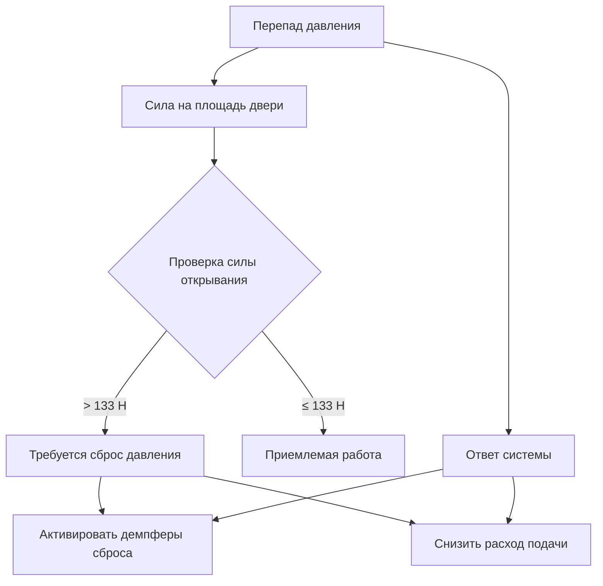
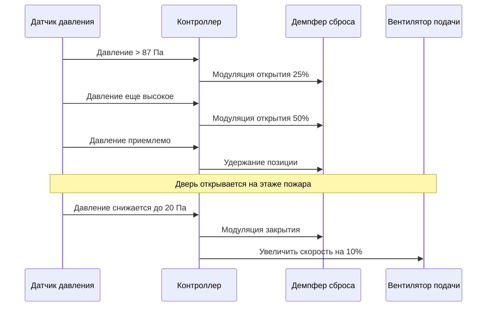

Системы повышения давления в лестничных клетках поддерживают положительное давление в эвакуационных лестничных клетках для предотвращения инфильтрации дыма во время пожарных чрезвычайных ситуаций в высотных зданиях. Эти системы создают барьер давления путем впрыска наружного воздуха в лестничную клетку, создавая более высокое давление, чем в смежных помещениях здания. Фундаментальная проблема заключается в поддержании достаточного перепада давления для предотвращения проникновения дыма при обеспечении возможности жильцов открывать двери лестничной клетки при эвакуации.

## Требования к перепаду давления

NFPA 92 и IBC устанавливают минимальные перепады давления на основе состояния двери и условий в здании. Разность давления через барьер предотвращает миграцию дыма в соответствии с соотношением:

$$Q = C \cdot A \cdot \sqrt{2 \Delta P / \rho}$$

где $Q$ представляет объемный расход воздуха через отверстия (м³/ч), $C$ — коэффициент расхода (обычно 0,65 для щелей двери), $A$ — площадь утечки (м²), $\Delta P$ — перепад давления (Па), а $\rho$ — плотность воздуха (кг/м³).

### Целевые значения давления при проектировании

| Условие | Минимальное давление | Максимальное давление | Применение |
|---------|----------------------|----------------------|-----------|
| Двери закрыты | 24,9 Па | 87 Па | Сценарий, когда все двери закрыты |
| Одна дверь открыта | 12,4 Па | Н/Д | Одна дверь открыта на этаже пожара |
| Несколько дверей открыты | Поддерживать расход | Н/Д | Сценарий эвакуации |
| Сила открывания двери | Н/Д | 133 Н | Максимально допустимое усилие |

Минимальный перепад 24,9 Па при всех закрытых дверях обеспечивает адекватные характеристики дымовой завесы. Максимальный предел 87 Па предотвращает чрезмерные силы открывания дверей. Во время событий открытия одной двери система должна поддерживать не менее 12,4 Па через закрытые двери на других этажах, чтобы предотвратить распространение дыма.

## Расчеты силы открывания двери

Сила открывания двери напрямую коррелирует с перепадом давления через геометрию двери. Сила, необходимая для преодоления перепада давления, действующего на площадь двери, следует из:

$$F_{pressure} = \Delta P \cdot A_{door} \cdot \frac{W}{2}$$

где $F_{pressure}$ — составляющая силы от давления (Н), $A_{door}$ — площадь двери (м²), а $W$ — ширина двери (м). Коэффициент $W/2$ учитывает момент плеча от петли двери до центра давления.

Для стандартной двери размером 0,915 м × 2,134 м соотношение становится:

$$F_{total} = \Delta P \times 1,955 \text{ м}^2 \times 0,457 \text{ м} + F_{closure} + F_{friction}$$

где $F_{closure}$ представляет силу механизма закрывания двери, а $F_{friction}$ учитывает сопротивление защелки и петель. IBC ограничивает общее усилие открывания до 133 Н для доступной эвакуации, что ограничивает максимально допустимый перепад давления.

### Анализ ограничения силы

Когда перепад давления превышает пороги, производящие силы открывания выше 133 Н, система должна немедленно снизить давление через механизмы сброса или модуляцию расхода подачи.

## Стратегия множественных точек впрыска

Высокие лестничные клетки требуют нескольких точек впрыска подаваемого воздуха для преодоления эффекта стека и поддержания равномерного распределения давления. Системы с одной точкой впрыска создают градиенты давления от эффекта стека:

$$\Delta P_{stack} = \rho \cdot g \cdot h \cdot \left(\frac{1}{T_{outside}} - \frac{1}{T_{stairwell}}\right)$$

где $g$ — ускорение свободного падения (9,81 м/с²), $h$ — вертикальная высота (м), а температуры выражены в абсолютной шкале (К).

### Расстояние между точками впрыска

Для лестничной клетки высотой 152 м с наружной температурой −7°C и температурой в лестничной клетке 21°C:

$$\Delta P_{stack} = 1,2 \times 9,81 \times 152 \times \left(\frac{1}{266} - \frac{1}{294}\right) = 37 \text{ Па}$$

Этот эффект стека создает перепад давления от низа к верху, требующий нескольких точек впрыска. Рекомендуемое расстояние:

| Высота здания | Максимальное расстояние впрыска | Типичные точки впрыска |
|---------------|----------------------------------|------------------------|
| < 23 м | Одна точка в нижней части | 1 место |
| 23–46 м | 23 м по вертикали | 2–3 места |
| 46–91 м | 15–23 м по вертикали | 4–6 мест |
| > 91 м | 12–18 м по вертикали | 8+ мест |

Каждая точка впрыска подает пропорциональный расход воздуха на основе объема зоны и площади утечки. Верхние точки впрыска компенсируют потерю давления от эффекта стека, поддерживая равномерный перепад по высоте здания.

## Модулирующие системы сброса давления

Демпферы сброса давления предотвращают избыточное давление при переменных состояниях двери. Система реагирует на открывание дверей через барометрический или механический сброс:

### Последовательность управления демпфером сброса

Размер демпфера сброса требует достаточной пропускной способности для сброса избыточного расхода при минимальном открывании двери:

$$Q_{relief} = Q_{supply} - Q_{leakage} - Q_{door}$$

где $Q_{relief}$ — пропускная способность демпфера сброса (м³/ч), $Q_{supply}$ — общий расход подачи, $Q_{leakage}$ — нормальная утечка в лестничной клетке, а $Q_{door}$ представляет расход через открытые двери.

### Барометрический и механический сброс

| Тип сброса | Время отклика | Точность | Сложность | Применение |
|-----------|----------------|----------|-----------|-----------|
| Барометрические демпферы | 1–2 секунды | ±12,4 Па | Низкая | Здания < 61 м |
| Моторизованные демпферы | 5–15 секунд | ±5 Па | Средняя | Здания 61–122 м |
| Вентилятор подачи с VFD | 3–8 секунд | ±2,5 Па | Высокая | Здания > 122 м |

Барометрические демпферы сброса открываются механически при предустановленном давлении, обеспечивая быстрый отклик без органов управления. Моторизованные демпферы обеспечивают точную модуляцию через интеграцию с автоматизацией зданий. Управление вентилятором подачи с преобразователем частоты обеспечивает наиболее точное регулирование давления путем регулирования расхода воздуха у источника вместо сброса избыточного давления.

## Проверка и пусконаладка системы

Приемочные испытания проверяют поддержание перепада давления при различных сценариях работы двери:

1. **Тест с закрытыми дверями**: Проверить 24,9–87 Па на всех этажах
2. **Тест с одной открытой дверью**: Открыть по одной двери на этажи последовательно, поддерживать ≥12,4 Па на других этажах
3. **Тест силы открывания двери**: Измерить силу открывания при максимальном давлении, подтвердить ≤133 Н
4. **Ответ демпфера сброса**: Проверить модуляцию в пределах указанного времени и точности
5. **Компенсация эффекта стека**: Протестировать систему при максимальной разнице температур в помещении и на улице

Вызванный температурой эффект стека создает наиболее сложные условия эксплуатации, требуя сезонной проверки при пусконаладке, чтобы подтвердить круглогодичное функционирование при экстремальных погодных условиях.
