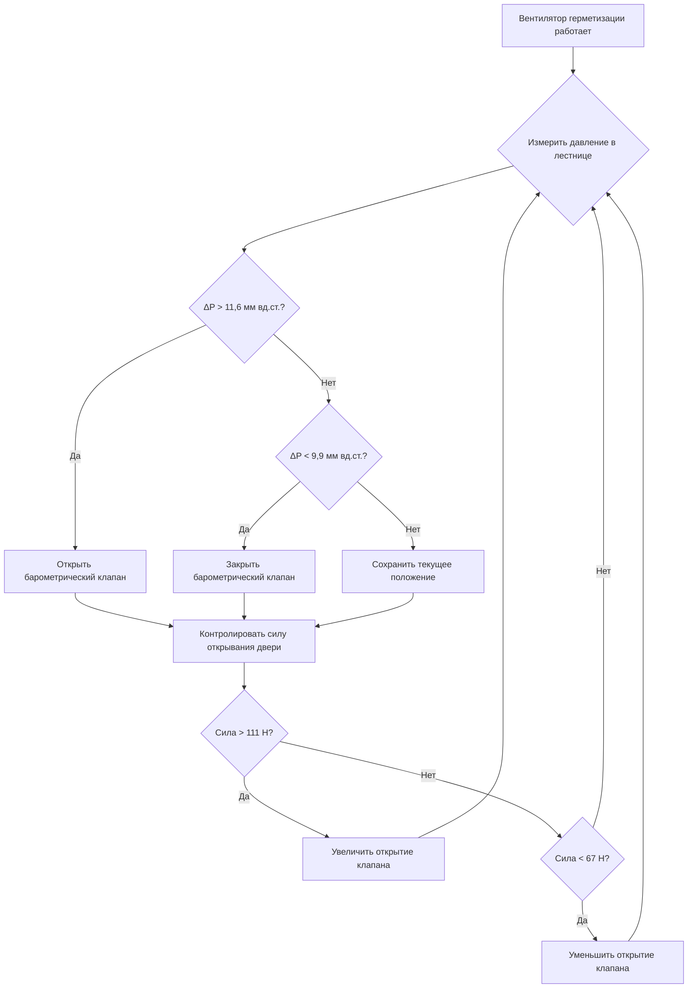

Лестницы доступа пожарной службы требуют усовершенствованных систем герметизации, которые уравновешивают два противоречивых требования: достаточный перепад давления для предотвращения инфильтрации дыма при одновременном сохранении силы открывания дверей в пределах физических возможностей пожарных с оборудованием. Эти системы представляют наиболее сложное применение герметизации лестниц из-за строгих ограничений на силу открывания дверей и необходимости абсолютной надежности во время аварийных операций.

## Повышенные требования к герметизации

Лестницы доступа пожарной службы служат основным защищенным путем для пожарных операций в зданиях повышенной высоты. IBC раздел 403.5.3 и NFPA 92 требуют систем герметизации, которые поддерживают минимальные перепады давления 12,4 Па между дверями лестницы, при этом никогда не превышая перепады давления, которые могут создать силу открывания двери более 133 Н на ручке двери.

Физика силы открывания двери связана напрямую с перепадом давления через фундаментальное уравнение:

$$F = \Delta P \cdot A_{eff} \cdot d_{cp}/d_h$$

где $F$ — сила открывания на ручке, $\Delta P$ — перепад давления, $A_{eff}$ — эффективная площадь двери, подверженная давлению (учитывающая утечку в раме и силы доводчика двери), $d_{cp}$ — расстояние от петли до центра давления, а $d_h$ — расстояние от петли до ручки. Для стандартной двери 0,91 м × 2,13 м с центром давления в середине ширины эффективное отношение плеч $d_{cp}/d_h$ приблизительно равно 0,5.

### Ограничения на перепад давления

Допустимый диапазон давления создает узкое окно эксплуатации. Для типичной противопожарной двери с эффективной площадью 1,67 м² (с учетом утечки 15%) максимальный допустимый перепад давления рассчитывается как:

$$\Delta P_{max} = \frac{F_{max} \cdot d_h}{A_{eff} \cdot d_{cp}} = \frac{133 \text{ Н} \cdot 0,76 \text{ м}}{1,67 \text{ м}^2 \cdot 0,38 \text{ м}} = 160 \text{ Па} = 23,2 \text{ мм вд.ст.}$$

Это дает диапазон эксплуатационного давления от 12,4 до 23,2 мм вд.ст., требующий точного контроля для компенсации изменяющегося количества открытых дверей и колебаний давления, вызванных ветром.

## Требования к герметизации вестибюля

IBC раздел 403.5.3 требует, чтобы доступ к лифтам пожарной службы осуществлялся через проветриваемый вестибюль. Когда лестница также соединяется с этим вестибюлем, развивается каскад герметизации с тремя зонами: лестница > вестибюль > этаж здания. NFPA 92 рекомендует поддерживать вестибюль на промежуточном давлении, обычно 2,5 Па выше этажа и 2,5 Па ниже лестницы.

Расход воздуха, необходимый для поддержания давления в вестибюле, зависит от общей площади утечки дверей и стыков конструкции:

$$Q_{vestibule} = C \cdot A_{leak} \cdot \sqrt{\Delta P}$$

где $C$ — коэффициент расхода (приблизительно 1,22 для турбулентного потока при давлении в Па и площади в м²), а $A_{leak}$ представляет эффективную площадь утечки. Типичный вестибюль с двумя противопожарными дверями (каждая с $A_{leak}$ = 0,011 м²) при 2,5 Па требует:

$$Q_{vestibule} = 1,22 \cdot 0,022 \cdot \sqrt{2,5} = 0,066 \text{ м}^3/\text{с} = 238 \text{ CFM (404 м}^3/\text{ч)}$$

## Сброс давления и контроль силы открывания двери

Критическая проблема в герметизации лестницы доступа пожарной службы возникает, когда все двери остаются закрытыми, а фасад здания подвергается воздействию ветрового давления. Система должна предотвращать чрезмерное накопление давления посредством автоматических клапанов сброса.

Три основных метода контролируют силы открывания дверей:

1. **Барометрические клапаны сброса**: клапаны с пружинным приводом, которые открываются автоматически при превышении давления уставки, обеспечивая пассивный сброс без требований к электропитанию
2. **Моторизованные клапаны сброса**: клапаны переменного положения, управляемые датчиками давления, обеспечивающие точную модуляцию
3. **Управление переменной скоростью вентилятора**: модулирует скорость вентилятора подачи на основе измеренного перепада давления, снижая потребление энергии

| Метод сброса | Время отклика | Точность | Зависимость от электропитания | Типичное применение |
|---------------|---------------|-----------|---|---|
| Барометрический клапан | 1-2 секунды | ±1,2 мм вд.ст. | Не требуется | Низкие здания, простые системы |
| Моторизованный клапан | 5-10 секунд | ±0,5 мм вд.ст. | Требуется | Высокие здания, несколько зон |
| Управление VFD вентилятором | 10-30 секунд | ±0,25 мм вд.ст. | Требуется | Премиум системы, энергетическая оптимизация |

## Требования к резервному питанию

NFPA 70 (Национальный электрический код) статья 700 классифицирует вентиляторы герметизации лестниц доступа пожарной службы как аварийные системы, требующие автоматического переключения на резервное питание в течение 10 секунд после отказа сетевого питания. Источник резервного питания должен иметь достаточную мощность для работы системы герметизации при полной расчетной нагрузке в течение минимальной продолжительности, указанной местным кодом (обычно 2-4 часа).

Генератор резервного питания должен питать:

- Вентилятор(ы) герметизации: полный номинальный ток двигателя
- Системы управления: включая датчики давления, приводы клапанов и панели управления
- Связанное оборудование HVAC: агрегаты подпиточного воздуха при необходимости для охлаждения вентилятора
- Системы освещения и связи: в лестнице и вестибюле

Размер генератора должен учитывать пусковой ток двигателя. Для типичного вентилятора герметизации мощностью 7,5 кВт с пусковым током заторможенного ротора в 6× номинального тока:

$$I_{peak} = I_{run} \cdot 6 = 20,9 \text{ А} \cdot 6 = 125,4 \text{ А}$$

Устройства плавного пуска снижают пусковой ток приблизительно до 2× номинального тока, значительно снижая требования к мощности генератора.

## Интеграция систем связи

Лестницы доступа пожарной службы требуют двусторонних аварийных систем связи согласно IBC раздел 403.4.7. Система герметизации должна координироваться с оборудованием связи для предотвращения акустических помех. Чрезмерные скорости воздуха около станций связи создают шум, который мешает разборчивости речи.

Связь между скоростью воздуха и уровнем фонового шума следует уравнению:

$$L_p = 50 + 10 \log_{10}(v^{1.5})$$

где $L_p$ — уровень звукового давления в дБА, а $v$ — скорость воздуха в м/с. Для поддержания разборчивости речи (требующей фонового шума ниже 65 дБА) максимальная скорость воздуха у станций связи не должна превышать:

$$v_{max} = 10^{(65-50)/(10 \cdot 1.5)} = 10^{1.0} = 10 \text{ м/с} = 36 \text{ км/ч}$$

Диффузоры подачи воздуха должны располагаться на расстоянии не менее 3 метров от станций связи с воздухом, направленным в сторону от микрофонов.

## Тестирование и пуск в эксплуатацию системы

NFPA 92 раздел 4.6.3.3 требует тестирования систем герметизации лестниц как при закрытых, так и при открытых дверях. Тестирование должно проверить:

1. **Минимальный перепад давления**: 12,4 Па при всех закрытых дверях
2. **Максимальная сила открывания двери**: не превышающая 133 Н ни у одной двери
3. **Эксплуатация системы сброса**: надлежащее срабатывание клапанов сброса или снижение скорости вентилятора
4. **Переключение резервного питания**: успешный переход на резервное питание в течение 10 секунд
5. **Функция системы связи**: разборчивость речи при работающей системе герметизации

Наиболее критичный тест имитирует вход пожарного путем последовательного открывания дверей снизу вверх при контроле перепадов давления и силы открывания двери на всех уровнях. Этот тест выявляет недостаточную подачу воздуха или неправильно подобранные механизмы сброса.

Надлежащее проектирование, установка и тестирование систем герметизации лестниц доступа пожарной службы обеспечивают, что пожарные могут безопасно получить доступ ко всем уровням здания во время аварийных операций, одновременно предотвращая инфильтрацию дыма, которая могла бы скомпрометировать защищенный путь эвакуации. Узкое окно эксплуатационного давления требует сложных систем управления и тщательного пуска в эксплуатацию для достижения надежной работы во всех сценариях эксплуатации.
