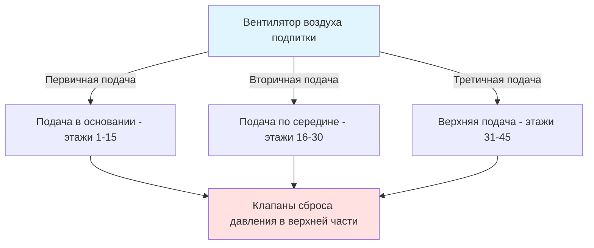
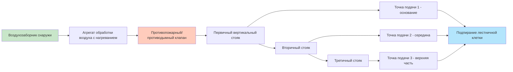

## Обзор

Системы воздуха подпитки для подпирания лестничных клеток должны подавать достаточный воздушный поток для поддержания минимальных перепадов давления по всем границам лестничной клетки при компенсации утечек и событий открытия дверей. Проектирование требует тщательного расчета объемов подаваемого воздуха, стратегического размещения точек подачи и правильного подбора вентилятора для обеспечения равномерного распределения давления по всему вертикальному стволу.

## Расчет объема воздуха подпитки

Общее требование к воздуху подпитки объединяет два основных компонента: непрерывную компенсацию утечек и переходный спрос при открытии дверей.

### Базовый воздушный поток утечки

Утечка через проникновения оболочки лестничной клетки следует уравнению отверстия, модифицированному для геометрии трещин:

$$Q_L = C \cdot A \cdot \sqrt{\Delta P}$$

Где:
- $Q_L$ = воздушный поток утечки (м³/ч)
- $C$ = коэффициент потока (м³/ч-м²-√кПа), типично 0,65–0,83 для строительных швов
- $A$ = общая площадь утечки (м²)
- $\Delta P$ = перепад давления (кПа)

Для многоэтажных лестничных клеток совокупная площадь утечки включает:

| Путь утечки | Типовая площадь на этаж | Примечания |
|--------------|-------------------------|-----------|
| Периметр двери (закрыта) | 0,014–0,023 м² | На основе IBC раздел 403.5.1 |
| Строительные швы | 0,005–0,009 м² | На основе NFPA 92 таблица 4.5.3 |
| Проникновения (трубы, кабелепроводы) | 0,002–0,005 м² | Варьируется в зависимости от конструкции |
| Разделения лифтовых вестибюлей | 0,009–0,019 м² | Если не подпирается отдельно |

Для $n$-этажной лестничной клетки:

$$Q_{L,total} = \sum_{i=1}^{n} C_i \cdot A_i \cdot \sqrt{\Delta P_i}$$

IBC раздел 909.6.2 требует поддерживать минимум 0,012 кПа по дверям лестничной клетки при закрытии всех дверей. NFPA 92 раздел 4.5.3 рекомендует 0,025 кПа в качестве практической цели проектирования для учета неопределенности измерения.

### Спрос при открытии двери

Когда открывается дверь лестничной клетки, система должна подавать воздух подпитки для замены объема, выходящего через открытие, при поддержании приемлемого давления:

$$Q_{door} = C_d \cdot A_{door} \cdot \sqrt{2 \cdot \Delta P / \rho}$$

Преобразование в стандартные единицы HVAC:

$$Q_{door} = 2610 \cdot C_d \cdot A_{door} \cdot \sqrt{\Delta P}$$

Где:
- $Q_{door}$ = воздушный поток открытия двери (м³/ч)
- $C_d$ = коэффициент истечения, 0,65–0,70 для открытий дверей
- $A_{door}$ = эффективная площадь двери (м²), типично 50–70% геометрической площади
- $\Delta P$ = перепад давления (кПа)
- 2610 = коэффициент преобразования для стандартного воздуха (15°C, уровень моря)

NFPA 92 требует, чтобы системы вмещали одновременное открытие дверей на этаже пожара плюс два смежных этажа. Для типовой двери 0,9 м × 2,1 м с эффективной площадью 60%:

$$Q_{door} = 2610 \times 0,65 \times (0,9 \times 2,1 \times 0,60) \times \sqrt{0,025} = 1 298 \text{ м³/ч на дверь}$$

## Стратегия множественных точек подачи

Вертикальное распределение воздуха подпитки предотвращает чрезмерное расслоение давления в высоких лестничных клетках. Эффект дымовой трубы создает градиент давления:

$$\Delta P_{stack} = 0,0342 \cdot h \cdot \left(\frac{1}{T_{outside}} - \frac{1}{T_{stairwell}}\right)$$

Где:
- $\Delta P_{stack}$ = давление эффекта дымовой трубы (кПа)
- $h$ = разность высот (м)
- $T$ = абсолютная температура (К)

Для лестничной клетки 122 м с наружной температурой −7°C и внутренней 21°C:

$$\Delta P_{stack} = 0,0342 \times 122 \times \left(\frac{1}{266} - \frac{1}{294}\right) = 0,074 \text{ кПа}$$

Этот градиент давления требует множественных точек подачи для поддержания равномерного подпирания.

### Размещение точек подачи

Общие рекомендации по расстоянию между точками подачи:

| Высота здания | Точки подачи | Максимальный вертикальный пролет |
|----------------|-------------|----------------------------------|
| < 46 м (≤15 этажей) | 1 (основание) | 46 м |
| 46–91 м (15–30 этажей) | 2 | 46 м каждая |
| 91–152 м (30–50 этажей) | 3–4 | 38–46 м каждая |
| > 152 м (>50 этажей) | 4+ | 30–38 м каждая |

Каждая точка подачи должна обслуживать зоны с подобными характеристиками утечки. Балансировочные клапаны в каждой точке подачи позволяют полевую регулировку для достижения равномерного распределения давления.

## Подбор и выбор вентилятора

Вентиляторы воздуха подпитки должны преодолеть системное сопротивление при подаче расчетного потока в наихудших условиях.

### Требования к производительности вентилятора

Общая производительность вентилятора включает коэффициенты запаса на неопределенности:

$$Q_{fan} = 1,2 \times \left(Q_{L,total} + Q_{door,simultaneous}\right)$$

Множитель 1,2 учитывает:
- Неопределенность оценки площади утечки (±15%)
- Утечку воздуховода (3–5% для герметичных металлических воздуховодов)
- Допуск управления (±5%)

### Расчет статического давления

Полное давление вентилятора должно преодолеть:

$$\Delta P_{fan} = \Delta P_{stairwell} + \Delta P_{duct} + \Delta P_{fittings} + \Delta P_{injection}$$

**Потеря трения воздуховода** следует уравнению Дарси-Вайсбаха:

$$\Delta P_{duct} = f \cdot \frac{L}{D} \cdot \frac{\rho V^2}{2 \cdot 144}$$

Для прямоугольных воздуховодов используйте гидравлический диаметр $D_h = 4A/P$.

**Потеря устройства подачи** типично находится в диапазоне 0,06–0,12 кПа для диффузоров, 0,04–0,07 кПа для сопел.

Пример для 40-этажного здания:
- Целевое давление в лестничной клетке: 0,025 кПа
- Трение воздуховода (76 м эквивалента): 0,21 кПа
- Фитинги и переходы (8 отводов, 3 ответвления): 0,10 кПа
- Устройства подачи (3 точки): 0,09 кПа
- **Общее статическое давление вентилятора: 0,42 кПа**

### Выбор типа вентилятора

| Тип вентилятора | Преимущества | Недостатки | Применение |
|-----------------|-------------|-----------|-----------|
| Центробежный отогнутый назад | Высокая эффективность (75–82%), стабильная кривая | Больший размер | Предпочтителен для <7,1 м³/с |
| Центробежный аэрофойль | Наивысшая эффективность (78–85%) | Стоимость, размер | Большие системы >9,5 м³/с |
| Осевой с направляющим аппаратом | Компактный, встроенная установка | Шум, узкий диапазон эффективности | Приложения с ограниченным пространством |
| Плену-вентилятор | Очень компактный | Более низкая эффективность (65–72%) | Модернизация, ограниченное пространство |

Выбирайте вентиляторы для работы между 50–75% максимального потока на кривой вентилятора, обеспечивая стабильную работу, если системное сопротивление меняется.

## Соображения по маршрутизации воздуховодов

### Конфигурация стояка

Вертикальные воздуховоды рядом с лестничными клетками минимизируют горизонтальные пролеты. Ключевые элементы проектирования:

**Ограничения скорости:**
- Главные стояки: 10–12,7 м/с (баланс шума и размера)
- Ответвления: 7,6–10 м/с
- Устройства подачи: 4–6 м/с (минимизация шума)

### Размещение наружного воздухозабора

IBC раздел 909.13 и NFPA 92 раздел 4.8.4 требуют размещение наружного воздухозабора для предотвращения захвата дыма:

- Минимум 6 м от потенциальных источников дыма (погрузочные доки, выпускные отверстия)
- Выше уровня наводнения по местным требованиям
- Рассмотрите преобладающие ветровые потоки и аэродинамику здания
- Установите защиту от птиц/мусора без чрезмерного перепада давления (<0,025 кПа)

Для зданий >23 м размещайте воздухозаборы на кровле для предотвращения миграции дыма на уровне земли и максимизации восстановления давления от поля течения здания.

## Сезонные соображения

### Влияние температуры на воздушный поток

Вариация плотности воздуха влияет на соотношения объемного потока:

$$\rho = \frac{P_{abs}}{R \cdot T_{abs}}$$

Для стандартного давления (101,3 кПа) и варьирующейся температуры:

| Наружная температура | Плотность воздуха (кг/м³) | Соотношение плотности (vs 15°C) |
|---------------------|--------------------------|--------------------------------|
| −29°C | 1,395 | 1,16 |
| −18°C | 1,333 | 1,11 |
| 0°C | 1,293 | 1,08 |
| 15°C | 1,225 | 1,00 |
| 32°C | 1,165 | 0,95 |

Холодный наружный воздух увеличивает плотность, требуя компенсации в стратегиях управления вентилятором. Привод с переменной частотой (ПЧП) модулирует скорость вентилятора для поддержания постоянного давления:

$$N_2 = N_1 \cdot \sqrt{\frac{\rho_1}{\rho_2}}$$

### Компенсация эффекта дымовой трубы

Зимние условия интенсифицируют эффект дымовой трубы в высоких зданиях. Системы должны преодолеть дополнительный перепад давления:

**Наихудший зимний сценарий** (для здания 122 м):
- Наружная: −12°C
- Внутренняя: 21°C
- Эффект дымовой трубы: 0,088 кПа (из предыдущего уравнения)
- Требуемое давление в лестничной клетке: 0,025 кПа
- **Требуемое полное давление вентилятора: 0,113 кПа + потери воздуховода**

Летний обратный эффект дымовой трубы (наружная >внутренней температура) способствует подпиранию на нижних этажах, но противодействует на верхних, требуя тщательной балансировки точек подачи.

### Требования к нагреванию

NFPA 92 раздел 4.8.5 разрешает нагревание воздуха подпитки для предотвращения дискомфорта при открытии дверей. Тепловая мощность:

$$Q_{heating} = 1,08 \cdot CFM \cdot \Delta T$$

Для системы 4,72 м³/с с повышением температуры 33°C (−12°C до 21°C выпуска):

$$Q_{heating} = 1,08 \times 4,72 \times 33 = 169 \text{ кВт}$$

Нагревание должно активироваться с вентиляторами подпирания для предотвращения выброса холодного воздуха во время эвакуации при чрезвычайных обстоятельствах.

## Резервирование системы и аварийное питание

IBC раздел 909.11 требует аварийное питание для систем подпирания. Соображения проектирования:

- Двойные вентиляторы воздуха подпитки (100% резервная производительность)
- Подключение аварийного генератора через автоматический переключатель передачи (<10 секунд передачи)
- Резервное питание аккумулятора для управления и приводов клапанов (минимум 90-минутная емкость)
- Ежемесячное автоматическое тестирование в соответствии с NFPA 110

Резервные системы могут совместно использовать общий воздуховод с изолирующими клапанами или обеспечивать полностью независимые воздушные пути для повышенной надежности в критически важных приложениях.

## Испытание и пусконаладка

Полевая проверка подтверждает предположения проектирования:

1. **Измерение площади утечки**: Подпирайте лестничную клетку со всеми закрытыми отверстиями, измеряйте поток при различных давлениях для определения фактического продукта $C \cdot A$
2. **Распределение давления**: Проверьте равномерность ±0,005 кПа между зонами подачи
3. **Производительность при открытии двери**: Смоделируйте одновременное открытие дверей, подтвердите поддержание давления
4. **Сезонная регулировка**: Программируйте алгоритмы управления ПЧП на основе датчиков наружной температуры

Критерии приемки в соответствии с NFPA 92 раздел 4.6:
- Минимум 0,012 кПа, максимум 0,087 кПа по закрытым дверям
- Максимум 133 Н усилия открытия двери (0,03–0,04 кПа в зависимости от геометрии двери)
- Восстановление давления в течение 30 секунд после закрытия двери

---

*Это содержание предоставляет инженерный уровень указания для проектирования системы воздуха подпитки. Специфические проекты требуют расчетов на основе фактической геометрии здания, конструкционных деталей и местных поправок кодекса.*
