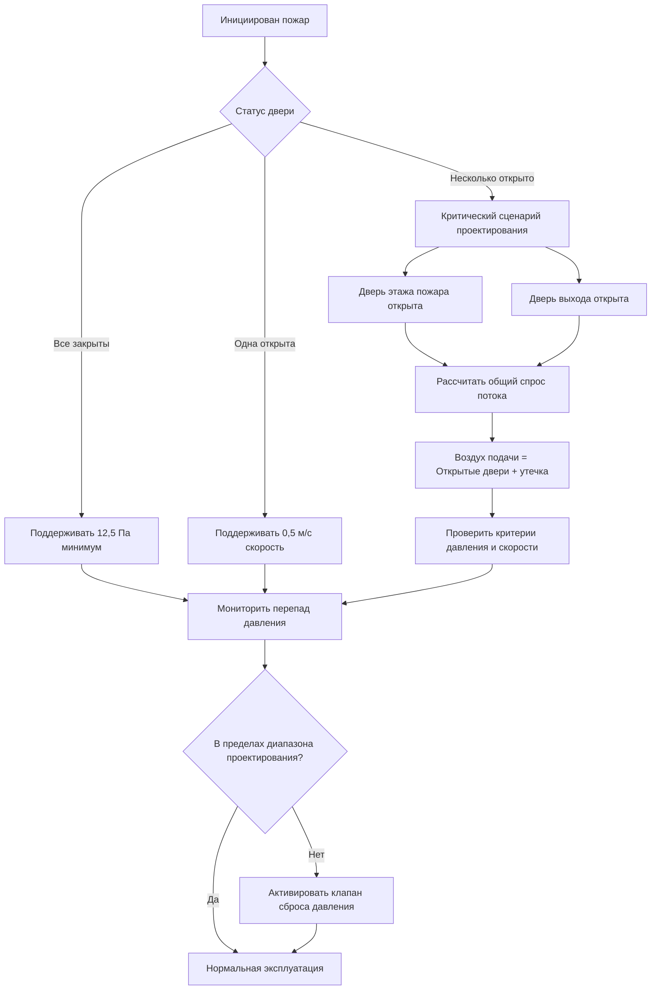
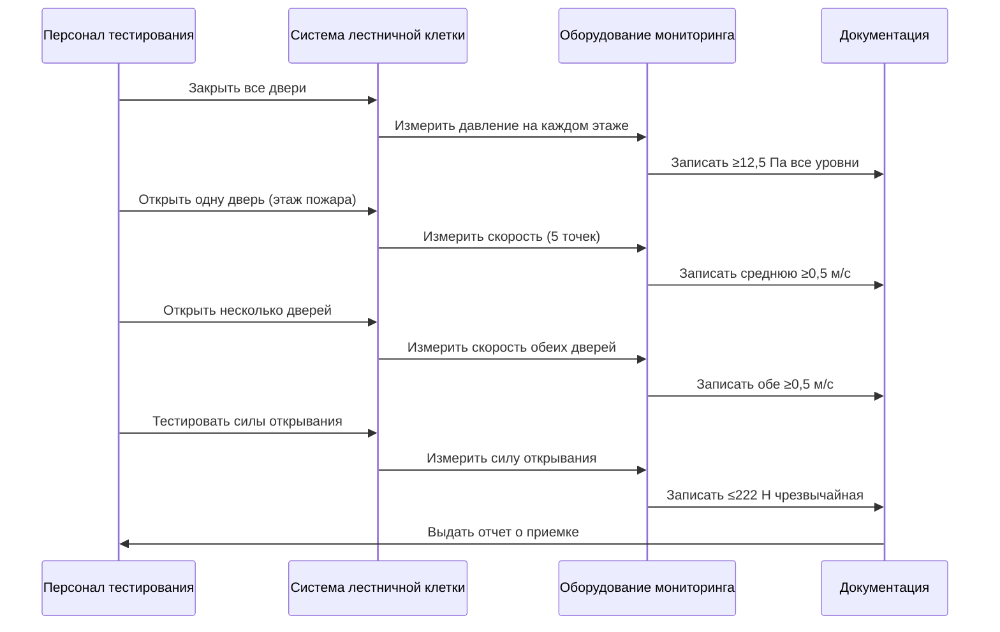

## Основные цели контроля дыма

Системы создания избыточного давления в лестничных клетках поддерживают положительные перепады давления для предотвращения проникновения дыма во время пожара, обеспечивая приемлемые условия эвакуации для жильцов и безопасный доступ для пожарных. Физический принцип основан на создании скорости воздуха через дверные проемы, превышающей силы плавучести дыма.

Фундаментальное соотношение, управляющее контролем дыма:

$$\Delta P = \rho \cdot g \cdot h \cdot \Delta T / T_{avg}$$

где $\Delta P$ — перепад давления, вызванный плавучестью (Па), $\rho$ — плотность воздуха (кг/м³), $g$ — ускорение свободного падения (9,81 м/с²), $h$ — высота (м), $\Delta T$ — разность температур (K), $T_{avg}$ — средняя абсолютная температура (K).

## Проектные перепады давления

### Минимальные требования по давлению

NFPA 92 устанавливает минимальные перепады давления на закрытых дверях лестничной клетки относительно помещений здания. При всех условиях эксплуатации система должна поддерживать достаточное давление для преодоления эффекта дымовой трубы и ветровых нагрузок.

**Минимальные проектные давления:**

| Условие | Минимальное давление | Основание проектирования |
|---------|----------------------|--------------------------|
| Все двери закрыты | 12,5 Па | Предотвращение утечки дыма |
| Одна дверь открыта | Поддержание потока | Минимум 0,5 м/с скорость |
| Несколько дверей открыто | Поддержание потока | Зависит от сценария проектирования |

Минимальное давление 12,5 Па предотвращает проникновение дыма через щели дверей и дефекты конструкции. Это значение учитывает типичные площади утечек дверей 0,01–0,02 м² на одну дверь.

### Максимальные пределы давления

Максимальные перепады давления ограничены силами открывания дверей, которые не должны превышать требования доступности. NFPA 101 ограничивает максимальную силу открывания двери 133 Н в нормальных условиях и разрешает до 222 Н во время пожарных чрезвычайных ситуаций.

Сила, требуемая для открывания двери против перепада давления:

$$F_{door} = \Delta P \cdot A_{door} \cdot W / 2$$

где $F_{door}$ — сила открывания (Н), $A_{door}$ — площадь двери (м²), $W$ — ширина двери (м), коэффициент 2 учитывает рычаг у дверной ручки.

Для стандартной двери 0,91 м × 2,13 м:

$$\Delta P_{max} = \frac{2 \cdot F_{door}}{A_{door} \cdot W}$$

При максимальной аварийной силе 222 Н:

$$\Delta P_{max} = \frac{2 \times 222}{(0,91 \times 2,13) \times 0,91} = 252 \text{ Па}$$

Практические пределы проектирования обычно варьируются от 50–75 Па для баланса эффективности контроля дыма с удобством открывания двери.

## Сценарии открытых дверей

### Открытие одной двери

Когда дверь лестничной клетки открывается, перепад давления исчезает, и система должна поддерживать минимальную скорость воздуха через дверной проем для предотвращения проникновения дыма. NFPA 92 требует минимальную среднюю скорость 0,5 м/с через открытую дверь.

Требуемый объемный расход для открытой двери:

$$Q_{door} = V_{min} \cdot A_{door}$$

Для двери площадью 1,94 м² при 0,5 м/с:

$$Q_{door} = 0,5 \times 1,94 = 0,97 \text{ м³/с (1,648 CFM)}$$

Этот расчет предполагает равномерное распределение скорости. Реальные проекты обычно используют 0,75–1,0 м/с для учета неравномерного потока и турбулентности двери.

### Сценарий открытия нескольких дверей

Критический сценарий проектирования возникает при одновременном открытии дверей на этаже пожара и уровне выхода, создавая максимальный спрос на воздухопоток. Система должна подавать воздух для замены:

1. Воздуха, выходящего на уровне выхода
2. Воздуха, просачивающегося через закрытые двери по всему стволу
3. Приточного воздуха для поддержания давления

**Расчет потока для нескольких проемов:**

$$Q_{total} = Q_{open,fire} + Q_{open,discharge} + Q_{leakage}$$

Утечка воздуха через закрытые двери:

$$Q_{leakage} = C_{d} \cdot A_{leak} \cdot \sqrt{2 \cdot \Delta P / \rho}$$

где $C_{d}$ — коэффициент расхода (обычно 0,65), $A_{leak}$ — общая площадь утечек (м²), $\Delta P$ — перепад давления (Па), $\rho$ — плотность воздуха (кг/м³).

## Несколько точек подачи воздуха

Высокие лестничные клетки требуют нескольких точек подачи воздуха для преодоления эффекта дымовой трубы и поддержания равномерного давления по всей высоте ствола. Одноточечная подача на вершине создает чрезмерное давление на верхних уровнях и недостаточное давление на нижних уровнях.

### Распределение давления от эффекта дымовой трубы

Естественный эффект дымовой трубы создает градиенты давления в вертикальных стволах:

$$\Delta P_{stack} = 3460 \cdot h \cdot \left(\frac{1}{T_{out}} - \frac{1}{T_{in}}\right)$$

где $\Delta P_{stack}$ — давление от эффекта дымовой трубы (Па), $h$ — высота (м), $T_{out}$ — наружная температура (K), $T_{in}$ — внутренняя температура (K).

Для лестничной клетки высотой 100 м с наружной температурой -20°C (253 K) и внутренней температурой 20°C (293 K):

$$\Delta P_{stack} = 3460 \times 100 \times \left(\frac{1}{253} - \frac{1}{293}\right) = 187 \text{ Па}$$

Этот значительный перепад давления требует нескольких точек подачи воздуха для противодействия силам эффекта дымовой трубы.

### Расстояние между точками подачи воздуха

Максимальное вертикальное расстояние между точками подачи воздуха обычно варьируется от 15–30 этажей (50–100 м), в зависимости от:

- Величины эффекта дымовой трубы (зависит от климата)
- Целевых перепадов давления в проекте
- Характеристик утечки дверей
- Запасов мощности системы

**Оптимальная стратегия подачи воздуха:**

| Высота здания | Точки подачи | Стратегия расположения |
|---------------|--------------|------------------------|
| < 30 м | 1 | Вершина ствола |
| 30–60 м | 2 | Вершина и середина высоты |
| 60–100 м | 3 | Вершина, 2/3 высоты, 1/3 высоты |
| > 100 м | 4+ | Каждые 25–30 м вертикально |

Каждая точка подачи требует независимого управления потоком с реагирующими на давление демпферами или вентиляторами с переменной скоростью для балансировки давления по всему стволу.

## Требования к приемочному тестированию

NFPA 92 требует комплексное приемочное тестирование для проверки производительности системы при всех сценариях проектирования. Тестирование должно демонстрировать соответствие критериям давления, скорости и силы открывания двери.

### Тестирование перепада давления

**Процедура тестирования:**

1. **Тест со всеми закрытыми дверями:** Измерить перепад давления на каждом уровне этажа со всеми закрытыми дверями лестничной клетки. Проверить минимум 12,5 Па во всех местах.

2. **Тест с открытой одной дверью:** Открыть одну дверь на проектном этаже пожара. Измерить скорость в пяти точках через дверной проем. Проверить среднюю скорость ≥ 0,5 м/с.

3. **Тест с открытыми несколькими дверями:** Открыть двери на этаже пожара и выхода одновременно. Проверить поддерживаемую скорость воздуха на обоих проемах.

Измерения давления с использованием калиброванных цифровых манометров с точностью ±1 Па. Измерения выполняются в центре двери, на расстоянии 25 мм от закрытой поверхности двери.

### Протокол измерения скорости

Скорость открывания двери измеряется с помощью калиброванных крыльчатых анемометров или горячих анемометров. Сетка измерений в пять точек:

- Центр двери
- Четыре точки в 1/4 и 3/4 ширины, 1/4 и 3/4 высоты

Средняя скорость рассчитывается как:

$$V_{avg} = \frac{1}{5} \sum_{i=1}^{5} V_i$$

Отдельные измерения не должны отличаться более чем на 30% от среднего для обеспечения адекватного распределения потока.

### Тестирование силы открывания двери

Сила открывания двери измеряется с помощью калиброванных динамометров в месте дверной ручки. Максимальная записанная сила от полностью закрытого положения через 15° дуги открывания.

**Критерии приемки:**

| Режим эксплуатации | Максимальная сила | Стандартная ссылка |
|-------------------|-------------------|-------------------|
| Нормальные условия | 133 Н | NFPA 101 |
| Пожарная чрезвычайная ситуация | 222 Н | NFPA 101 |
| Соответствие ADA | 22 Н | Нормальные условия |

Если силы превышают пределы, демпферы сброса давления должны быть отрегулированы или установлена дополнительная емкость сброса.

### Тестирование реакции системы

Динамическое тестирование проверяет реакцию системы на операции с дверями:

1. Контролировать давление со всеми закрытыми дверями
2. Открыть одну дверь и записать время установления минимальной скорости
3. Закрыть дверь и записать время восстановления давления
4. Повторить для сценариев открытия нескольких дверей

Время отклика от открывания двери до установленного воздушного потока не должно превышать 10 секунд для предотвращения проникновения дыма во время переходных условий.

### Требования к сезонному тестированию

Эффект дымовой трубы существенно варьируется при сезонных изменениях температуры. Приемочное тестирование должно проверить производительность системы при:

- **Летних условиях:** Минимальный эффект дымовой трубы, возможен обратный эффект
- **Зимних условиях:** Максимальный эффект дымовой трубы, наивысшие требования давления
- **Переходных сезонах:** Промежуточные условия

Системы должны демонстрировать соответствие при полном диапазоне ожидаемых условий окружающей среды или включать автоматические механизмы компенсации, такие как:

- Вентиляторы с переменной скоростью с обратной связью давления
- Барометрические демпферы для автоматического сброса давления
- Многоступенчатое включение вентиляторов на основе наружной температуры

Процесс наладки подтверждает последовательности управления, проверяя автоматические регулировки поддерживают критерии проектирования на протяжении всего годового цикла.

## Заключение

Эффективный контроль дыма через создание избыточного давления в лестничных клетках требует интегрированного проектирования, учитывающего перепады давления, сценарии открытых дверей, стратегии подачи воздуха и строгое приемочное тестирование. Расчеты, основанные на физике, обеспечивают, что системы преодолевают эффект дымовой трубы при поддержании удобства открывания двери. Несколько точек подачи воздуха обеспечивают равномерное давление в высоких зданиях. Комплексное тестирование в соответствии с NFPA 92 подтверждает производительность жизненной безопасности при всех условиях эксплуатации и сценариях окружающей среды.
