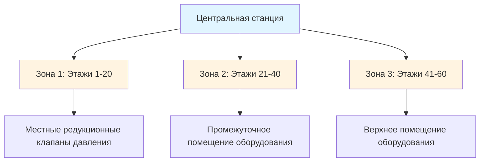
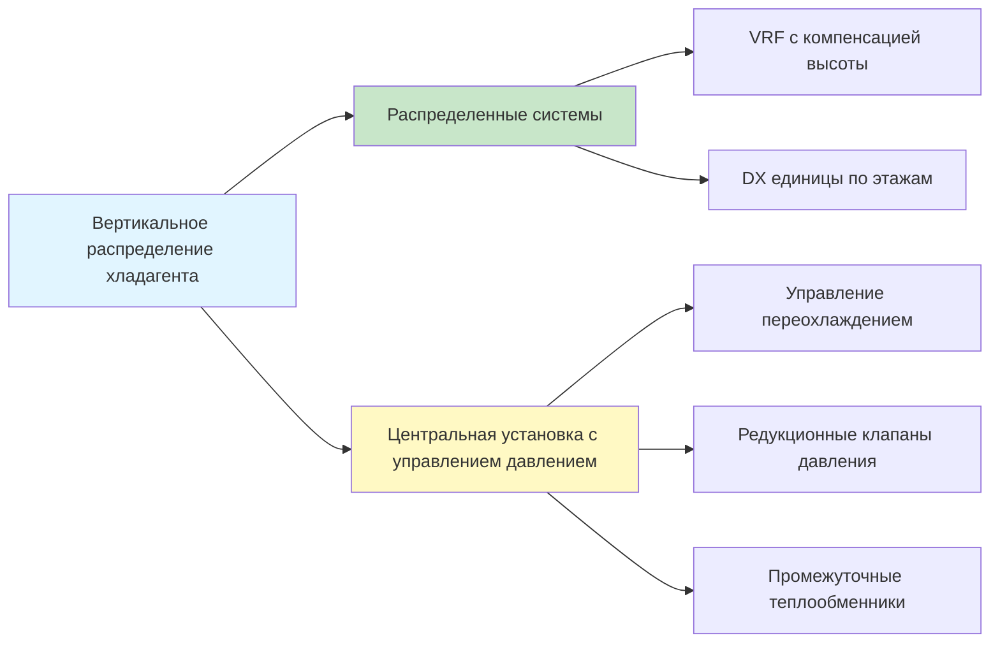

## Физические проблемы вертикального распределения жидкостей

Вертикальный транспорт жидкостей HVAC в высотных зданиях представляет собой уникальные инженерные задачи, обусловленные фундаментальной физикой. Основным препятствием является гидростатическое давление, которое увеличивается линейно с высотой согласно:

$$P_{\text{static}} = \rho g h$$

где $\rho$ — плотность жидкости (кг/м³), $g$ — ускорение свободного падения (9,81 м/с²), и $h$ — вертикальная высота (м).

Для водяных систем это соответствует примерно 9,8 кПа/м перепада высоты. 100-этажное здание с вертикальным подъемом 122 м создает статическое давление 1,2 МПа в основании, что вызывает несколько критических проблем:

- **Рейтинги давления компонентов** — Клапаны, теплообменники и трубопроводы должны выдерживать максимальное давление в системе
- **Сложность выбора насоса** — Баланс между общим напором и ограничениями оборудования
- **Штрафы по энергии** — Многократный подъем массы жидкости потребляет значительную энергию насоса
- **Требования по управлению давлением** — Предотвращение повреждения оборудования и обеспечение надлежащего распределения потока

## Стратегии разделения на зоны давления

Высотные здания обычно используют разделение на зоны давления для управления статическим напором. Вместо проектирования единой системы на максимальное давление вертикальное распределение разделяется на зоны, каждая из которых обслуживается специализированным оборудованием.

### Подходы к зонированию

| Метод | Преимущества | Недостатки | Типичное применение |
|--------|------------|---------------|---------------------|
| **Параллельное насосное оборудование** | Простое управление, резервирование оборудования | Требует вертикального пространства шахты для множественных стояков | Здания < 40 этажей |
| **Серийное насосное оборудование** | Снижает индивидуальный напор насоса, возможно восстановление энергии | Сложное управление, координация каскадирования требуется | Здания 40-80 этажей |
| **Изоляция теплообменника** | Полное гидравлическое разделение, независимое управление зоной | Штраф по теплопередаче, увеличенная первоначальная стоимость | Здания > 60 этажей, смешанного назначения |
| **Редукционные клапаны давления** | Низкая первоначальная стоимость, минимальное пространство | Потеря энергии, ограниченная точность управления | Переоборудование, малые зоны |

## Выбор насоса и каскадирование

Общий напор, требуемый для вертикального распределения, объединяет статический напор, потери трения и перепады давления оборудования:

$$H_{\text{total}} = H_{\text{static}} + H_{\text{friction}} + H_{\text{equipment}}$$

Для высотных зданий статический напор является доминирующим фактором. Насос, обслуживающий этажи 1-30 (примерно 91 м), должен преодолеть:

- **Статический напор**: 896 кПа
- **Потери трения**: 138-276 кПа в зависимости от скорости потока
- **Перепад давления оборудования**: 103-207 кПа для катушек, клапанов, управления

**Требуемый общий напор**: 1,14-1,38 МПа

### Конфигурация серийного насосного оборудования

Серийное насосное оборудование позволяет нескольким насосам разделять требуемый общий напор. Каждый насос добавляет свой напор к системе:

$$H_{\text{system}} = H_{\text{pump1}} + H_{\text{pump2}} + H_{\text{pump3}}$$

Этот подход предлагает несколько преимуществ:

1. **Доступность оборудования** — Отдельные насосы работают в стандартных диапазонах давления (1,03-1,21 МПа)
2. **Гибкость каскадирования** — Насосы могут активироваться в зависимости от нагрузки, улучшая эффективность на частичной нагрузке
3. **Восстановление энергии** — Спускающаяся жидкость может приводить нижние насосы при наличии перепадов давления

Гидравлическая энергия, доступная от спускающегося обратного потока, составляет:

$$W_{\text{recovery}} = \dot{m} g h = \rho Q g h$$

где $Q$ — объемный расход (м³/с). Для обратного потока 63 л/с, спускающегося на 91 м, теоретическая мощность восстановления составляет приблизительно 56 кВт, что представляет 30-40% энергии насоса в хорошо спроектированных системах.

## Распределение хладагента в высотных зданиях

Системы прямого расширения (DX) и переменного потока хладагента (VRF) сталкиваются с уникальными проблемами в вертикальных приложениях. Трубопроводы хладагента должны учитывать:

### Требования возврата масла

Масло компрессора, увлекаемое в хладагент, должно надежно возвращаться. Вертикальные стояки всасывания требуют минимальных скоростей газа для поднятия масла:

$$v_{\text{min}} = \sqrt{\frac{4 g d (\rho_{\text{oil}} - \rho_{\text{gas}})}{\rho_{\text{gas}} C_D}}$$

Для типичных условий это соответствует минимальной скорости 5-7,6 м/с в вертикальных стояках. При частичной нагрузке скорость снижается, что потенциально может привести к застою масла. Двойные стояки конфигурации с автоматическим переключением предотвращают скопление масла при низконагруженной работе.

### Рассмотрение перепада давления

Плотность хладагента варьируется кардинально между жидким и газообразным состояниями. Штраф по статическому давлению для жидкого хладагента (плотность ~1200 кг/м³) примерно в 3 раза больше, чем для воды:

- **R-410A жидкой**: 29,4 кПа/м
- **R-134a жидкой**: 24,9 кПа/м

Линия жидкости длиной 122 м создает статическое давление 3,6 МПа, потенциально вызывая:

- **Чрезмерное переохлаждение** на верхних этажах
- **Вспышку жидкости** в расширительных устройствах на нижних этажах
- **Снижение производительности системы** из-за дисбаланса давления

### Стратегии смягчения

## Влияние на энергию и оптимизация

Паразитное энергопотребление вертикального транспорта количественно определяется штрафом по насосному оборудованию на статический напор:

$$E_{\text{static}} = \frac{\rho g h Q}{\eta_{\text{pump}} \eta_{\text{motor}}}$$

Для представительной высокоэтажной системы охлажденной воды (63 л/с, 91 м высоты, 65% эффективности от провода к воде), статический напор в одиночку потребляет 104 кВт непрерывной мощности насоса. Годовое энергопотребление достигает 1,2 миллиона кВтч, стоимость приблизительно 120 000 долларов США при типичных коммерческих тарифах.

### Подходы оптимизации

**Расцепление первичной-вторичной системы**: Изоляция насосного оборудования распределения от производственного насосного оборудования позволяет оптимизировать центральную станцию независимо от штрафов высоты здания.

**Конструкция переменного потока**: Снижение потока при частичной нагрузке снижает как потери трения, так и мощность насоса согласно законам подобия:

$$\frac{P_2}{P_1} = \left(\frac{Q_2}{Q_1}\right)^3$$

**Конечные устройства независимые от давления**: Двухходовые управляющие клапаны с встроенной регуляцией давления исключают требования минимального потока, максимизируя преимущества переменного потока.

**Восстановление тепла от спускающейся жидкости**: Захват потенциальной энергии через гидравлические турбины или насосы обратного хода восстанавливает 25-35% энергии статического напора.

## Рекомендации по проектированию согласно ASHRAE

Справочник ASHRAE—Приложения HVAC, Глава 3 (Коммерческие и общественные здания) предоставляет руководство для высокоэтажного распределения:

- Ограничивайте статический напор отдельной зоны до 46 м, где это практично
- Проектируйте для скоростей жидкости, которые уравновешивают первоначальную стоимость против энергии насоса (1,8-3,0 м/с для охлажденной воды)
- Укажите рейтинги давления на 25% выше максимального статического плюс рабочее давление
- Обеспечивайте защиту от перепада давления на границах помещения оборудования
- Рассмотрите требования по сейсмическому разделению на границах зон согласно стандарту ASHRAE 171

Инженерия систем вертикального транспорта фундаментально формирует производительность высокоэтажной HVAC, энергопотребление и долгосрочные эксплуатационные расходы. Надлежащее управление давлением, стратегическое зонирование и выбор насоса на основе физики преобразуют вызовы высоты в управляемые параметры проектирования.
