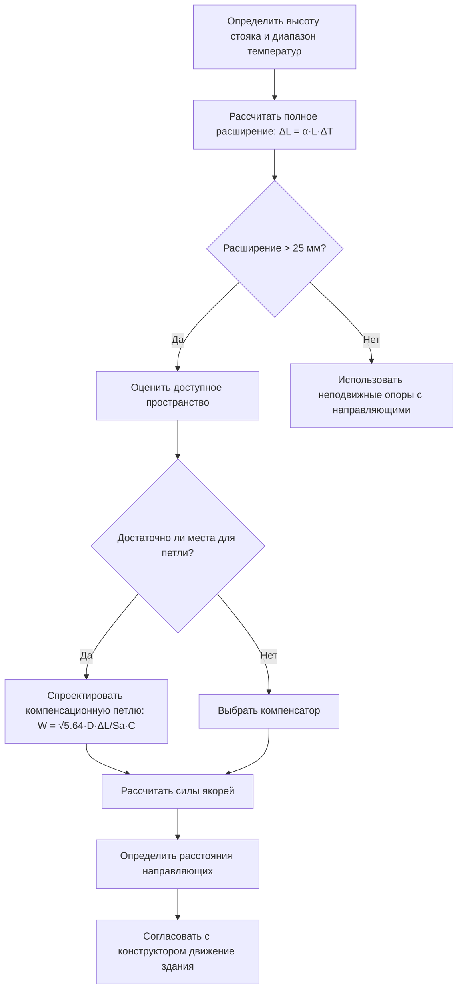

## Тепловое расширение в вертикальных стояках

Вертикальные трубопроводы в высотных зданиях испытывают значительное тепловое расширение из-за разницы температур между условиями установки и рабочими условиями. Стальной стояк длиной 122 м с изменением температуры на 38 °C расширяется примерно на 84 мм, создавая значительные нагрузки при неправильном ограничении.

Фундаментальное уравнение теплового расширения определяет конструкцию стояка:

$$\Delta L = \alpha \cdot L \cdot \Delta T$$

Где:
- $\Delta L$ = полное расширение (мм)
- $\alpha$ = коэффициент линейного расширения (мм/мм/°C)
- $L$ = длина трубопровода (м)
- $\Delta T$ = изменение температуры (°C)

**Коэффициенты расширения материалов:**

| Материал | Коэффициент (мм/мм/°C) | 30 м @ 56 °C ΔT |
|----------|------------------------|-------------------|
| Углеродистая сталь | 1.17 × 10⁻⁵ | 20 мм |
| Медь | 1.69 × 10⁻⁵ | 28 мм |
| Нержавеющая сталь 304 | 1.73 × 10⁻⁵ | 29 мм |
| CPVC | 6.48 × 10⁻⁵ | 110 мм |

## Конструкция компенсационной петли

Компенсационные петли обеспечивают гибкость благодаря геометрической конфигурации, поглощая тепловое движение без генерирования чрезмерных напряжений. Двухплоскостная смещенная петля представляет наиболее распространенную конфигурацию для вертикальных стояков.

### Расчет размера петли

Требуемая длина плеча для двухплоскостной смещенной петли:

$$W = \sqrt{\frac{5.64 \cdot D \cdot \Delta L}{S_a \cdot C}}$$

Где:
- $W$ = длина плеча от осевой линии основной линии (м)
- $D$ = наружный диаметр трубопровода (см)
- $\Delta L$ = полное расширение (мм)
- $S_a$ = допустимый диапазон напряжений (МПа), обычно 138 МПа для углеродистой стали
- $C$ = коэффициент коррекции гибкости (безразмерный)

Для стального стояка 159 мм Schedule 40 из углеродистой стали с расширением 64 мм:

$$W = \sqrt{\frac{5.64 \times 168.3 \times 64}{138 \times 1.0}} = \sqrt{349.4} = 18.7 \text{ см} = 1.37 \text{ м}$$

## Компенсационные петли против компенсаторов

Выбор между петлями и компенсаторами зависит от доступного пространства, давления в системе и философии обслуживания.

| Фактор | Компенсационные петли | Компенсаторы |
|--------|-----------------|------------------|
| Требуемое пространство | 1.2–3 м на петлю | Минимум (30–60 см) |
| Предел давления | Номинальное давление трубопровода | Номинальное давление компенсатора (обычно ниже) |
| Обслуживание | Не требуется | Периодическая проверка/замена |
| Начальная стоимость | Умеренная (трубопровод/рабочая сила) | Выше (стоимость компенсатора) |
| Надежность | Отличная (без движущихся частей) | Хорошая (требует обслуживания) |
| Срок службы | 50+ лет | 15–25 лет типично |
| Силы якорей | Низкие (саморегулирующиеся) | Высокие (должны сопротивляться давлению) |

**Компенсационные петли** превосходны там, где пространство позволяет и долгосрочная надежность является приоритетом. Они не вводят дополнительные точки утечек и не требуют обслуживания.

**Компенсаторы** становятся необходимы в условиях ограниченного пространства или когда маршруты трубопроводов не могут вместить петли. Компенсаторы мехового типа справляются со значительным движением, но вводят силы давления, требующие значительного крепления якорей.

## Конструкция точки якоря

Якоря предотвращают движение трубопровода в определенных местах, принуждая расширение в петли или компенсаторы. Основные якоря сопротивляются давлению и тепловым нагрузкам:

$$F_a = P \cdot A + \mu \cdot W$$

Где:
- $F_a$ = полная сила якоря (кН)
- $P$ = давление в системе (кПа)
- $A$ = площадь поперечного сечения трубопровода (см²)
- $\mu$ = коэффициент трения (0.3 типично для стали по стали)
- $W$ = вес трубопровода включая жидкость (кН)

Для трубопровода 159 мм Schedule 40 при давлении 1034 кПа:

$$A = \frac{\pi \cdot d^2}{4} = \frac{\pi \cdot 154.1^2}{4} = 186.4 \text{ см}^2$$

$$F_a = 1034 \times 186.4 + 0.3 \times W_{трубопровода} = 192.7 + 0.3W \text{ кН}$$

Якоря должны быть установлены в:
- Изменениях направления трубопровода (отводы перед компенсационными петлями)
- Соединениях оборудования (чтобы предотвратить движение оборудования)
- Границах компенсаторов (для сдерживания давления)
- Пересечениях расширительных швов здания

## Расстояния направляющих

Направляющие ограничивают боковое движение, позволяя осевое смещение. Надлежащее расстояние предотвращает потерю устойчивости при тепловом расширении.

**Максимальное расстояние направляющих согласно ASME B31.1:**

$$L_{max} = 0.03 \cdot \sqrt[3]{\frac{E \cdot I}{W_p}}$$

Где:
- $L_{max}$ = максимальное расстояние (м)
- $E$ = модуль упругости (200 ГПа для стали)
- $I$ = момент инерции (см⁴)
- $W_p$ = вес трубопровода на метр включая жидкость (кН/м)

**Рекомендуемые расстояния направляющих для вертикальных стояков:**

| Размер трубопровода | Вес (кН/м) | Максимальное расстояние | Практическое расстояние |
|-----------|-----------------|-----------------|-------------------|
| 50 мм | 0.097 | 6.7 м | 4.6 м (каждый этаж) |
| 100 мм | 0.223 | 4.9 м | 4.6 м (каждый этаж) |
| 150 мм | 0.424 | 4.0 м | 3.0 м (каждый этаж) |
| 200 мм | 0.625 | 3.4 м | 3.0 м (через этаж) |
| 300 мм | 1.087 | 2.7 м | 2.4 м (через этаж) |

Направляющие, непосредственно прилегающие к компенсационным петлям (в пределах 10 диаметров трубопровода), должны быть выровнены с высокой точностью, чтобы предотвратить заклинивание.

## Приспособление к движению здания

Высокие здания испытывают структурное движение от ветровых нагрузок, сейсмической активности и дифференциального оседания. HVAC стояки, пересекающие расширительные швы здания, требуют специальной обработки.

**Типы движения здания:**

1. **Вертикальное оседание** - дифференциальное сжатие между ядром и периметром
2. **Боковой крен** - смещение, вызванное ветром и землетрясением
3. **Тепловое расширение** - изменение температуры строительной конструкции
4. **Последовательность строительства** - кумулятивное укорочение во время строительства

На расширительных швах здания трубопровод должен вмещать полное структурное движение плюс тепловое расширение. Требуется гибкое соединение, независимое от компенсации теплового расширения:

$$\Delta_{total} = \Delta_{здания} + \Delta_{тепловое}$$

Двойные петли или компенсаторы с увеличенной емкостью движения справляются с этим комбинированным смещением. Согласуйте маршрутизацию стояков для пересечения расширительных швов здания в оптимальных местах, где движение минимально и доступ для обслуживания доступен.

## Анализ гибкости системы стояков

Полные системы стояков требуют комплексного анализа, учитывающего все компоненты опор. Современный анализ методом конечных элементов оценивает распределение напряжений во всей системе при комбинированных нагрузках.

Критические проверки включают:
- Максимальное напряжение в трубопроводе у якорей и направляющих
- Силы реакции в точках конструктивной опоры
- Зазоры во время полных циклов расширения/сжатия
- Нагрузки на патрубки оборудования в пределах номинальных значений производителя
- Характеристики вибрации и собственные частоты

ASME B31.1 раздел 119.7 требует, чтобы рассчитанный диапазон напряжений оставался ниже допустимых значений на основе свойств материала и ожиданий срока службы цикла. Для систем, испытывающих ежедневные колебания температуры, усталостные соображения становятся значительными свыше 7000 циклов.

---

**Стандарты ссылок:**
- ASME B31.1: Код силовых трубопроводов
- ASME B31.9: Трубопроводы систем инженерного оснащения зданий
- ASHRAE Handbook - HVAC Systems and Equipment, Глава 46
- MSS SP-69: Крепления и опоры трубопроводов - Выбор и применение
