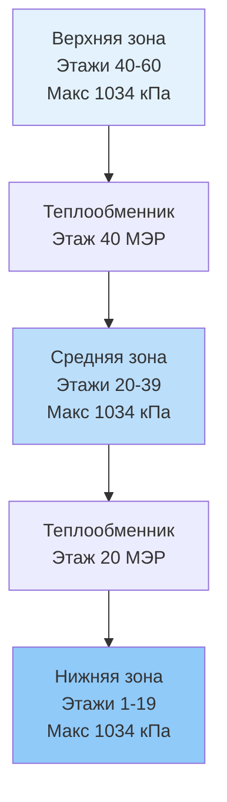
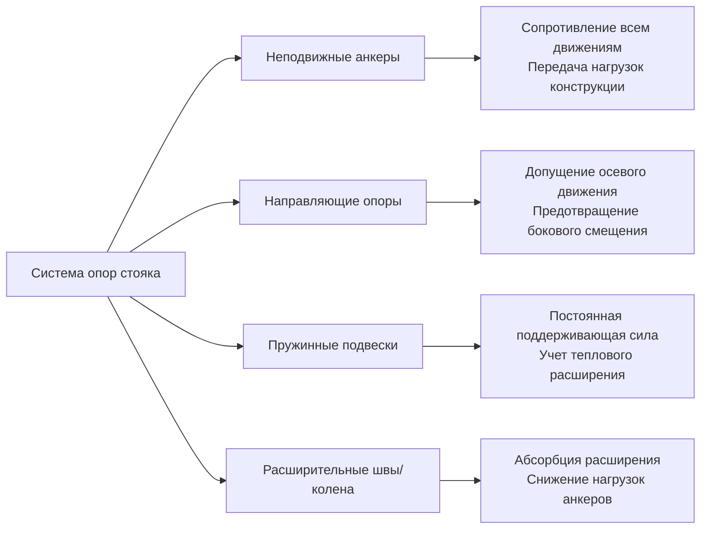

Системы вертикального трубопровода в высотных зданиях представляют собой уникальные инженерные задачи, обусловленные гидростатическим давлением, тепловым расширением на значительных высотах и необходимостью надежного транспорта жидкости между несколькими этажами. Надлежащее проектирование требует тщательного анализа эффектов гидростатического давления, стратегического зонирования давления и специализированных систем опор, которые учитывают как гравитационные, так и тепловые нагрузки.

## Статическое давление и зонирование стояков

Основным ограничением при проектировании вертикального трубопровода является статическое давление, которое растет линейно с разностью высот. Взаимосвязь гидростатического давления выражается следующим образом:

$$P_{static} = \rho g h$$

Где $\rho$ — плотность жидкости (кг/м³), $g$ — ускорение свободного падения (9,81 м/с²), $h$ — вертикальная высота (м). Для воды в стандартных условиях это составляет приблизительно 9,8 кПа на метр высоты.

В зданиях высотой свыше 120-150 м системы с одной зоной становятся неприемлемыми из-за чрезмерного давления на нижних уровнях. Номинальное давление оборудования обычно ограничивает давление в системе до 1034-2068 кПа, что требует наличия нескольких зон давления, разделенных теплообменниками, станциями снижения давления или выделенными помещениями механического оборудования.

### Стратегии зонирования

| Стратегия | Применение | Преимущества | Ограничения |
|----------|-----------|------------|------------|
| Разделение теплообменником | Охлажденная вода, горячая вода отопления | Полная изоляция давления, защита оборудования | Тепловые потери (1-2°C), добавочная стоимость |
| Редукционные клапаны давления | Вода конденсатора, вторичные системы | Низкая стоимость, более простое проектирование | Потери дросселирования, требования к обслуживанию |
| Бустерные насосы | Обратные стояки, системы конденсата | Устранение потерь гидростатического давления | Добавочное энергопотребление, сложность |
| Прямое соединение с высоконапорным оборудованием | Здания высотой <120 м | Простота, низкая первоначальная стоимость | Требует компонентов, рассчитанных на высокое давление |

## Расчет трубопроводов для вертикального транспорта

Расчет вертикальных стояков требует баланса между потерей на трение и эффектами статического давления. Полная потеря давления в сегменте вертикального трубопровода сочетает компоненты трения и высоты:

$$\Delta P_{total} = \Delta P_{friction} + \rho g \Delta h$$

Для восходящего потока статический компонент противодействует давлению нагнетания насоса; для нисходящего потока он способствует. Уравнение Дарси-Вейсбаха определяет потери на трение:

$$\Delta P_{friction} = f \frac{L}{D} \frac{\rho v^2}{2}$$

Где $f$ — коэффициент трения (безразмерный), $L$ — длина трубопровода (м), $D$ — диаметр (м), $v$ — скорость (м/с).

**Рекомендуемые скорости для вертикальных стояков:**
- Подача охлажденной воды: 1,2-2,4 м/с
- Обратная охлажденная вода: 1,2-2,4 м/с
- Горячая вода отопления: 1,2-3,0 м/с
- Вода конденсатора: 1,8-3,7 м/с
- Пар (низкое давление): 30-51 м/с

Более высокие скорости минимизируют диаметр трубопровода и первоначальную стоимость, но увеличивают потери на трение, шум и потенциал эрозии. ASHRAE Guideline 36 рекомендует поддерживать скорости в указанных диапазонах для баланса производительности и долговечности.

## Выбор материалов и номинальное давление

Выбор материала для вертикальных стояков зависит от типа жидкости, класса давления и соображений коррозии:

| Материал | Номинальное давление | Применение | Устойчивость к коррозии |
|----------|-------------------|-----------|----------------------|
| Углеродистая сталь Schedule 40 | 1034 кПа при 178°C | Охлажденная вода, горячая вода отопления | Умеренная с обработкой |
| Углеродистая сталь Schedule 80 | 2068 кПа при 178°C | Высоконапорные зоны, пар | Умеренная с обработкой |
| Медь тип L | 1724 кПа при 38°C | Питьевая вода, малые стояки | Отличная |
| Нержавеющая сталь 304/316 | 2758+ кПа | Коррозионно-активные жидкости, критические системы | Отличная |
| CPVC Schedule 80 | 2758 кПа при 23°C | Неметаллический вариант, специальные применения | Отличная, ограниченная температура |

Углеродистая сталь преобладает в крупных коммерческих установках благодаря экономичности и свариваемости. Надлежащая обработка воды с поддержанием pH 7,5-9,5 и уровня кислорода <0,005 мг/л предотвращает внутреннюю коррозию. Защита от внешней коррозии требует изоляционных пароизоляционных барьеров и периодического осмотра в местах опор.

## Системы опор и анкеровки

Опоры вертикального трубопровода должны выдерживать собственный вес, силы теплового расширения и сейсмические нагрузки, допуская контролируемое движение. Тепловое расширение стального трубопровода выражается следующим образом:

$$\Delta L = \alpha L \Delta T$$

Где $\alpha$ — коэффициент теплового расширения (1,17 × 10⁻⁵ мм/мм/°C для стали), $L$ — длина, $\Delta T$ — изменение температуры. Вертикальный стояк высотой 150 м, испытывающий изменение температуры на 28°C, расширяется на приблизительно 50 мм.

**Компоненты системы опор:**

Неподвижные анкеры обычно располагаются в помещениях механического оборудования каждые 3-6 этажей, создавая управляемые сегменты расширения. Направляющие опоры располагаются на расстоянии 4,5-7,5 м по вертикали с более близким расстоянием вблизи изменений направления. Пружинные подвески у отводов поддерживают постоянную силу поддержки несмотря на тепловое расширение стояка.

## Испытание давлением и пусконаладка

ASME B31.9 и местные нормы требуют гидростатического испытания при давлении в 1,5 раза превышающем рабочее давление, минимум 1034 кПа, в течение минимум 30 минут. Для высотных зданий испытание проводится по сегментам во избежание превышения номинальных давлений:

**Процедура испытания давлением:**
1. Заполнять систему снизу, постоянно выпуская воздух в высоких точках
2. Применять давление испытания постепенно (345 кПа за 10 минут)
3. Визуально проверить все соединения, фланцы и проемы
4. Контролировать манометр в течение 30 минут — падение >5% указывает на утечку
5. Медленно сбросить давление во избежание гидравлического удара

Пусконаладка систем вертикального трубопровода включает балансировку расхода между зонами, проверку автоматических клапанов и тепловизионную съемку для подтверждения целостности изоляции. Мониторинг перепада давления между подающим и обратным стояками подтверждает предположения проектирования и выявляет ограничения.

Общая потеря давления от системных насосов через распределение должна совпадать с расчетными значениями в пределах ±10%. Значительные отклонения указывают на недостаточно подобранный трубопровод, засоренные фильтры или неправильно расположенные клапаны, требующие исследования перед приемкой системы.

## Компоненты

- Стояки охлажденной воды
- Стояки горячей воды отопления
- Стояки воды конденсатора
- Паровые стояки высотных зданий
- Стояки возврата конденсата
- Двухтемпературные стояки
- Выбор материала трубопровода
