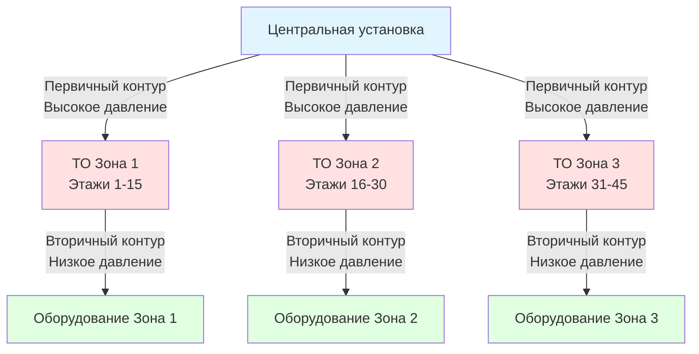

## Гидростатическое давление в вертикальных системах

Системы трубопроводов высотных зданий сталкиваются с фундаментальной проблемой: гидростатическое давление увеличивается линейно с вертикальной высотой примерно на 0,0435 кПа на метр высоты в водяных системах. Это создает давления на нижних этажах, которые превышают рейтинги оборудования и нарушают целостность системы без надлежащей компартментализации.

Гидростатическое давление в любой точке статического водяного столба составляет:

$$P = \rho g h$$

Где:
- $P$ = давление (Па)
- $\rho$ = плотность жидкости (кг/м³)
- $g$ = ускорение свободного падения (9,81 м/с²)
- $h$ = вертикальная высота над точкой (м)

В имперской системе единиц это упрощается до 0,433 psi/ft для воды при 15°C. Здание высотой 183 м генерирует давление около 1793 кПа в основании, что намного превышает типичные рейтинги компонентов HVAC в 862–1207 кПа.

## Ограничения рейтинга давления оборудования

Оборудование HVAC и компоненты системы имеют максимальные рабочие характеристики давления (MWP), которые устанавливают требования зонирования:

| Компонент | Типичное MWP | Стандарт |
|-----------|-------------|----------|
| Концевые устройства (FCU, VAV) | 862–1034 кПа | AHRI 430 |
| Гидравлические катушки | 1034–1207 кПа | AHRI 410 |
| Управляющие клапаны | 1034–1379 кПа | ANSI/FCI 70-2 |
| Стальная труба (Schedule 40) | 2070+ кПа | ASME B31.9 |
| Медная трубка (Type L) | 1379–2758 кПа | ASTM B88 |
| Теплообменники (пластинчатые) | 1034–2070 кПа | ASME Section VIII |

Самые слабые компоненты — обычно концевое оборудование и управляющие клапаны — диктуют ограничения высоты зон. Справочник ASHRAE рекомендует ограничивать отдельные зоны, чтобы не превышать 80% от MWP компонента с наименьшим рейтингом, обеспечивая запас безопасности для преходящих процессов давления.

## Расчет высоты зоны давления

Максимальная вертикальная высота для одной зоны давления:

$$H_{max} = \frac{P_{rated} \times 0.8 - P_{system}}{0.0435}$$

Где:
- $H_{max}$ = максимальная высота зоны (м)
- $P_{rated}$ = наименьший рейтинг давления оборудования (кПа)
- $P_{system}$ = рабочее давление системы, включая напор насоса (кПа)
- 0,0435 = градиент гидростатического давления (кПа/м)

Для оборудования с рейтингом 1034 кПа в системе, работающей при 207 кПа:

$$H_{max} = \frac{1034 \times 0.8 - 207}{0.0435} = \frac{619}{0.0435} = 14,230 \text{ м}$$

Это устанавливает практический предел высоты зоны примерно на 63 м, что требует 3–4 зон для типичной 183-метровой башни.

## Стратегии конфигурации зон давления

### Стратегия 1: Изоляция теплообменника

Каждая зона давления работает как независимый гидравлический контур, изолированный пластинчатыми или паяными пластинчатыми теплообменниками. Первичный контур (высокого давления) обслуживает теплообменники на границах зон, а вторичные контуры (низкого давления) распределяют тепло или охлаждение в пределах каждой зоны.

### Стратегия 2: Станции клапанов понижения давления

Станции клапанов понижения давления (PRV) поддерживают нижестоящее давление на безопасных уровнях, позволяя непрерывный поток через единую сеть трубопроводов. Этот подход требует меньше места в машинном отделении, чем изоляция теплообменника, но вводит сложность управления.

## Проектирование станции понижения давления

Станции PRV требуют резервных клапанов, возможности изоляции и мониторинга давления:

**Ключевые компоненты:**
- Двойные PRV (один рабочий, один резервный) для надежности
- Клапаны изоляции выше и ниже по потоку PRV
- Фильтры сетчатые выше по потоку от PRV для предотвращения загрязнения
- Манометры с обеих сторон для проверки производительности
- Линия обхода с ручным клапаном для обслуживания
- Клапан сброса давления ниже по потоку, установленный на 10% выше заданной точки PRV

Падение давления через станцию PRV:

$$\Delta P_{PRV} = P_{upstream} - P_{setpoint}$$

Для зоны, получающей воду при 1241 кПа с оборудованием, рассчитанным на 1034 кПа, заданная точка PRV будет 827 кПа (80% рейтинга), требуя от клапана поглощения 414 кПа.

## Выбор точки разрыва зоны

Оптимальные разрывы зон происходят в:

1. **Местах машинных этажей**, где машинные отделения обеспечивают установочное пространство
2. **Архитектурных отступах**, которые снижают сложность трубопровода
3. **Трети или четверти здания** для геометрической однородности
4. **Границах рейтинга оборудования** на рассчитанных максимальных высотах

Переходные этажи зоны обычно содержат теплообменники или станции PRV, расширительные баки для зоны и зоне-специфические насосы при использовании изоляции теплообменника.

## Преимущества компартментализации системы

Помимо защиты давления, компартментализация зон обеспечивает:

**Эксплуатационные преимущества:**
- Сокращенный объем воды в системе на зону обеспечивает более быстрый запуск
- Изоляция зоны для обслуживания без остановки всего здания
- Локализация отказа ограничивает распространение отказа
- Меньшие зональные насосы снижают потребление энергии по сравнению с одиночными насосами высокого напора

**Гидравлические преимущества:**
- Сниженные потери трения при более коротких вертикальных проходах
- Сниженные требования к толщине стенок труб в верхних зонах
- Минимизированные эффекты гидравлического удара при преходящих событиях

## Рассмотрение преходящих процессов давления

Расчеты статического давления представляют установившиеся условия. События преходящих процессов вводят дополнительные всплески давления:

- **Запуск/остановка насоса**: Генерирует волны давления, распространяющиеся со скоростью звука (примерно 1219 м/с в воде)
- **Быстрое закрытие управляющего клапана**: Создает гидравлический удар с повышением давления, рассчитанным по уравнению Жуковского: $\Delta P = \rho c \Delta v$
- **Заполнение системы**: Требует управляемого нагнетания давления для предотвращения избыточного давления

Проектирование зоны давления должно учитывать эти преходящие процессы благодаря надлежащему выбору оборудования, последовательности управления и защите сброса давления, рассчитанной согласно требованиям ASME Section VIII.

## Соответствие и стандарты

Проектирование зоны давления должно удовлетворять:

- **ASME B31.9**: Рейтинги давления трубопроводов систем зданий и испытания
- **Справочник ASHRAE—HVAC Applications**: Глава по высотным зданиям
- **ASME Section VIII**: Правила сосудов давления для теплообменников
- **Местные строительные коды**: Требования максимального рабочего давления
- **IPC/UPC**: Мандаты устройств сброса давления и безопасности

Надлежащая реализация зоны давления защищает оборудование, обеспечивает эксплуатационную надежность и обеспечивает основу для эффективного гидравлического распределения в высотных зданиях.
