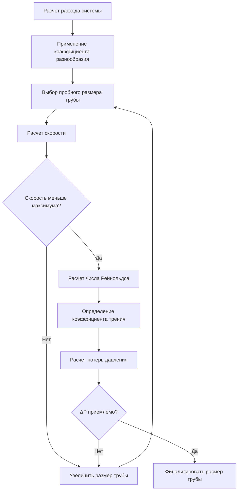
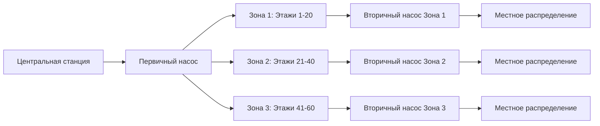
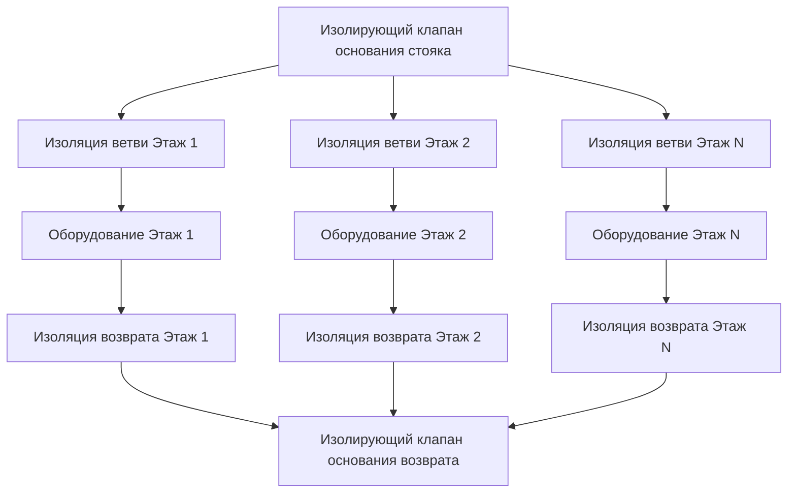

Проектирование стояков HVAC в высотных зданиях создает уникальные трудности, вызванные гидростатическим давлением, ограничениями скорости, тепловым расширением и необходимостью гидравлического баланса между несколькими вертикальными зонами. Правильная конфигурация стояков напрямую влияет на эффективность системы, срок службы оборудования и гибкость в управлении.

## Фундаментальная физика вертикальных гидравлических систем

Общее давление у основания водяного столба сочетает статические и динамические компоненты. Для вертикального стояка:

$$P_{total} = P_{static} + P_{friction} + P_{equipment}$$

где:
- $P_{static} = \rho g h$ (Па), где $\rho$ = плотность воды (кг/м³), $g$ = 9,81 м/с², $h$ = вертикальная высота (м)
- $P_{friction}$ = потери на трение в трубопроводе (Па)
- $P_{equipment}$ = перепад давления через клапаны, катушки и фитинги (Па)

Статическое давление доминирует в высотных зданиях. Стояк высотой 100 м создает примерно 980 кПа гидростатического давления, требуя рассмотрения классов давления для всех компонентов ниже уровня земли.

## Методология определения размеров стояков

Правильное определение размеров балансирует первоначальные затраты, потери давления, ограничения скорости и использование площади шахты. Фундаментальное уравнение потока:

$$Q = A \times v = \frac{\pi d^2}{4} \times v$$

где $Q$ = расход (м³/с), $d$ = внутренний диаметр (м), $v$ = скорость (м/с).

Для приложений HVAC оптимальные скорости варьируются от 1,2 до 2,4 м/с для минимизации эрозии, шума и потерь давления при исключении захвата воздуха.

**Процесс определения размеров:**

1. **Расчет общего расхода системы** с использованием коэффициентов разнообразия нагрузок (обычно 0,7-0,85 для крупных зданий согласно ASHRAE Handbook—HVAC Systems and Equipment)
2. **Определение максимальной допустимой скорости** (2,4 м/с для охлажденной воды, 3,0 м/с для конденсаторной воды)
3. **Выбор начального размера трубы** из стандартизированных таблиц
4. **Расчет потерь давления** с использованием уравнения Дарси-Вейсбаха
5. **Проверка требований напора насоса** в сравнении с доступным оборудованием

### Расчеты потерь давления

Уравнение Дарси-Вейсбаха определяет потери давления на трение:

$$\Delta P_f = f \frac{L}{D} \frac{\rho v^2}{2}$$

где:
- $f$ = коэффициент трения (безразмерный), зависит от числа Рейнольдса и относительной шероховатости
- $L$ = длина трубопровода (м)
- $D$ = внутренний диаметр (м)
- $\rho$ = плотность (кг/м³)
- $v$ = скорость (м/с)

Для турбулентного потока (Re > 4000) уравнение Кулебрука-Уайта определяет коэффициент трения:

$$\frac{1}{\sqrt{f}} = -2 \log_{10}\left(\frac{\varepsilon/D}{3.7} + \frac{2.51}{Re\sqrt{f}}\right)$$

где $\varepsilon$ = абсолютная шероховатость (0,045 мм для коммерческих стальных труб), Re = число Рейнольдса.

## Стратегии конфигурации стояков

### Системы с прямым возвратом

Стояки подачи и возврата следуют независимыми путями, создавая неотъемлемый гидравлический дисбаланс. Нижние этажи испытывают большие потери давления из-за большей длины трубопровода, требуя балансировочных клапанов на каждом этаже.

**Преимущества:**
- Более простая установка
- Сниженные требования к площади шахты
- Более низкая первоначальная стоимость

**Недостатки:**
- Сложные процедуры балансировки
- Высокие операционные затраты от дроссельных потерь
- Трудно поддерживать баланс при частичной нагрузке

### Системы с обратным возвратом

Самая удаленная ветвь имеет равную общую длину трубопровода ближайшей ветви, обеспечивая неотъемлемый гидравлический баланс.

$$L_{supply,far} + L_{return,far} = L_{supply,near} + L_{return,near}$$

**Преимущества:**
- Саморегулирующиеся характеристики баланса
- Сниженные требования к балансировочным клапанам
- Лучшая производительность при частичной нагрузке

**Недостатки:**
- Увеличенная площадь шахты (на 30-40%)
- Более высокие материальные затраты
- Сложная прокладка в существующих зданиях

### Системы с кольцевыми стояками

Часто используются в супервысоких зданиях (>150 м), кольцевые системы делят здание на вертикальные зоны, обслуживаемые выделенными первичными контурами со вторичным распределением.

## Ограничения скорости и соображения об эрозии

Чрезмерная скорость ускоряет эрозионно-коррозионные повреждения в изгибах труб и фитингах. Потенциал эрозии коррелирует с кинетической энергией:

$$E_{kinetic} = \frac{1}{2}\rho v^2$$

**Максимальные рекомендуемые скорости (ASHRAE Standard 90.1):**

| Тип системы | Максимальная скорость | Обоснование |
|-------------|---------------------|-----------|
| Охлажденная вода | 2,4 м/с | Минимизация эрозии, контроль шума |
| Нагревательная вода | 2,4 м/с | Предотвращение вспышек в зонах низкого давления |
| Конденсаторная вода | 3,0 м/с | Более высокая толерантность к качеству воды |
| Гликолевые растворы | 1,8 м/с | Более высокая вязкость увеличивает эрозию |

Медные трубопроводы проявляют эрозию выше 1,5 м/с в системах с плохой обработкой воды. Стальные трубопроводы выдерживают более высокие скорости, но требуют надлежащего пуска в работу для удаления заводского окалина.

## Распределение площади шахты

Размер шахты стояка должен вмещать трубопровод, изоляцию, зазоры и возможное будущее расширение.

**Минимальные размеры шахты:**

$$W_{shaft} = \sum(D_{pipe} + 2t_{insulation} + C_{clearance}) + S_{access}$$

где:
- $D_{pipe}$ = наружный диаметр всех труб
- $t_{insulation}$ = толщина изоляции (обычно 25-50 мм для охлажденной воды)
- $C_{clearance}$ = минимальный зазор (50 мм между трубами, 75 мм до стены)
- $S_{access}$ = пространство доступа/обслуживания (минимум 600 мм)

**Типичные требования к шахтам:**

| Высота здания | Приблизительная площадь шахты | Примечания |
|---------------|-------------------------------|-----------|
| 10-20 этажей | 1,5-2,0 м² | Достаточно одной пары стояков |
| 20-40 этажей | 2,5-3,5 м² | Несколько систем или зонирование |
| 40-60 этажей | 4,0-6,0 м² | Рекомендуются отдельные шахты |
| >60 этажей | В зависимости от зоны | Децентрализованный подход |

## Стратегии балансировки и управления

Гидравлический баланс обеспечивает достижение расчетного расхода каждым терминальным устройством независимо от длины трубопровода или высоты. Три основных метода:

1. **Ручные балансировочные клапаны**: Требуют пуска в работу, но обеспечивают долгосрочную стабильность
2. **Автоматические ограничители расхода**: Независимые от давления устройства, поддерживающие постоянный расход
3. **Управление перепадом давления**: Модулирование скорости насоса или положения клапана для поддержания установки

Требуемый орган управления клапана для эффективного управления:

$$N = \frac{\Delta P_{valve,design}}{\Delta P_{valve,design} + \Delta P_{circuit}}$$

Целевой орган управления 0,3-0,5 обеспечивает управляемость при избежании чрезмерных потерь давления.

## Стратегия размещения изолирующих клапанов

Стратегическое размещение изолирующих клапанов позволяет проводить обслуживание без полного отключения системы.

**Критические точки изоляции:**
- Основание каждого стояка (подача и возврат)
- Каждое подключение этажа
- Основное оборудование (охладители, насосы, теплообменники)
- Границы зон в многозонных системах
- Подключения расширительного бака

Дисковые клапаны обычно используются для размеров >100 мм, в то время как шаровые клапаны подходят для более мелких соединений. Все изолирующие клапаны требуют:
- Номинальное давление, превышающее максимальное статическое + рабочее давление
- Доступное расположение с зазором для эксплуатации
- Идентификационные теги согласно ASHRAE Standard 134
- Упоры памяти на дроссельных клапанах для предотвращения несанкционированной регулировки

## Соображения класса давления

Номиналы оборудования и клапанов должны превышать максимальное рабочее давление плюс гидростатический напор:

$$P_{required} = P_{operating} + \rho g h + P_{safety}$$

Стандартные классы давления (ANSI/ASME B16.5): 150 psi (1034 кПа), 300 psi (2068 кПа), 600 psi (4137 кПа).

Для здания высотой 200 м с рабочим давлением 700 кПа:
- Гидростатический напор = 2000 кПа
- Общее давление = 2700 кПа (392 psi)
- Минимальный класс давления = 600 psi у основания здания

Правильное проектирование стояков интегрирует конструктивные, гидравлические и тепловые соображения для обеспечения надежного и эффективного вертикального транспорта жидкости в системах HVAC высотных зданий.
